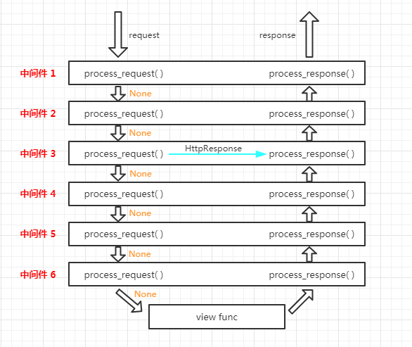
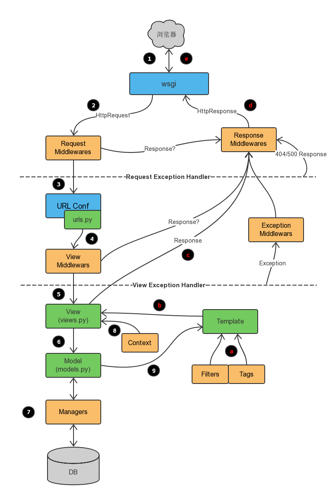

###### datetime:2019/6/28 14:13
###### author:nzb

## Django中间件

### 前戏

我们在前面的课程中已经学会了给视图函数加装饰器来判断是用户是否登录，把没有登录的用户请求跳转到登录页面。
我们通过给几个特定视图函数加装饰器实现了这个需求。但是以后添加的视图函数可能也需要加上装饰器，这样是不是稍微有点繁琐。

学完今天的内容之后呢，我们就可以用更适宜的方式来实现类似给所有请求都做相同操作的功能了

### 中间件

#### 中间件介绍

##### 什么是中间件?

官方的说法：中间件是一个用来处理Django的请求和响应的框架级别的钩子。它是一个轻量、低级别的插件系统，用于在全局范围内改变Django的输入和输出。
每个中间件组件都负责做一些特定的功能。

但是由于其影响的是全局，所以需要谨慎使用，使用不当会影响性能。

说的直白一点中间件是帮助我们在视图函数执行之前和执行之后都可以做一些额外的操作，它本质上就是一个自定义类，类中定义了几个方法，
Django框架会在请求的特定的时间去执行这些方法。

我们一直都在使用中间件，只是没有注意到而已，打开Django项目的Settings.py文件，看到下图的MIDDLEWARE配置项。

```python
    MIDDLEWARE = [
        'django.middleware.security.SecurityMiddleware',
        'django.contrib.sessions.middleware.SessionMiddleware',
        'django.middleware.common.CommonMiddleware',
        'django.middleware.csrf.CsrfViewMiddleware',
        'django.contrib.auth.middleware.AuthenticationMiddleware',
        'django.contrib.messages.middleware.MessageMiddleware',
        'django.middleware.clickjacking.XFrameOptionsMiddleware',
    ]
```
MIDDLEWARE配置项是一个列表，列表中是一个个字符串，这些字符串其实是一个个类，也就是一个个中间件。

我们之前已经接触过一个csrf相关的中间件了？我们一开始让大家把他注释掉，再提交post请求的时候，就不会被forbidden了，
后来学会使用csrf_token之后就不再注释这个中间件了。

那接下来就学习中间件中的方法以及这些方法什么时候被执行。

#### 自定义中间件

中间件可以定义五个方法，分别是：（主要的是process_request和process_response）

- process_request(self,request)
- process_view(self, request, view_func, view_args, view_kwargs)
- process_template_response(self,request,response)
- process_exception(self, request, exception)
- process_response(self, request, response)

以上方法的返回值可以是None或一个HttpResponse对象，如果是None，则继续按照django定义的规则向后继续执行，如果是HttpResponse对象，
则直接将该对象返回给用户。

##### 自定义一个中间件

```python
    from django.utils.deprecation import MiddlewareMixin
    
    
    class MD1(MiddlewareMixin):
    
        def process_request(self, request):
            print("MD1里面的 process_request")
    
        def process_response(self, request, response):
            print("MD1里面的 process_response")
            return response
```

##### process_request

process_request有一个参数，就是request，这个request和视图函数中的request是一样的。

它的返回值可以是None也可以是HttpResponse对象。返回值是None的话，按正常流程继续走，交给下一个中间件处理，如果是HttpResponse对象，
Django将不执行视图函数，而将相应对象返回给浏览器。

我们来看看多个中间件时，Django是如何执行其中的process_request方法的。
```python
    from django.utils.deprecation import MiddlewareMixin
    
    
    class MD1(MiddlewareMixin):
    
        def process_request(self, request):
            print("MD1里面的 process_request")
    
    
    class MD2(MiddlewareMixin):
        def process_request(self, request):
            print("MD2里面的 process_request")
            pass
```
在settings.py的MIDDLEWARE配置项中注册上述两个自定义中间件：
````python
    MIDDLEWARE = [
        'django.middleware.security.SecurityMiddleware',
        'django.contrib.sessions.middleware.SessionMiddleware',
        'django.middleware.common.CommonMiddleware',
        'django.middleware.csrf.CsrfViewMiddleware',
        'django.contrib.auth.middleware.AuthenticationMiddleware',
        'django.contrib.messages.middleware.MessageMiddleware',
        'django.middleware.clickjacking.XFrameOptionsMiddleware',
        'middlewares.MD1',  # 自定义中间件MD1
        'middlewares.MD2'  # 自定义中间件MD2
    ]
````
此时，我们访问一个视图，会发现终端中打印如下内容：

    MD1里面的 process_request
    MD2里面的 process_request
    app01 中的 index视图
    
把MD1和MD2的位置调换一下，再访问一个视图，会发现终端中打印的内容如下：

    MD2里面的 process_request
    MD1里面的 process_request
    app01 中的 index视图
    
看结果我们知道：视图函数还是最后执行的，MD2比MD1先执行自己的process_request方法。

在打印一下两个自定义中间件中process_request方法中的request参数，会发现它们是同一个对象。

由此总结一下：

    1、中间件的process_request方法是在执行视图函数之前执行的。
    2、当配置多个中间件时，会按照MIDDLEWARE中的注册顺序，也就是列表的索引值，从前到后依次执行的。
    3、不同中间件之间传递的request都是同一个对象
 

多个中间件中的process_response方法是按照MIDDLEWARE中的注册顺序倒序执行的，也就是说第一个中间件的process_request方法首先执行，
而它的process_response方法最后执行，最后一个中间件的process_request方法最后一个执行，它的process_response方法是最先执行。

##### process_response

它有两个参数，一个是request，一个是response，request就是上述例子中一样的对象，response是视图函数返回的HttpResponse对象。
该方法的返回值也必须是HttpResponse对象。

给上述的M1和M2加上process_response方法：
```python
    from django.utils.deprecation import MiddlewareMixin
    
    
    class MD1(MiddlewareMixin):
    
        def process_request(self, request):
            print("MD1里面的 process_request")
    
        def process_response(self, request, response):
            print("MD1里面的 process_response")
            return response
    
    
    class MD2(MiddlewareMixin):
        def process_request(self, request):
            print("MD2里面的 process_request")
            pass
    
        def process_response(self, request, response):
            print("MD2里面的 process_response")
            return response
```
访问一个视图，看一下终端的输出：

    MD2里面的 process_request
    MD1里面的 process_request
    app01 中的 index视图
    MD1里面的 process_response
    MD2里面的 process_response
    
看结果可知：

process_response方法是在视图函数之后执行的，并且顺序是MD1比MD2先执行。(此时settings.py中 MD2比MD1先注册)

多个中间件中的process_response方法是按照MIDDLEWARE中的注册顺序倒序执行的，也就是说第一个中间件的process_request方法首先执行，
而它的process_response方法最后执行，最后一个中间件的process_request方法最后一个执行，它的process_response方法是最先执行。

##### process_view

process_view(self, request, view_func, view_args, view_kwargs)

该方法有四个参数

request是HttpRequest对象。

view_func是Django即将使用的视图函数。 （它是实际的函数对象，而不是函数的名称作为字符串。）

view_args是将传递给视图的位置参数的列表.

view_kwargs是将传递给视图的关键字参数的字典。 view_args和view_kwargs都不包含第一个视图参数（request）。

Django会在调用视图函数之前调用process_view方法。

它应该返回None或一个HttpResponse对象。 如果返回None，Django将继续处理这个请求，执行任何其他中间件的process_view方法，然后在执行相应的视图。 如果它返回一个HttpResponse对象，Django不会调用适当的视图函数。 它将执行中间件的process_response方法并将应用到该HttpResponse并返回结果。

 给MD1和MD2添加process_view方法:
 
 ```python
    from django.utils.deprecation import MiddlewareMixin
    
    
    class MD1(MiddlewareMixin):
    
        def process_request(self, request):
            print("MD1里面的 process_request")
    
        def process_response(self, request, response):
            print("MD1里面的 process_response")
            return response
    
        def process_view(self, request, view_func, view_args, view_kwargs):
            print("-" * 80)
            print("MD1 中的process_view")
            print(view_func, view_func.__name__)
    
    
    class MD2(MiddlewareMixin):
        def process_request(self, request):
            print("MD2里面的 process_request")
            pass
    
        def process_response(self, request, response):
            print("MD2里面的 process_response")
            return response
    
        def process_view(self, request, view_func, view_args, view_kwargs):
            print("-" * 80)
            print("MD2 中的process_view")
            print(view_func, view_func.__name__)
```
访问index视图函数，看一下输出结果：

    MD2里面的 process_request
    MD1里面的 process_request
    --------------------------------------------------------------------------------
    MD2 中的process_view
    <function index at 0x000001DE68317488> index
    --------------------------------------------------------------------------------
    MD1 中的process_view
    <function index at 0x000001DE68317488> index
    app01 中的 index视图
    MD1里面的 process_response
    MD2里面的 process_response
    
process_view方法是在process_request之后，视图函数之前执行的，执行顺序按照MIDDLEWARE中的注册顺序从前到后顺序执行的

##### process_exception

process_exception(self, request, exception)

该方法两个参数:

一个HttpRequest对象

一个exception是视图函数异常产生的Exception对象。

这个方法只有在视图函数中出现异常了才执行，它返回的值可以是一个None也可以是一个HttpResponse对象。如果是HttpResponse对象，Django将调用模板和中间件中的process_response方法，并返回给浏览器，否则将默认处理异常。如果返回一个None，则交给下一个中间件的process_exception方法来处理异常。它的执行顺序也是按照中间件注册顺序的倒序执行。

 给MD1和MD2添加上这个方法：
 ```python
    from django.utils.deprecation import MiddlewareMixin
    
    
    class MD1(MiddlewareMixin):
    
        def process_request(self, request):
            print("MD1里面的 process_request")
    
        def process_response(self, request, response):
            print("MD1里面的 process_response")
            return response
    
        def process_view(self, request, view_func, view_args, view_kwargs):
            print("-" * 80)
            print("MD1 中的process_view")
            print(view_func, view_func.__name__)
    
        def process_exception(self, request, exception):
            print(exception)
            print("MD1 中的process_exception")
    
    
    class MD2(MiddlewareMixin):
        def process_request(self, request):
            print("MD2里面的 process_request")
            pass
    
        def process_response(self, request, response):
            print("MD2里面的 process_response")
            return response
    
        def process_view(self, request, view_func, view_args, view_kwargs):
            print("-" * 80)
            print("MD2 中的process_view")
            print(view_func, view_func.__name__)
    
        def process_exception(self, request, exception):
            print(exception)
            print("MD2 中的process_exception")
```
如果视图函数中无异常，process_exception方法不执行。

想办法，在视图函数中抛出一个异常：
```python
    def index(request):
        print("app01 中的 index视图")
        raise ValueError("呵呵")
        return HttpResponse("O98K")
```
在MD1的process_exception中返回一个响应对象：
```python
    class MD1(MiddlewareMixin):
    
        def process_request(self, request):
            print("MD1里面的 process_request")
    
        def process_response(self, request, response):
            print("MD1里面的 process_response")
            return response
    
        def process_view(self, request, view_func, view_args, view_kwargs):
            print("-" * 80)
            print("MD1 中的process_view")
            print(view_func, view_func.__name__)
    
        def process_exception(self, request, exception):
            print(exception)
            print("MD1 中的process_exception")
            return HttpResponse(str(exception))  # 返回一个响应对象
```
看输出结果：

    MD2里面的 process_request
    MD1里面的 process_request
    --------------------------------------------------------------------------------
    MD2 中的process_view
    <function index at 0x0000022C09727488> index
    --------------------------------------------------------------------------------
    MD1 中的process_view
    <function index at 0x0000022C09727488> index
    app01 中的 index视图
    呵呵
    MD1 中的process_exception
    MD1里面的 process_response
    MD2里面的 process_response

注意，这里并没有执行MD2的process_exception方法，因为MD1中的process_exception方法直接返回了一个响应对象。

proc

##### process_template_response(用的比较少)

process_template_response(self, request, response)

它的参数，一个HttpRequest对象，response是TemplateResponse对象（由视图函数或者中间件产生）。

process_template_response是在视图函数执行完成后立即执行，但是它有一个前提条件，那就是视图函数返回的对象有一个render()方法
（或者表明该对象是一个TemplateResponse对象或等价方法）。
```python
    class MD1(MiddlewareMixin):
    
        def process_request(self, request):
            print("MD1里面的 process_request")
    
        def process_response(self, request, response):
            print("MD1里面的 process_response")
            return response
    
        def process_view(self, request, view_func, view_args, view_kwargs):
            print("-" * 80)
            print("MD1 中的process_view")
            print(view_func, view_func.__name__)
    
        def process_exception(self, request, exception):
            print(exception)
            print("MD1 中的process_exception")
            return HttpResponse(str(exception))
    
        def process_template_response(self, request, response):
            print("MD1 中的process_template_response")
            return response
    
    
    class MD2(MiddlewareMixin):
        def process_request(self, request):
            print("MD2里面的 process_request")
            pass
    
        def process_response(self, request, response):
            print("MD2里面的 process_response")
            return response
    
        def process_view(self, request, view_func, view_args, view_kwargs):
            print("-" * 80)
            print("MD2 中的process_view")
            print(view_func, view_func.__name__)
    
        def process_exception(self, request, exception):
            print(exception)
            print("MD2 中的process_exception")
    
        def process_template_response(self, request, response):
            print("MD2 中的process_template_response")
            return response
```
views.py中：
```python
    def index(request):
        print("app01 中的 index视图")
    
        def render():
            print("in index/render")
            return HttpResponse("O98K")
        rep = HttpResponse("OK")
        rep.render = render
        return rep
```
访问index视图，终端输出的结果：

    MD2里面的 process_request
    MD1里面的 process_request
    --------------------------------------------------------------------------------
    MD2 中的process_view
    <function index at 0x000001C111B97488> index
    --------------------------------------------------------------------------------
    MD1 中的process_view
    <function index at 0x000001C111B97488> index
    app01 中的 index视图
    MD1 中的process_template_response
    MD2 中的process_template_response
    in index/render
    MD1里面的 process_response
    MD2里面的 process_response

从结果看出：

视图函数执行完之后，立即执行了中间件的process_template_response方法，顺序是倒序，先执行MD1的，在执行MD2的，
接着执行了视图函数返回的HttpResponse对象的render方法，返回了一个新的HttpResponse对象，接着执行中间件的process_response方法。

#### 中间件的执行流程

上一部分，我们了解了中间件中的5个方法，它们的参数、返回值以及什么时候执行，现在总结一下中间件的执行流程。

请求到达中间件之后，先按照正序执行每个注册中间件的process_reques方法，process_request方法返回的值是None，就依次执行，
如果返回的值是HttpResponse对象，不再执行后面的process_request方法，而是执行当前对应中间件的process_response方法，
将HttpResponse对象返回给浏览器。也就是说：如果MIDDLEWARE中注册了6个中间件，执行过程中，第3个中间件返回了一个HttpResponse对象，
那么第4,5,6中间件的process_request和process_response方法都不执行，顺序执行3,2,1中间件的process_response方法。



process_request方法都执行完后，匹配路由，找到要执行的视图函数，先不执行视图函数，先执行中间件中的process_view方法，
process_view方法返回None，继续按顺序执行，所有process_view方法执行完后执行视图函数。
加入中间件3 的process_view方法返回了HttpResponse对象，则4,5,6的process_view以及视图函数都不执行，直接从最后一个中间件，
也就是中间件6的process_response方法开始倒序执行。


process_template_response和process_exception两个方法的触发是有条件的，执行顺序也是倒序。总结所有的执行流程如下：


#### 中间件版登陆验证

中间件版的登录验证需要依靠session，所以数据库中要有django_session表。

urls.py
```python
    from django.conf.urls import url
    from app01 import views
    
    urlpatterns = [
        url(r'^index/$', views.index),
        url(r'^login/$', views.login, name='login'),
    ]
```

views.py
```python
    from django.shortcuts import render, HttpResponse, redirect
    
    
    def index(request):
        return HttpResponse('this is index')
    
    
    def home(request):
        return HttpResponse('this is home')
    
    
    def login(request):
        if request.method == "POST":
            user = request.POST.get("user")
            pwd = request.POST.get("pwd")
    
            if user == "Q1mi" and pwd == "123456":
                # 设置session
                request.session["user"] = user
                # 获取跳到登陆页面之前的URL
                next_url = request.GET.get("next")
                # 如果有，就跳转回登陆之前的URL
                if next_url:
                    return redirect(next_url)
                # 否则默认跳转到index页面
                else:
                    return redirect("/index/")
        return render(request, "login.html")
```

login.html
```python
    <!DOCTYPE html>
    <html lang="en">
    <head>
        <meta charset="UTF-8">
        <meta http-equiv="x-ua-compatible" content="IE=edge">
        <meta name="viewport" content="width=device-width, initial-scale=1">
        <title>登录页面</title>
    </head>
    <body>
    <form action="">
        <p>
            <label for="user">用户名：</label>
            <input type="text" name="user" id="user">
        </p>
        <p>
            <label for="pwd">密 码：</label>
            <input type="text" name="pwd" id="pwd">
        </p>
        <input type="submit" value="登录">
    </form>
    </body>
    </html>
```

middlewares.py
```python
    class AuthMD(MiddlewareMixin):
        white_list = ['/login/', ]  # 白名单
        balck_list = ['/black/', ]  # 黑名单
    
        def process_request(self, request):
            from django.shortcuts import redirect, HttpResponse
    
            next_url = request.path_info
            print(request.path_info, request.get_full_path())
    
            if next_url in self.white_list or request.session.get("user"):
                return
            elif next_url in self.balck_list:
                return HttpResponse('This is an illegal URL')
            else:
                return redirect("/login/?next={}".format(next_url))
```

在settings.py中注册
```python
    MIDDLEWARE = [
        'django.middleware.security.SecurityMiddleware',
        'django.contrib.sessions.middleware.SessionMiddleware',
        'django.middleware.common.CommonMiddleware',
        'django.middleware.csrf.CsrfViewMiddleware',
        'django.contrib.auth.middleware.AuthenticationMiddleware',
        'django.contrib.messages.middleware.MessageMiddleware',
        'middlewares.AuthMD',
    ]
```

AuthMD中间件注册后，所有的请求都要走AuthMD的process_request方法。

访问的URL在白名单内或者session中有user用户名，则不做阻拦走正常流程；

如果URL在黑名单中，则返回This is an illegal URL的字符串；

正常的URL但是需要登录后访问，让浏览器跳转到登录页面。

注：AuthMD中间件中需要session，所以AuthMD注册的位置要在session中间的下方。

 

附：Django请求流程图

