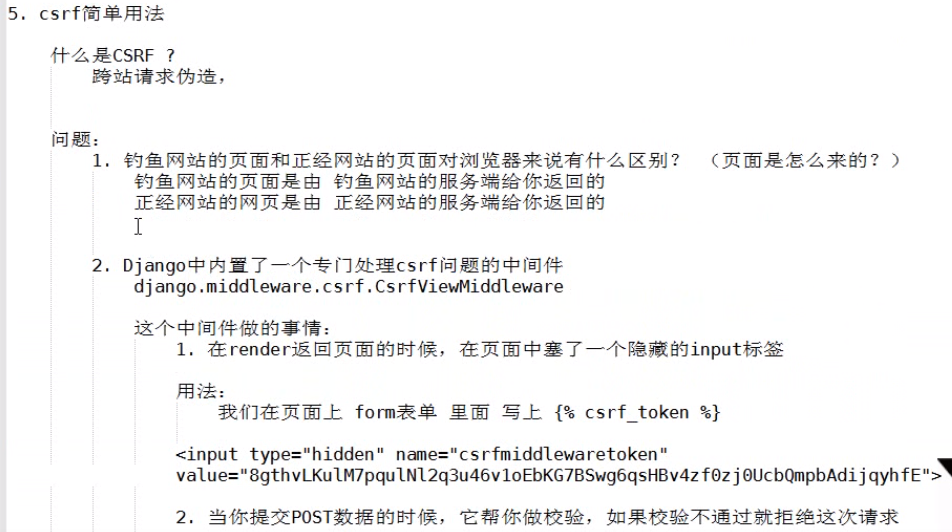

# Django生命周期

        a、wsgi
            wsgi：协议：web server getway interface      web服务网关接口
            wsgiref:是python实现wsgi协议的一个模块，模块的本质：一个socket服务端(django)
            werkzeug:是python实现wsgi协议的一个模块，模块的本质：一个socket服务端(Flask框架)
            tornado:是python实现wsgi协议的一个模块，模块的本质：一个socket服务端(Flask框架)
            uwsgi:是实现了wsgi协议的一个模块，模块本质：一个socket服务器

# Django生命周期:(rest_framework)

        CBV,基于反射实现根据请求方式不同，执行不同的方法。
        原理：
            1、路由
                url -> as_view()里的view方法 -> dispath方法（反射执行其他：GET/POST/DELETE/PUT）

            2、流程
                class StudentView(View):
                    def dispath(self, request, *args, **kwargs):
                        print('before') # 自己添加需求
                        ret = super(Student, self).dispath(request, *args, **kwargs)
                        print('after')
                
                    def get(self, request, *args, **kwargs):
                        return HttpResponse('GET')
                
                    def post(self, request, *args, **kwargs):
                        return HttpResponse('POST')
                
                    def put(self, request, *args, **kwargs):
                        return HttpResponse('PUT')
                
                    def delete(self, request, *args, **kwargs):
                        return HttpResponse('DELETE')
                
    
# Django的rest_framework：
## 中间件

        1、最多几个方法：
            process_request；
            process_view；
            process_response；
            process_exception；
            process_render_template；
            
            执行流程：
                首先进来执行所有的process_request然后路由匹配（找到函数不执行跳回去），然后再执行所有的process_view，然后再执行
                视图函数，然后再执行process_response，如果报错执行process_exception，如果返回render则执行process_render_template。
            
        2、用中间件做过什么：
            --利用它实现csrf_token，利用process_view中处理或装饰器
                2.1、为什么用process_view而不用process_request?
                    因为用process_request的话如果用的是装饰器这需要到达路由匹配到函数才能知道是否加了装饰器，
                    而process_view已经路由匹配到函数，知道函数是否加了装饰器
            --基于角色的权限控制
            --用户认证
            --csrf(说原理）
            --session(说原理）
            --黑名单
            --日志记录
        
        3、csrf
            --检查视图函数是否被 @csrf_exempt(免除csrf认证)
            --去请求体或cookie中获取token
            FBV:
                情况一：FBV中，全局配置
                    MIDDLEWARE = [
                        'django.middleware.security.SecurityMiddleware',
                        'django.contrib.sessions.middleware.SessionMiddleware',
                        'django.middleware.common.CommonMiddleware',
                        'django.middleware.csrf.CsrfViewMiddleware',
                        'django.contrib.auth.middleware.AuthenticationMiddleware',
                        'django.contrib.messages.middleware.MessageMiddleware',
                        'django.middleware.clickjacking.XFrameOptionsMiddleware',
                    ]
                    
                    from django.views.decorators.csrf import csrf_exempt
                    @csrf_exempt    # 该函数无需认证
                    def users(request):
                        return HttpResponse('...')
                        
                情况二：全局注释，FBV中某些函数需要
                    from django.views.decorators.csrf import csrf_protect
                    @csrf_protect    # 该函数需认证
                    def users(request):
                        return HttpResponse('...')
             
             CBV:   
             
                # 单独在get，post。。。等中无效
                
                方式一：
                    from django.views.decorators.csrf import csrf_exempt,csrf_protect
                    from django.utils.decorates import method_decorator
                    
                    class StudentView(View):
                    
                        @method_decorator(csrf_exempt)
                        def dispath(self, request, *args, **kwargs):
                            ret = super(Student, self).dispath(request, *args, **kwargs)
                    
                        def get(self, request, *args, **kwargs):
                            return HttpResponse('GET')
                    
                        def post(self, request, *args, **kwargs):
                            return HttpResponse('POST')
                    
                        def put(self, request, *args, **kwargs):
                            return HttpResponse('PUT')
                    
                        def delete(self, request, *args, **kwargs):
                            return HttpResponse('DELETE')
                            
                方式二：
                    from django.views.decorators.csrf import csrf_exempt,csrf_protect
                    from django.utils.decorates import method_decorator
                    
                    @method_decorator(csrf_exempt, name='dispath')
                    class StudentView(View):
                    
                        def get(self, request, *args, **kwargs):
                            return HttpResponse('GET')
                    
                        def post(self, request, *args, **kwargs):
                            return HttpResponse('POST')
                    
                        def put(self, request, *args, **kwargs):
                            return HttpResponse('PUT')
                    
                        def delete(self, request, *args, **kwargs):
                            return HttpResponse('DELETE')
            
        4、CBV
        
        5、restful
            3.1、10条规范
            3.2、自己的认识
        
        6、djangorestframework
            5.1、如何验证（基于数据库实现用户认证）
            5.2、源码流程（面向对象回顾流程）

# Django-Rest-framework组件
## 一、认证

        1、使用
        
            1.1、创建类：继承BaseAuthentication：实现：authenticate这个方法
            1.2、返回值：
                1.2.1、None，下一个认证类执行，全部都返回None，则返回匿名用户。
                1.2.3、抛出异常，raise exceptions.AuthenticationFailed('用户认证失败')
                1.2.3、返回元组，（元素1，元素2） 分别赋值给request.user，request.auth
            1.3、局部使用：
                需要认证的View:加上authentication_classes = [Authentication,]
            1.4、全局使用：（使用路径）
                REST_FRAMEWORK = {
                    # 全局使用的认证类
                    "authentication_classes": ['app01.utils.auth.Authentication',],
                    # 匿名用户设置
                    # "UNAUTHENTICATED_USER": lambda :"匿名用户"
                    "UNAUTHENTICATED_USER": None,           # 推荐使用，匿名，因为request.user = None
                    "UNAUTHENTICATED_TOKEN": None,          # 匿名，因为request.auth = None
                }
        
        2、源码流程
        
            dispath -> 封装request -> 获取定义的认证类（全局/局部）,通过列表生成器创建对象 -> initial -> perform_authentication 
            -> request.user -> Request里的user方法 -> _authenticate -> 最后执行自定义的认证类里的authenticate方法

        3、示例
            
            # 认证
            # 访问进来第一步执行as_view()里面的view()里面的dispath,当前类没有找父类
            class MyAuthentication(object):
                """
                认证源码流程
                1.访问进来第一步执行dispath,当前类没有找父类
                2.封装Request：               initialize_request(request, *args, **kwargs)
                3.                            initial(request, *args, **kwargs)           #    这当中我们设置的raise异常都会在当前函数的下面捕获
                4.                            perform_authentication(request)
                5.                            request.user ————>去封装request的类里面找user()方法
                6.user方法里面:                _authenticate()
                7._authenticate()里面循环认证类的所有对象       调用每个对象的authenticate()方法就是我们自己定义的 MyAuthentication里面的 authenticate()
                8.最后反射到我们定义的View的get,post等等方法执行里面逻辑。
                """
                def authenticate(self, request):
                    token = request._request.GET.get('token')
                    # 获取用户名和密码，去数据库校验
                    if not token:
                        raise exceptions.AuthenticationFailed('用户认证失败')
                    # 返回元组（校验后的数据）
                    return ("nzb", None)
            
                def authenticate_header(self, val):
                    """
                    认证失败给浏览器返回的响应头
                    :param val:
                    :return:
                    """
                    pass

## 二、权限

        问题：不同的视图不同的权限
        
        1、使用
            class MyPermission(object):
            
                def has_permission(self, request, view):
                    print(request.user)
                    if request.user.user_type != 1:
                        return False
                    return True
                    
            class OrderView(APIView):
                permission_classes = [MyPermission,]
    
                def get(self, request, *args, **kwargs):
                    ret = {'code': 10000,'msg': None, 'data':None}
                    try:
                        ret['data'] = {'msg':'test'}
                    except Exception as e:
                        pass
                    return JsonResponse(ret)

        2、权限梳理
        
            3.1、基本使用
            
                3.1.1、类，必须继承rest-framework提供的类：BasePermission，必须实现：has_permission方法
    
                    from rest_framework.permissions import BasePermission
    
                    class SvipPermission(BasePermission):
                        # 定义错误信息
                        message = "必须是SVIP才能访问"
    
                        def has_permission(self, request, view):
                            # print(request.user)
                            if request.user.user_type != 3:
                                return False
                            return True
                3.1.2、返回值，True,有权访问，False,无权访问
                3.1.3、局部使用：
                    需要认证的View:加上permission_classes = [SvipPermission,]
                3.1.4、全局使用：（使用路径）
                    REST_FRAMEWORK = {
                    "DEFAULT_PERMISSION_CLASSES":['app01.utils.permission.SvipPermission',],
                    }
                    
        3、源码流程
            跟认证相似，执行完认证执行权限，类里面的has_permission方法。

## 三、频率控制(节流)

        1、使用
            
            -类，继承：BaseThrottle，实现：allow_request、wait方法
            -类，继承：SimpleRateThrottle，实现：get_cache_key、scope = "Lufei" (配置文件中的key)
            
            1.1、局部使用
                class AuthView(APIView):
                    """用户认证"""
                    # 因为全局配置了，但当前View认证，所以设置为空
                    authentication_classes = []
                    permission_classes = []
                    throttle_classes = [VisitThorttle, ]
                
                    def post(self, request, *args, **kwargs):
                
            1.2、全局使用
                REST_FRAMEWORK = {
                    # 访问频率控制
                    'DEFAULT_THROTTLE_CLASSES': ['app01.utils.throttle.UserThorttle', ],
                    'DEFAULT_THROTTLE_RATES': {
                        'Lufei': '3/m',  # 匿名用户配置 一分钟三次
                        'LufeiUser': '3/m',  # 用户配置 一分钟三次
                    }
                }
            
                
            import time
            VISIT_RECORD = {}  # 放入缓存里
            
            
            class VisitThorttle(object):
            
                def __init__(self):
                    self.history = None
            
                def allow_request(self, request, view):
                    """60s内只能访问3次"""
                    # 1、获取用户ip
                    remote_addr = request._request.META.get('REMOTE_ADDR')
                    ctime = time.time()
                    if remote_addr not in VISIT_RECORD:
                        VISIT_RECORD[remote_addr] = [ctime, ]
                        return True
                    self.history = VISIT_RECORD.get(remote_addr)
            
                    # 把超出时间外的时间数据pop掉
                    while self.history and self.history[-1] < ctime - 60:
                        self.history.pop()
            
                    if len(self.history) < 3:
                        self.history.insert(0, ctime)
                        return True
            
                    # return True   # 表示可以继续访问
                    # return False    # return False表示访问频率太高，被限制，不返回也是False。
            
                def wait(self):
                    """提示还需要多少秒可以访问
            
                    """
                    ctime = time.time()
                    return 60 - (ctime - self.history[-1])
        
        2、流程流程 
        
            跟认证相似，执行完权限执行节流，类里面的allow_request方法。           
        

## 四、版本(全局配置就行)

        1、URL中通过GET传参数
        
            class ParamVersion(object):
    
                def determine_version(self, request, *args, **kwargs):
                    version = request.query_params.get('version')
                    return version
                    
            class OrderView(APIView):
                    versioning_class = ParamVersion
                    ...
        
        2、在URL中传参（推荐使用,正则表达式）
            
            # 版本配置类
            "DEFAULT_VERSIONING_CLASS": 'rest_framework.versioning.URLPathVersioning',
            "DEFAULT_VERSION": 'v1',         # 默认版本
            "ALLOWED_VERSIONS": ['v1', 'v2'],  # 允许版本
            "VERSION_PARAM": 'version',      # 版本参数
            
            例：re_path('(?P<version>[v1|v2]+)/', include(router.urls))
            
            # 获取版本
            # print(request.version)
            # 获取处理版本的对象
            # print(request.versioning_scheme)
            
            # request.versioning_scheme
            # 反向生成url
            # print(request.versioning_scheme.reverse(viewname='order', request=request))

## 五、解析器(全局配置就行)

        1、前戏：django:request.POST/ request.body
        
            request.POST要有值需要满足以下2个要求：
                
                1.1、请求头要求：
                    Content-Type:application/x-www-form-urlencoded
                    PS：如果请求头中的Content-Type:application/x-www-form-urlencoded，request.POST中才有值（去request.body中解析数据）
                
                1.2、数据格式要求：
                    name=alex&age=18&gender=男
                    
                如：
                    a.form表单提交：默认带的是Content-Type:application/x-www-form-urlencoded
                    b.ajax提交：
        
                        $.ajax({
                            url:...
                            type:POST
                            data:{'name':'alex','age':18}    # 内部转化成name=alex&age=18&gender=男，携带Content-Type:application/x-www-form-urlencoded提交
                            ...
                        })
                        
                        情况一：
                        
                            $.ajax({
                                url:...
                                type:POST
                                headres:{'Content-Type':'application/json'}
                                data:{'name':'alex','age':18}   # 内部转化成name=alex&age=18&gender=男
                                ...                             # body有值，POST没有
                            })
                        
                        情况二：
                        
                            $.ajax({
                                url:...
                                type:POST
                                headres:{'Content-Type':'application/json'}
                                data:JSON.stringfy({'name':'alex','age':18})    # {'name':'alex','age':18}
                                ...                                             # body有值，POST没有，但是可以用json.loads(request.body)得到
                            })
    
        2、rest-framework解析器，对请求体进行解析
        
            2.1、全局配置
            
            2.2、使用
            
                class ParserView(APIView):
                """
                JSONParser:表示只能解析content-type:application/json头,(最常用)
                FormParser:表示只能解析content-type:application/x-www-form-urlencoded头
                """
    
                def post(self, request, *args, **kwargs):
                    """
                    允许用户发送JSON格式数据
                        a.content-type:application/json
                        b.{'name':'alex','age':18}
                    :param request:
                    :param args:
                    :param kwargs:
                    :return:
                    """
                    # 获取解析后的结果，用了request.data才去解析
                    """
                        1.获取用户请求
                        2.获取用户请求体
                        3.根据用户请求体和parser_classes = [JSONParser,]中支持的请求头进行比较
                        4.JSONParser对象处理请求体
                        5.request.data来触发的
                    """
                    print(request.data)
                    return  HttpResponse('ParserView')
                    
            2.3、想实现上传功能的话，局部视图配置
            
                parser_classes = [FileUploadParser]
                然后取文件：
                    request.FILES
        
        3、源码流程&本质：
        
            3.1、本质
            
                请求体
                状态码
                请求方法
                
            3.2、源码流程
            
                --dispath:request封装
                --request.data

## 六、序列化

        1、序列化：
        
            1.1、写类，继承于Serializer(自定义生成字段)、ModelSerializer(自动生成字段，也是继承于Serializer)
            
            1.2、字段：
                
                1.2.1、name=serializers.CharField(source="xxx.xx.xx")
                
                1.2.2、roles = serializers.SerializerMethodField()  # 自定义显示
    
                        class UserInfoSerializer(serializers.ModelSerializer):
                            roles = serializers.SerializerMethodField()  # 字段自定义显示
                            class Meta:
                                model = UserInfo
                                # fields = "__all__"
                                fields = ['id', 'username', 'password', 'xxx', 'roles', 'group']
        
                            def get_roles(self, row):
                                role_obj_list = row.roles.all()
                                ret = []
                                for item in role_obj_list:
                                    ret.append({'id':item.id, 'name':item.name})
                                return ret
                
                1.2.3、自定义字段类不常用
                
            1.3、自动化序列化连表
                
                class UserInfoSerializer(serializers.ModelSerializer):
                    class Meta:
                        model = UserInfo
                        fields = "__all__"
                        # fields = ['id', 'username', 'password', 'xxx', 'roles', 'group']
                        depth = 1  # 官方建议0~10，尽量不要超过3层
            
            1.4、生成链接
                
                class UserInfoSerializer(serializers.ModelSerializer):
                    group = serializers.HyperlinkedIdentityField(view_name='group', lookup_field='group_id', lookup_url_kwarg='pk')
    
                    class Meta:
                        model = UserInfo
                        fields = "__all__"
                        fields = ['id', 'username', 'password', 'roles', 'group']
                        depth = 0  # 官方建议0~10，尽量不要超过3层
    
                class UserInfoView(APIView):
                    """用户中心（普通用户，vip）"""
                    # authentication_classes = [Authentication, ]
                    # 当前permission_classes存在就不会去取配置文件里的设置
                    permission_classes = [VipPermission, ]
    
                    def get(self, request, *args, **kwargs):
    
                        users = UserInfo.objects.all()
                        ser = UserInfoSerializer(instance=users, many=True, context={'request': request})
                        # print(ser.data)
                        ret = json.dumps(ser.data, ensure_ascii=False)
                        return HttpResponse(ret)
            
            1.5、源码流程
                
                单个结果，对象使用Serializer类处理
                多个结果，QuerySet，ListSerializer类处理
                # ser.data是入口
        
        2、请求数据校验
            
            class XXXValidator(object):
                def __init__(self, base):
                    self.base = base
    
                def __call__(self, value):
                    if not value.startswith(self.base):
                        message = '名称必须以 %s 开头' % self.base
                        raise serializers.ValidationError(message)
    
            class UserGroupSerializer(serializers.Serializer):
                name = serializers.CharField(error_messages={'required': '姓名不能为空'}, validators=[XXXValidator('nzb'),])
    
            class UserGroupView(APIView):
    
                authentication_classes = []
                permission_classes = []
    
                def post(self, request, *args, **kwargs):
    
                    # print(request.data)
                    ser = UserGroupSerializer(data=request.data)
                    if ser.is_valid():
                        # 取数据
                        print(ser.validated_data)
                        # 单独取某些
                        print(ser.validated_data['name'])
                    else:
                        print(ser.errors)
                    return HttpResponse('提交数据')

## 七、分页

        数据量大时，怎么规避，1、只显示200页，2、只有上一页和下一页
            1、分页，看第几页，每页显示n条数据；
            2、分页，在n个位置，向后查看n条数据；
            3、加密分页，只能看上一页和下一页。(记住id的最大值和最小值)
        
             第一种分页
                 class MyPagination(PageNumberPagination):
                     # 自定义分页类
                     page_size = 2
                     page_query_param = 'page'
                     page_size_query_param = 'size'
                     max_page_size = 5       
            
             第二种分页
                 class MyPagination(LimitOffsetPagination):
                     # 自定义分页类
                     page_size = 2
                     limit_query_param = 'limit'
                     offset_query_param = 'offset'
                     max_limit = 5
            
             第三种分页
                 class MyPagination(CursorPagination):
                     # 自定义分页类
                     page_size = 2
                     cursor_query_param = 'cursor'
                     max_limit = 5
                     ordering = 'id'
                     page_size_query_param = None
                     max_page_size = None
            
            
                 class Pager1View(APIView):
                     authentication_classes = []
                     permission_classes = []
                    
                     def get(self, request, *args, **kwargs):
                    
                         # 获取所以数据
                         roles = Role.objects.all()
                    
                         # ret = json.dumps(ser.data, ensure_ascii=False)
                         # return HttpResponse(ret)
                    
                         # rest_framework 渲染
                         # 创建分页对象
                         pg = MyPagination()
                         # 在数据中获取分页的数据
                         pager_roles = pg.paginate_queryset(queryset=roles, request=request, view=self)
                         # 对数据进行序列化
                         ser = PagerSerializer(instance=pager_roles, many=True)
                    
                         # return Response(ser.data)
                         # 生成上一页下一页链接(加密分页很有用)
                         return pg.get_paginated_response(ser.data)
        总结：
            1、数据量大，如何做分页？
                1.1、数据库性能相关转到rest_framework是怎么处理
                1.2、

## 八、视图

        1、过去
            class XxxView(View)：
                pass
                
        2、现在
            class XxxView(APIView): APIView继承于VIew
                pass
                
        3、没什么用的类：GenericAPIView（不使用）
            from app01.utils.serializers.pager import PagerSerializer
            from rest_framework.generics import GenericAPIView
            
            class View1View(GenericAPIView):
                # 继承GenericAPIView需要queryset相当于上面的roles
                queryset = Role.objects.all()
                serializer_class = PagerSerializer
                pagination_class = PageNumberPagination
                authentication_classes = []
                permission_classes = []
            
                def get(self, request, *args, **kwargs):
            
                    # 获取数据
                    roles = self.get_queryset() # Role.objects.all()
                    # 分页 [1,100]
                    pager_roles = self.paginate_queryset(roles)
                    # 序列化
                    ser = self.get_serializer(instance=pager_roles, many=True)
            
                    return Response(ser.data)
                   
        4、GenericViewSet(ViewSetMixin, generics.GenericAPIView):     
            路由：
                re_path('(?P<version>[v1|v2]+)/v1/', views.View1View.as_view({'get': 'list'}), name='view1'),
    
            视图：
                from app01.utils.serializers.pager import PagerSerializer
                from rest_framework.viewsets import GenericViewSet
                
                
                class View1View(GenericViewSet):
                    queryset = Role.objects.all()
                    serializer_class = PagerSerializer
                    pagination_class = PageNumberPagination
                    authentication_classes = []
                    permission_classes = []
                
                    def list(self, request, *args, **kwargs):
                
                        # 获取数据
                        roles = self.get_queryset() # Role.objects.all()
                        # 分页 [1,100]
                        pager_roles = self.paginate_queryset(roles)
                        # 序列化
                        ser = self.get_serializer(instance=pager_roles, many=True)
                
                        return Response(ser.data)  
                             
        5、ModelViewSet(最强大)
            路由：
                re_path('(?P<version>[v1|v2]+)/v1/$', views.View1View.as_view({'get': 'list', 'post':'create'}), name='view1'),
                re_path('(?P<version>[v1|v2]+)/v1/(?P<pk>\d+)', views.View1View.as_view({'get': 'retrieve','delete':'destroy','put': 'update','patch': 'partial_update'}), name='view1'),
            视图：
                from app01.utils.serializers.pager import PagerSerializer
                from rest_framework.viewsets import GenericViewSet, ModelViewSet
                from rest_framework.mixins import ListModelMixin, CreateModelMixin
               
                # class View1View(ListModelMixin,GenericViewSet,CreateModelMixin):
                class View1View(ModelViewSet):
                    queryset = Role.objects.all()
                    serializer_class = PagerSerializer
                    pagination_class = PageNumberPagination
                    authentication_classes = []
                    permission_classes = []        
                    
                PS:class View1View(CreateModelMixin):
        6、总结：
            6.1、增删改查：ModelViewSet
            6.2、增删：CreateModelMixin，DestroyModelMixin，GenericViewSet
            6.4、复杂逻辑：GenericViewSet 或 APIView
            
            PS：权限：
                GenericAPIView.get_object
                    check_object_permissions
                        has_object_permission

## 九、路由

        1、
            re_path('(?P<version>[v1|v2]+)/auth/', views.AuthView.as_view(), name='auth'),
        
        2、
            re_path('(?P<version>[v1|v2]+)/v1/$', views.View1View.as_view({'get': 'list', 'post':'create'}), name='view1'),
        
        3、
            # http://127.0.0.1:8000/api01/v1/v1/
            re_path('(?P<version>[v1|v2]+)/v1/$', views.View1View.as_view({'get': 'list', 'post':'create'}), name='view1'),
           
            # http://127.0.0.1:8000/api01/v1/v1.json
            re_path('(?P<version>[v1|v2]+)/v1\.(?P<format>\w+)$', views.View1View.as_view({'get': 'list', 'post':'create'}), name='view1'),
            
            re_path('(?P<version>[v1|v2]+)/v1/(?P<pk>\d+)$', views.View1View.as_view({'get': 'retrieve', 'delete':'destroy', 'put': 'update', 'patch': 'partial_update'}), name='view1'),
            re_path('(?P<version>[v1|v2]+)/v1/(?P<pk>\d+)\.(?P<format>\w+)', views.View1View.as_view({'get': 'retrieve','delete':'destroy','put': 'update','patch': 'partial_update'}), name='view1'),
        
        4、自动生成路由
            from app01 import views
            from rest_framework import routers
            # rest_framework路由
            router = routers.DefaultRouter()
            router.register(r'xxx', views.View1View)
            router.register(r'rt', views.View1View)
            urlpatterns = [
                # rest_framework路由
                re_path('(?P<version>[v1|v2]+)/', include(router.urls))
            ]     

## 十、渲染器

        from rest_framework.renderers import JSONRenderer, BrowsableAPIRenderer, AdminRenderer, HTMLFormRenderer
        # class View1View(ListModelMixin,GenericViewSet,CreateModelMixin):
        class View1View(ModelViewSet):
            # 渲染器,使用JSONRenderer就行，BrowsableAPIRenderer只是界面好看
            # renderer_classes = [JSONRenderer, BrowsableAPIRenderer]
            authentication_classes = []
            permission_classes = []
            queryset = Role.objects.all()
            serializer_class = PagerSerializer
            pagination_class = PageNumberPagination
        全局配置：
            'DEFAULT_RENDERER_CLASSES':['rest_framework.renderers.JSONRenderer','rest_framework.renderers.BrowsableAPIRenderer']

## 十一、django组件：content-type
        
        Django内置的一个组件，帮助开发者做连表操作。【混搭】
        models里定义的时候，实现一表对多表操作
        
        例：
            # 利用content-type实现一表对应多表
            
            # models.py
                
                from django.contrib.contenttypes.fields import GenericForeignKey, GenericRelation
                from django.db import models
                from django.contrib.contenttypes.models import ContentType
                
                class Course(models.Model):
                    """
                    普通课程
                    """
                    name = models.CharField(max_length=32)
                
                    # 仅用于反向查找
                    price_policy_list = GenericRelation('PricePolicy')
                
                
                class DegreeCourse(models.Model):
                    """
                    学位课程
                    """
                    name = models.CharField(max_length=32)
                    # 仅用于反向查找
                    price_policy_list = GenericRelation('PricePolicy')
                
                
                class PricePolicy(models.Model):
                    """价格策略"""
                    price = models.IntegerField()
                    period = models.IntegerField()
                
                    # 自定义
                    # table_name = models.CharField(verbose_name=u'关联的表名称')
                    # object_id = models.CharField(verbose_name=u'关联表中的数据id')
                
                    # 使用Django的组件content-type
                    content_type = models.ForeignKey(ContentType, verbose_name=u'关联普通课或学位课表', on_delete=models.CASCADE)  # 11、12就是上面两个表
                    object_id = models.IntegerField(verbose_name=u'关联表中的数据id')
                
                    # 帮助你快速实现content-type操作
                    content_object = GenericForeignKey('content_type', 'object_id')
            
            # 视图view里面的逻辑, views.py:
            
                # 插入一条价格策略,为学位课“Python”添加一个价格策略：一个月9.9
               
                # 1、加一个字段后，使用content-type
                # obj = DegreeCourse.objects.filter(name='Python').first()
                # PricePolicy.objects.create(price=9.9, period=30, content_object=obj)
                
                # 2、根据课程ID找到课程，并获取所有的价格策略
                # course = DegreeCourse.objects.filter(id=1).first()
                # price_policy = course.price_policy_list.all()

# 十二、小知识点

        1、前后端分离如何解决跨域
            --jsonp
            --cors
                -响应头放在中间件
            
        2、__init__和__new__的区别：
        
            __new__：是返回对象
            __init__：是__new__返回的对象的构造方法
            
            
            例：
            
                class Foo(object):
                    def __init__(self, a1):
                        print(a1)
                        self.a = a1
                        
                    def __new__(cls, *args, **kwargs):
                        """
                        1.根据类创建对象，并返回
                        2.执行返回值的__init__
                        """
                        
                        # 如果返回的是nzb字符串，则执行字符串的构造方法__init__,上面__init__里面的输出a1为nzb(因为字符串没有构造方法)
                        return 'nzb'
                        
                        # 默认,实例化当前类的对象返回, 然后去执行构造方法
                        return object.__new__(cls)
                        
                obj = Foo(123)
                print(obj)

[https://github.com/bluesnie/Learning-notes/blob/master/Python/Django-REST-framework.md#django%E7%94%9F%E5%91%BD%E5%91%A8%E6%9C%9F]: ./django生命周期