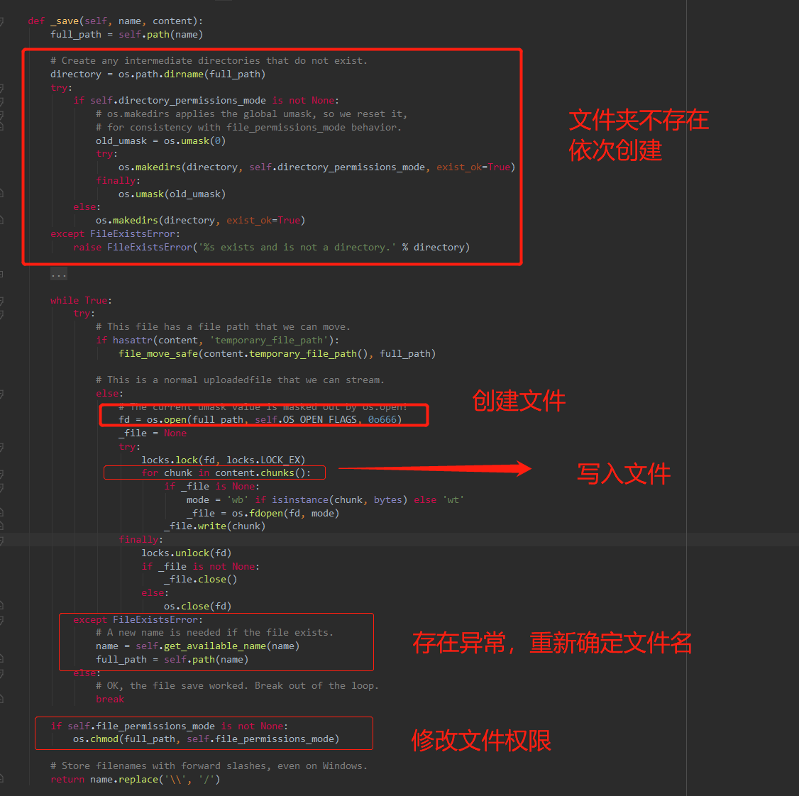
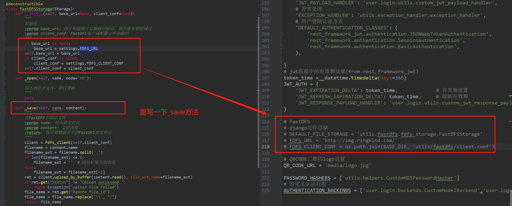

###### datetime:2020/5/14 16:17
###### author:nzb

## Django-Fastdfs重写存储类

- [csnd文章](https://blog.csdn.net/linzi1994/article/details/83045628)

- 源码解析


- 本地存储类


- 重写存储类


- client.conf
```text
    # connect timeout in seconds
    # default value is 30s
    connect_timeout=30
    
    # network timeout in seconds
    # default value is 30s
    network_timeout=60
    
    # the base path to store log files
    # base_path=C:\Users\Admin\PycharmProjects\alumnus_circle\venv
    # FastDFS客户端存放日志文件的目录
    base_path = /data/log/fastdfs/fastdfs.log
    
    # tracker_server can ocur more than once, and tracker_server format is
    #  "host:port", host can be hostname or ip address
    # 运行tracker服务的机器ip
    tracker_server = 172.26.6.129:22122
    
    #standard log level as syslog, case insensitive, value list:
    ### emerg for emergency
    ### alert
    ### crit for critical
    ### error
    ### warn for warning
    ### notice
    ### info
    ### debug
    log_level=info
    
    # if use connection pool
    # default value is false
    # since V4.05
    use_connection_pool = false
    
    # connections whose the idle time exceeds this time will be closed
    # unit: second
    # default value is 3600
    # since V4.05
    connection_pool_max_idle_time = 3600
    
    # if load FastDFS parameters from tracker server
    # since V4.05
    # default value is false
    load_fdfs_parameters_from_tracker=false
    
    # if use storage ID instead of IP address
    # same as tracker.conf
    # valid only when load_fdfs_parameters_from_tracker is false
    # default value is false
    # since V4.05
    use_storage_id = false
    
    # specify storage ids filename, can use relative or absolute path
    # same as tracker.conf
    # valid only when load_fdfs_parameters_from_tracker is false
    # since V4.05
    storage_ids_filename = storage_ids.conf
    
    #HTTP settings
    http.tracker_server_port=80
    
    #use "#include" directive to include HTTP other settiongs
    ##include http.conf
```

- fdfs-storage.py

```python
# _*_ encoding:utf-8 _*_
__author__ = 'nzb'
__datetime__ = '2020/1/3 15:18'

from django.conf import settings
from django.core.files.storage import Storage
from django.utils.deconstruct import deconstructible
from fdfs_client.client import Fdfs_client


@deconstructible
class FastDFSStorage(Storage):
    def __init__(self, base_url=None, client_conf=None):
        """
        初始化
        :param base_url: 用于构造图片完整路径使用，图片服务器的域名
        :param client_conf: FastDFS客户端配置文件的路径
        """
        if base_url is None:
            base_url = settings.FDFS_URL
        self.base_url = base_url
        if client_conf is None:
            client_conf = settings.FDFS_CLIENT_CONF
        self.client_conf = client_conf

    def _open(self, name, mode='rb'):
        """
        用不到打开文件，所以省略
        """
        pass

    def _save(self, name, content):
        """
        在FastDFS中保存文件
        :param name: 传入的文件名
        :param content: 文件内容
        :return: 保存到数据库中的FastDFS的文件名
        """
        client = Fdfs_client(self.client_conf)
        filename = content.name
        filename_ext = filename.split('.')
        if len(filename_ext) <= 1:
            filename_ext = ''  # 没有扩展名的情况
        else:
            filename_ext = filename_ext[-1]
        ret = client.upload_by_buffer(content.read(), file_ext_name=filename_ext)
        if ret.get("Status") != "Upload successed.":
            raise Exception("upload file failed")
        file_name = ret.get("Remote file_id")
        file_name = file_name.replace('\\', "/")
        return file_name

    def url(self, name):
        """
        返回文件的完整URL路径
        :param name: 数据库中保存的文件名
        :return: 完整的URL
        """
        return self.base_url + name

    def exists(self, name):
        """
        判断文件是否存在，FastDFS可以自行解决文件的重名问题
        所以此处返回False，告诉Django上传的都是新文件
        :param name:  文件名
        :return: False
        """
        return False


```

- settings.py
```python
# FastDFS
# django文件存储
DEFAULT_FILE_STORAGE = 'utils.fastdfs.fdfs_storage.FastDFSStorage'
FDFS_URL = 'http://img.example.com/'
FDFS_CLIENT_CONF = os.path.join(BASE_DIR, 'utils/fastdfs/client.conf')
```