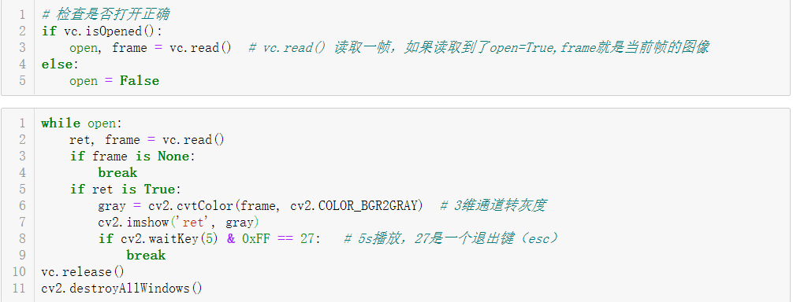
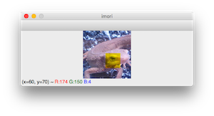
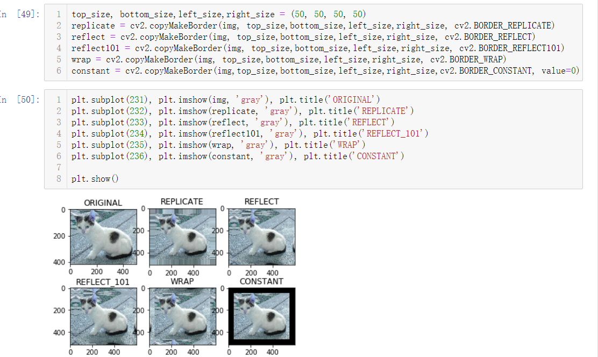
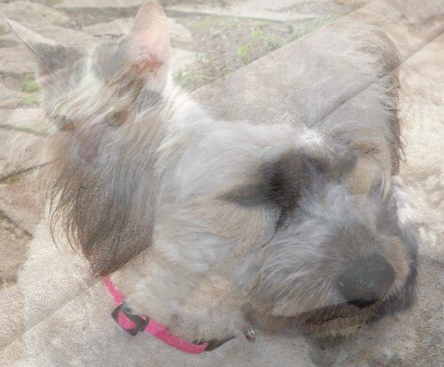
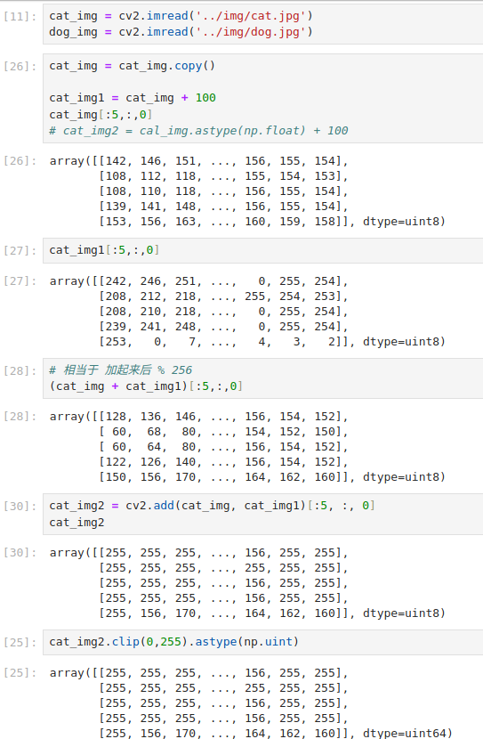

###### datetime:2022/04/11 15:07

###### author:nzb

# 图像基本操作

## 数据读取

### 图像

  * 读取图像使用`imread()`函数

    - `img = cv2.imread("test.jpg")`
    - `opencv` 读取的格式是：`BGR`

  * `img.shape`：获得图像的大小，返回的元组（tuple）中的三个数依次表示高度、宽度和通道数（蓝通道、绿通道、红通道）。

  * `img.dtype`：获得图片的类型。`uint8`是一个 8 位无符号整数。图像的`RGB`分量通常用 `0` 到 `255` 的 `256` 个灰度表示。例如，红色像素为 `(R,G,B)=(255,0,0)` ，白色是 `(R,G,B)=(255,255,255)` 。如果图像不以这个类型保存的话，图像会变得很奇怪。

  * `cv2.imshow()`：来显示图像。`cv2.imshow()`的第一个参数是窗口的名字（不写也没有关系），第二个参数是要显示的图像的名称，一定要写。

      ```python
          cv2.imshow('image', img)
          cv2.waitKey(0)
          cv2.destroyAllWindows()

          # 封装显示
          def show_img(img,name='img', hstack=False):
            if not hstack:
                if isinstance(img, list):
                    for i in range(len(img)):
                        cv2.imshow(name + str(i), img[i])
                else:
                    cv2.imshow("res", img)
            else:
                res = np.hstack(img)
                cv2.imshow("res", res)
            cv2.waitKey(0)
            cv2.destroyAllWindows()
      ```

  * `img.astype(np.float32)`：让`img`的类型变更为`float32`的话，可以使用`astype()`。

      * 如果用这种类型显示图片，就会变成得很奇怪。所以当你想要操作图像时：

          * 使用`cv2.imread`读取图像；

          * 将图像的类型变为浮点型`np.float32`；

          * 操作图像；

          * 像素值不满 `0` 的将值设置为 `0` ，像素值超过 `255` 的将值设置为 `255` （**超重要**）；

            `img = np.clip（img, 0 , 255） 或者 img.clip（0，255）`

          * 将图像类型变更为n`p.uint8`并保存；

            `astype(np.uint8)`

  * `img2 = img.copy()`：拷贝图像

  * `cv2.imwrite()`：保存图像

    - `cv2.imwrite("sample.jpg", img2)`：例如之前的被保存为名称为的图像，如果返回值为的话，这就说明该图像被保存在同一个文件夹中，文件名为。

### 视频

  * `cv2.VideoCapture`可以捕获摄像头，用数字来控制不同的设备，例如`0,1`。

    `vc = cv2.VideoCapture("../img/test.mp4")`

  * 如果是视频文件，直接指定好路径即可。

  * 

## 操作像素

* 例如，操作 `x=30,y=20` 的像素值时，进行以下的操作。像素值是按 `BGR` 的顺序排列的。`array()` 表示这个图像是 `NumPy` 格式。也就是说，`OpenCV` 是 `NumPy` 的高层封装。

  `img[20,30]`

* 更进一步，要得到 `x=30,y=20` 处的 `G` 分量，可以使用代码`img[20,30,1]`

* 切片

    * 例如要查看 `y=20, x=[30, 32]` 这个范围之内（的像素）时，如果设置为`30:33`可以得到一个矩阵。如果设置`a:b`，可以获得在 `a < v < b` 范围内的值。顺便说一下，如果设置为`:30`可以获得 `[0, 30]`范围内的像素；如果设置为30:的话，可以获得 [30,最后] 像素的值。

      `img[20, 30:33]`

    * 例如将图片左上角`（ x=[0, 50], y = [0, 50] ）`设置为黑色，是照下面这样做。`copy()`这个函数在后面介绍。

      `img2[:50, :50] = 0`

        * 

* 获取颜色通道：`b,g,r = cv2.split(img)`

* 合并颜色通道：`cv2.merge((b,g,r)) # 合并`
 
* 只保留`R`通道(以此类推只保留`G`，只保留`B`)

  ```python
  # 只保留R
  # 通道为 BGR
  only_R_img = img.copy()
  # only_R_img[...,0] = 0
  # only_R_img[...,1] = 0
  only_R_img[:, :, 0] = 0  # B 通道
  only_R_img[:, :, 1] = 0  # G 通道
  cv_show('ret', [img, only_R_img])
  ```

* 之前有提到：像素的值小于 `0` 的时候设置为 `0`，超过 `255` 的时候修改为 `255`。

    * 例如，图像的类型为`float32`，将一部分的`B`分量改为 `260`。`uint8`类型的整数范围只能取 `[0,255]` ，如果变成`uint8`型的话蝾螈的颜色一部分就会变成黄色的。

    * 这是因为，如果将 `260` 变为`uint8`型的话，因为 `260-256`，所以会让`B`的值为 `4`。经常会由于这个原因让像素的值变得不正确。所以上面的第四步的操作（限定值的范围在`[0,255]`之间）是必要的。

    * 

## 边界填充

* `cv2.copyMakeBorder（）`

* 选项

    * `BORDER_REPLICATE`：复制法，也就是复制最边缘像素。

    * `BORDER_REFLECT`：反射法，对感兴趣的图像中的像素在两边进行复制，例如：`fedcba|abcdefgh|hgfedcb`

    * `BORDER_REFLECT_101`：反射法，也就是以最边缘像素为轴，对称`gfedcb|abcdefgh|gfedcba`

    * `BORDER_WRAP`：外包装法，`cdefgh|abcdefgh|abcdefg`

    * `BORDER_CONSTANT`：常量法，常数值填充。

* 

## 图像缩放

* `cv2.resize(src， dsize[， dst[， fx[， fy[，interpolation]]]])`

    * 选项

        * `src`：必须，原图像

        * `dsize`：必须，输出图像所需大小

        * `fx`：可选，沿水平轴的比例因子

        * `fy`：可选，沿垂直轴的比例因子

        * `interpolation`：可选，插值方式

          `通常的，缩小使用cv.INTER_AREA，放缩使用cv.INTER_CUBIC(较慢)和cv.INTER_LINEAR(较快效果也不错)。默认情况下，所有的放缩都使用cv.INTER_LINEAR。`

            * `cv2.INTER_NEAREST`：最近邻插值

            * `cv2.INTER_LINEAR`：双线性插值

            * `cv2.INTER_CUBIC`：双线性插值

            * `cv2.INTER_AREA`：使用像素区域关系重新采样。它可能是图像抽取的首选方法，因为它可以提供无莫尔条纹的结果。但是当图像被缩放时，它类似于`INTER_NEAREST`方法。

* 示例

    * `cv2.resize（img，（0，0），fx=5，fy=5）`：不指定像素大小，`xy`按不同比例缩放

    * `cv2.resize（img，（400，500））-`：缩放成高`400`，宽`500`的大小

## 图像融合

`两张图片维度需要一样`

* `cv2.addWeighted()`

    * `cv2.addWeighted（img_cat， 0.4，img_dog， 0.6，0）`

      - `R = αx + βy + b`；其中`α`和`β`是对应的权重，哪个值大就更明显，`b`是亮度级上提亮
  
  - 

## 图片拼接展示

`需要注意的是图片维度需要一样`

* 水平拼接

    ```python
        res = np.hstack((blur1,gussian,median)) # 水平拼接
        cv2.imshow('median vs gussian vs median', res)
        cv2.waitKey(0)
        cv2.destroyAllWindows()
    ```

* 

* 垂直拼接

    ```python
        res = np.vstack((blur1,gussian,median)) # 水平拼接
    ```

## x, y, w, h作为参数的时候获取图像

* 操作像素：`img [ y ：y + h， x：x + w ]`

* 作为参数传递函数时：`（x，y）`或者`（x + w，y + h）`

## 数值计算
 
- 因为颜色数值为：`0-255`，所以计算的时候超过后会变成： `计算后的数值 % 256（取模）`
- 因此计算需要转换成`float`后，之后小于`0`的转换为`0`，大于`255`的转换为`255`

