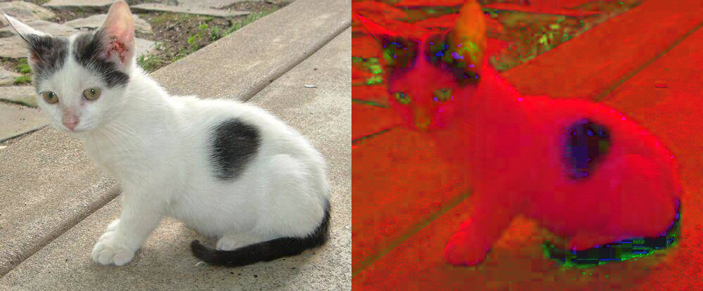

###### datetime:2022/04/11 15:07

###### author:nzb

# 图像处理

## 灰度图

* 灰度是一种图像亮度的表示方法

* `gray = cv2.cvtColor(img, cv2.COLOR_BGR2GRAY )`

## 二值化（图像阈值）

* `ret, dst = cv2.threshold(src, thresh, maxval, type)`

  `简单二值化`

    * `src`： 输入图，只能输入单通道图像，通常来说为**灰度图**

    * `dst`： 输出图

    * `thresh（ret）`： 阈值

    * `maxval`： 当像素值超过了阈值（或者小于阈值，根据`type`来决定），所赋予的值，最大：`255`

    * `type`：二值化操作的类型，包含以下5种类型

        * `cv2.THRESH_BINARY`：超过阈值部分取`maxval`（最大值），否则取`0`

        * `cv2.THRESH_BINARY_INV`：`THRESH_BINARY`的反转

        * `cv2.THRESH_TRUNC`：大于阈值部分设为阈值，否则不变

        * `cv2.THRESH_TOZERO`：大于阈值部分不改变，否则设为`0`

        * `cv2.THRESH_TOZERO_INV`：`THRESH_TOZERO`的反转

* `ret2,dst2= cv2.threshold(img, 0, 255, cv2.THRESH_BINARY | cv2.THRESH_OTSU)`

  `Otsu （大津）二值化：找到最合适的阈值，其中threshold设置为0配合cv2.THRESH_OTSU，寻找最适合的阈值`

* 示例

    * 

## HSV变换

* `HSV`即使用：色相（`Hue`）、饱和度（`Saturation`）、明度（`Value`）来表示色彩的一种方式。

    * 色相：将颜色使用0∘到360∘表示，就是平常所说的颜色名称，如红色、蓝色。

    * 饱和度：是指色彩的纯度，饱和度越低则颜色越黯淡（0≤S<1）；

    * 明度：即颜色的明暗程度。数值越高越接近白色，数值越低越接近黑色（0≤V<1）；

* `hsv = cv2.cvtColor(img, cv2.COLOR_BGR2HSV)`

  