###### datetime:2022/04/11 15:07

###### author:nzb

# 图像处理

## 灰度图

* 灰度是一种图像亮度的表示方法

* gray = cv2.cvtColor(img, cv2.COLOR_BGR2GRAY )

## 二值化（图像阈值）

* ret, dst = cv2.threshold(src, thresh, maxval, type)

  `简单二值化`

    * src： 输入图，只能输入单通道图像，通常来说为灰度图

    * dst： 输出图

    * thresh（ret）： 阈值

    * maxval： 当像素值超过了阈值（或者小于阈值，根据type来决定），所赋予的值

      `最大：255`

    * type：二值化操作的类型，包含以下5种类型

        * cv2.THRESH_BINARY：超过阈值部分取maxval（最大值），否则取0

        * cv2.THRESH_BINARY_INV：THRESH_BINARY的反转

        * cv2.THRESH_TRUNC：大于阈值部分设为阈值，否则不变

        * cv2.THRESH_TOZERO：大于阈值部分不改变，否则设为0

        * cv2.THRESH_TOZERO_INV：THRESH_TOZERO的反转

* ret2,dst2= cv2.threshold(img, 0, 255, cv2.THRESH_BINARY | cv2.THRESH_OTSU)

  `Otsu （大津）二值化：找到最合适的阈值，其中threshold设置为0配合cv2.THRESH_OTSU，寻找最适合的阈值`

* 示例

    * 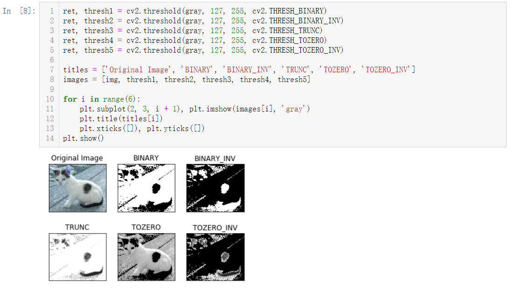

## HSV变换

* HSV即使用：色相（Hue）、饱和度（Saturation）、明度（Value）来表示色彩的一种方式。

    * 色相：将颜色使用0∘到360∘表示，就是平常所说的颜色名称，如红色、蓝色。

    * 饱和度：是指色彩的纯度，饱和度越低则颜色越黯淡（0≤S<1）；

    * 明度：即颜色的明暗程度。数值越高越接近白色，数值越低越接近黑色（0≤V<1）；

* hsv = cv2.cvtColor(img, cv2.COLOR_BGR2HSV)

## 图像滤波

`图像降噪，使图像更清晰，更平滑`

* 均值滤波

    * blur1 = cv2.blur(noise_img, (3,3))

      `3 * 3的卷积核`

    * 方框滤波

      `基本和均值一样，可以选择归一化`

        * 归一化

          `计算均值滤波`

            * blur2 = cv2.boxFilter(noise_img,-1, (3,3), normalize=True)

              `-1是固定值，一般不需要改变`

        * 未归一化

          `容易越界（未取均值，超过255，一旦越界就取255）`

            * blur3 = cv2.boxFilter(noise_img,-1, (3,3), normalize=False)

* 高斯滤波

  `更看重权重，离目标远的权重小，离目标近的权重大`

    * gussian = cv2.GaussianBlur(noise_img, (5, 5), 1)

      `5*5的卷积核`

* 中值滤波

    * median = cv2.medianBlur(noise_img, 5)

      `5*5的卷积核`

## 形态学处理

`处理二值化图像，获取轮廓 腐蚀=瘦身，膨胀=增`

* 腐蚀（Erode）

    * kernel = np.ones((3,3), dtype=np.uint8)

      `核`

    * erode_img = cv2.erode(img, kernel, iterations=1)

      `iterations：迭代（腐蚀）次数`

    * 不同腐蚀次数的变化

        * 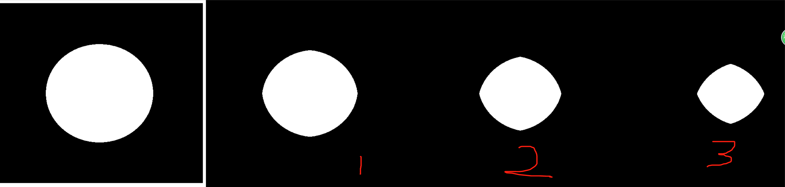

* 膨胀（Dilate）

    * kernel = np.ones((3,3), dtype=np.uint8)

      `核`

    * dilate_img = cv2.dilate(erosion, kernel, iterations=1)

    * 不同膨胀次数的变化

        * 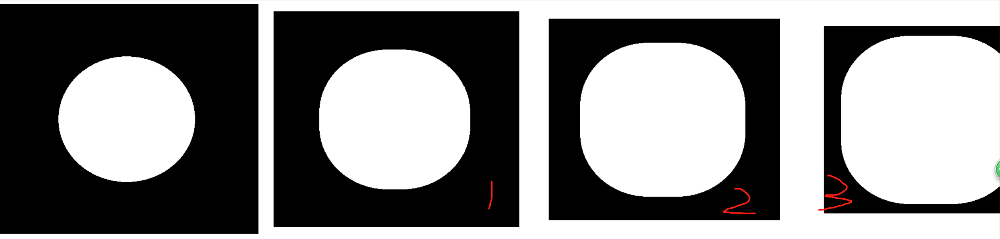

* 开运算与闭运算

  `open_close_kernel = np.ones((5,5), np.uint8)`

    * 开运算：先腐蚀，后膨胀

      `开运算可以用来去除仅存的小块像素。`

        * openimg = cv2.morphologyEx(img, cv2.MORPH_OPEN, open_close_kernel)

    * 闭运算：先膨胀，后腐蚀

        * closeimg = cv2.morphologyEx(img, cv2.MORPH_CLOSE, open_close_kernel)

    * 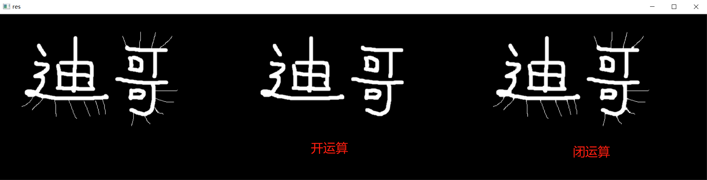

* 梯度运算

  `kernel = np.ones((7,7), np.uint8)`

    * 梯度 = 膨胀 - 腐蚀

    * 形态学梯度为经过膨胀操作（dilate）的图像与经过腐蚀操作（erode）的图像的差，可以用于抽出物体的边缘。

    * gradient = cv2.morphologyEx(pie, cv2.MORPH_GRADIENT, kernel)

    * 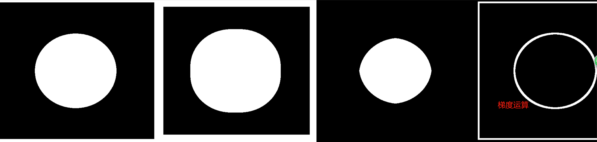

* 顶帽和黑帽

  `kernel = np.ones((7,7), np.uint8)`

    * 顶帽

      `顶帽 = 原始输入 - 开运算`

        * tophat = cv2.morphologyEx(img1, cv2.MORPH_TOPHAT, kernel)

    * 黑帽

      `黑帽 = 闭运算 - 原始输入`

        * blackhat = cv2.morphologyEx(img1, cv2.MORPH_BLACKHAT, kernel)

    * 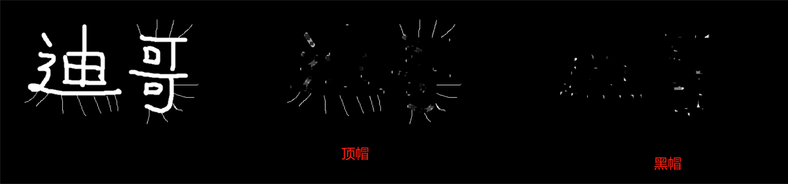

## 角点检测（图像梯度，边缘检测步骤）

* Sobel算子

    * 卷积核

        * 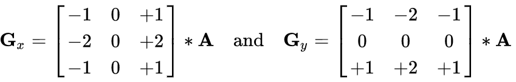

    * dst = cv2.Sobel(src, ddepth, dx, dy, ksize)
      > dx=0，dy=1，只计算垂直方向  
      dx=1，dy=0，只计算水平方向  
      dx=1，dy=1，直接计算（不建议，效果不好，建议分开计算再）

        * ddepth：图像的深度

        * dx和dy：分别表示水平和竖直方向

        * ksize：是Sobel算子的大小（核大小）

    * sobel = cv2.convertScaleAbs(sobel)

      `白到黑是正数，黑到白就是负数了，所有的负数会被截断成0，所以要取绝对值`

    * sobelxy = cv2.addWeighted(sobelx, 0.5, sobely, 0.5, 0)

      `分别计算x和y，再求和 0.5：为权重`

    * 示例

        * 代码
            ```python
                lena = cv2.imread("../img/lena.jpg", cv2.IMREAD_GRAYSCALE) 
                # 分开计算 
                sobelx = cv2.Sobel(lena, cv2.CV_64F, 1, 0, ksize=3) 
                sobelx = cv2.convertScaleAbs(sobelx) 
                sobely = cv2.Sobel(lena, cv2.CV_64F, 0, 1, ksize=3) 
                sobely = cv2.convertScaleAbs(sobely) 
                sobelxy1 = cv2.addWeighted(sobelx, 0.5, sobely, 0.5, 0) 
                # 直接计算 
                sobelxy2 = cv2.Sobel(lena, cv2.CV_64F, 1, 1, ksize=3) 
                sobelxy2 = cv2.convertScaleAbs(sobelxy2)
                show_img([lena, sobelxy1, sobelxy2], hstack=True)
            ```

        * 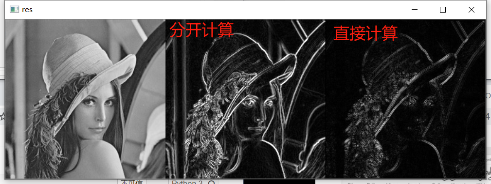

* Scharr算子

  `更敏感`

    * 卷积核

        * 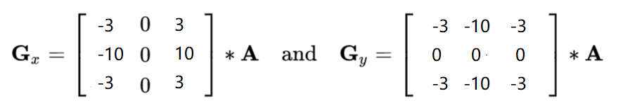

    * dst = cv2.Scharr(src, ddepth, dx, dy)

    * 示例

        * 代码
            ```python
                scharrx = cv2.Scharr(lena, cv2.CV_64F, 1, 0) 
                scharry = cv2.Scharr(lena, cv2.CV_64F, 0, 1) 
                scharrx = cv2.convertScaleAbs(scharrx) 
                scharry = cv2.convertScaleAbs(scharry) 
                scharrxy = cv2.addWeighted(scharrx, 0.5, scharry, 0.5, 0)
            ```

        * 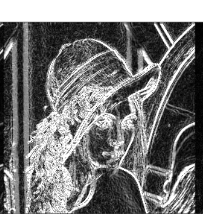

* Laplacian算子

  `二阶导，反应一阶导的变化率，所以对变化更敏感（对噪音点敏感，如果有噪音点就不好检测了）`

    * 卷积核

        * 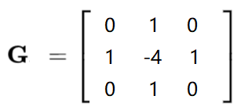

    * dst = cv2.Laplacian(src, ddepth)

    * 示例

        * 代码
            ```python
                laplacian = cv2.Laplacian(lena, cv2.CV_64F) 
                laplacian = cv2.convertScaleAbs(laplacian)
            ```

        * 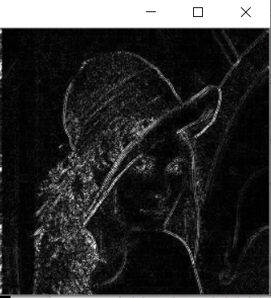

* 三者对比

    * 代码

        ```python
            lena = cv2.imread("../img/lena.jpg", cv2.IMREAD_GRAYSCALE) 
            # 分开计算 
            sobelx = cv2.Sobel(lena, cv2.CV_64F, 1, 0, ksize=3) 
            sobelx = cv2.convertScaleAbs(sobelx) 
            sobely = cv2.Sobel(lena, cv2.CV_64F, 0, 1, ksize=3) 
            sobely = cv2.convertScaleAbs(sobely) 
            sobelxy1 = cv2.addWeighted(sobelx, 0.5, sobely, 0.5, 0) 
      
            # Scharr算子 
            scharrx = cv2.Scharr(lena, cv2.CV_64F, 1, 0) 
            scharry = cv2.Scharr(lena, cv2.CV_64F, 0,1) 
            scharrx = cv2.convertScaleAbs(scharrx) 
            scharry = cv2.convertScaleAbs(scharry) 
            scharrxy = cv2.addWeighted(scharrx, 0.5, scharry, 0.5, 0) 
      
            # Laplacian算子 
            laplacian = cv2.Laplacian(lena, cv2.CV_64F) 
            laplacian = cv2.convertScaleAbs(laplacian) 
            show_img([lena, sobelxy1, scharrxy, laplacian], hstack=True)
        ```

    * 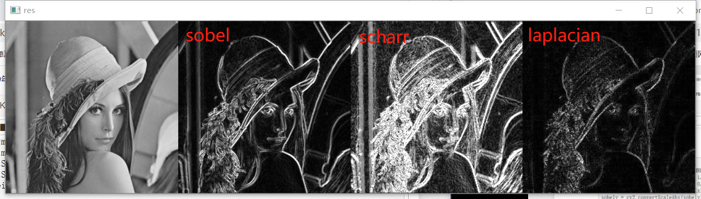

## Canny边缘检测

* 1、 使用高斯滤波器，以平滑图像，滤除噪声。

    * 高斯滤波器

        * 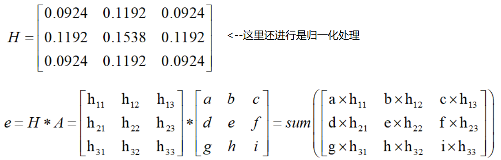

* 2、 计算图像中每个像素点的梯度强度和方向。

  `在x方向和y方向上使用Sobel滤波器，在此之上求出边缘的强度和边缘的梯度`

    * 梯度和方向

        * 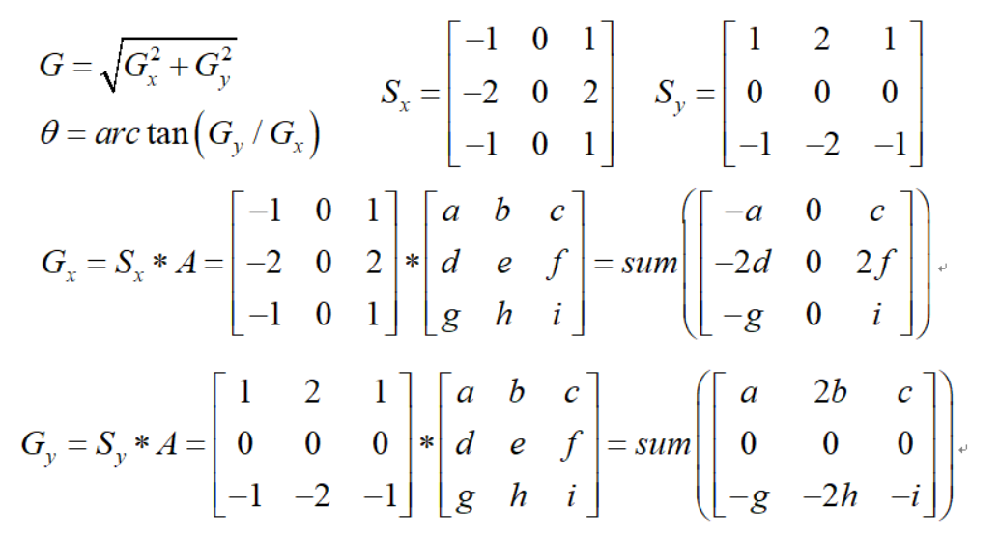

* 3、 应用非极大值（Non-Maximum Suppression）抑制，以消除边缘检测带来的杂散响应。

    * 非极大值抑制

    * 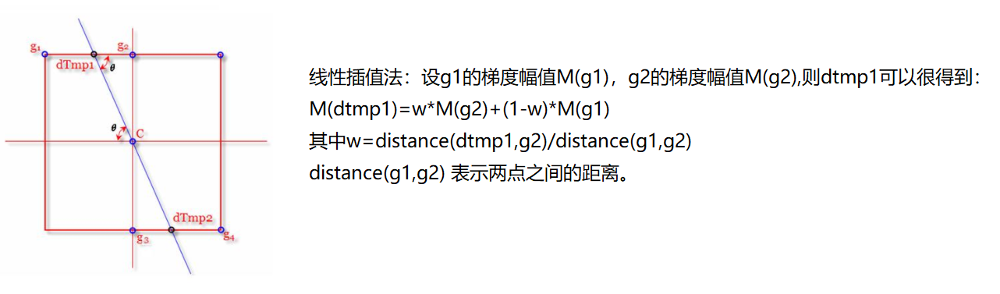
    * 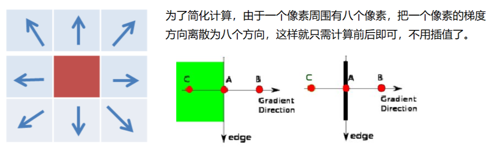

* 4、 应用双阈值（Double-Threshold）检测来确定真实的和潜在的边缘。

    * 双阈值检测

        * 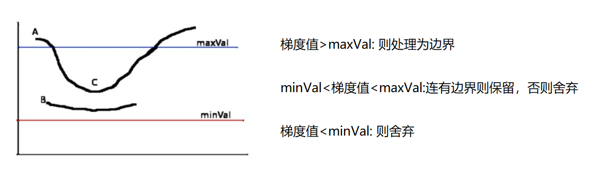

* 5、 通过抑制孤立的弱边缘最终完成边缘检测。

    * 示例

        * 代码

        ```python
            img=cv2.imread("lena.jpg",cv2.IMREAD_GRAYSCALE) 
            v1=cv2.Canny(img,80,150)
            v2=cv2.Canny(img,50,100) 
            # 80和150：minVal和maxVal 
            res = np.hstack((v1,v2))
            cv_show(res,'res')
        ```

        * 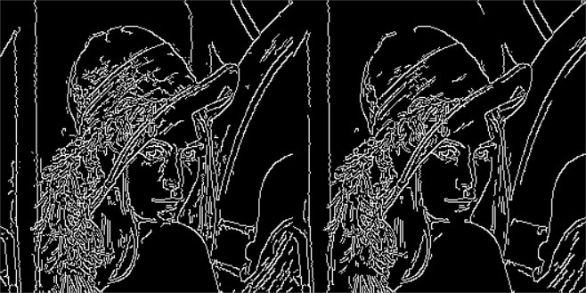

## 图像金字塔

* 高斯金字塔

    * 
    * 高斯金字塔：向下采样方法（缩小）

        * 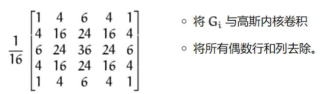

    * 高斯金字塔：向上采样方法（放大）

        * 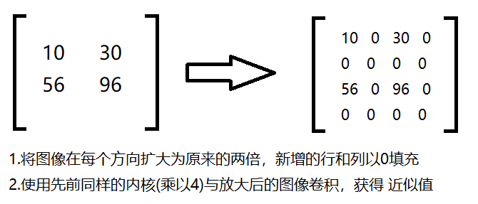

    * 示例

        * 代码

            ```python
                AM = cv2.imread("../img/AM.png") 
                up = cv2.pyrUp(AM) 
                down = cv2.pyrDown(AM)
                show_img([AM,up,down])
            ```

        * 展示

            * 原图

                * 
            * 向上

                * 
            * 向下

                * 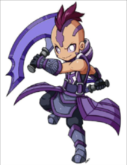

* 拉普拉斯金字塔

    * Gi：原图

        * 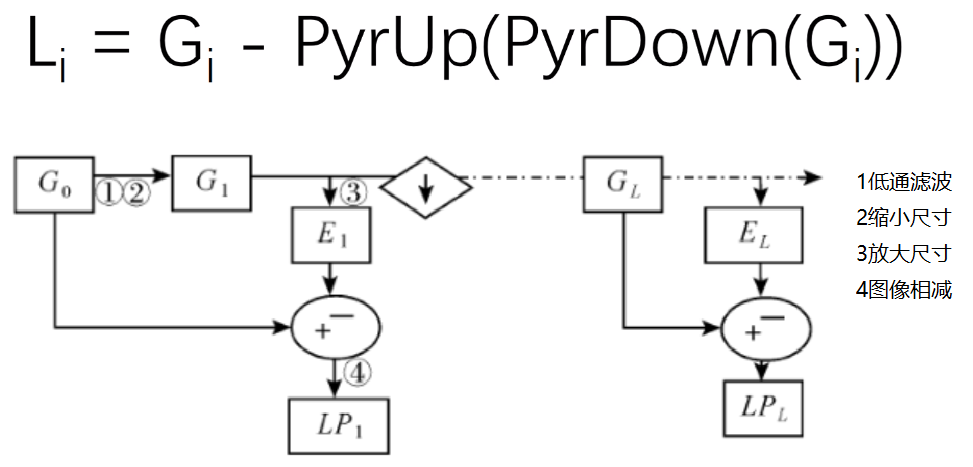
    * 示例

        * 代码
            ```python
                down = cv2.pyrDown(AM) 
                down_up = cv2.pyrUp(down) 
                ret = AM - down_up
                show_img([AM,ret], hstack=True)
            ```

        * 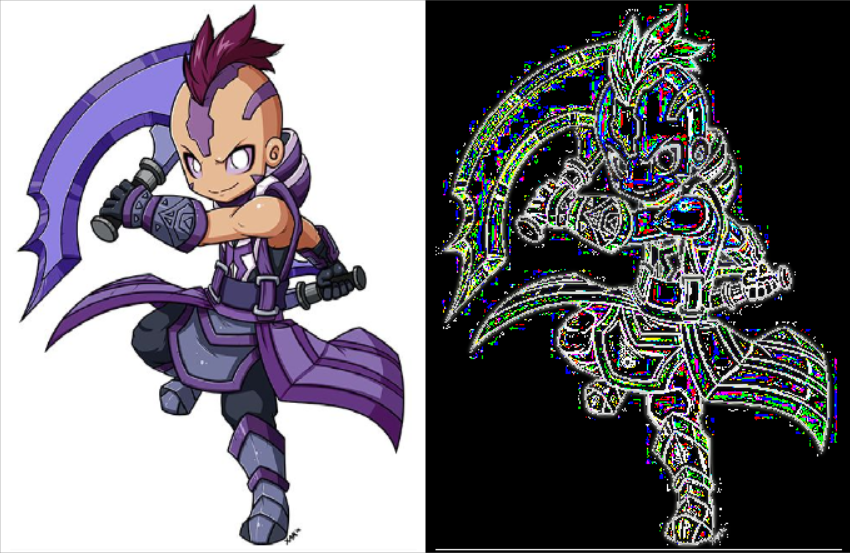

## 图像轮廓

* contours, hierarchy = cv2.findContours(img,mode,method)

  `为了更高的准确率，使用二值图像。 contours：轮廓信息（用得较多的数据） hierarchy：层级`

    * mode：轮廓检索模式

        * `RETR_EXTERNAL` ：只检索最外面的轮廓；

        * `RETR_LIST`：检索所有的轮廓，并将其保存到一条链表当中；

        * `RETR_CCOMP`：检索所有的轮廓，并将他们组织为两层：顶层是各部分的外部边界，第二层是空洞的边界;

        * `RETR_TREE`：检索所有的轮廓，并重构嵌套轮廓的整个层次;

          `常用`

    * method：轮廓逼近方法

        * `CHAIN_APPROX_NONE`：以Freeman链码的方式输出轮廓，所有其他方法输出多边形（顶点的序列）。

          `常用`

        * `CHAIN_APPROX_SIMPLE`:压缩水平的、垂直的和斜的部分，也就是，函数只保留他们的终点部分。

        * 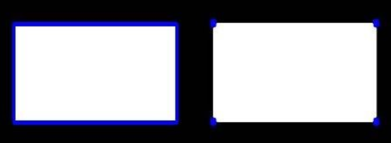

    * 示例

        * 代码
      ```python
          # 为了更高的准确率，使用二值图像。 
          img = cv2.imread("../img/car.png") 
          gray = cv2.cvtColor(img, cv2.COLOR_BGR2GRAY) 
          ret, thresh = cv2.threshold(gray, 127, 255, cv2.THRESH_BINARY) 
          contours, hierarchy = cv2.findContours(thresh, cv2.RETR_TREE, cv2.CHAIN_APPROX_NONE) 
          show_img([img, thresh])
      ```

## 绘制轮廓

* res = cv2.drawContours(copy_img, contours, -1, (0,0,255), 2)

    - 传入绘制图像， 轮廓， 轮廓索引， 颜色模式， 线条厚度
    - -1：所有的轮廓都画出来，0：对应的第0个轮廓，1：对应的第1个轮廓
    - （0,0,255）：对应：B,G,R，轮廓的颜色（这里是红色）
    - 2：线条宽度

* 示例

    * 代码
        ```python
          # 注意需要copy,要不原图会变 
          copy_img = img.copy() 
          res = cv2.drawContours(copy_img, contours, -1, (0,0,255), 2) 
          show_img([img, res])
        ```

    * 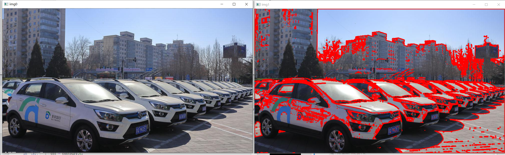

* 轮廓特征

```python
    # 第一个轮廓 
    cnt = contours[0] 
    # 面积 
    area = cv2.contourArea(cnt) 
    # 周长，True：表示闭合的
    perimeter = cv2.arcLength(cnt, True) 
    print("面积：",area) 
    print("周长：", perimeter)
```

* 轮廓近似

    * 
    * 示例

        * 代码

            ```python
                img = cv2.imread("../img/contours2.png") 
                
                gray = cv2.cvtColor(img, cv2.COLOR_BGR2GRAY) 
                ret, thresh = cv2.threshold(gray, 127,255, cv2.THRESH_BINARY) 
                contours,hierarchy = cv2.findContours(thresh, cv2.RETR_TREE, cv2.CHAIN_APPROX_NONE) 
                cnt = contours[0]  
                
                # 绘制轮廓 
                draw_img = img.copy() 
                res1 = cv2.drawContours(draw_img, [cnt], -1, (0, 0, 255), 2) 
                
                # 轮廓近似
                epsilon = 0.1 * cv2.arcLength(cnt, True) # 按周长比例 
                approx = cv2.approxPolyDP(cnt, epsilon, True) # 近似 
          
                draw_img = img.copy() 
                res2 = cv2.drawContours(draw_img, [approx], -1, (0, 0, 255), 2) 
                show_img([img, res1,res2], hstack=True)
            ```

        * 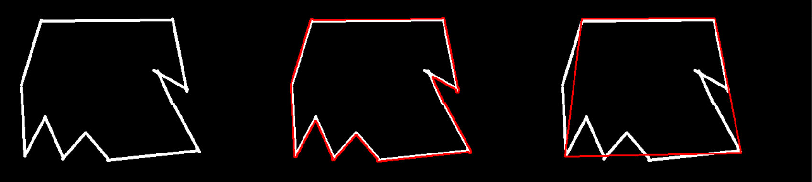

* 边界矩形

    * 示例

        * 代码

            ```python
                img = cv2.imread("../img/contours.png") 
                gray = cv2.cvtColor(img, cv2.COLOR_BGR2GRAY) 
                ret, thresh = cv2.threshold(gray, 127,255, cv2.THRESH_BINARY) 
                contours,hierarchy = cv2.findContours(thresh, cv2.RETR_TREE, cv2.CHAIN_APPROX_NONE) 
                cnt = contours[0] # 0：第0个轮廓也就是这里的三角形的外接矩形（外轮廓）; 1：内轮廓（内接矩形）..... 
                x,y,w,h = cv2.boundingRect(cnt)
                img = cv2.rectangle(img, (x,y), (x+w, y+h), (0,0,255), 2) 
                show_img([img])
            ```

        * 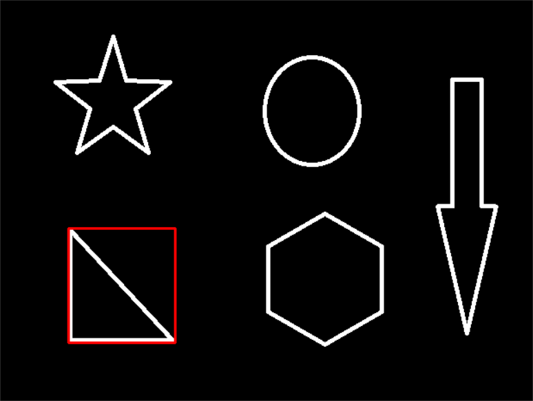

    * 应用

        * 计算面积比

            ```python
                area = cv2.contourArea(cnt) 
                x, y, w, h = cv2.boundingRect(cnt) 
                rect_area = w * h 
                extent = float(area) / rect_area 
                print ('轮廓面积与边界矩形比',extent)
            ```

* 外接圆

    * 示例

        * 代码

            ```python
                (x,y),radius = cv2.minEnclosingCircle(cnt) 
                center = (int(x),int(y)) 
                radius = int(radius) 
                img =cv2.circle(img,center,radius,(0,255,0),2)
                show_img([img])
            ```

        * 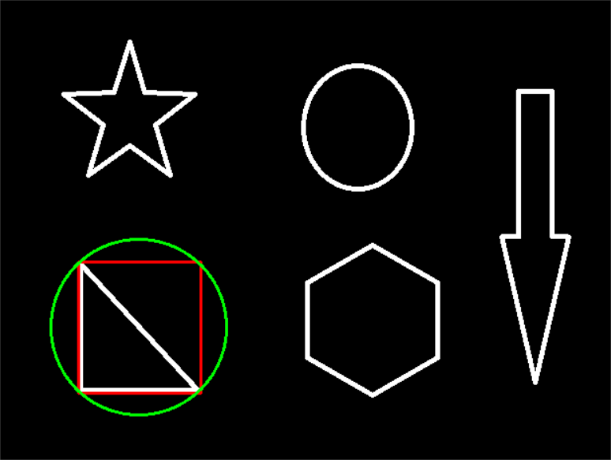

## 图像模板匹配

*

模板匹配和卷积原理很像，模板在原图像上从原点开始滑动，计算模板与（图像被模板覆盖的地方）的差别程度，这个差别程度的计算方法在opencv里有6种，然后将每次计算的结果放入一个矩阵里，作为结果输出。假如原图形是AxB大小，而模板是axb大小，则输出结果的矩阵是(
A-a+1)x(B-b+1)

* res = cv2.matchTemplate(img, template, cv2.TM_SQDIFF)

  `推荐使用包含归一化的`

    * TM_SQDIFF：计算平方不同，计算出来的值越小，越相关

    * TM_CCORR：计算相关性，计算出来的值越大，越相关

    * TM_CCOEFF：计算相关系数，计算出来的值越大，越相关

    * TM_SQDIFF_NORMED：计算归一化平方不同，计算出来的值越接近0，越相关

    * TM_CCORR_NORMED：计算归一化相关性，计算出来的值越接近1，越相关

    * TM_CCOEFF_NORMED：计算归一化相关系数，计算出来的值越接近1，越相关

    * [公式](https://docs.opencv.org/3.3.1/df/dfb/group__imgproc__object.html#ga3a7850640f1fe1f58fe91a2d7583695d)

* min_val, max_val, min_loc, max_loc = cv2.minMaxLoc(res)

  `最小值，最大值，最小值位置，最大值位置`

* 示例

    * 代码

      ```python
          img = cv2.imread('../img/lena.jpg', 0)
          template = cv2.imread('../img/face.jpg',0)
          h,w = template.shape[:2]
          methods = ['cv2.TM_CCOEFF', 'cv2.TM_CCOEFF_NORMED', 'cv2.TM_CCORR',
                     'cv2.TM_CCORR_NORMED', 'cv2.TM_SQDIFF', 'cv2.TM_SQDIFF_NORMED']
          # 模板匹配
          res = cv2.matchTemplate(img, template, cv2.TM_SQDIFF)
          # 最小值，最大值，最小值位置，最大值位置
          min_val, max_val, min_loc, max_loc = cv2.minMaxLoc(res)
          # 绘图比较
          for meth in methods:
              img2 = img.copy()
          
              # 匹配方法的真值
              method = eval(meth)   # 不能是字符串
              res = cv2.matchTemplate(img, template, method)
              min_val, max_val, min_loc, max_loc = cv2.minMaxLoc(res)
          
              # 如果是平方差匹配TM_SQDIFF或归一化平方差匹配TM_SQDIFF_NORMED，取最小值
              if method in [cv2.TM_SQDIFF, cv2.TM_SQDIFF_NORMED]:
                  top_left = min_loc
              else:
                  top_left = max_loc
              bottom_right = (top_left[0] + w, top_left[1] + h)
          
              # 画矩形
              cv2.rectangle(img2, top_left, bottom_right, 255, 2)
          
              plt.subplot(121), plt.imshow(res, cmap='gray')
              plt.xticks([]), plt.yticks([])  # 隐藏坐标轴
              plt.subplot(122), plt.imshow(img2, cmap='gray')
              plt.xticks([]), plt.yticks([])
              plt.suptitle(meth)
              plt.show()
      ```

    * 展示

        * 模板
        * 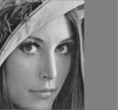
        * 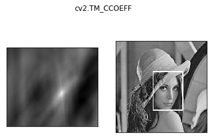
        * 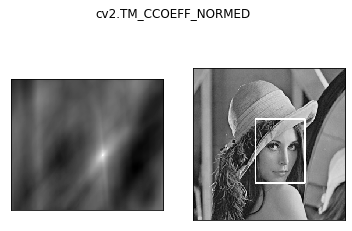
        * 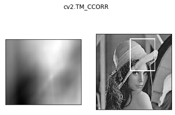
        * 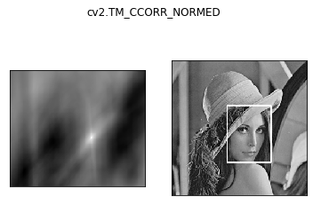
        * 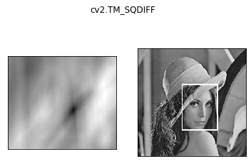
        * 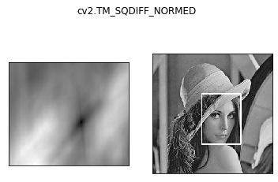

* 匹配多个对象

    * 代码

      ````python
          img_rgb = cv2.imread('../img/mario.jpg')
          img_gray = cv2.cvtColor(img_rgb, cv2.COLOR_BGR2GRAY)
          template = cv2.imread('../img/mario_coin.jpg', 0)
          h, w = template.shape[:2]
          
          res = cv2.matchTemplate(img_gray, template, cv2.TM_CCOEFF_NORMED)
          threshold = 0.8
          # 取匹配程度大于%80的坐标
          loc = np.where(res >= threshold)
          # *号表示可选参数
          for pt in zip(*loc[::-1]): 
              bottom_right = (pt[0] + w, pt[1] + h)
              cv2.rectangle(img_rgb, pt, bottom_right, (0, 0, 255), 2)
          
          show_img([template, img_rgb])
      ````

    * 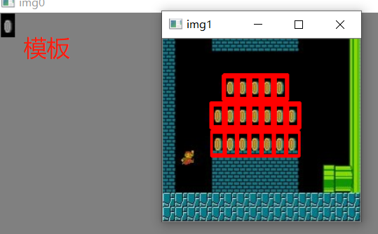


