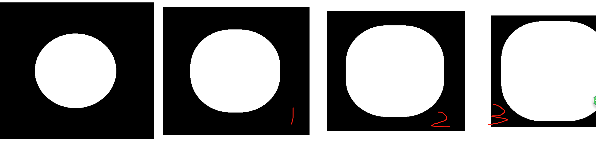
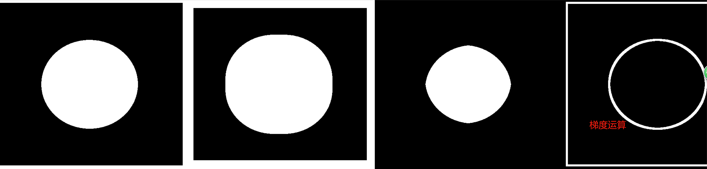

###### datetime:2022/04/11 15:07

###### author:nzb

# 图像处理

## 图像滤波

`图像降噪，使图像更清晰，更平滑`

* **均值滤波**

    * `blur1 = cv2.blur(noise_img, (3,3))`，使用`3 * 3`的卷积核

* **方框滤波**：基本和均值一样，可以选择归一化

    * 归一化：计算均值滤波

        * `blur2 = cv2.boxFilter(noise_img,-1, (3,3), normalize=True)`

          `-1是固定值，一般不需要改变`

    * 未归一化：容易越界（未取均值，超过255，一旦越界就取255）

        * `blur3 = cv2.boxFilter(noise_img,-1, (3,3), normalize=False)`

* **高斯滤波**：更看重权重，离目标远的权重小，离目标近的权重大

    * `gussian = cv2.GaussianBlur(noise_img, (5, 5), 1)`，使用`5*5`的卷积核

* **中值滤波**

    * `median = cv2.medianBlur(noise_img, 5)`，使用`5*5`的卷积核

## 形态学处理

`处理二值化图像，获取轮廓 腐蚀=瘦身，膨胀=增肥`

* 腐蚀（Erode）

    * `kernel = np.ones((3,3), dtype=np.uint8)`，`3*3`卷积核

    * `erode_img = cv2.erode(img, kernel, iterations=1)`，`iterations`：迭代（腐蚀）次数

    * 不同腐蚀次数的变化

        * 

* 膨胀（Dilate）

    * `kernel = np.ones((3,3), dtype=np.uint8)`，`3*3`卷积核

    * `dilate_img = cv2.dilate(erosion, kernel, iterations=1)`

    * 不同膨胀次数的变化

        * 

    - 腐蚀完后膨胀恢复之前的结果，两者互为逆运算

* 开运算与闭运算

  `open_close_kernel = np.ones((5,5), np.uint8)`

    * 开运算：先腐蚀，后膨胀，开运算可以用来去除仅存的小块像素。

        * `openimg = cv2.morphologyEx(img, cv2.MORPH_OPEN, open_close_kernel)`

    * 闭运算：先膨胀，后腐蚀

        * `closeimg = cv2.morphologyEx(img, cv2.MORPH_CLOSE, open_close_kernel)`

    * 

* 梯度运算

  `kernel = np.ones((7,7), np.uint8)`，`7*7`卷积核

    * 梯度 = 膨胀 - 腐蚀

    * 形态学梯度为经过膨胀操作（`dilate`）的图像与经过腐蚀操作（`erode`）的图像的差，**可以用于抽出物体的边缘**。

    * `gradient = cv2.morphologyEx(pie, cv2.MORPH_GRADIENT, kernel)`

    * 

* 顶帽和黑帽

  `kernel = np.ones((7,7), np.uint8)`，`7*7`卷积核

    * 顶帽：`顶帽 = 原始输入 - 开运算`

        * `tophat = cv2.morphologyEx(img1, cv2.MORPH_TOPHAT, kernel)`

    * 黑帽：`黑帽 = 闭运算 - 原始输入`

        * `blackhat = cv2.morphologyEx(img1, cv2.MORPH_BLACKHAT, kernel)`

    * 
