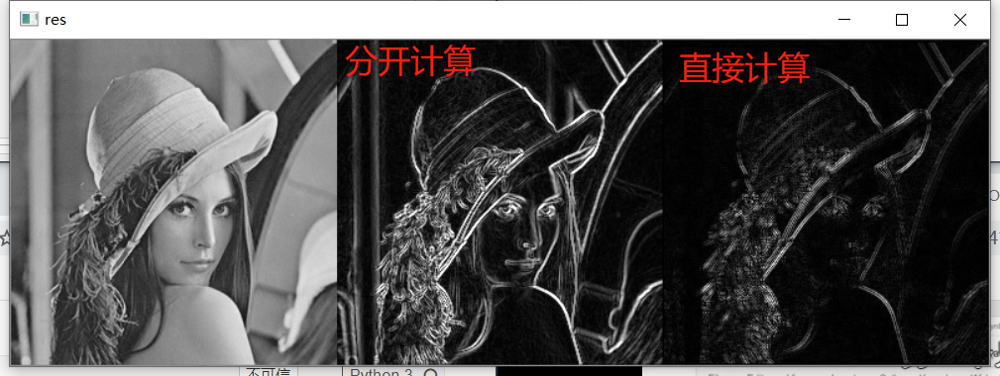
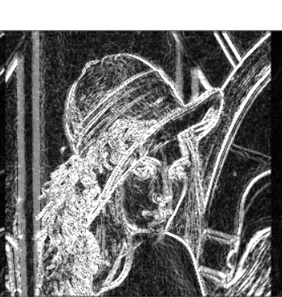
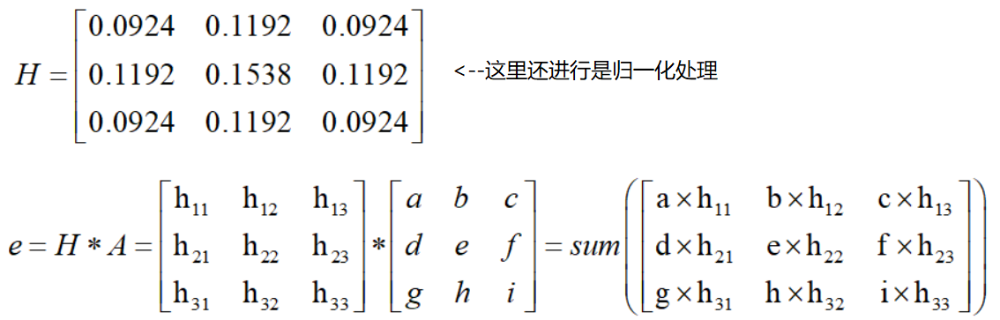
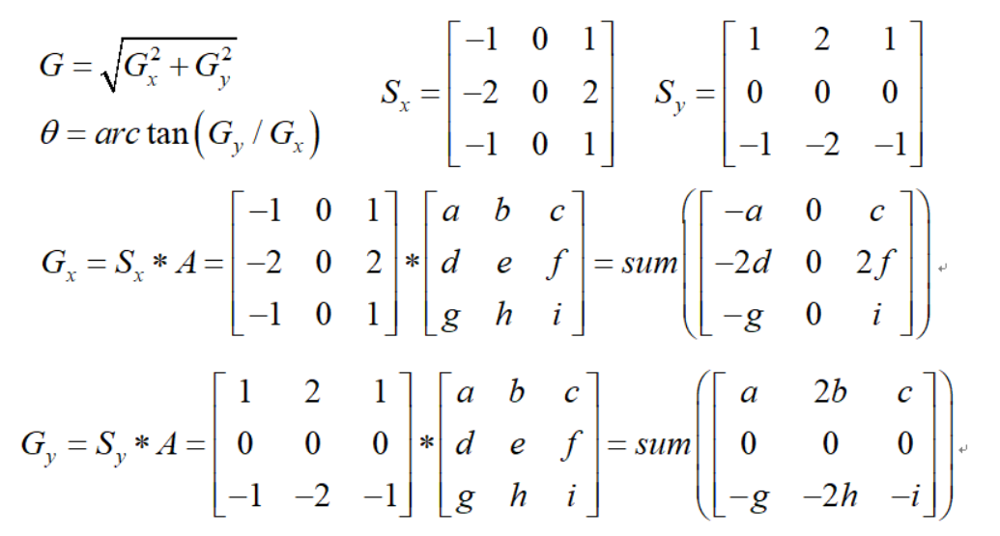
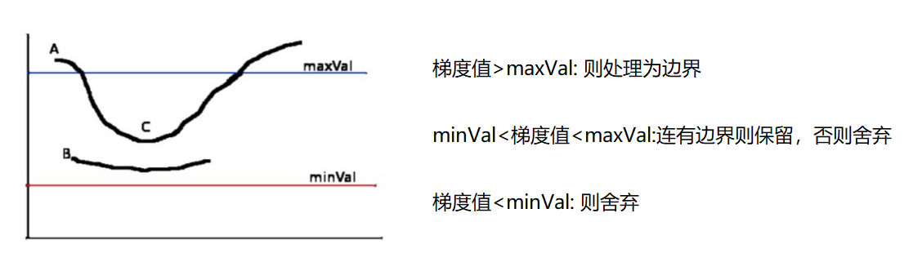
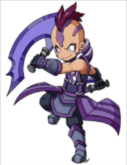
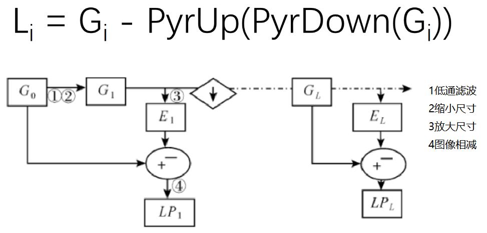

###### datetime:2022/04/11 15:07

###### author:nzb

# 图像处理

## 图像梯度（角点检测，边缘检测步骤）

* **Sobel算子**

    * 卷积核

        * 

    * `dst = cv2.Sobel(src, ddepth, dx, dy, ksize)`
     
        * `ddepth`：图像的深度

        * `dx`和`dy`：分别表示水平和竖直方向

        * `ksize`：是`Sobel`算子的大小（核大小）

    * `sobel = cv2.convertScaleAbs(sobel)`，白到黑是正数，黑到白就是负数了，所有的负数会被截断成0，所以要取绝对值

    * `sobelxy = cv2.addWeighted(sobelx, 0.5, sobely, 0.5, 0)`，分别计算`x`和`y`，再求和，`0.5`：为权重

    * 示例

        * 代码
            ```python
                lena = cv2.imread("../img/lena.jpg", cv2.IMREAD_GRAYSCALE) 
                # 分开计算 
                sobelx = cv2.Sobel(lena, cv2.CV_64F, 1, 0, ksize=3)  # dx=1，dy=0，只计算水平方向  
                sobelx = cv2.convertScaleAbs(sobelx)                 # 不能丢弃负值，需要去绝对值
                sobely = cv2.Sobel(lena, cv2.CV_64F, 0, 1, ksize=3)  # dx=0，dy=1，只计算垂直方向  
                sobely = cv2.convertScaleAbs(sobely) 
                sobelxy1 = cv2.addWeighted(sobelx, 0.5, sobely, 0.5, 0) 
                # 直接计算 
                sobelxy2 = cv2.Sobel(lena, cv2.CV_64F, 1, 1, ksize=3) # dx=1，dy=1，直接计算（不建议，效果不好，建议分开计算再）
                sobelxy2 = cv2.convertScaleAbs(sobelxy2)
                show_img([lena, sobelxy1, sobelxy2], hstack=True)
            ```

        * 

* **Scharr算子**更敏感

    * 卷积核

        * 

    * `dst = cv2.Scharr(src, ddepth, dx, dy)`

    * 示例

        * 代码
            ```python
                scharrx = cv2.Scharr(lena, cv2.CV_64F, 1, 0) 
                scharry = cv2.Scharr(lena, cv2.CV_64F, 0, 1) 
                scharrx = cv2.convertScaleAbs(scharrx) 
                scharry = cv2.convertScaleAbs(scharry) 
                scharrxy = cv2.addWeighted(scharrx, 0.5, scharry, 0.5, 0)
            ```

        * 

* **Laplacian算子**

    - 二阶导，反应一阶导的变化率，所以对变化更敏感（对噪音点敏感，如果有噪音点就不好检测了）

    * 卷积核

        * 

    * `dst = cv2.Laplacian(src, ddepth)`

    * 示例

        * 代码
            ```python
                laplacian = cv2.Laplacian(lena, cv2.CV_64F) 
                laplacian = cv2.convertScaleAbs(laplacian)
            ```

        * 

* 三者对比

    * 代码

        ```python
            lena = cv2.imread("../img/lena.jpg", cv2.IMREAD_GRAYSCALE) 
            # 分开计算 
            sobelx = cv2.Sobel(lena, cv2.CV_64F, 1, 0, ksize=3) 
            sobelx = cv2.convertScaleAbs(sobelx) 
            sobely = cv2.Sobel(lena, cv2.CV_64F, 0, 1, ksize=3) 
            sobely = cv2.convertScaleAbs(sobely) 
            sobelxy1 = cv2.addWeighted(sobelx, 0.5, sobely, 0.5, 0) 
      
            # Scharr算子 
            scharrx = cv2.Scharr(lena, cv2.CV_64F, 1, 0) 
            scharry = cv2.Scharr(lena, cv2.CV_64F, 0,1) 
            scharrx = cv2.convertScaleAbs(scharrx) 
            scharry = cv2.convertScaleAbs(scharry) 
            scharrxy = cv2.addWeighted(scharrx, 0.5, scharry, 0.5, 0) 
      
            # Laplacian算子 
            laplacian = cv2.Laplacian(lena, cv2.CV_64F) 
            laplacian = cv2.convertScaleAbs(laplacian) 
            show_img([lena, sobelxy1, scharrxy, laplacian], hstack=True)
        ```

    * 

## Canny边缘检测

* 1、 使用高斯滤波器，以平滑图像，滤除噪声。

    * 高斯滤波器

        * 

* 2、 计算图像中每个像素点的梯度强度和方向。

    - 在x方向和y方向上使用Sobel滤波器，在此之上求出边缘的强度和边缘的梯度

    * 梯度和方向

        * 

* 3、 应用非极大值（Non-Maximum Suppression）抑制，以消除边缘检测带来的杂散响应。

    * 非极大值抑制

    * 
    * 

* 4、 应用双阈值（Double-Threshold）检测来确定真实的和潜在的边缘。

    * 双阈值检测

        * 

* 5、 通过抑制孤立的弱边缘最终完成边缘检测。

    * 示例

        * 代码

        ```python
            img=cv2.imread("lena.jpg",cv2.IMREAD_GRAYSCALE) 
            v1=cv2.Canny(img,80,150)
            v2=cv2.Canny(img,50,100) 
            # 80和150：minVal和maxVal 
            res = np.hstack((v1,v2))
            cv_show(res,'res')
        ```

        * 

## 图像金字塔

* 高斯金字塔

    * 
    * 高斯金字塔：向下采样方法（缩小，从下往上）

        * 

    * 高斯金字塔：向上采样方法（放大，从上往下）

        * 

    * 示例

        * 代码

            ```python
                AM = cv2.imread("../img/AM.png") 
                up = cv2.pyrUp(AM)      # 可以一直上下采样下去
                down = cv2.pyrDown(AM)  # 可以一直上下采样下去
                show_img([AM,up,down])
            ```

        * 展示

            * 原图

                * 
            * 向上

                * 
            * 向下

                * 

* 拉普拉斯金字塔

    * Gi：原图

        * 
    * 示例

        * 代码
            ```python
                down = cv2.pyrDown(AM) 
                down_up = cv2.pyrUp(down) 
                ret = AM - down_up
                show_img([AM,ret], hstack=True)
            ```

        * 
