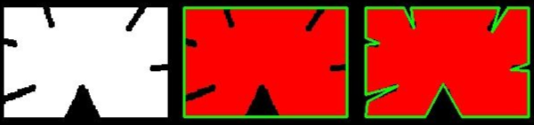
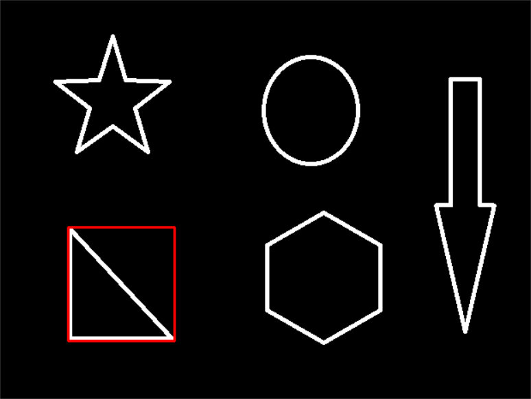

###### datetime:2022/04/11 15:07

###### author:nzb

# 图像处理

## 图像轮廓

* `contours, hierarchy = cv2.findContours(img,mode,method)`

    - 为了更高的准确率，使用**二值化图像**。 `contours`：轮廓信息（用得较多的数据） `hierarchy`：层级

    * mode：轮廓检索模式

        * `RETR_EXTERNAL` ：只检索最外面的轮廓；

        * `RETR_LIST`：检索所有的轮廓，并将其保存到一条链表当中；

        * `RETR_CCOMP`：检索所有的轮廓，并将他们组织为两层：顶层是各部分的外部边界，第二层是空洞的边界;

        * `RETR_TREE`：检索所有的轮廓，并重构嵌套轮廓的整个层次(最常用);

    * method：轮廓逼近方法

        * `CHAIN_APPROX_NONE`：以Freeman链码的方式输出轮廓，所有其他方法输出多边形（顶点的序列）(常用)

        * `CHAIN_APPROX_SIMPLE`:压缩水平的、垂直的和斜的部分，也就是，函数只保留他们的终点部分

        * 

    * 示例代码
    
      ```python
          # 为了更高的准确率，使用二值图像。 
          img = cv2.imread("../img/car.png") 
          gray = cv2.cvtColor(img, cv2.COLOR_BGR2GRAY) 
          ret, thresh = cv2.threshold(gray, 127, 255, cv2.THRESH_BINARY) 
          contours, hierarchy = cv2.findContours(thresh, cv2.RETR_TREE, cv2.CHAIN_APPROX_NONE) 
          show_img([img, thresh])
      ```

### 绘制轮廓

* `res = cv2.drawContours(copy_img, contours, -1, (0,0,255), 2)`
    - 传入绘制图像， 轮廓， 轮廓索引， 颜色模式， 线条厚度
    - -1：所有的轮廓都画出来，0：对应的第0个轮廓，1：对应的第1个轮廓
    - `（0,0,255）`：对应：`B,G,R`，轮廓的颜色（这里是红色）
    - 2：线条宽度

* 示例代码

    ```python
        # 注意需要copy,要不原图会变 
        copy_img = img.copy() 
        res = cv2.drawContours(copy_img, contours, -1, (0,0,255), 2) 
        show_img([img, res])
    ```

  * 

### 轮廓特征

    ```python
        # 第一个轮廓 
        cnt = contours[0] 
        # 面积 
        area = cv2.contourArea(cnt) 
        # 周长，True：表示闭合的
        perimeter = cv2.arcLength(cnt, True) 
        print("面积：",area) 
        print("周长：", perimeter)
    ```

### 轮廓近似

  * 
      
    * 示例代码

    ```python
        img = cv2.imread("../img/contours2.png") 
        
        gray = cv2.cvtColor(img, cv2.COLOR_BGR2GRAY) 
        ret, thresh = cv2.threshold(gray, 127,255, cv2.THRESH_BINARY) 
        contours,hierarchy = cv2.findContours(thresh, cv2.RETR_TREE, cv2.CHAIN_APPROX_NONE) 
        cnt = contours[0]   # 其中一个轮廓
        
        # 绘制轮廓 
        draw_img = img.copy() 
        res1 = cv2.drawContours(draw_img, [cnt], -1, (0, 0, 255), 2) 
        
        # 轮廓近似
        epsilon = 0.1 * cv2.arcLength(cnt, True) # 按周长比例, 可以 0.15试试
        approx = cv2.approxPolyDP(cnt, epsilon, True) # 近似 
    
        draw_img = img.copy() 
        res2 = cv2.drawContours(draw_img, [approx], -1, (0, 0, 255), 2) 
        show_img([img, res1,res2], hstack=True)
    ```

    * 

### 边界矩形

    * 示例代码

        ```python
            img = cv2.imread("../img/contours.png") 
            gray = cv2.cvtColor(img, cv2.COLOR_BGR2GRAY) 
            ret, thresh = cv2.threshold(gray, 127,255, cv2.THRESH_BINARY) 
            contours,hierarchy = cv2.findContours(thresh, cv2.RETR_TREE, cv2.CHAIN_APPROX_NONE) 
            cnt = contours[0] # 0：第0个轮廓也就是这里的三角形的外接矩形（外轮廓）; 1：内轮廓（内接矩形）..... 
            x,y,w,h = cv2.boundingRect(cnt)
            img = cv2.rectangle(img, (x,y), (x+w, y+h), (0,0,255), 2) 
            show_img([img])
        ```

  * 

    * 应用：计算面积比

    ```python
        area = cv2.contourArea(cnt) 
        x, y, w, h = cv2.boundingRect(cnt) 
        rect_area = w * h 
        extent = float(area) / rect_area 
        print ('轮廓面积与边界矩形比',extent)
    ```

### 外接圆

    * 示例代码

    ```python
        (x,y),radius = cv2.minEnclosingCircle(cnt) 
        center = (int(x),int(y)) 
        radius = int(radius) 
        img =cv2.circle(img,center,radius,(0,255,0),2)
        show_img([img])
    ```

  * 
