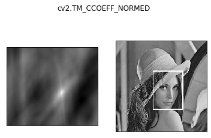

###### datetime:2022/04/11 15:07

###### author:nzb

# 图像处理

## 图像模板匹配

模板匹配和卷积原理很像，模板在原图像上从原点开始滑动，计算模板与（图像被模板覆盖的地方）的差别程度，这个差别程度的计算方法在opencv里有6种，然后将每次计算的结果放入一个矩阵里，作为结果输出。假如原图形是`AxB`大小，而模板是`axb`大小，则输出结果的矩阵是`(A-a+1)x(B-b+1)`

* `res = cv2.matchTemplate(img, template, cv2.TM_SQDIFF)`，推荐使用包含归一化的

    * `TM_SQDIFF`：计算平方不同，计算出来的值越小，越相关

    * `TM_CCORR`：计算相关性，计算出来的值越大，越相关

    * `TM_CCOEFF`：计算相关系数，计算出来的值越大，越相关

    * `TM_SQDIFF_NORMED`：计算归一化平方不同，计算出来的值越接近0，越相关

    * `TM_CCORR_NORMED`：计算归一化相关性，计算出来的值越接近1，越相关

    * `TM_CCOEFF_NORMED`：计算归一化相关系数，计算出来的值越接近1，越相关

    * [公式](https://docs.opencv.org/3.3.1/df/dfb/group__imgproc__object.html#ga3a7850640f1fe1f58fe91a2d7583695d)

* `min_val, max_val, min_loc, max_loc = cv2.minMaxLoc(res)`，最小值，最大值，最小值位置，最大值位置

* 示例代码

    ```python
        img = cv2.imread('../img/lena.jpg', 0)
        template = cv2.imread('../img/face.jpg',0)
        h,w = template.shape[:2]
        methods = ['cv2.TM_CCOEFF', 'cv2.TM_CCOEFF_NORMED', 'cv2.TM_CCORR',
                    'cv2.TM_CCORR_NORMED', 'cv2.TM_SQDIFF', 'cv2.TM_SQDIFF_NORMED']
        # 模板匹配
        res = cv2.matchTemplate(img, template, cv2.TM_SQDIFF)
        # 最小值，最大值，最小值位置，最大值位置
        min_val, max_val, min_loc, max_loc = cv2.minMaxLoc(res)
        # 绘图比较
        for meth in methods:
            img2 = img.copy()
        
            # 匹配方法的真值
            method = eval(meth)   # 不能是字符串
            res = cv2.matchTemplate(img, template, method)
            min_val, max_val, min_loc, max_loc = cv2.minMaxLoc(res)
        
            # 如果是平方差匹配TM_SQDIFF或归一化平方差匹配TM_SQDIFF_NORMED，取最小值
            if method in [cv2.TM_SQDIFF, cv2.TM_SQDIFF_NORMED]:
                top_left = min_loc
            else:
                top_left = max_loc
            bottom_right = (top_left[0] + w, top_left[1] + h)
        
            # 画矩形
            cv2.rectangle(img2, top_left, bottom_right, 255, 2)
        
            plt.subplot(121), plt.imshow(res, cmap='gray')
            plt.xticks([]), plt.yticks([])  # 隐藏坐标轴
            plt.subplot(122), plt.imshow(img2, cmap='gray')
            plt.xticks([]), plt.yticks([])
            plt.suptitle(meth)
            plt.show()
    ```

    * 展示

        * 模板
        * 
        * 
        * 
        * 
        * 
        * 
        * 

* 匹配多个对象

    * 代码

      ````python
          img_rgb = cv2.imread('../img/mario.jpg')
          img_gray = cv2.cvtColor(img_rgb, cv2.COLOR_BGR2GRAY)
          template = cv2.imread('../img/mario_coin.jpg', 0)
          h, w = template.shape[:2]
          
          res = cv2.matchTemplate(img_gray, template, cv2.TM_CCOEFF_NORMED)
          threshold = 0.8
          # 取匹配程度大于%80的坐标
          loc = np.where(res >= threshold)
          # *号表示可选参数
          for pt in zip(*loc[::-1]): 
              bottom_right = (pt[0] + w, pt[1] + h)
              cv2.rectangle(img_rgb, pt, bottom_right, (0, 0, 255), 2)
          
          show_img([template, img_rgb])
      ````

    * 


