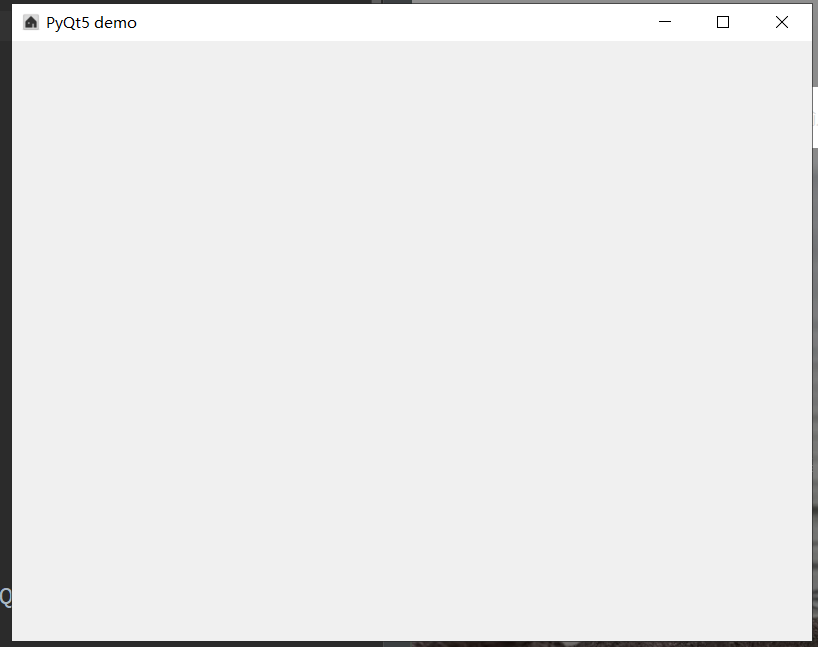
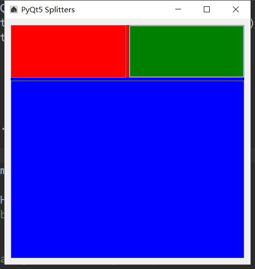
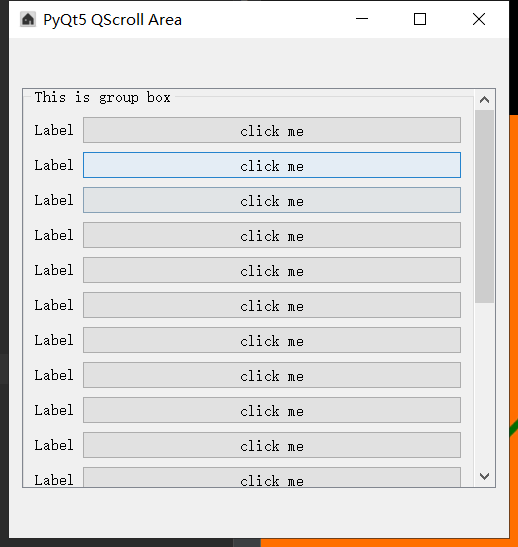
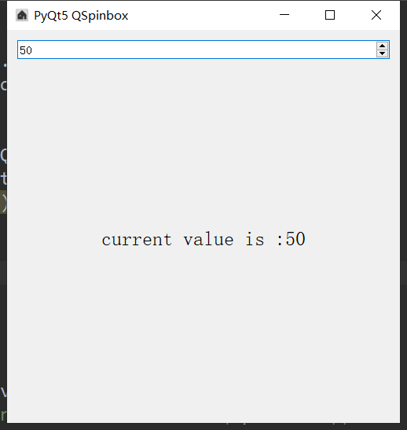
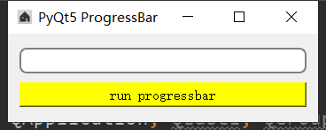
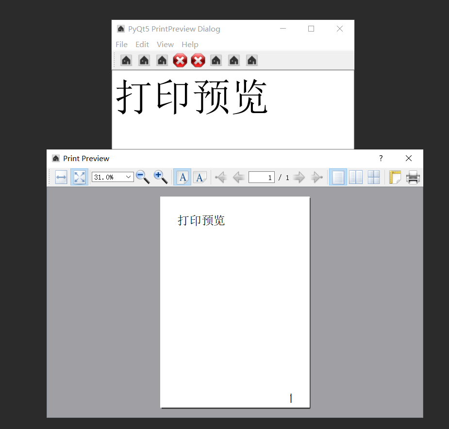
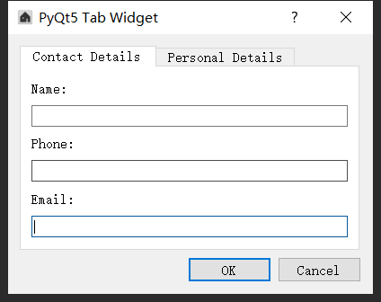
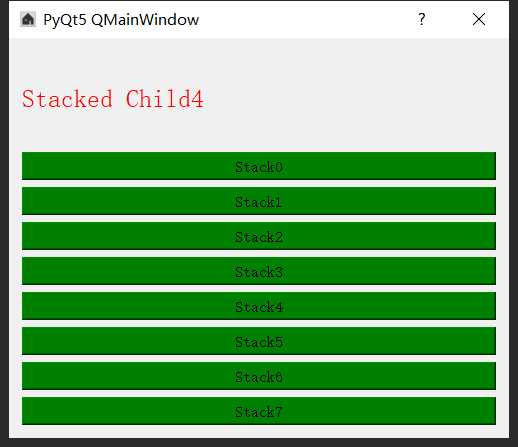
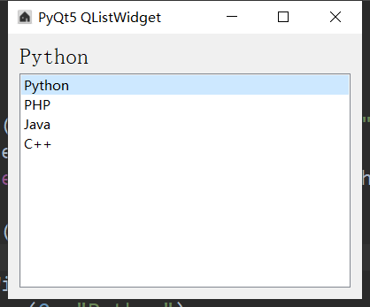

###### datetime:2019/5/23 15:28
###### author:nzb

## [创建窗口](./01-窗口.md)

## [创建按钮](./01-窗口.md)

## [垂直布局和水平布局](./01-窗口.md)

## [栅格布局](./01-窗口.md)

## [布局添加标签](./01-窗口.md)

## [布局添加背景图](./01-窗口.md)

## [单选按钮](./01-窗口.md)

## [复选框](./01-窗口.md)

## [创建提示](./01-窗口.md)

## [行编辑](./01-窗口.md)

## [按钮组](./01-窗口.md)

## [布局组](./01-窗口.md)

## [无边框窗口](./01-窗口.md)

## [创建框架qframe](./01-窗口.md)

## [创建分离器](./01-窗口.md)

## [创建滑动条](./01-窗口.md)

## [创建滚动条](./01-窗口.md)

## [创建刻度盘](./01-窗口.md)

## [spinbox](./01-窗口.md)

## [生成随机数](./01-窗口.md)

## [进度条](./01-窗口.md)

## [工具框](./01-窗口.md)

## [菜单栏和工具栏](./01-窗口.md)

## [文档编辑框](./01-窗口.md)

## [文本框字体的选择](./01-窗口.md)

## [字体颜色](./01-窗口.md)

## [打印](./01-窗口.md)

## [打印预览](./01-窗口.md)

## [打印PDF](./01-窗口.md)

## [（带选择的）消息框提示框](./01-窗口.md)

## [右键菜单](./01-窗口.md)

## [选项卡（单选下拉框和多选）](./01-窗口.md)

## [stack(堆叠小部件)](./01-窗口.md)

## [可停靠的窗口小部件](./01-窗口.md)

## [日历](./01-窗口.md)

## [单选下拉框](./01-窗口.md)

## [首字符模糊填充（查询）](./01-窗口.md)

## [打开更多的窗口](./01-窗口.md)

## [时间编辑](./01-窗口.md)

## [列表部件](./01-窗口.md)

## [列表部件小示例](./01-窗口.md)

