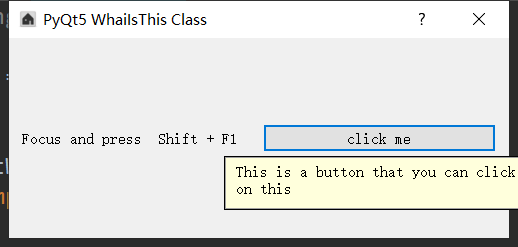

###### datetime:2019/5/20 15:58
###### author:nzb

## 创建提示



```python
import sys
from PyQt5.QtWidgets import QApplication, QDialog, QLabel, QHBoxLayout, QPushButton
from PyQt5 import QtGui


class UI_demo(QDialog):
    """用户界面"""
    def __init__(self):
        super().__init__()

        # 窗口信息
        self.title = 'PyQt5 WhaiIsThis Class'
        self.left = 600
        self.top = 200
        self.width = 500
        self.height = 200

        self.initWindow()

    def initWindow(self):

        # 窗口信息
        self.setWindowIcon(QtGui.QIcon('../img/home.ico'))  # 图标设置
        self.setGeometry(self.left, self.top, self.width, self.height)  # 大小位置设置
        self.setWindowTitle(self.title)  # 窗口标题

        hbox = QHBoxLayout()
        label = QLabel("Focus and press  Shift + F1")
        hbox.addWidget(label)

        button = QPushButton('click me', self)
        button.setWhatsThis("This is a button that you can click on this")
        hbox.addWidget(button)

        self.setLayout(hbox)

        # 展示窗口
        self.show()


if __name__ == "__main__":
    app = QApplication(sys.argv)
    ex = UI_demo()
    sys.exit(app.exec_())
```