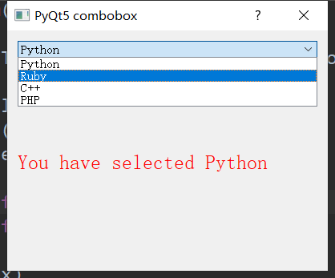

###### datetime:2019/5/23 14:07
###### author:nzb

## 单选下拉框



```python
from PyQt5 import QtGui
from PyQt5.QtWidgets import QApplication,QLabel, QComboBox, QVBoxLayout,  QDialog, QMainWindow, QCalendarWidget, QVBoxLayout, QLabel
import sys


class Window(QDialog):
    """下拉框"""
    def __init__(self):
        super().__init__()

        self.title = "PyQt5 combobox"
        self.top = 200
        self.left = 500
        self.width = 400
        self.height = 300

        self.InitWindow()

    def InitWindow(self):
        self.setWindowIcon(QtGui.QIcon("icon.png"))
        self.setWindowTitle(self.title)
        self.setGeometry(self.left, self.top, self.width, self.height)

        self.InitUI()
        self.show()

    def InitUI(self):

        vbox = QVBoxLayout()

        self.combo = QComboBox()
        self.combo.addItem("Python")
        self.combo.addItem("Ruby")
        self.combo.addItem("C++")
        self.combo.addItem("PHP")

        self.combo.currentTextChanged.connect(self.comboChanged)

        self.label = QLabel()
        self.label.setFont(QtGui.QFont("Sanserif", 15))
        self.label.setStyleSheet("color:red")

        vbox.addWidget(self.combo)
        vbox.addWidget(self.label)

        self.setLayout(vbox)

    def comboChanged(self):
        """选择事件"""
        text = self.combo.currentText()
        self.label.setText("You have selected " + text)


App = QApplication(sys.argv)
window = Window()
sys.exit(App.exec())
```
