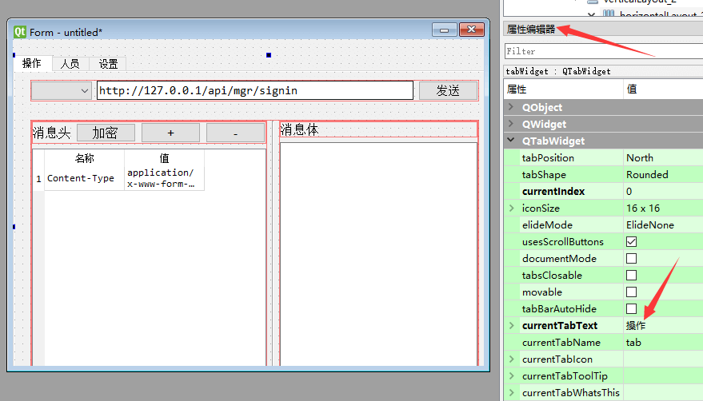

## 常用控件3

### 单选按钮和按钮组

`QRadioButton` 是单选按钮，如下图所示  


- 说明  
  同一个父窗口 里面的多个单选按钮，只能选中一项。  
  如果你有多组单选按钮， 每组都应该有不同的父控件，或者不同的`Layout`。  
  通常建议：多组单选按钮，放到不同的 按钮组 `QButtonGroup` 中

- 信号：选中状态改变  
  如果用户操作点击了按钮组 `QButtonGroup` 中的一个按钮， `QButtonGroup` 就会发出 `buttonClicked` 信号，可以这样指定处理该信号的函数  
  `buttongroup.buttonClicked.connect(handleButtonClicked)`  
  然后，在处理函数中调用`QButtonGroup`对象的 `checkedButton()` 函数，返回值就是被选中的按钮对象。  
  再调用这个返回的按钮对象的 `text()` 方法得到界面文本，就可以知道是哪个选项被选中了。

### 勾选按钮和按钮组

`QCheckBox` 是勾选按钮，如下图所示  


- 说明  
  通常建议：多组勾选按钮，放到不同的 按钮组 `QButtonGroup` 中，按钮组就是父控件。  
  可以在 Qt设计师中设置 `QButtonGroup` 的 `exclusive` 属性， 来控制 是否 只能单选一个选项。
- 信号：选中状态改变  
  如果用户操作点击了按钮组 `QButtonGroup` 中的一个按钮， `QButtonGroup` 就会发出 `buttonClicked` 信号，可以这样指定处理该信号的函数  
  `buttongroup.buttonClicked.connect(handleButtonClicked)`  
  `QButtonGroup` 设置为 单选 情况下： 在处理函数中调用`QButtonGroup`对象的 `checkedButton()` 函数，返回值就是被选中的按钮对象。 再调用这个返回的按钮对象的 `text()`
  方法得到界面文本，就可以知道是哪个选项被选中了。
  `QButtonGroup` 设置为 多选 情况下：  
  要得知哪些按钮被选中， 可以 对所有该组中的 按钮调用 isChecked 方法 ，来判断。

### tab页控件

我们可以通过tab页控件把界面分为好几个页面，如下所示  
  
通过`Qt designer` 只需要拖拽控件到各个页面即可。  
要修改 tab 页的标题，可以先点击该 tab 页，然后在下图所示处修改  


- tab页中布局Layout 如果要在tab页上布局， 你可能会在对象查看器总直接右键点击该tab，可以你会发现 右键菜单里面没有布局项。 这是 Qt designer 非常坑爹的地方。
    - 首先需要你在tab页上添加一个控件
    - 然后点击 在对象查看器 右键点击上层 TabWidget ，这时，你就会发现有布局菜单了

### 进度条

`QProgressBar` 是进度条，如下图所示  


- 说明  
  进度条也是一个常用的控件，当程序需要做一件比较耗费时间的任务（比如统计数据，下载文件等）时，可以用来向用户指示操作的进度。  
  而且有了进度显示，用户就知道应用程序仍在运行，并没有出问题。  
  `QProgressBar`进度条把每个进度称之为一个step（步骤）。  
  我们可以通过它的 `setRange` 方法设定步骤个数，比如  
  `progressBar.setRange(0,5)`  
  就设定了，进度分为5步。  
  然后，通过 `setValue` 方法，指定当前完成到了哪一步，比如  
  `progressBar.setValue(3)`
  就表示完成了 3/5， 也就是 60%， 进度条就会显示60%的进度。  
  可以使用`reset()`将进度条倒退到开头。  
  有时候我们的任务没法知道完成了多少，比如下载一个未知大小的文件。  
  这时，可以把 `range` 范围都设置为0，这样，进度条会显示忙碌指示符，而不是显示进度百分比。  
  下面是一个进度条程序的示例代码

```python
from PySide2.QtWidgets import QApplication, QMainWindow, QPushButton, QProgressBar, QMessageBox
from time import sleep
from threading import Thread


class Stats():
    def __init__(self):
        self.window = QMainWindow()
        self.window.resize(500, 400)
        self.window.move(300, 300)

        self.progressBar = QProgressBar(self.window)
        self.progressBar.resize(300, 20)
        self.progressBar.move(80, 30)
        # 进度是 0 - 5，
        self.progressBar.setRange(0, 5)

        self.button = QPushButton('统计', self.window)
        self.button.move(80, 80)

        self.button.clicked.connect(self.handleCalc)

        # 统计进行中标记，不能同时做两个统计
        self.ongoing = False

    def handleCalc(self):
        def workerThreadFunc():
            self.ongoing = True
            for i in range(1, 6):
                sleep(1)
                # 设置进度值
                self.progressBar.setValue(i)
            self.ongoing = False

        if self.ongoing:
            QMessageBox.warning(
                self.window,
                '警告', '任务进行中，请等待完成')
            return

        # 通常任务执行比较耗时，应该在新的线程中进行
        # 否则会阻塞主线程显示界面
        worker = Thread(target=workerThreadFunc)
        worker.start()


app = QApplication([])
stats = Stats()
stats.window.show()
app.exec_()
```

上面的代码，运行时，会有很多告警，因为我们在新线程中操作界面对象，容易出问题。  
更合理的方法是通过信号，在线程之间传递信息，对界面的操作都在主线程中完成。  
如下

```python
from PySide2.QtWidgets import QApplication, QMainWindow, QPushButton, QProgressBar, QMessageBox
from time import sleep
from threading import Thread
from PySide2.QtCore import Signal, QObject


# 信号库
class SignalStore(QObject):
    # 定义一种信号
    progress_update = Signal(int)
    # 还可以定义其他作用的信号


# 实例化
so = SignalStore()


class Stats():
    def __init__(self):
        # 连接信号到处理的slot函数
        so.progress_update.connect(self.setProgress)

        self.window = QMainWindow()
        self.window.resize(500, 400)
        self.window.move(300, 300)

        self.progressBar = QProgressBar(self.window)
        self.progressBar.resize(300, 20)
        self.progressBar.move(80, 30)
        # 进度是 0 - 5，
        self.progressBar.setRange(0, 5)

        self.button = QPushButton('统计', self.window)
        self.button.move(80, 80)

        self.button.clicked.connect(self.handleCalc)

        # 统计进行中标记，不能同时做两个统计
        self.ongoing = False

    def handleCalc(self):
        def workerThreadFunc():
            self.ongoing = True
            for i in range(1, 6):
                sleep(1)
                # 发出信息，通知主线程进行进度处理
                so.progress_update.emit(i)
            self.ongoing = False

        if self.ongoing:
            QMessageBox.warning(
                self.window,
                '警告', '任务进行中，请等待完成')
            return

        worker = Thread(target=workerThreadFunc)
        worker.start()

    # 处理进度的slot函数
    def setProgress(self, value):
        self.progressBar.setValue(value)


app = QApplication([])
stats = Stats()
stats.window.show()
app.exec_()
```

### 数字输入框

`QSpinBox` 是数字输入框，可以输入或使用上下箭头选择数字，如下图所示  


- 获取数字  
  通过 `value` 方法获取编辑框内的文本内容，比如  
  `number = box.value()`  
  注意：返回的是整数对象，不是字符串
- 方法：设置数字  
  通过 `setValue` 方法可以设置提示文本内容，比如  
  `box.setValue(100)`

### 日期控件

`QDateEdit` 类可以用来选择日期时间，如下图所示
  
获取日期 当用户点击日期时间控件并且选取了 日期和时间，后来程序要获取这个控件里面选定的日期时间，可以使用date方法获取日期对象。    
如下所示

```python
# 返回 PySide2.QtCore.QDate 对象
qdate = dateEdit.date()

# 可以转化为 指定格式的字符串
dateStr = qdate.toString('yyyy-MM-dd')

# 也可以获取年月日 对应的数字 ，比如日期是2020年5月2号
year = qdate.year()  # 返回 2020
month = qdate.month()  # 返回 5
day = qdate.day()  # 返回 2
```

### 选择文件框

`QFileDialog` 类可以用来选择文件或者目录，如下图所示


- 选择目录  
  通过 `getExistingDirectory` 静态方法 选择目录。  
  该方法，第一个参数是父窗口对象，第二个参数是选择框显示的标题。  
  比如

```python
from PySide2.QtWidgets import QFileDialog

filePath = QFileDialog.getExistingDirectory(self.ui, "选择存储路径")
```

返回值即为选择的路径字符串。  
如果用户点击了 选择框的 取消选择按钮，返回 空字符串。

- 选择单个文件 如果你想弹出文件选择框，选择一个 已经存在 的文件，可以使用 `QFileDialog` 静态方法 `getOpenFileName` ，比如

```python
from PySide2.QtWidgets import QFileDialog

filePath, _ = QFileDialog.getOpenFileName(
    self.ui,  # 父窗口对象
    "选择你要上传的图片",  # 标题
    r"d:\\data",  # 起始目录
    "图片类型 (*.png *.jpg *.bmp)"  # 选择类型过滤项，过滤内容在括号中
)
```

该方法返回值 是一个元组，第一个元素是选择的文件路径，第二个元素是文件类型，如果你只想获取文件路径即可，可以采用上面的代码写法。  
如果用户点击了 选择框的 取消选择按钮，返回 空字符串。  
如果你想弹出文件选择框，选择路径和文件名，来 保存一个文件 ，可以使用 QFileDialog 静态方法 getSaveFileName ，比如

```python
from PySide2.QtWidgets import QFileDialog

filePath, _ = QFileDialog.getSaveFileName(
    self.ui,  # 父窗口对象
    "保存文件",  # 标题
    r"d:\\data",  # 起始目录
    "json类型 (*.json)"  # 选择类型过滤项，过滤内容在括号中
)
```

- 选择多个文件  
  如果要选择多个文件，使用 `getOpenFileNames` 静态方法

```python
from PySide2.QtWidgets import QFileDialog

filePaths, _ = QFileDialog.getOpenFileNames(
    self.ui,  # 父窗口对象
    "选择你要上传的图片",  # 标题
    r"d:\\data",  # 起始目录
    "图片类型 (*.png *.jpg *.bmp)"  # 选择类型过滤项，过滤内容在括号中
)
```

上例中 `filePaths` 对应的返回值是一个列表，里面包含了选择的文件。  
如果用户点击了 选择框的 取消选择按钮，返回 空列表。


