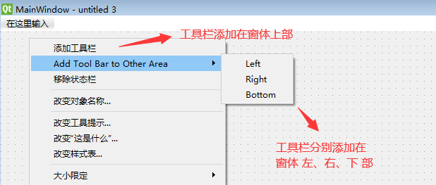
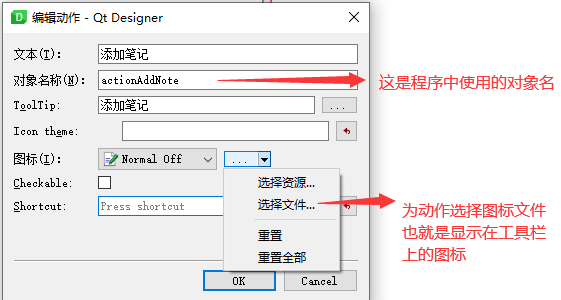

## 常用控件4

### 树控件

`QTreeWidget` 树控件树控件， 是和 `QTreeWidgetItem` 树节点控件 结合使用的。  
如下图所示  


### 提示框

`QMessageBox` 类可以用来弹出各种提示框 该类可以通过一系列静态方法，显示 如下弹出框

- 错误报告  
    
  使用 `critical` 方法
    ```python
    QMessageBox.critical(
        self.ui,
        '错误',
        '请选择爬取数据存储路径！')
    ```
- 警告  
    
  使用 `warning` 方法
    ```python
        QMessageBox.warning(
        self.ui,
            '阅读太快',
            '阅读客户协议必须超过1分钟')
    ```

- 信息提示  
    
  使用 `information` 方法
    ```python
    QMessageBox.information(
        self.ui,
        '操作成功',
        '请继续下一步操作')
    ```
  也可以使用 `about` 方法

    ```python
    QMessageBox.about(
        self.ui,
        '操作成功',
        '请继续下一步操作')
    ```

- 确认继续  
    
  使用 `question ` 方法
    ```python
    choice = QMessageBox.question(
    self.ui,
    '确认',
    '确定要删除本文件吗？')
    
    if choice == QMessageBox.Yes:
      print('你选择了yes')
    if choice == QMessageBox.No:
      print('你选择了no')
    ```

### 输入对话框

`QInputDialog` 输入对话框 只让用户输入一行数据信息，比如 姓名、年龄等。  
可以方便的用来获取简单的信息。  
    
比如

```python
from PySide2.QtWidgets import QInputDialog, QLineEdit

# 返回值分别是输入数据 和 是否点击了 OK 按钮（True/False）
title, okPressed = QInputDialog.getText(
    self,
    "输入目录名称",
    "名称:",
    QLineEdit.Normal,
    "")

if not okPressed:
    print('你取消了输入')
```

常用的方法有：

- getText  
  弹出对话框，让用户输入 单行文本
- getMultiLineText  
  弹出对话框，让用户输入 多行文本
- getInt  
  弹出对话框，让用户输入 整数
- getItem  
  弹出对话框，让用户选择 选项
  ```python
  items = ["春天", "夏天", "秋天", "冬天"]
  
  item, ok = QInputDialog().getItem(self, 
                                    "请选择",
                                    "季节:", 
                                    items, 
                                    0, 
                                    False)
  if ok and not item.isEmpty():
      itemLabel.setText(item)
  
  ```

### 菜单

可以在 Qt Designer上很方便的添加菜单，如下所示  
  
点击菜单的信号是 `triggered`， 处理点击菜单的的代码如下  
`self.ui.actionOpenFile.triggered.connect(self.openPageFile)`  
注意：如果菜单和工具栏有 相同的 `action` ，通常是先在 动作编辑器 创建一个`action`， 然后分别拖动到 菜单和工具栏

### 工具栏

在 Qt 设计师上添加工具栏，可以右键点击 Main Window 类型的窗体空白处，如下所示  
  
选择添加工具栏    
注意，只有 `Main Window` 类型的窗体，才能添加工具栏，如下  
  
添加工具栏后，还要在工具栏上添加图标。 方法是点击右下角 动作编辑器，新建动作，如下图所示  
    
然后如下图所示进行设置  
  
添加动作成功后，就可以直接拖到工具栏上了。  
然后，在代码中定义动作触发后的处理函数，如下所示
`self.ui.actionAddNote.triggered.connect(self.actionAddNode)`

### 状态栏

要在状态栏显示文本信息，只需要调用 `QStatusBar` 的 `showMessage` 方法  
`self.ui.statusbar.showMessage(f'打开文件{filePath}')`

### 剪贴板

Qt程序可以获取和设置剪贴板内容

```python
from PySide2.QtGui import QGuiApplication

cb = QGuiApplication.clipboard()
# 获取剪贴板内容
originalText = cb.text()
# 设置剪贴板内容
clipboard.setText(newText)
```

### MDI 多个子窗口

QMdiArea 提供了一个主窗口区，里面可以存放多个 QMdiSubWindow 子窗口  
如图：  
