###### datetime:2022/04/23 18:00

###### author:nzb

# Catkin工作空间和编译系统

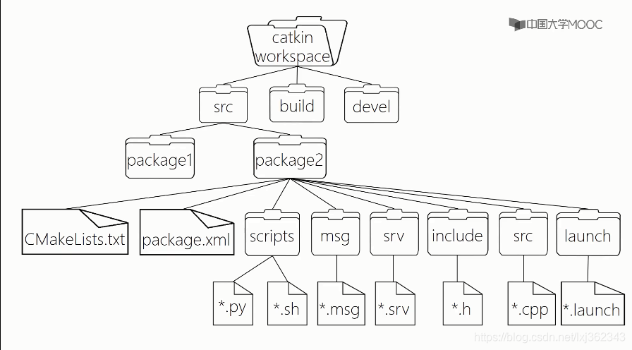

- 上图文件夹及文件说明
    - `src`：package 源代码(该文件就是我们写代码的所在的文件夹)
    - `build`：cmake&catkin 缓存和中间文件
    - `devel`：目标文件

- catkin：ROS 定制的编译构建系统，对 cmake 的扩展。
- catkin 工作空间：组织和管理功能包的文件夹，以 catkin 工具编译

```shell
$ source /opt/ros/noetic/setup.bash
 
# 建立工作站
$ mkdir -p ~/catkin_ws/src
$ cd ~/catkin_ws/  # 回到工作站
$ catkin_make  # 编译
//$ catkin_make -DPYTHON_EXECUTABLE=/usr/bin/python3
$ source devel/setup.bash  # 编译完成后要 source 刷新环境
 
$ echo $ROS_PACKAGE_PATH
/home/youruser/catkin_ws/src:/opt/ros/kinetic/share
```
编译后结构目录

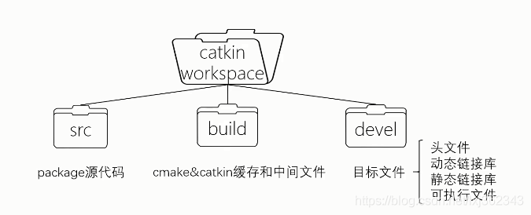

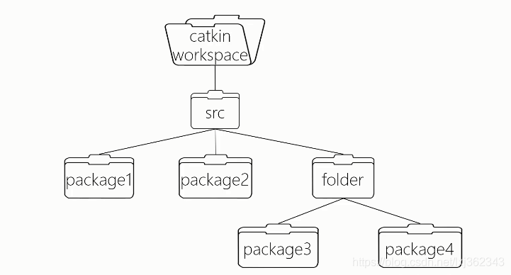

# package

- ROS 软件的基本组织形式
- catkin 编译的基本单元
- 一个 package 可以包含多个可执行文件（节点）

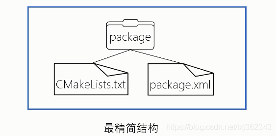

## cmake简单介绍

- CMakeLists.txt：规定 catkin 编译的规则，例如：源文件、依赖项、目标文件

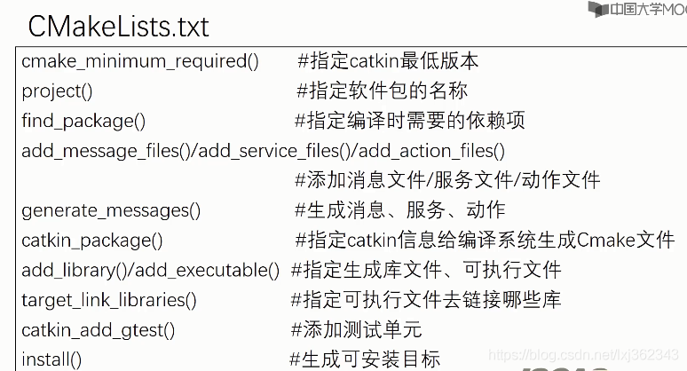

如果没有cmake基础的可以去看《cmake实践》 ，好像和《CMake Practice》是同一本书只是不同叫法或者是中英文叫法而已。

## package.xml简单介绍

- package.xml：定义 package 的属性，例如：包名、版本号、作者、依赖等

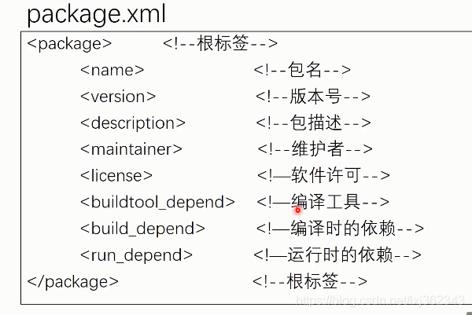

- manifest.xml：rosbuild 编译采用的包信息清单，类似 catkin 的 package.xml

## 代码文件

一般代码文件可以是脚本（shell、Python）或者C++文件。

package结构示意图：
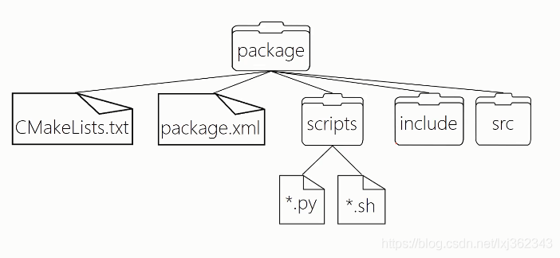

package还有有自定义通信格式的文件，包括消息（msg），服务（srv），动作（action）等

这时候package结构就像下面这样了
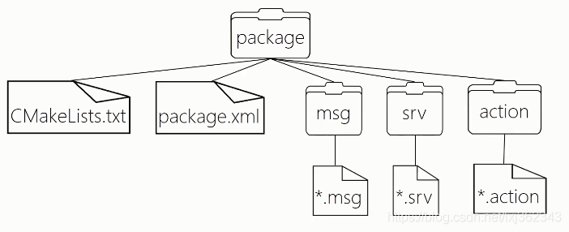

package还有launch文件，配置文件（yaml）。launch用于每次可以运行多个可执行文件。

这时候package结构图如下
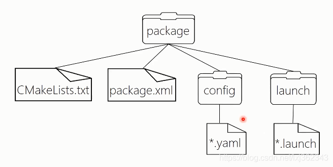


总体框架（视频缺少config文件，我添加上去了） 
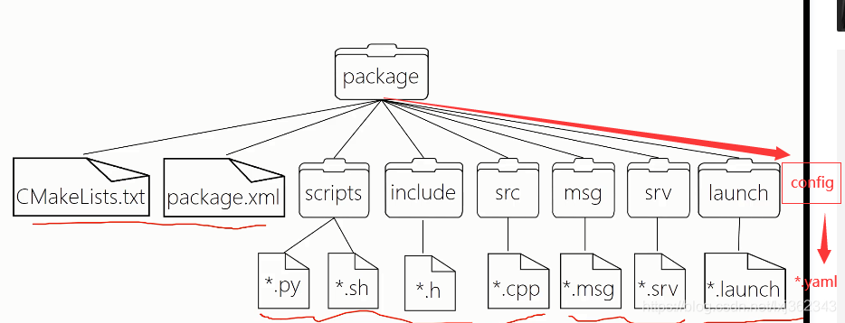

## 常用命令

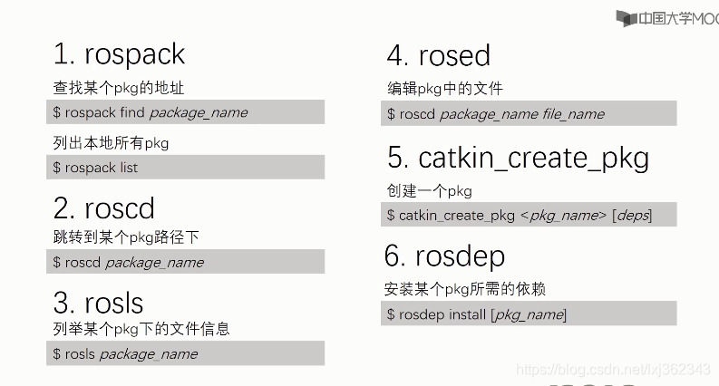

## 在ROS的noetic版本中通过rosrun运行python文件

- 不要将`python`文件放入`src`目录中，否则后续编译工作空间会报如图所示的错误。首先要在功能包文件夹（`catkin_ws/src/learnning_topic`）中创建一个`scripts`(文件夹名可任意，但默认为`scripts`)目录来存放`python`脚本文件

    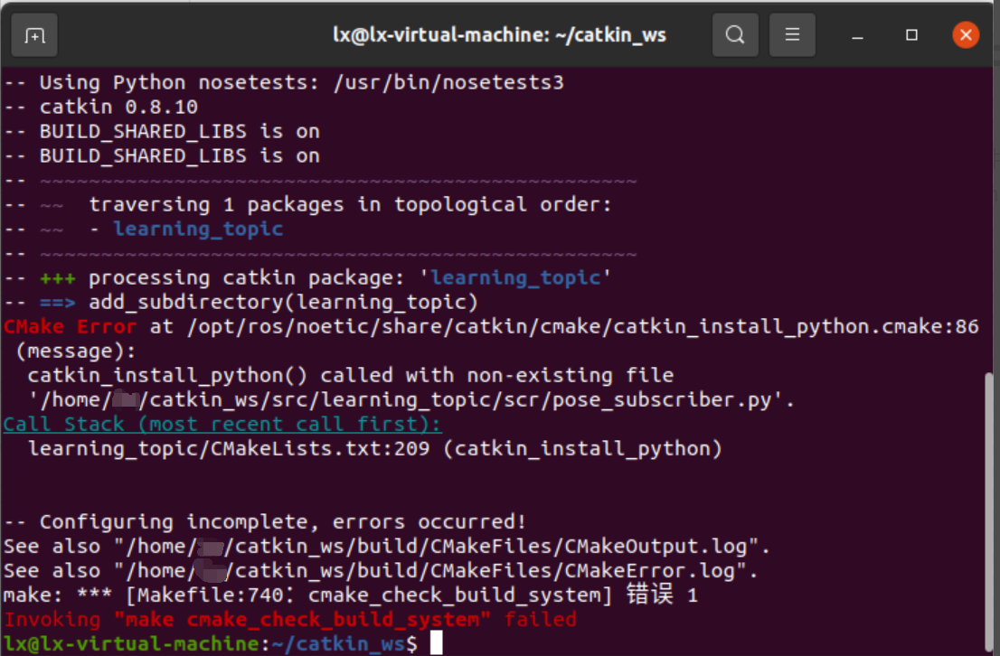

- 将以下内容添加到`CMakeLists.txt`文件中，确保正确安装`Python`脚本，并使用合适的`Python`解释器：

    ```text
    catkin_install_python(PROGRAMS
    scripts/pose_subscriber.py #代码文件夹/py文件名
    DESTINATION ${CATKIN_PACKAGE_BIN_DESTINATION}
    )
    ```

- 多个python文件则为：

    ```text
    catkin_install_python(PROGRAMS
    scripts/pose_subscriber.py scripts/velocity_publisher.py #代码文件夹/py文件名 代码文件夹/py文件名
    DESTINATION ${CATKIN_PACKAGE_BIN_DESTINATION}
    )
    ```

- 编译启动

    ```shell
    cd ~/catkin_ws/
    catkin_make
    source devel/setup.bash
    rosrun learnning_topic pose_subscriber.py
    ```

# Metapackage

把一系列包组织起来，安装使用方便

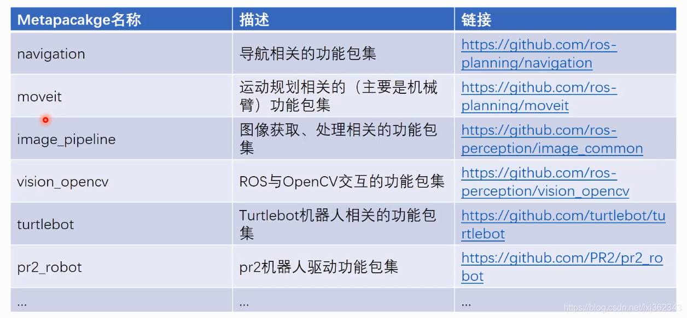

