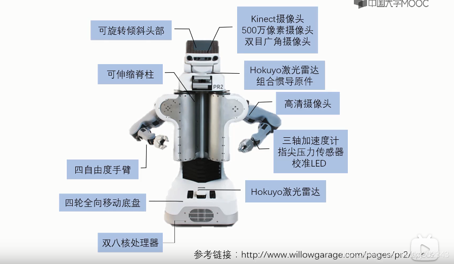
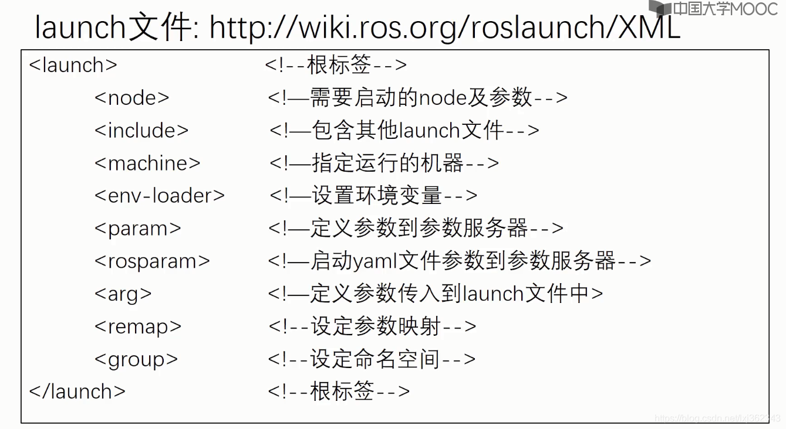
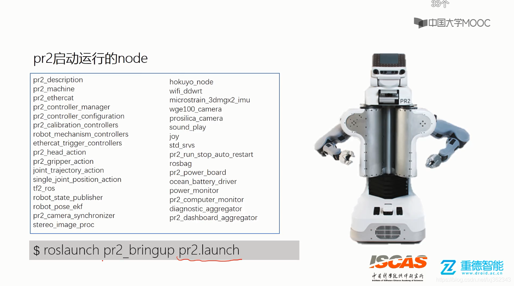

###### datetime:2022/04/24 10:04

###### author:nzb

# ROS 通信架构(上)

## Master 和 Node



### Node

在ROS的世界里，最小的进程单元就是节点（node）。一个软件包里可以有多个可执行文件，可执行文件在运行之后就成了一个进程(process)，这个进程在ROS中就叫做节点。
从程序角度来说，node就是一个可执行文件（通常为C++编译生成的可执行文件、Python脚本）被执行，加载到了内存之中；从功能角度来说，通常一个node负责者机器人的某一个单独的功能。由于机器人的功能模块非常复杂，我们往往不会把所有功能都集中到一个node上，而会采用分布式的方式，把鸡蛋放到不同的篮子里。例如有一个node来控制底盘轮子的运动，有一个node驱动摄像头获取图像，有一个node驱动激光雷达，有一个node根据传感器信息进行路径规划……这样做可以降低程序发生崩溃的可能性，试想一下如果把所有功能都写到一个程序中，模块间的通信、异常处理将会很麻烦。

- 节点(node)相当一个个程序
    - ROS 的进程
    - pkg 里的可执行文件运行的实例
- node启动命令
    - `rosrun [--prefix cmd] [--debug] pkg_name node_name [ARGS]`
    - rosrun将会寻找PACKAGE下的名为EXECUTABLE的可执行程序，将可选参数ARGS传入。 例如在GDB下运行ros程序：
      `rosrun --prefix 'gdb -ex run --args' pkg_name node_name`
- 常用命令

| rosnode命令 | 作用 |
| ----- | ----- |
| rosnode list | 列出当前运行的node信息 |
| rosnode info node_name | 显示出node的详细信息 |
| rosnode kill node_name | 结束某个node |
| rosnode ping | 测试连接节点 |
| rosnode machine | 列出在特定机器或列表机器上运行的节点 |
| rosnode cleanup | 清除不可到达节点的注册信息 |

以上命令中常用的为前三个，在开发调试时经常会需要查看当前node以及node信息，所以请记住这些常用命令。如果你想不起来，也可以通过rosnode help来查看rosnode命令的用法。

- `ros1` 节点运行中修改日志打印级别
  - `rosconsole set <node> <logger> <level>`
  - e.g：`rosconsole set test_pub_joint_state rosout debug`
### Master

由于机器人的元器件很多，功能庞大，因此实际运行时往往会运行众多的node，负责感知世界、控制运动、决策和计算等功能。那么如何合理的进行调配、管理这些node？这就要利用ROS提供给我们的节点管理器master,
master在整个网络通信架构里相当于管理中心，管理着各个node。node首先在master处进行注册，之后master会将该node纳入整个ROS程序中。node之间的通信也是先由master进行“牵线”，才能两两的进行点对点通信。当ROS程序启动时，第一步首先启动master，由节点管理器处理依次启动node。

- master相当一个管家，用来管理各个节点
    - 每个 node 启动时都要想 master 注册
    - 管理 node 之间的通信

- 启动 roscore
    - `roscore`：启动 ros master
        - master：节点管理器
        - rosout：日志输出
        - parameter server：参数服务器

通常我们运行ROS，就是按照这样的顺序启动，有时候节点太多，我们会选择用launch文件来启动，下一小节会有介绍。 Master、Node之间以及Node之间的关系如下图所示：


### launch文件

- 简介

机器人是一个系统工程，通常一个机器人运行操作时要开启很多个node，对于一个复杂的机器人的启动操作应该怎么做呢？当然，我们并不需要每个节点依次进行rosrun，ROS为我们提供了一个命令能一次性启动master和多个node。该命令是：

`roslaunch pkg_name file_name.launch`

roslaunch命令首先会自动进行检测系统的roscore有没有运行，也即是确认节点管理器是否在运行状态中，如果master没有启动，那么roslaunch就会首先启动master，然后再按照launch的规则执行。launch文件里已经配置好了启动的规则。
所以roslaunch就像是一个启动工具，能够一次性把多个节点按照我们预先的配置启动起来，减少我们在终端中一条条输入指令的麻烦。

- 写法与格式
    - launch文件同样也遵循着xml格式规范，是一种标签文本，它的格式包括以下标签：
      

[参考链接](http://wiki.ros.org/roslaunch/XML)

- 示例

launch文件的写法和格式看起来内容比较复杂，我们先来介绍一个最简单的例子如下：

```html

<launch>
    <node name="talker" pkg="rospy_tutorials" type="talker"/>
</launch>
```

这是官网给出的一个最小的例子，文本中的信息是，它启动了一个单独的节点talker,该节点是包rospy_tutorials软件包中的节点。

然而实际中的launch文件要复杂很多，我们以Ros-Academy-for-Beginners中的robot_sim_demo为例：

```html

<launch>
    <!--arg是launch标签中的变量声明，arg的name为变量名，default或者value为值-->
    <arg name="robot" default="xbot2"/>
    <arg name="debug" default="false"/>
    <arg name="gui" default="true"/>
    <arg name="headless" default="false"/>

    <!-- Start Gazebo with a blank world -->
    <include file="$(find gazebo_ros)/launch/empty_world.launch"> <!--include用来嵌套仿真场景的launch文件-->
        <arg name="world_name" value="$(find robot_sim_demo)/worlds/ROS-Academy.world"/>
        <arg name="debug" value="$(arg debug)"/>
        <arg name="gui" value="$(arg gui)"/>
        <arg name="paused" value="false"/>
        <arg name="use_sim_time" value="true"/>
        <arg name="headless" value="$(arg headless)"/>
    </include>

    <!-- Oh, you wanted a robot? --> <!--嵌套了机器人的launch文件-->
    <include file="$(find robot_sim_demo)/launch/include/$(arg robot).launch.xml"/>

    <!--如果你想连同RViz一起启动，可以按照以下方式加入RViz这个node-->
    <!--node name="rviz" pkg="rviz" type="rviz" args="-d $(find robot_sim_demo)/urdf_gazebo.rviz" /-->
</launch>
```

这个launch文件相比上一个简单的例子来说，内容稍微有些复杂，它的作用是：启动gazebo模拟器，导入参数内容，加入机器人模型。

- 小结  
  对于初学者，我们不要求掌握每一个标签是什么作用，但至少应该有一个印象。如果我们要进行自己写launch文件，可以先从改launch文件的模板入手，基本可以满足普通项目的要求。

- pr2机器人要启动的节点
  

### Topic

#### 简介

ROS的通信方式是ROS最为核心的概念，ROS系统的精髓就在于它提供的通信架构。ROS的通信方式有以下四种：

- Topic 主题
- Service 服务
- Parameter Service 参数服务器
- Actionlib 动作库

#### Topic

ROS中的通信方式中，topic是常用的一种。对于实时性、周期性的消息，使用topic来传输是最佳的选择。topic是一种点对点的单向通信方式，这里的“点”指的是node，也就是说node之间可以通过topic方式来传递信息。topic要经历下面几步的初始化过程：首先，publisher节点和subscriber节点都要到节点管理器进行注册，然后publisher会发布topic，subscriber在master的指挥下会订阅该topic，从而建立起sub-pub之间的通信。注意整个过程是单向的。其结构示意图如下：


Subscriber接收消息会进行处理，一般这个过程叫做回调(Callback)。所谓回调就是提前定义好了一个处理函数（写在代码中），当有消息来就会触发这个处理函数，函数会对消息进行处理。

上图就是ROS的topic通信方式的流程示意图。topic通信属于一种异步的通信方式。下面我们通过一个示例来了解下如何使用topic通信。

#### 通信示例

参考下图，我们以摄像头画面的发布、处理、显示为例讲讲topic通信的流程。在机器人上的摄像头拍摄程序是一个node（圆圈表示,我们记作node1），当node1运行启动之后，它作为一个Publisher就开始发布topic。比如它发布了一个topic（方框表示），叫做/camera_rgb，是rgb颜色信息，即采集到的彩色图像。同时，node2假如是图像处理程序,它订阅了/camera_rgb这个topic，经过节点管理器的介绍，它就能建立和摄像头节点（node1）的连接。

那么怎么样来理解“异步”这个概念呢？在node1每发布一次消息之后，就会继续执行下一个动作，至于消息是什么状态、被怎样处理，它不需要了解；而对于node2图像处理程序，它只管接收和处理/camera_rgb上的消息，至于是谁发来的，它不会关心。所以node1、node2两者都是各司其责，不存在协同工作，我们称这样的通信方式是异步的。


ROS是一种分布式的架构，一个topic可以被多个节点同时发布，也可以同时被多个节点接收。比如在这个场景中用户可以再加入一个图像显示的节点，我们在想看看摄像头节点的画面，则可以用自己的笔记本连接到机器人上的节点管理器，然后在自己的电脑上启动图像显示节点。

这就体现了分布式系统通信的好处：扩展性好、软件复用率高。

- 总结三点：
    - topic通信方式是异步的，发送时调用publish()方法，发送完成立即返回，不用等待反馈。
    - subscriber通过回调函数的方式来处理消息。
    - topic可以同时有多个subscribers，也可以同时有多个publishers。ROS中这样的例子有：/rosout、/tf等等。

#### 操作命令

在实际应用中，我们应该熟悉topic的几种使用命令，下表详细的列出了各自的命令及其作用。

| 命令 | 作用 |
| ----- | ----- |
| rostopic list | 列出当前所有的topic |
| rostopic info topic_name | 显示某个topic的属性信息 |
| rostopic echo topic_name | 显示某个topic的内容 |
| rostopic pub topic_name ... | 向某个topic发布内容 |
| rostopic bw topic_name | 查看某个topic的带宽 |
| rostopic hz topic_name | 查看某个topic的频率 |
| rostopic find topic_type | 查找某个类型的topic |
| rostopic type topic_name | 查看某个topic的类型(msg) |

如果你一时忘记了命令的写法，可以通过rostopic help或rostopic command -h查看具体用法。

- 获取输出过滤：`rostopic echo /tf --filter "m.transforms[0].child_frame_id == 'vive_command_client'" `

#### Message

- 简介  
  topic有很严格的格式要求，比如上节的摄像头进程中的rgb图像topic，它就必然要遵循ROS中定义好的rgb图像格式。这种数据格式就是Message。Message按照定义解释就是topic内容的数据类型，也称之为topic的格式标准。这里和我们平常用到的Massage直观概念有所不同，这里的Message不单单指一条发布或者订阅的消息，也指定为topic的格式标准。

- 结构与类型   
  基本的msg包括bool、int8、int16、int32、int64(以及uint)、float、float64、string、time、duration、header、可变长数组array[]、固定长度数组array[C]
  。那么具体的一个msg是怎么组成的呢？我们用一个具体的msg来了解，例如上例中的msg sensor_msg/image,位置存放在sensor_msgs/msg/image.msg里,它的结构如下：

```text
std_msg/Header header
    uint32    seq
    time    stamp
    string    frame_id
uint32    height
uint32    width
string    encoding
uint8    is_bigendian
uint32    step
uint8[]    data
```

观察上面msg的定义，是不是很类似C语言中的结构体呢？通过具体的定义图像的宽度，高度等等来规范图像的格式。所以这就解释了Message不仅仅是我们平时理解的一条一条的消息，而且更是ROS中topic的格式规范。或者可以理解msg是一个“类”，那么我们每次发布的内容可以理解为“对象”，这么对比来理解可能更加容易。
我们实际通常不会把Message概念分的那么清，通常说Message既指的是类，也是指它的对象。而msg文件则相当于类的定义了。

- 操作命令  
  rosmsg的命令相比topic就比较少了，只有两个如下：

| rosmsg命令 | 作用 |
| ----- | ----- |
| rosmsg list | 列出系统上所有的msg |
| rosmsg show msg_name | 显示某个msg的内容 |

#### 小结

topic的通信方式是ROS中比较常见的单向异步通信方式，它在很多时候的通信是比较易用且高效的。但是有些需要交互的通信时该方式就显露出自己的不足之处了，后续我们会介绍双向同步的通信方式service。

#### 常见message

本小节主要介绍常见的message类型，包括std_msgs, sensor_msgs, nav_msgs, geometry_msgs等

- Vector3.msg

```text
#文件位置:geometry_msgs/Vector3.msg

float64 x
float64 y
float64 z
```

- Accel.msg

```text
#定义加速度项，包括线性加速度和角加速度
#文件位置:geometry_msgs/Accel.msg
Vector3 linear
Vector3 angular
```

- Header.msg

```text
#定义数据的参考时间和参考坐标
#文件位置:std_msgs/Header.msg
uint32 seq      #数据ID
time stamp      #数据时间戳
string frame_id #数据的参考坐标系
```

- Echos.msg

```text
#定义超声传感器
#文件位置:自定义msg文件
Header header
uint16 front_left
uint16 front_center
uint16 front_right
uint16 rear_left
uint16 rear_center
uint16 rear_right
```

- Quaternion.msg

```text
#消息代表空间中旋转的四元数
#文件位置:geometry_msgs/Quaternion.msg

float64 x
float64 y
float64 z
float64 w
```

- Imu.msg

```text
#消息包含了从惯性原件中得到的数据，加速度为m/^2，角速度为rad/s
#如果所有的测量协方差已知，则需要全部填充进来如果只知道方差，则
#只填充协方差矩阵的对角数据即可
#位置：sensor_msgs/Imu.msg

Header header
Quaternion orientation
float64[9] orientation_covariance
Vector3 angular_velocity
float64[9] angular_velocity_covariance
Vector3 linear_acceleration
float64[] linear_acceleration_covariance
```

- LaserScan.msg

```text
#平面内的激光测距扫描数据，注意此消息类型仅仅适配激光测距设备
#如果有其他类型的测距设备(如声呐)，需要另外创建不同类型的消息
#位置：sensor_msgs/LaserScan.msg

Header header            #时间戳为接收到第一束激光的时间
float32 angle_min        #扫描开始时的角度(单位为rad)
float32 angle_max        #扫描结束时的角度(单位为rad)
float32 angle_increment    #两次测量之间的角度增量(单位为rad)
float32 time_increment    #两次测量之间的时间增量(单位为s)
float32 scan_time        #两次扫描之间的时间间隔(单位为s)
float32 range_min        #距离最小值(m)
float32 range_max        #距离最大值(m)
float32[] ranges        #测距数据(m,如果数据不在最小数据和最大数据之间，则抛弃)
float32[] intensities    #强度，具体单位由测量设备确定，如果仪器没有强度测量，则数组为空即可

```

- Point.msg

```text
#空间中的点的位置
#文件位置:geometry_msgs/Point.msg

float64 x
float64 y
float64 z
```

- Pose.msg

```text
#消息定义自由空间中的位姿信息，包括位置和指向信息
#文件位置:geometry_msgs/Pose.msg

Point position
Quaternion orientation
```

- PoseStamped.msg

```text
#定义有时空基准的位姿
#文件位置：geometry_msgs/PoseStamped.msg

Header header
Pose pose
```

- PoseWithCovariance.msg

```text
#表示空间中含有不确定性的位姿信息
#文件位置：geometry_msgs/PoseWithCovariance.msg

Pose pose
float64[36] covariance
```

- Power.msg

```text
#表示电源状态，是否开启
#文件位置：自定义msg文件
Header header
bool power
######################
bool ON  = 1
bool OFF = 0
```

- Twist.msg

```text
#定义空间中物体运动的线速度和角速度
#文件位置：geometry_msgs/Twist.msg

Vector3 linear
Vector3 angular
```

- TwistWithCovariance.msg

```text
#消息定义了包含不确定性的速度量，协方差矩阵按行分别表示：
#沿x方向速度的不确定性，沿y方向速度的不确定性，沿z方向速度的不确定性
#绕x转动角速度的不确定性，绕y轴转动的角速度的不确定性，绕z轴转动的
#角速度的不确定性
#文件位置：geometry_msgs/TwistWithCovariance.msg

Twist twist
float64[36] covariance  #分别表示[x; y; z; Rx; Ry; Rz]
```

- Odometry.msg

```text
#消息描述了自由空间中位置和速度的估计值
#文件位置：nav_msgs/Odometry.msg

Header header
string child_frame_id
PoseWithCovariance pose
TwistWithCovariance twist
```


