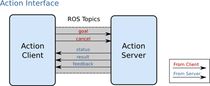

###### datetime:2022/04/24 10:04

###### author:nzb

# ROS 通信架构(下)

## Service

上一章我们介绍了ROS的通信方式中的topic(主题)通信，我们知道topic是ROS中的一种单向的异步通信方式。然而有些时候单向的通信满足不了通信要求，比如当一些节点只是临时而非周期性的需要某些数据，如果用topic通信方式时就会消耗大量不必要的系统资源，造成系统的低效率高功耗。

这种情况下，就需要有另外一种请求-查询式的通信模型。这节我们来介绍ROS通信中的另一种通信方式——service(服务)。

## 工作原理
- 简介  

为了解决以上问题，service方式在通信模型上与topic做了区别。Service通信是双向的，它不仅可以发送消息，同时还会有反馈。所以service包括两部分，一部分是请求方（Clinet），另一部分是应答方/服务提供方（Server）。这时请求方（Client）就会发送一个request，要等待server处理，反馈回一个reply，这样通过类似“请求-应答”的机制完成整个服务通信。

这种通信方式的示意图如下：  

Node B是server（应答方），提供了一个服务的接口，叫做/Service，我们一般都会用string类型来指定service的名称，类似于topic。Node A向Node B发起了请求，经过处理后得到了反馈。


- 过程

Service是同步通信方式，所谓同步就是说，此时Node A发布请求后会在原地等待reply，直到Node B处理完了请求并且完成了reply，Node A才会继续执行。Node A等待过程中，是处于阻塞状态的成通信。这样的通信模型没有频繁的消息传递，没有冲突与高系统资源的占用，只有接受请求才执行服务，简单而且高效。

## topic VS service

我们对比一下这两种最常用的通信方式，加深我们对两者的理解和认识，具体见下表：

| 名称 | Topic | Service |
| ----- | ----- | ---- |
| 通信方式 | 异步通信 | 同步通信 |
| 实现原理 | TCP/IP | TCP/IP |
| 通信模型 | Publish-Subscribe | Request-Reply |
| 映射关系 | Publish-Subscribe(多对多) | Request-Reply（多对一） |
| 特点 | 接受者收到数据会回调（Callback） | 远程过程调用（RPC）服务器端的服务 |
| 应用场景 | 连续、高频的数据发布 | 偶尔使用的功能/具体的任务 |
| 举例 | 激光雷达、里程计发布数据 | 开关传感器、拍照、逆解计算 |

**注意**：远程过程调用(Remote Procedure Call，RPC),可以简单通俗的理解为在一个进程里调用另一个进程的函数。

## 操作命令
在实际应用中，service通信方式的命令时rosservice，具体的命令参数如下表：

| rosservice 命令 | 作用 |
| ----- | ----- |
| rosservice list | 显示服务列表 |
| rosservice info | 打印服务信息 |
| rosservice type | 打印服务类型 |
| rosservice uri | 打印服务ROSRPC uri |
| rosservice find | 按服务类型查找服务 |
| rosservice call | 使用所提供的args调用服务 |
| rosservice args | 打印服务参数 |

## 小结
本节我们详细介绍了service通信方式，建议与topic通信方式进行对比记忆，这样我们能更深的理解这两种通信方式，也能在以后的学习工作中更加合理使用每个通信方式，获得更高的效率。

## Srv

### 简介
类似msg文件，srv文件是用来描述服务（service数据类型的，service通信的数据格式定义在*.srv中。它声明了一个服务，包括请求(request)和响应（reply）两部分。其格式声明如下：

举例：

msgs_demo/srv/DetectHuman.srv
```text
bool start_detect
---
my_pkg/HumanPose[] pose_data
```
msgs_demo/msg/HumanPose.msg
```text
std_msgs/Header header
string uuid
int32 number_of_joints
my_pkg/JointPose[]joint_data
```
msgs_demo/msg/JointPose.msg
```text
string joint_name
geometry_msgs/Pose pose
floar32 confidence
```
以`DetectHUman.srv`文件为例，该服务例子取自OpenNI的人体检测ROS软件包。它是用来查询当前深度摄像头中的人体姿态和关节数的。srv文件格式很固定，第一行是请求的格式，中间用---隔开，第三行是应答的格式。在本例中，请求为是否开始检测，应答为一个数组，数组的每个元素为某个人的姿态（HumanPose）。而对于人的姿态，其实是一个msg，所以srv可以嵌套msg在其中，但它不能嵌套srv。

### 操作命令
具体的操作指令如下表：

| rossrv 命令 | 作用 |
| ----- | ----- |
| rossrv show | 显示服务描述 |
| rossrv list | 列出所有服务 |
| rossrv md5 | 显示服务md5sum |
| rossrv package | 列出包中的服务 |
| rossrv packages | 列出包含服务的包 |

### 修改部分文件
定义完了msg、srv文件，还有重要的一个步骤就是修改package.xml和修改CMakeList.txt。这些文件需要添加一些必要的依赖等，例如：

```text
<build_depend>** message_generation **</build_depend>
<run_depend>** message_runtime **</run_depend>
```

上述文本中“**”所引就是新添加的依赖。又例如：
```text
find_package(...roscpp rospy std_msgs ** message_generation **)
catkin_package(
...
CATJIN_DEPENDS ** message_runtime ** ...
...)

add_message_file(
FILES
** DetectHuman.srv **
** HumanPose.msg **
** JointPos.msg **)

** generate_messages(DEPENDENCIES std_msgs) **
```
添加的这些内容指定了srv或者msg在编译或者运行中需要的依赖。具体的作用我们初学者可不深究，我们需要了解的是，无论我们自定义了srv,还是msg，修改上述部分添加依赖都是必不可少的一步。

### 常见srv类型

本小节介绍常见的srv类型及其定义 srv类型相当于两个message通道，一个发送，一个接收

- AddTwoInts.srv

```text
#对两个整数求和，虚线前是输入量，后是返回量
#文件位置：自定义srv文件
int32 a
int32 b
---
int32 sum
```

- Empty.srv

```text
#文件位置：std_srvs/Empty.srv
#代表一个空的srv类型

---
```

- GetMap.srv

```text
#文件位置:nav_msgs/GetMap.srv
#获取地图，注意请求部分为空

---
nav_msgs/OccupancyGrid map
```

- GetPlan.srv

```text
#文件位置:nav_msgs/GetPlan.srv
#得到一条从当前位置到目标点的路径
geometry_msgs/PoseStamped start        #起始点
geometry_msgs/PoseStamped goal        #目标点
float32 tolerance    #到达目标点的x，y方向的容错距离
---
nav_msgs/Path plan
```

- SetBool.srv

```text
#文件位置：std_srvs/SetBools.srv
bool data # 启动或者关闭硬件
---
bool success   # 标示硬件是否成功运行
string message # 运行信息
```

- SetCameraInfo.srv

```text
#文件位置:sensor_msgs/SetCameraInfo.srv
#通过给定的CameraInfo相机信息，来对相机进行标定
sensor_msgs/CameraInfo camera_info        #相机信息
---
bool success            #如果调用成功，则返回true
string status_message    #给出调用成功的细节
```

- SetMap.srv

```text
#文件位置：nav_msgs/SetMap.srv
#以初始位置为基准，设定新的地图
nav_msgs/OccupancyGrid map
geometry_msgs/PoseWithCovarianceStamped initial_pose
---
bool success
```

- TalkerListener.srv

```text
#文件位置: 自定义srv文件
---
bool success   # 标示srv是否成功运行
string message # 信息，如错误信息等
```

- Trigger.srv

```text
#文件位置:std_srvs/Trigger.srv
---
bool success   # 标示srv是否成功运行
string message # 信息，如错误信息等
```

## Parameter server

### 简介

前文介绍了ROS中常见的两种通信方式——主题和服务，这节介绍另外一种通信方式——参数服务器（parameter server）。与前两种通信方式不同，参数服务器也可以说是特殊的“通信方式”。特殊点在于参数服务器是节点存储参数的地方、用于配置参数，全局共享参数。参数服务器使用互联网传输，在节点管理器中运行，实现整个通信过程。

参数服务器，作为ROS中另外一种数据传输方式，有别于topic和service，它更加的静态。参数服务器维护着一个数据字典，字典里存储着各种参数和配置。

- 字典简介  

何为字典，其实就是一个个的键值对，我们小时候学习语文的时候，常常都会有一本字典，当遇到不认识的字了我们可以查部首查到这个字，获取这个字的读音、意义等等，而这里的字典可以对比理解记忆。键值kay可以理解为语文里的“部首”这个概念，每一个key都是唯一的，参照下图：

每一个key不重复，且每一个key对应着一个value。也可以说字典就是一种映射关系，在实际的项目应用中，因为字典的这种静态的映射特点，我们往往将一些不常用到的参数和配置放入参数服务器里的字典里，这样对这些数据进行读写都将方便高效。

- 维护方式，参数服务器的维护方式非常的简单灵活，总的来讲有三种方式：
    - 命令行维护
    - launch文件内读写
    - node源码

下面我们来一一介绍这三种维护方式。

### 命令行维护

使用命令行来维护参数服务器，主要使用rosparam语句来进行操作的各种命令，如下表：

| rosparam 命令 | 作用 |
| ----- | ----- |
| rosparam set param_key param_value | 设置参数 |
| rosparam get param_key | 显示参数 |
| rosparam load file_name | 从文件加载参数 |
| rosparam dump file_name | 保存参数到文件 |
| rosparam delete | 删除参数 |
| rosparam list | 列出参数名称 |

- load&&dump文件

load和dump文件需要遵守YAML格式，YAML格式具体示例如下：
```yaml
name:'Zhangsan'
age:20
gender:'M'
score{Chinese:80,Math:90}
score_history:[85,82,88,90]
```
简明解释。就是“名称+：+值”这样一种常用的解释方式。一般格式如下：
```yaml
key : value
```
遵循格式进行定义参数。其实就可以把YAML文件的内容理解为字典，因为它也是键值对的形式。

### launch文件内读写

launch文件中有很多标签，而与参数服务器相关的标签只有两个，一个是<param>，另一个是<rosparam>。这两个标签功能比较相近，但<param>一般只设置一个参数

观察上例比如的param就定义了一个key和一个value，交给了参数服务器维护。而param只给出了key，没有直接给出value，这里的value是由后没的脚本运行结果作为value进行定义的。而rosparam的典型用法，先指定一个YAML文件，然后施加command,其效果等于rosparam load file_name 。

### node源码
除了上述最常用的两种读写参数服务器的方法，还有一种就是修改ROS的源码，也就是利用API来对参数服务器进行操作。具体内容我们学习完后面章节再进行介绍。

### 参数类型
ROS参数服务器为参数值使用XMLRPC数据类型，其中包括:strings, integers, floats, booleans, lists, dictionaries, iso8601 dates, and base64-encoded data。

## Action

### 简介
Actionlib是ROS中一个很重要的库，类似service通信机制，actionlib也是一种请求响应机制的通信方式，actionlib主要弥补了service通信的一个不足，就是当机器人执行一个长时间的任务时，假如利用service通信方式，那么publisher会很长时间接受不到反馈的reply，致使通信受阻。当service通信不能很好的完成任务时候，actionlib则可以比较适合实现长时间的通信过程，actionlib通信过程可以随时被查看过程进度，也可以终止请求，这样的一个特性，使得它在一些特别的机制中拥有很高的效率。

### 通信原理

> Action的工作原理是client-server模式，也是一个双向的通信模式。通信双方在ROS Action Protocol下通过消息进行数据的交流通信。client和server为用户提供一个简单的API来请求目标（在客户端）或通过函数调用和回调来执行目标（在服务器端）。

工作模式的结构示意图如下：


通信双方在ROS Action Protocal下进行交流通信是通过接口来实现,如下图:



我们可以看到,客户端会向服务器发送目标指令和取消动作指令,而服务器则可以给客户端发送实时的状态信息,结果信息,反馈信息等等,从而完成了service没法做到的部分.

### Action 规范

利用动作库进行请求响应，动作的内容格式应包含三个部分，目标、反馈、结果。

- 目标

机器人执行一个动作，应该有明确的移动目标信息，包括一些参数的设定，方向、角度、速度等等。从而使机器人完成动作任务。

- 反馈

在动作进行的过程中，应该有实时的状态信息反馈给服务器的实施者，告诉实施者动作完成的状态，可以使实施者作出准确的判断去修正命令。

- 结果

当运动完成时，动作服务器把本次运动的结果数据发送给客户端，使客户端得到本次动作的全部信息，例如可能包含机器人的运动时长，最终姿势等等。

### Action规范文件格式

Action规范文件的后缀名是.action，它的内容格式如下：
```text
# Define the goal
uint32 dishwasher_id  # Specify which dishwasher we want to use
---
# Define the result
uint32 total_dishes_cleaned
---
# Define a feedback message
float32 percent_complete
```

### Action实例详解

Actionlib是一个用来实现action的一个功能包集。我们在demo中设置一个场景，执行一个搬运的action，搬运过程中客户端会不断的发回反馈信息，最终完成整个搬运过程．

首先写handling.action文件,类比如上的格式.包括三个部分,目标,结果,反馈.如下:

```text
# Define the goal
uint32 handling_id 
---
# Define the result
uint32 Handling_completed
---
# Define a feedback message
float32 percent_complete
```

写完之后修改文件夹里CmakeLists.txt如下内容:

```text
find_package(catkin REQUIRED genmsg actionlib_msgs actionlib)

add_action_files(DIRECTORY action FILES DoDishes.action) generate_messages(DEPENDENCIES actionlib_msgs)

add_action_files(DIRECTORY action FILES Handling.action)

generate_messages( DEPENDENCIES actionlib_msgs)
```
修改package.xml,添加所需要的依赖如下:

```xml
<build_depend>actionlib </build_depend>
<build_depend>actionlib_msgs</build_depend>
<run_depend>actionlib</run_depend>
<run_depend>actionlib_msgs</run_depend>
```
然后回到工作空间 catkin_ws进行编译.

本例中设置的的action,定义了一个搬运的例子,首先写客户端,实现功能发送action请求,包括进行目标活动,或者目标活动.之后写服务器,实验返回客户端活动当前状态信息,结果信息,和反馈信息.从而实现action.本例测试结果截图如下:


### 常见action类型

本小节介绍常见的action类型以及其定义

- AddTwoInts.action

```text
#文件位置:自定义action文件
#表示将两个整数求和
int64 a
int64 b
---
int64 sum
---
```

- AutoDocking.action

```text
#文件位置:自定义action文件
#goal
---
#result
string text
---
#feedback
string state
string text
```

- GetMap.action

```text
#文件位置:nav_msgs/GetMap.action
#获取地图信息，响应部分为空

---
nav_msgs/OccupancyGrid map
---
#无返回部分
```

- MoveBase.action

```text
#文件位置:geometry_msgs/MoveBase.action
geometry_msgs/PoseStamped target_pose
---
---
geometry_msgs/PoseStamped base_position
```

### 小结

至此，ROS通信架构的四种通信方式就介绍结束，我们可以对比学习这四种通信方式，去思考每一种通信的优缺点和适用条件，在正确的地方用正确的通信方式，这样整个ROS的通信会更加高效，机器人也将更加的灵活和智能。机器人学会了通信，也就相当于有了“灵魂”。


