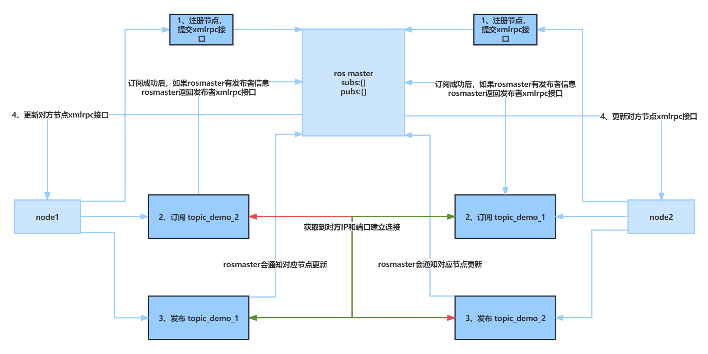

###### datetime:2023/02/07 17:18

###### author:nzb

# 4、topic

## 4.1、流程

> 执行顺序：rosmaster -> topic_demo_node_1 -> topic_demo_node_2
> - `topic_demo_node_1`节点初始化
> - `topic_demo_2` 订阅
> - `topic_demo_1` 发布
> - `topic_demo_node_2`节点初始化
> - `topic_demo_1` 订阅
> - `topic_demo_2` 发布



### 4.1.1、topic_demo_node_1(topic_demo_node_2) 节点初始化流程

- `init_node()` -> `start_node()`：初始化启动节点
    - `init_tcpros()` -> `init_tcpros_server()` -> `_tcpros_server=TCPROSServer()`：只是初始化(未启动) `_tcpros_server`
      并设置`topic_connection_handler`和`service_connection_handler`
    - `XmlRpcNode()` -> `start()` -> `_run_init()`：初始化XmlRpc服务相关信息
        - `ROSHandler()._ready()`
            - `RegManager().start()`：开线程向ros_master注册节点
                - ` RegistrationListeners().add_listener(self)`：把`RegManager()`实例添加到`RegistrationListeners()`
                  实例的`listeners`属性中，用于更新状态
                - `run()`：死循环，一个一个取`updates`属性的数据，开线程连接topic
                    - `_connect_topic_thread()` -> `ROSHandler()._connect_topic()`：下面有完整流程
    - `serve_forever()`：开启XmlRpc服务

### 4.1.2、topic_demo_node_1 中发布订阅流程

> 前置条件：上面节点已经初始化完成

#### 4.1.2.1 订阅 topic_demo_2

- `Subscriber()`
    - 父类的构造函数中执行`_TopicManager()` -> `acquire_impl()` -> `_add()`：创建`_SubscriberImpl`实例
        - `RegistrationListeners()`->`notify_added()`
            - 遍历`RegistrationListeners()`实例的`listeners`属性，其值都是`RegManager()`实例
            - 执行`RegManager()`实例的`reg_added()` -> `xmlrpcapi(master_uri).registerSubscriber()`：向ros_master注册订阅
                - 主节点：`master_api.ROSMasterHandler().registerSubscriber()`
                    - 注册订阅：`RegistrationManager().register_subscriber()`
                        - `_register()`
                            - `_register_node_api()`：创建或更新节点信息
                            - `Registrations().register()`：更新`Registrations()`实例的`map`或`service_api_map`属性
                                - `map`数据内容为：`{ key: [(caller_id, caller_api)] }`：`key`为topic名称，`caller_id`
                                  为节点名称（ID），`caller_api`为节点`XmlRpc`服务接口
                                - `service_api_map`数据内容为：`{ key: (caller_id, caller_api) }`：`key`为服务名称，`caller_id`
                                  为节点名称（ID），`caller_api`为`TCPROS`服务链接
                    - 返回发布的节点列表：`ROSMasterHandler().RegistrationManager().publishers.get_apis()`：返回对应`topic`
                      的发布节点`XmlRpc`列表，`publishers`为`Registrations`实例，
            - `publisher_update()`：`rosmaster`节点会返回发布该`topic`的所有`XmlRpc`链接列表，此操作会更新`updates`属性，目前`node_2`还未初始化，所以到这就结束了

#### 4.1.2.2 发布 topic_demo_1

- `Publisher()`
    - 父类的构造函数中执行`_TopicManager()` -> `acquire_impl()` -> `_add()`：创建`_PublisherImpl`实例
        - `RegistrationListeners()`->`notify_added()`
            - 遍历`RegistrationListeners()`实例的`listeners`属性，其值都是`RegManager()`实例
            - 执行`RegManager()`实例的`reg_added()` -> `xmlrpcapi(master_uri).registerPublisher()`：向ros_master注册发布
                - `master_api.ROSMasterHandler().registerPublisher()`
                    - 注册发布：`RegistrationManager().register_publisher()`
                        - `_register()`
                            - `_register_node_api()`：创建或更新节点信息
                            - `Registrations().register()`：更新`Registrations()`实例的`map`或`service_api_map`属性
                                - `map`数据内容为：`{ key: [(caller_id, caller_api)] }`：`key`为topic名称，`caller_id`
                                  为节点ID，`caller_api`为节点XmlRpc服务接口
                                - `service_api_map`数据内容为：`{ key: (caller_id, caller_api) }`：`key`为服务名称，`caller_id`
                                  为节点ID，`caller_api`为节点XmlRpc服务接口
                    - `pub_uris = self.publishers.get_apis(topic)`：获取发布节点`XmlRpc`服务接口
                    - `sub_uris = self.subscribers.get_apis(topic)`：获取订阅节点`XmlRpc`服务接口
                    - 通知订阅节点并返回订阅节点列表：`_notify_topic_subscribers()` -> `publisher_update_task()`：目前`node_2`
                      还未初始化，所以还没有订阅，如果有走下面流程
                        - `xmlrpcapi(api).publisherUpdate('/master', topic, pub_uris)`
                            - `api`为订阅节点的`XmlRpc`接口
                            - 该方法通知对应节点更新发布节点的`XmlRpc`链接：`ROSHandler().publisherUpdate()`
                                - `RegManager().publisher_update()`：更新`RegManager`实例的`updates`属性
                                - `updates`属性，在`RegManager`实例方法`run`中一直监听创建连接线程，`_connect_topic_thread`
- `Publisher().publish(String("topic_demo_1"))`：开启循环发送数据
    - `_PublisherImpl().publish()` -> `QueuedConnection().write_data()` -> `TCPROSTransport().write_data()`
      -> `self.socket.sendall(data)`：socket发送数据

### 4.1.3、topic_demo_node_2 中发布订阅流程

> 前置条件：上面节点已经初始化完成

#### 4.1.3.1 订阅 topic_demo_1

- 初始化跟上面的`订阅 topic_demo_2`流程一样，最后`rosmaster`会返回发布该`topic`的所有`XmlRpc`链接列表，最后更新`updates`属性
- `topic_demo_node_2`节点初始化流程中，`RegManager().start()`：开线程向`ros_master`注册节点，最后执行了死循环`run()`
    - `topic, uris = self.updates.pop()`：从`updates`取出`topic`和`XmlRpc`链接
    - `get_topic_manager().check_all()`：移除异常断连的连接
    - `self._connect_topic_thread(topic, uri)`：遍历`urls`启连接`topic`线程，每个`topic`启一个线程
        - `ROSHandler()._connect_topic(topic, uri)`
            - `xmlrpcapi(pub_uri, cache=False).requestTopic()`：请求发布节点的接口
                - 以下为发布节点内的操作
                    - `TCPROSHandler().init_publisher()` -> `start_tcpros_server()`：开启节点启动时初始化的`TCPROSServer()`
                    - `TCPROSServer().start_server()` -> `TCPServer().start()` -> 启线程执行`run()`
                        - `accept()`接收`TCP`客户端
                        - `TCPROSServer()._tcp_server_callback(client_sock, client_addr)`
                            - `read_ros_handshake_header()`：读取请求头
                            - 根据请求头区分`topic`或`service`，执行`topic_connection_handler`或`service_connection_handler`
                                - topic：`TCPROSHandler().topic_connection_handler()`
                                    - `_TopicManager()._PublisherImpl`：通过`topic`获取到对应实例，实例有数据类型等参数
                                    - `protocol = TCPROSPub()`：数据传输协议
                                    - `transport = TCPROSTransport()`：`TCPROS` 用于`topic`和`service`交互
                                    - `_PublisherImpl().add_connection(transport)`：父类对比连接者的`XmlRpc`接口或`socker`
                                      描述符，看是否已经存在连接，存在移除，否则重新添加
                                        - `c = QueuedConnection(c, self.queue_size)`：实例化队列连接，内部启线程死循环执行`_run`
                                          ，使用`TCPROSTransport().write_data`发送队列数据
                                - service：`rospy.impl.tcpros_service.service_connection_handler()`
                - 发布节点返回给订阅节点：`['TCPROS', 'pf2gf7kc', 60978]`，通讯协议、ip、端口
            - 收到发布节点的结果后订阅节点操作
                - `TCPROSHandler().create_transport()`
                    - `_TopicManager()._SubscriberImpl`：通过`topic`获取到对应订阅实例，实例有数据类型等参数
                    - `protocol = TCPROSSub()`：数据传输协议
                    - 启线程执行`robust_connect_subscriber`
                        - 参数：`TCPROSTransport`连接实例、目标IP、目标端口、发布者`XmlRpc`链接、回调函数、topic名称
                        - `TCPROSTransport().connect`：`socket`连接，一直尝试，失败会检测发布者发布链接列表实例数量是否改变了
                        - 连接成功执行：`TCPROSTransport().receive_loop(receive_cb)`：`receive_cb`用户指定的回调函数，该函数死循环接收数据，然后执行回调函数
                    - `_SubscriberImpl().add_connection(transport)`：父类对比连接者的`XmlRpc`接口或`socker`
                      描述符，看是否已经存在连接，存在移除，否则重新添加，添加成功开启线程
                      
### 4.1.4、rosout发布初始化

- `init_node()`
- `init_rosout()` -> `Publisher()`：初始化`/rosout`用于发布日志
    - `Publisher`父类的构造函数中执行`_TopicManager()` -> `acquire_impl()` -> `_add()`：创建`_PublisherImpl`或`_SubscriberImpl`实例
        - `RegistrationListeners()`->`notify_added()`
            - 遍历`RegistrationListeners()`实例的`listeners`属性，其值都是`RegManager()`实例
            - 执行`RegManager()`实例的`reg_added()` -> `xmlrpcapi(master_uri).registerPublisher()`：向ros_master注册发布
                - `master_api.ROSMasterHandler().registerPublisher()`
                    - `RegistrationManager().register_publisher()`
                    - `_notify_topic_subscribers()` -> `publisher_update_task()`
                        - `xmlrpcapi(api).publisherUpdate('/master', topic, pub_uris)`
                            - api为`rosout`的`XmlRpc`接口
                            - 该方法通知`rosout`节点更新发布节点的`XmlRpc`链接
                        - `ROSHandler().publisherUpdate()`
                            - `RegManager().publisher_update()`：更新`RegManager`实例的`updates`属性
                            - `updates`属性，在`RegManager`实例方法`run`中一直监听创建连接线程，`_connect_topic_thread`

## 4.2、代码

- `master.py`

```python
import rosmaster

if __name__ == '__main__':
    rosmaster.rosmaster_main(["--core"])
```

- `topic_demo_node_1.py`

```python
import threading

import rospy
from std_msgs.msg import String


def talker():
    pub = rospy.Publisher('topic_demo_1', String, queue_size=10)
    # 更新频率是1hz
    rate = rospy.Rate(1)
    while not rospy.is_shutdown():
        # 计算距离
        pub.publish(String("topic_demo_1"))
        rate.sleep()


def callback(data):
    rospy.loginfo(data)


def main():
    # 订阅
    rospy.Subscriber('topic_demo_2', String, callback)
    # 发布
    threading.Thread(target=talker).start()


if __name__ == '__main__':
    rospy.init_node('topic_demo_node_1', anonymous=True, log_level=rospy.DEBUG)
    main()
    rospy.spin()
```

- `topic_demo_node_2.py`

```python
import threading

import rospy
from std_msgs.msg import String


def talker():
    pub = rospy.Publisher('topic_demo_2', String, queue_size=10)
    # 更新频率是1hz
    rate = rospy.Rate(1)
    while not rospy.is_shutdown():
        # 计算距离
        pub.publish(String("topic_demo_2"))
        rate.sleep()


def callback(data):
    rospy.loginfo(data)


def main():
    # 订阅
    rospy.Subscriber('topic_demo_1', String, callback)
    # 发布
    threading.Thread(target=talker).start()


if __name__ == '__main__':
    rospy.init_node('topic_demo_node_2', anonymous=True, log_level=rospy.DEBUG)
    main()
    rospy.spin()

```

## 4.3、日志

```text
# rosmaster 启动日志
2023-02-09 14:44:08 - main - 25908 - INFO : initialization complete, waiting for shutdown
2023-02-09 14:44:08 - main - 25908 - INFO : Starting ROS Master Node
2023-02-09 14:44:08 - xmlrpc - 27172 - INFO : XML-RPC server binding to 0.0.0.0:11311
2023-02-09 14:44:08 - xmlrpc - 27172 - INFO : Started XML-RPC server [http://pf2gf7kc:11311/]
2023-02-09 14:44:08 - xmlrpc - 27172 - INFO : xml rpc node: starting XML-RPC server
2023-02-09 14:44:08 - master - 25908 - INFO : Master initialized: port[11311], uri[http://pf2gf7kc:11311/]

# topic_demo_node_1 启动日志(开始)
2023-02-09 14:45:10 - client - 19492 - INFO : init_node, name[/topic_demo_node_1_12044_1675925110198], pid[12044]
2023-02-09 14:45:10 - xmlrpc - 20232 - INFO : XML-RPC server binding to 0.0.0.0:0
2023-02-09 14:45:10 - xmlrpc - 20232 - INFO : Started XML-RPC server [http://pf2gf7kc:60976/]
2023-02-09 14:45:10 - init - 19492 - INFO : ROS Slave URI: [http://pf2gf7kc:60976/]
2023-02-09 14:45:10 - masterslave - 20232 - INFO : _ready: http://pf2gf7kc:60976/
2023-02-09 14:45:10 - registration - 26880 - INFO : Registering with master node http://127.0.0.1:11311/
2023-02-09 14:45:10 - xmlrpc - 20232 - INFO : xml rpc node: starting XML-RPC server
2023-02-09 14:45:10 - registration - 26880 - DEBUG : No topics to register with master node http://127.0.0.1:11311/
2023-02-09 14:45:10 - init - 19492 - INFO : registered with master
2023-02-09 14:45:10 - rosout - 19492 - INFO : initializing /rosout core topic
2023-02-09 14:45:10 - topics - 19492 - DEBUG : tm._add: /rosout, rosgraph_msgs/Log, pub
2023-02-09 14:45:10 - registration - 19492 - DEBUG : master.registerPublisher(/topic_demo_node_1_12044_1675925110198, /rosout, rosgraph_msgs/Log, http://pf2gf7kc:60976/)
2023-02-09 14:45:10 - master_api - 26800 - INFO : +PUB [/rosout] /topic_demo_node_1_12044_1675925110198 http://pf2gf7kc:60976/
2023-02-09 14:45:10 - rosout - 19492 - INFO : connected to core topic /rosout
2023-02-09 14:45:10 - simtime - 19492 - INFO : /use_sim_time is not set, will not subscribe to simulated time [/clock] topic
2023-02-09 14:45:10 - client - 19492 - DEBUG : init_node, name[/topic_demo_node_1_12044_1675925110198], pid[12044]
2023-02-09 14:45:10 - tcpros_base - 19492 - DEBUG : binding to 0.0.0.0 0
2023-02-09 14:45:10 - tcpros_base - 19492 - DEBUG : bound to 0.0.0.0 60978
2023-02-09 14:45:10 - tcpros_service - 19492 - DEBUG : ... service URL is rosrpc://pf2gf7kc:60978
2023-02-09 14:45:10 - tcpros_service - 19492 - DEBUG : [/topic_demo_node_1_12044_1675925110198/get_loggers]: new Service instance
2023-02-09 14:45:10 - registration - 19492 - DEBUG : master.registerService(/topic_demo_node_1_12044_1675925110198, /topic_demo_node_1_12044_1675925110198/get_loggers, rosrpc://pf2gf7kc:60978, http://pf2gf7kc:60976/)
2023-02-09 14:45:10 - master_api - 26800 - INFO : +SERVICE [/topic_demo_node_1_12044_1675925110198/get_loggers] /topic_demo_node_1_12044_1675925110198 http://pf2gf7kc:60976/
2023-02-09 14:45:10 - tcpros_service - 19492 - DEBUG : ... service URL is rosrpc://pf2gf7kc:60978
2023-02-09 14:45:10 - tcpros_service - 19492 - DEBUG : [/topic_demo_node_1_12044_1675925110198/set_logger_level]: new Service instance
2023-02-09 14:45:10 - registration - 19492 - DEBUG : master.registerService(/topic_demo_node_1_12044_1675925110198, /topic_demo_node_1_12044_1675925110198/set_logger_level, rosrpc://pf2gf7kc:60978, http://pf2gf7kc:60976/)
2023-02-09 14:45:10 - master_api - 26800 - INFO : +SERVICE [/topic_demo_node_1_12044_1675925110198/set_logger_level] /topic_demo_node_1_12044_1675925110198 http://pf2gf7kc:60976/
2023-02-09 14:45:10 - topics - 19492 - DEBUG : tm._add: /topic_demo_2, std_msgs/String, sub
2023-02-09 14:45:10 - registration - 19492 - DEBUG : master.registerSubscriber(/topic_demo_node_1_12044_1675925110198, /topic_demo_2, std_msgs/String, http://pf2gf7kc:60976/)
2023-02-09 14:45:10 - master_api - 26800 - INFO : +SUB [/topic_demo_2] /topic_demo_node_1_12044_1675925110198 http://pf2gf7kc:60976/
2023-02-09 14:45:10 - topics - 24104 - DEBUG : tm._add: /topic_demo_1, std_msgs/String, pub
2023-02-09 14:45:10 - registration - 24104 - DEBUG : master.registerPublisher(/topic_demo_node_1_12044_1675925110198, /topic_demo_1, std_msgs/String, http://pf2gf7kc:60976/)
2023-02-09 14:45:10 - client - 19492 - DEBUG : node[/topic_demo_node_1_12044_1675925110198, http://pf2gf7kc:60976/] entering spin(), pid[12044]
2023-02-09 14:45:10 - master_api - 26800 - INFO : +PUB [/topic_demo_1] /topic_demo_node_1_12044_1675925110198 http://pf2gf7kc:60976/

# topic_demo_node_2 启动日志(开始)
2023-02-09 14:46:29 - client - 20676 - INFO : init_node, name[/topic_demo_node_2_26108_1675925189526], pid[26108]
2023-02-09 14:46:29 - xmlrpc - 9668 - INFO : XML-RPC server binding to 0.0.0.0:0
2023-02-09 14:46:29 - xmlrpc - 9668 - INFO : Started XML-RPC server [http://pf2gf7kc:61018/]
2023-02-09 14:46:29 - masterslave - 9668 - INFO : _ready: http://pf2gf7kc:61018/
2023-02-09 14:46:29 - registration - 13684 - INFO : Registering with master node http://127.0.0.1:11311/
2023-02-09 14:46:29 - xmlrpc - 9668 - INFO : xml rpc node: starting XML-RPC server
2023-02-09 14:46:29 - registration - 13684 - DEBUG : No topics to register with master node http://127.0.0.1:11311/
2023-02-09 14:46:29 - init - 20676 - INFO : ROS Slave URI: [http://pf2gf7kc:61018/]
2023-02-09 14:46:29 - init - 20676 - INFO : registered with master
2023-02-09 14:46:29 - rosout - 20676 - INFO : initializing /rosout core topic
2023-02-09 14:46:29 - topics - 20676 - DEBUG : tm._add: /rosout, rosgraph_msgs/Log, pub
2023-02-09 14:46:29 - registration - 20676 - DEBUG : master.registerPublisher(/topic_demo_node_2_26108_1675925189526, /rosout, rosgraph_msgs/Log, http://pf2gf7kc:61018/)
2023-02-09 14:46:29 - master_api - 12808 - INFO : +PUB [/rosout] /topic_demo_node_2_26108_1675925189526 http://pf2gf7kc:61018/
2023-02-09 14:46:29 - rosout - 20676 - INFO : connected to core topic /rosout
2023-02-09 14:46:29 - simtime - 20676 - INFO : /use_sim_time is not set, will not subscribe to simulated time [/clock] topic
2023-02-09 14:46:29 - client - 20676 - DEBUG : init_node, name[/topic_demo_node_2_26108_1675925189526], pid[26108]
2023-02-09 14:46:29 - tcpros_base - 20676 - DEBUG : binding to 0.0.0.0 0
2023-02-09 14:46:29 - tcpros_base - 20676 - DEBUG : bound to 0.0.0.0 61020
2023-02-09 14:46:29 - tcpros_service - 20676 - DEBUG : ... service URL is rosrpc://pf2gf7kc:61020
2023-02-09 14:46:29 - tcpros_service - 20676 - DEBUG : [/topic_demo_node_2_26108_1675925189526/get_loggers]: new Service instance
2023-02-09 14:46:29 - registration - 20676 - DEBUG : master.registerService(/topic_demo_node_2_26108_1675925189526, /topic_demo_node_2_26108_1675925189526/get_loggers, rosrpc://pf2gf7kc:61020, http://pf2gf7kc:61018/)
2023-02-09 14:46:29 - master_api - 12808 - INFO : +SERVICE [/topic_demo_node_2_26108_1675925189526/get_loggers] /topic_demo_node_2_26108_1675925189526 http://pf2gf7kc:61018/
2023-02-09 14:46:29 - tcpros_service - 20676 - DEBUG : ... service URL is rosrpc://pf2gf7kc:61020
2023-02-09 14:46:29 - tcpros_service - 20676 - DEBUG : [/topic_demo_node_2_26108_1675925189526/set_logger_level]: new Service instance
2023-02-09 14:46:29 - registration - 20676 - DEBUG : master.registerService(/topic_demo_node_2_26108_1675925189526, /topic_demo_node_2_26108_1675925189526/set_logger_level, rosrpc://pf2gf7kc:61020, http://pf2gf7kc:61018/)
2023-02-09 14:46:29 - master_api - 12808 - INFO : +SERVICE [/topic_demo_node_2_26108_1675925189526/set_logger_level] /topic_demo_node_2_26108_1675925189526 http://pf2gf7kc:61018/
2023-02-09 14:46:29 - topics - 20676 - DEBUG : tm._add: /topic_demo_1, std_msgs/String, sub
2023-02-09 14:46:29 - registration - 20676 - DEBUG : master.registerSubscriber(/topic_demo_node_2_26108_1675925189526, /topic_demo_1, std_msgs/String, http://pf2gf7kc:61018/)
2023-02-09 14:46:29 - master_api - 12808 - INFO : +SUB [/topic_demo_1] /topic_demo_node_2_26108_1675925189526 http://pf2gf7kc:61018/
2023-02-09 14:46:29 - topics - 26340 - DEBUG : tm._add: /topic_demo_2, std_msgs/String, pub
2023-02-09 14:46:29 - masterslave - 26820 - DEBUG : connect[/topic_demo_1]: calling requestTopic(/topic_demo_node_2_26108_1675925189526, /topic_demo_1, [['TCPROS']])
2023-02-09 14:46:29 - registration - 26340 - DEBUG : master.registerPublisher(/topic_demo_node_2_26108_1675925189526, /topic_demo_2, std_msgs/String, http://pf2gf7kc:61018/)
2023-02-09 14:46:29 - client - 20676 - DEBUG : node[/topic_demo_node_2_26108_1675925189526, http://pf2gf7kc:61018/] entering spin(), pid[26108]
2023-02-09 14:46:29 - master_api - 12808 - INFO : +PUB [/topic_demo_2] /topic_demo_node_2_26108_1675925189526 http://pf2gf7kc:61018/

# 收发topic
2023-02-09 14:46:29 - master_api - 24928 - INFO : publisherUpdate[/topic_demo_2] -> http://pf2gf7kc:60976/ ['http://pf2gf7kc:61018/']
2023-02-09 14:46:33 - masterslave - 1644 - DEBUG : requestTopic('/topic_demo_node_2_26108_1675925189526', '/topic_demo_1', [['TCPROS']])
2023-02-09 14:46:33 - masterslave - 1644 - DEBUG : requestTopic[/topic_demo_1]: choosing protocol TCPROS
2023-02-09 14:46:33 - masterslave - 1644 - DEBUG : requestTopic('/topic_demo_node_2_26108_1675925189526', '/topic_demo_1', [['TCPROS']]) returns (1, 'ready on pf2gf7kc:60978', ['TCPROS', 'pf2gf7kc', 60978])
2023-02-09 14:46:33 - masterslave - 26820 - DEBUG : connect[/topic_demo_1]: requestTopic returned protocol list ['TCPROS', 'pf2gf7kc', 60978]
2023-02-09 14:46:33 - core - 26820 - INFO : topic[/topic_demo_1] adding connection to [http://pf2gf7kc:60976/], count 0
2023-02-09 14:46:33 - tcpros_base - 25744 - DEBUG : connecting to pf2gf7kc 60978
2023-02-09 14:46:33 - tcpros_base - 25744 - DEBUG : [/topic_demo_1]: writing header
2023-02-09 14:46:33 - tcpros_base - 23760 - DEBUG : [/topic_demo_1]: writing header
2023-02-09 14:46:33 - tcpros_base - 25744 - DEBUG : receive_loop for [/topic_demo_1]
2023-02-09 14:46:33 - core - 23760 - INFO : topic[/topic_demo_1] adding connection to [/topic_demo_node_2_26108_1675925189526], count 0
2023-02-09 14:46:33 - masterslave - 9492 - DEBUG : publisherUpdate('/master', '/topic_demo_2', ['http://pf2gf7kc:61018/'])
2023-02-09 14:46:33 - masterslave - 9492 - DEBUG : publisherUpdate('/master', '/topic_demo_2', ['http://pf2gf7kc:61018/']) returns (1, '', 0)
2023-02-09 14:46:33 - masterslave - 13884 - DEBUG : connect[/topic_demo_2]: calling requestTopic(/topic_demo_node_1_12044_1675925110198, /topic_demo_2, [['TCPROS']])
2023-02-09 14:46:33 - master_api - 24928 - INFO : publisherUpdate[/topic_demo_2] -> http://pf2gf7kc:60976/ ['http://pf2gf7kc:61018/']: sec=4.07, result=[1, '', 0]
2023-02-09 14:46:34 - listener - 25744 - INFO : data: "topic_demo_1"
2023-02-09 14:46:35 - listener - 25744 - INFO : data: "topic_demo_1"
2023-02-09 14:46:36 - listener - 25744 - INFO : data: "topic_demo_1"
2023-02-09 14:46:37 - listener - 25744 - INFO : data: "topic_demo_1"
2023-02-09 14:46:37 - masterslave - 27052 - DEBUG : requestTopic('/topic_demo_node_1_12044_1675925110198', '/topic_demo_2', [['TCPROS']])
2023-02-09 14:46:37 - masterslave - 27052 - DEBUG : requestTopic[/topic_demo_2]: choosing protocol TCPROS
2023-02-09 14:46:37 - masterslave - 27052 - DEBUG : requestTopic('/topic_demo_node_1_12044_1675925110198', '/topic_demo_2', [['TCPROS']]) returns (1, 'ready on pf2gf7kc:61020', ['TCPROS', 'pf2gf7kc', 61020])
2023-02-09 14:46:37 - masterslave - 13884 - DEBUG : connect[/topic_demo_2]: requestTopic returned protocol list ['TCPROS', 'pf2gf7kc', 61020]
2023-02-09 14:46:37 - core - 13884 - INFO : topic[/topic_demo_2] adding connection to [http://pf2gf7kc:61018/], count 0
2023-02-09 14:46:37 - tcpros_base - 10828 - DEBUG : connecting to pf2gf7kc 61020
2023-02-09 14:46:37 - tcpros_base - 10828 - DEBUG : [/topic_demo_2]: writing header
2023-02-09 14:46:37 - tcpros_base - 23504 - DEBUG : [/topic_demo_2]: writing header
2023-02-09 14:46:37 - tcpros_base - 10828 - DEBUG : receive_loop for [/topic_demo_2]
2023-02-09 14:46:37 - core - 23504 - INFO : topic[/topic_demo_2] adding connection to [/topic_demo_node_1_12044_1675925110198], count 0
2023-02-09 14:46:38 - listener - 25744 - INFO : data: "topic_demo_1"
2023-02-09 14:46:38 - talker - 10828 - INFO : data: "topic_demo_2"
2023-02-09 14:46:39 - listener - 25744 - INFO : data: "topic_demo_1"
2023-02-09 14:46:39 - talker - 10828 - INFO : data: "topic_demo_2"
2023-02-09 14:46:40 - listener - 25744 - INFO : data: "topic_demo_1"
2023-02-09 14:46:40 - talker - 10828 - INFO : data: "topic_demo_2"
2023-02-09 14:46:41 - listener - 25744 - INFO : data: "topic_demo_1"
2023-02-09 14:46:41 - talker - 10828 - INFO : data: "topic_demo_2"
2023-02-09 14:46:42 - listener - 25744 - INFO : data: "topic_demo_1"
2023-02-09 14:46:42 - talker - 10828 - INFO : data: "topic_demo_2"
2023-02-09 14:46:43 - listener - 25744 - INFO : data: "topic_demo_1"
2023-02-09 14:46:43 - talker - 10828 - INFO : data: "topic_demo_2"
2023-02-09 14:46:44 - listener - 25744 - INFO : data: "topic_demo_1"
2023-02-09 14:46:44 - talker - 10828 - INFO : data: "topic_demo_2"
2023-02-09 14:46:45 - listener - 25744 - INFO : data: "topic_demo_1"
2023-02-09 14:46:45 - talker - 10828 - INFO : data: "topic_demo_2"
2023-02-09 14:46:46 - listener - 25744 - INFO : data: "topic_demo_1"
2023-02-09 14:46:46 - talker - 10828 - INFO : data: "topic_demo_2"
2023-02-09 14:46:47 - listener - 25744 - INFO : data: "topic_demo_1"
2023-02-09 14:46:47 - talker - 10828 - INFO : data: "topic_demo_2"
2023-02-09 14:46:48 - listener - 25744 - INFO : data: "topic_demo_1"
2023-02-09 14:46:48 - talker - 10828 - INFO : data: "topic_demo_2"
2023-02-09 14:46:49 - listener - 25744 - INFO : data: "topic_demo_1"
2023-02-09 14:46:49 - talker - 10828 - INFO : data: "topic_demo_2"
2023-02-09 14:46:50 - listener - 25744 - INFO : data: "topic_demo_1"
2023-02-09 14:46:50 - talker - 10828 - INFO : data: "topic_demo_2"
2023-02-09 14:46:51 - listener - 25744 - INFO : data: "topic_demo_1"
2023-02-09 14:46:51 - talker - 10828 - INFO : data: "topic_demo_2"
2023-02-09 14:46:52 - listener - 25744 - INFO : data: "topic_demo_1"
2023-02-09 14:46:52 - talker - 10828 - INFO : data: "topic_demo_2"
2023-02-09 14:46:53 - listener - 25744 - INFO : data: "topic_demo_1"
2023-02-09 14:46:53 - talker - 10828 - INFO : data: "topic_demo_2"
2023-02-09 14:46:54 - listener - 25744 - INFO : data: "topic_demo_1"
2023-02-09 14:46:54 - talker - 10828 - INFO : data: "topic_demo_2"
2023-02-09 14:46:55 - listener - 25744 - INFO : data: "topic_demo_1"
2023-02-09 14:46:55 - talker - 10828 - INFO : data: "topic_demo_2"
2023-02-09 14:46:56 - listener - 25744 - INFO : data: "topic_demo_1"
2023-02-09 14:46:56 - talker - 10828 - INFO : data: "topic_demo_2"
2023-02-09 14:46:57 - listener - 25744 - INFO : data: "topic_demo_1"
2023-02-09 14:46:57 - talker - 10828 - INFO : data: "topic_demo_2"
2023-02-09 14:46:58 - listener - 25744 - INFO : data: "topic_demo_1"
2023-02-09 14:46:58 - talker - 10828 - INFO : data: "topic_demo_2"
2023-02-09 14:46:59 - listener - 25744 - INFO : data: "topic_demo_1"
2023-02-09 14:46:59 - talker - 10828 - INFO : data: "topic_demo_2"
2023-02-09 14:47:00 - listener - 25744 - INFO : data: "topic_demo_1"
2023-02-09 14:47:00 - talker - 10828 - INFO : data: "topic_demo_2"
2023-02-09 14:47:01 - listener - 25744 - INFO : data: "topic_demo_1"
2023-02-09 14:47:01 - talker - 10828 - INFO : data: "topic_demo_2"
2023-02-09 14:47:02 - listener - 25744 - INFO : data: "topic_demo_1"
2023-02-09 14:47:02 - talker - 10828 - INFO : data: "topic_demo_2"
2023-02-09 14:47:03 - listener - 25744 - INFO : data: "topic_demo_1"
2023-02-09 14:47:03 - talker - 10828 - INFO : data: "topic_demo_2"
2023-02-09 14:47:04 - listener - 25744 - INFO : data: "topic_demo_1"
2023-02-09 14:47:04 - talker - 10828 - INFO : data: "topic_demo_2"
2023-02-09 14:47:05 - listener - 25744 - INFO : data: "topic_demo_1"
2023-02-09 14:47:05 - talker - 10828 - INFO : data: "topic_demo_2"
2023-02-09 14:47:06 - listener - 25744 - INFO : data: "topic_demo_1"
2023-02-09 14:47:06 - talker - 10828 - INFO : data: "topic_demo_2"
2023-02-09 14:47:07 - listener - 25744 - INFO : data: "topic_demo_1"
# 订阅段关闭
2023-02-09 14:47:07 - core - 10828 - ERROR : Traceback (most recent call last):
  File "D:\Program\py_env\demo\lib\site-packages\rospy\impl\tcpros_base.py", line 737, in receive_once
    self.stat_bytes += recv_buff(sock, b, p.buff_size)
  File "D:\Program\py_env\demo\lib\site-packages\rospy\impl\tcpros_base.py", line 104, in recv_buff
    d = sock.recv(buff_size)
ConnectionResetError: [WinError 10054] 远程主机强迫关闭了一个现有的连接。

2023-02-09 14:47:07 - xmlrpc - 12808 - ERROR : Traceback (most recent call last):
  File "D:\Program\Python39\lib\socketserver.py", line 683, in process_request_thread
    self.finish_request(request, client_address)
  File "D:\Program\Python39\lib\socketserver.py", line 360, in finish_request
    self.RequestHandlerClass(request, client_address, self)
  File "D:\Program\Python39\lib\socketserver.py", line 747, in __init__
    self.handle()
  File "D:\Program\Python39\lib\http\server.py", line 429, in handle
    self.handle_one_request()
  File "D:\Program\Python39\lib\http\server.py", line 395, in handle_one_request
    self.raw_requestline = self.rfile.readline(65537)
  File "D:\Program\Python39\lib\socket.py", line 704, in readinto
    return self._sock.recv_into(b)
ConnectionResetError: [WinError 10054] 远程主机强迫关闭了一个现有的连接。

2023-02-09 14:47:07 - tcpros_base - 10828 - DEBUG : connecting to pf2gf7kc 61020
2023-02-09 14:47:09 - topics - 24104 - DEBUG : publisher connection to [/topic_demo_node_2_26108_1675925189526] terminated, see errorlog for details:
Traceback (most recent call last):
  File "D:\Program\py_env\demo\lib\site-packages\rospy\impl\tcpros_base.py", line 689, in write_data
    self.socket.sendall(data)
ConnectionResetError: [WinError 10054] 远程主机强迫关闭了一个现有的连接。

During handling of the above exception, another exception occurred:

Traceback (most recent call last):
  File "D:\Program\py_env\demo\lib\site-packages\rospy\topics.py", line 1075, in publish
    c.write_data(data)
  File "D:\Program\py_env\demo\lib\site-packages\rospy\impl\tcpros_pubsub.py", line 413, in write_data
    raise error
  File "D:\Program\py_env\demo\lib\site-packages\rospy\impl\tcpros_pubsub.py", line 437, in _run
    self._connection.write_data(data)
  File "D:\Program\py_env\demo\lib\site-packages\rospy\impl\tcpros_base.py", line 694, in write_data
    (ioe_errno, msg) = ioe.args
ValueError: too many values to unpack (expected 2)

2023-02-09 14:47:09 - core - 24104 - INFO : topic[/topic_demo_1] removing connection to /topic_demo_node_2_26108_1675925189526
2023-02-09 14:47:09 - core - 10828 - WARNING : Unknown error initiating TCP/IP socket to pf2gf7kc:61020 (http://pf2gf7kc:61018/): Traceback (most recent call last):
  File "D:\Program\py_env\demo\lib\site-packages\rospy\impl\tcpros_base.py", line 560, in connect
    self.socket.connect((dest_addr, dest_port))
ConnectionRefusedError: [WinError 10061] 由于目标计算机积极拒绝，无法连接。

2023-02-09 14:47:09 - core - 10828 - INFO : topic[/topic_demo_2] removing connection to http://pf2gf7kc:61018/
2023-02-09 14:47:10 - core - 10828 - DEBUG : receive_loop[/topic_demo_2]: done condition met, exited loop
2023-02-09 14:47:21 - xmlrpc - 26800 - ERROR : Traceback (most recent call last):
  File "D:\Program\Python39\lib\socketserver.py", line 683, in process_request_thread
    self.finish_request(request, client_address)
  File "D:\Program\Python39\lib\socketserver.py", line 360, in finish_request
    self.RequestHandlerClass(request, client_address, self)
  File "D:\Program\Python39\lib\socketserver.py", line 747, in __init__
    self.handle()
  File "D:\Program\Python39\lib\http\server.py", line 429, in handle
    self.handle_one_request()
  File "D:\Program\Python39\lib\http\server.py", line 395, in handle_one_request
    self.raw_requestline = self.rfile.readline(65537)
  File "D:\Program\Python39\lib\socket.py", line 704, in readinto
    return self._sock.recv_into(b)
ConnectionResetError: [WinError 10054] 远程主机强迫关闭了一个现有的连接。
```