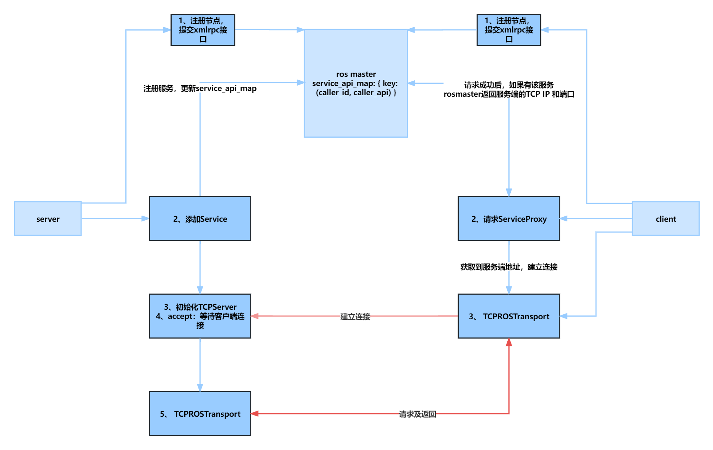

###### datetime:2023/02/10 17:46

###### author:nzb

# 5、service

## 5.1、流程

客户端和服务端每次请求都要重新连接一次



### 5.1.1、server端

- `init_node()`：节点初始化
- `rospy.Service("/test_service", SetBool, callback)`：添加`test_service`服务
    - 父类`ServiceImpl().__init__()`
        - 父类`_Service().__init__()`：赋值`service_class`,`request_class`,`response_class`
        - `start_tcpros_server()`
            - `TCPROSServer(port=port)`
            - `start_server()`
                - `TCPServer(self._tcp_server_callback, self.port)` -> `self._create_server_sock()`：创建`socket`
                - `start()`
                    - `run()死循环` -> `self.server_sock.accept()`：接收客户端连接，以下为接收客户端请求及结果返回
                        - `self._tcp_server_callback()`
                            - `read_ros_handshake_header(sock, StringIO(), buff_size)`：读取头信息
                            - 服务调用：`service_connection_handler(sock, client_addr, header)`
                                - `ServiceManager().get_service(service_name)`：获取`Service`实例
                                - `transport = TCPROSTransport(service.protocol, service_name, header=header)`
                                  ：`service.protocol`为下面实例化的`TCPService()`
                                - `transport.write_header()`
                                - `threading.Thread(target=service.handle, args=(transport, header)).start()`
                                    - `request = transport.receive_once()`：接收客户端请求数据，返回列表
                                        - `recv_buff(sock, StringIO(), p.buff_size)`
                                        - `if StringIO().tell() >= 4:` -> `TCPROSTransportProtocol().read_messages()`
                                          -> `deserialize_messages()`：反序列化
                                    - `self._handle_request(transport, request)`
                                        - `convert_return_to_response(self.handler(request), self.response_class)`
                                          ：转换执行结果序列化，`self.handler`：就是用户指定的回调函数
                                        - `transport.write_buff.write(struct.pack('<B', 1))`：第一字节为1，代表成功
                                        - `transport.send_message(response, self.seq)`：发送客户端结果
                                            - `serialize_message()` -> 执行数据类型实例化`msg.serialize(StringIO())` ->
                                              协议：4字节数据长度 + 数据
                                            - `self.write_data(StringIO().getvalue())` -> `self.socket.sendall(data)`
                                    - `transport.close()`

        - `self.protocol=TCPService()`
    - `ServiceManager().register()` -> `RegistrationListeners().notify_added()`
        - 遍历`RegistrationListeners()`实例的`listeners`属性，其值都是`RegManager()`实例，节点实例化的添加的
        - 执行`RegManager()`实例的`reg_added()` -> `xmlrpcapi(master_uri).registerService()`：向`ros_master`注册服务
            - `rosmaster`操作：`master_api.ROSMasterHandler().registerService()`
                - `RegistrationManager().register_service()`-> `_register()`
                    - `RegistrationManager()._register_node_api()`
                    - `Registrations().register()`：更新`self.service_api_map`
                        - 数据格式 { key: (caller_id, caller_api) }
                            - `key`：服务名
                            - `caller_id`：节点名称
                            - `caller_api`：`TCPROS`服务链接

### 5.1.2、client端

- `init_node()`：节点初始化
- `rospy.wait_for_service("/test_service")`：阻塞，等待`test_service`服务直到可访问
    - `contact_service()` -> `master.lookupService()`
        - `rosmaster`操作：`RegistrationManager().Registrations().get_service_api(service)`：从上面的`self.service_api_map`
          属性中获取信息，返回`TCPROS`的URI`rosrpc://pf2gf7kc:51461`
        - `socket.socket()`
        - `s.connect(addr)`：重新建立`socket`连接
        - `rosgraph.network.write_ros_handshake_header(s, h)`：发送头信息
- `rospy.ServiceProxy("/test_service", SetBool)` -> `protocol = TCPROSServiceClient()`
- `proxy.call(True)`：也可以写成`ServiceProxy()(True)`，`ServiceProxy`的魔术方法`__call__`调用了`call`
    - `request = rospy.msg.args_kwds_to_message(self.request_class, args, kwds)`：封装请求数据
    - `self.transport`为空
        - `self._get_service_uri(request)`：请求`rosmaster`获取`ip`和端口
        - `transport = TCPROSTransport()`
        - `transport.connect()` -> `socket.socket()` -> `socket.connect()` -> `self.write_header()`
          -> `self.read_header()`
    - `transport.send_message(request, self.seq)`
        - `serialize_message()` -> 执行数据类型实例化`msg.serialize(StringIO())` -> 协议：4字节数据长度 + 数据
        - `self.write_data(StringIO().getvalue())` -> `self.socket.sendall(data)`
    - `transport.receive_once()`
        - `recv_buff(sock, StringIO(), p.buff_size)`
        - `if StringIO().tell() >= 4:` -> `TCPROSServiceClient().read_messages(StringIO(), msg_queue, sock)`
            - `self._read_ok_byte()`：获取第一字节数据是否有错误
            - `rospy.msg.deserialize_messages()`：反序列化
        - 服务端节点返回结果
    - `transport.close()`：每次调用都要重新连接`socket`

### 5.2、代码

- `server.py`

```python
import rospy
from std_srvs.srv import SetBool, SetBoolResponse


def callback(d):
    rospy.loginfo(f"client request data---> {d}")
    res = SetBoolResponse()
    res.success = True
    res.message = "Yes, you successful, you send '{}' to me!!!".format(d)
    return res


def main():
    rospy.init_node("service_demo_server", log_level=rospy.DEBUG)
    rospy.Service("/test_service", SetBool, callback)
    rospy.spin()


if __name__ == '__main__':
    main()
```

- `client.py`

```python
import rospy
from std_srvs.srv import SetBool
from random import choice


def ros_server():
    while not rospy.is_shutdown():
        rospy.wait_for_service("/test_service")
        proxy = rospy.ServiceProxy("/test_service", SetBool)
        rospy.loginfo("{:-^100}".format("start call"))
        res = proxy.call(choice([True, False]))
        rospy.loginfo(res)
        rospy.sleep(1)


def main():
    rospy.init_node("service_demo_client", log_level=rospy.DEBUG)
    ros_server()
    rospy.spin()


if __name__ == '__main__':
    main()
```

### 5.3、日志

```text
# master启动
2023-03-02 18:45:37 - main - 27120 - INFO : initialization complete, waiting for shutdown
2023-03-02 18:45:37 - main - 27120 - INFO : Starting ROS Master Node
2023-03-02 18:45:37 - xmlrpc - 27224 - INFO : XML-RPC server binding to 0.0.0.0:11311
2023-03-02 18:45:37 - xmlrpc - 27224 - INFO : Started XML-RPC server [http://pf2gf7kc:11311/]
2023-03-02 18:45:37 - xmlrpc - 27224 - INFO : xml rpc node: starting XML-RPC server
2023-03-02 18:45:37 - master - 27120 - INFO : Master initialized: port[11311], uri[http://pf2gf7kc:11311/]

# server启动
2023-03-02 18:47:06 - client - 8732 - INFO : init_node, name[/service_demo_server], pid[27964]
2023-03-02 18:47:06 - xmlrpc - 3272 - INFO : XML-RPC server binding to 0.0.0.0:0
2023-03-02 18:47:06 - xmlrpc - 3272 - INFO : Started XML-RPC server [http://pf2gf7kc:64186/]
2023-03-02 18:47:06 - masterslave - 3272 - INFO : _ready: http://pf2gf7kc:64186/
2023-03-02 18:47:06 - registration - 28488 - INFO : Registering with master node http://172.31.242.34:11311/
2023-03-02 18:47:06 - xmlrpc - 3272 - INFO : xml rpc node: starting XML-RPC server
2023-03-02 18:47:06 - registration - 28488 - DEBUG : No topics to register with master node http://172.31.242.34:11311/
2023-03-02 18:47:06 - init - 8732 - INFO : ROS Slave URI: [http://pf2gf7kc:64186/]
2023-03-02 18:47:06 - init - 8732 - INFO : registered with master
2023-03-02 18:47:06 - rosout - 8732 - INFO : initializing /rosout core topic
2023-03-02 18:47:06 - topics - 8732 - DEBUG : tm._add: /rosout, rosgraph_msgs/Log, pub
2023-03-02 18:47:06 - registration - 8732 - DEBUG : master.registerPublisher(/service_demo_server, /rosout, rosgraph_msgs/Log, http://pf2gf7kc:64186/)
2023-03-02 18:47:06 - rosout - 8732 - INFO : connected to core topic /rosout
2023-03-02 18:47:06 - simtime - 8732 - INFO : /use_sim_time is not set, will not subscribe to simulated time [/clock] topic
2023-03-02 18:47:06 - client - 8732 - DEBUG : init_node, name[/service_demo_server], pid[27964]
2023-03-02 18:47:06 - tcpros_base - 8732 - DEBUG : binding to 0.0.0.0 0
2023-03-02 18:47:07 - tcpros_base - 8732 - DEBUG : bound to 0.0.0.0 64188
2023-03-02 18:47:07 - tcpros_service - 8732 - DEBUG : ... service URL is rosrpc://pf2gf7kc:64188
2023-03-02 18:47:07 - tcpros_service - 8732 - DEBUG : [/service_demo_server/get_loggers]: new Service instance
2023-03-02 18:47:07 - registration - 8732 - DEBUG : master.registerService(/service_demo_server, /service_demo_server/get_loggers, rosrpc://pf2gf7kc:64188, http://pf2gf7kc:64186/)
2023-03-02 18:47:07 - tcpros_service - 8732 - DEBUG : ... service URL is rosrpc://pf2gf7kc:64188
2023-03-02 18:47:07 - tcpros_service - 8732 - DEBUG : [/service_demo_server/set_logger_level]: new Service instance
2023-03-02 18:47:07 - registration - 8732 - DEBUG : master.registerService(/service_demo_server, /service_demo_server/set_logger_level, rosrpc://pf2gf7kc:64188, http://pf2gf7kc:64186/)
2023-03-02 18:47:07 - tcpros_service - 8732 - DEBUG : ... service URL is rosrpc://pf2gf7kc:64188
2023-03-02 18:47:07 - tcpros_service - 8732 - DEBUG : [/test_service]: new Service instance
2023-03-02 18:47:07 - registration - 8732 - DEBUG : master.registerService(/service_demo_server, /test_service, rosrpc://pf2gf7kc:64188, http://pf2gf7kc:64186/)
2023-03-02 18:47:07 - client - 8732 - DEBUG : node[/service_demo_server, http://pf2gf7kc:64186/] entering spin(), pid[27964]

# client 启动
2023-03-02 18:49:19 - client - 22220 - INFO : init_node, name[/service_demo_client], pid[27576]
2023-03-02 18:49:19 - xmlrpc - 20880 - INFO : XML-RPC server binding to 0.0.0.0:0
2023-03-02 18:49:19 - xmlrpc - 20880 - INFO : Started XML-RPC server [http://pf2gf7kc:51459/]
2023-03-02 18:49:19 - masterslave - 20880 - INFO : _ready: http://pf2gf7kc:51459/
2023-03-02 18:49:19 - registration - 16232 - INFO : Registering with master node http://172.31.242.34:11311/
2023-03-02 18:49:19 - xmlrpc - 20880 - INFO : xml rpc node: starting XML-RPC server
2023-03-02 18:49:19 - registration - 16232 - DEBUG : No topics to register with master node http://172.31.242.34:11311/
2023-03-02 18:49:19 - init - 22220 - INFO : ROS Slave URI: [http://pf2gf7kc:51459/]
2023-03-02 18:49:19 - init - 22220 - INFO : registered with master
2023-03-02 18:49:19 - rosout - 22220 - INFO : initializing /rosout core topic
2023-03-02 18:49:19 - topics - 22220 - DEBUG : tm._add: /rosout, rosgraph_msgs/Log, pub
2023-03-02 18:49:19 - registration - 22220 - DEBUG : master.registerPublisher(/service_demo_client, /rosout, rosgraph_msgs/Log, http://pf2gf7kc:51459/)
2023-03-02 18:49:19 - rosout - 22220 - INFO : connected to core topic /rosout
2023-03-02 18:49:19 - simtime - 22220 - INFO : /use_sim_time is not set, will not subscribe to simulated time [/clock] topic
2023-03-02 18:49:19 - client - 22220 - DEBUG : init_node, name[/service_demo_client], pid[27576]
2023-03-02 18:49:19 - tcpros_base - 22220 - DEBUG : binding to 0.0.0.0 0
2023-03-02 18:49:19 - tcpros_base - 22220 - DEBUG : bound to 0.0.0.0 51461
2023-03-02 18:49:19 - tcpros_service - 22220 - DEBUG : ... service URL is rosrpc://pf2gf7kc:51461
2023-03-02 18:49:19 - tcpros_service - 22220 - DEBUG : [/service_demo_client/get_loggers]: new Service instance
2023-03-02 18:49:19 - registration - 22220 - DEBUG : master.registerService(/service_demo_client, /service_demo_client/get_loggers, rosrpc://pf2gf7kc:51461, http://pf2gf7kc:51459/)
2023-03-02 18:49:19 - tcpros_service - 22220 - DEBUG : ... service URL is rosrpc://pf2gf7kc:51461
2023-03-02 18:49:19 - tcpros_service - 22220 - DEBUG : [/service_demo_client/set_logger_level]: new Service instance
2023-03-02 18:49:19 - registration - 22220 - DEBUG : master.registerService(/service_demo_client, /service_demo_client/set_logger_level, rosrpc://pf2gf7kc:51461, http://pf2gf7kc:51459/)
2023-03-02 18:49:19 - tcpros_service - 22220 - DEBUG : connecting to ('pf2gf7kc', 64188)
2023-03-02 18:49:19 - tcpros_service - 26492 - DEBUG : connection from 172.27.0.1:51463
2023-03-02 18:49:19 - tcpros_base - 26492 - DEBUG : [/test_service]: writing header
2023-03-02 18:49:19 - client - 22220 - INFO : ---------------------------------------------start call---------------------------------------------
2023-03-02 18:49:19 - tcpros_base - 22220 - DEBUG : connecting to pf2gf7kc 64188
2023-03-02 18:49:19 - tcpros_base - 22220 - DEBUG : [/test_service]: writing header
2023-03-02 18:49:19 - tcpros_service - 26492 - DEBUG : connection from 172.27.0.1:51465
2023-03-02 18:49:19 - tcpros_base - 26492 - DEBUG : [/test_service]: writing header
2023-03-02 18:49:19 - server - 28220 - INFO : client request data---> data: True
2023-03-02 18:49:19 - client - 22220 - INFO : success: True
message: "Yes, you successful, you send 'data: True' to me!!!"
2023-03-02 18:49:21 - tcpros_service - 22220 - DEBUG : connecting to ('pf2gf7kc', 64188)
2023-03-02 18:49:21 - tcpros_service - 26492 - DEBUG : connection from 172.27.0.1:51468
2023-03-02 18:49:21 - tcpros_base - 26492 - DEBUG : [/test_service]: writing header
2023-03-02 18:49:21 - client - 22220 - INFO : ---------------------------------------------start call---------------------------------------------
2023-03-02 18:49:21 - tcpros_base - 22220 - DEBUG : connecting to pf2gf7kc 64188
2023-03-02 18:49:21 - tcpros_base - 22220 - DEBUG : [/test_service]: writing header
2023-03-02 18:49:21 - tcpros_service - 26492 - DEBUG : connection from 172.27.0.1:51470
2023-03-02 18:49:21 - tcpros_base - 26492 - DEBUG : [/test_service]: writing header
2023-03-02 18:49:21 - server - 3912 - INFO : client request data---> data: False
2023-03-02 18:49:21 - client - 22220 - INFO : success: True
message: "Yes, you successful, you send 'data: False' to me!!!"
2023-03-02 18:49:23 - tcpros_service - 22220 - DEBUG : connecting to ('pf2gf7kc', 64188)
2023-03-02 18:49:23 - tcpros_service - 26492 - DEBUG : connection from 172.27.0.1:51473
2023-03-02 18:49:23 - tcpros_base - 26492 - DEBUG : [/test_service]: writing header
2023-03-02 18:49:23 - client - 22220 - INFO : ---------------------------------------------start call---------------------------------------------
2023-03-02 18:49:23 - tcpros_base - 22220 - DEBUG : connecting to pf2gf7kc 64188
2023-03-02 18:49:23 - tcpros_base - 22220 - DEBUG : [/test_service]: writing header
2023-03-02 18:49:23 - tcpros_service - 26492 - DEBUG : connection from 172.27.0.1:51475
2023-03-02 18:49:23 - tcpros_base - 26492 - DEBUG : [/test_service]: writing header
2023-03-02 18:49:23 - server - 11784 - INFO : client request data---> data: False
2023-03-02 18:49:23 - client - 22220 - INFO : success: True
message: "Yes, you successful, you send 'data: False' to me!!!"
2023-03-02 18:49:24 - tcpros_service - 22220 - DEBUG : connecting to ('pf2gf7kc', 64188)
2023-03-02 18:49:24 - tcpros_service - 26492 - DEBUG : connection from 172.27.0.1:51480
2023-03-02 18:49:24 - tcpros_base - 26492 - DEBUG : [/test_service]: writing header
2023-03-02 18:49:24 - client - 22220 - INFO : ---------------------------------------------start call---------------------------------------------
2023-03-02 18:49:24 - tcpros_base - 22220 - DEBUG : connecting to pf2gf7kc 64188
2023-03-02 18:49:24 - tcpros_base - 22220 - DEBUG : [/test_service]: writing header
2023-03-02 18:49:24 - tcpros_service - 26492 - DEBUG : connection from 172.27.0.1:51482
2023-03-02 18:49:24 - tcpros_base - 26492 - DEBUG : [/test_service]: writing header
2023-03-02 18:49:24 - server - 11700 - INFO : client request data---> data: True
2023-03-02 18:49:24 - client - 22220 - INFO : success: True
message: "Yes, you successful, you send 'data: True' to me!!!"
2023-03-02 18:49:27 - tcpros_service - 22220 - DEBUG : connecting to ('pf2gf7kc', 64188)
2023-03-02 18:49:27 - tcpros_service - 26492 - DEBUG : connection from 172.27.0.1:51486
2023-03-02 18:49:27 - tcpros_base - 26492 - DEBUG : [/test_service]: writing header
2023-03-02 18:49:27 - client - 22220 - INFO : ---------------------------------------------start call---------------------------------------------
2023-03-02 18:49:27 - tcpros_base - 22220 - DEBUG : connecting to pf2gf7kc 64188
2023-03-02 18:49:27 - tcpros_base - 22220 - DEBUG : [/test_service]: writing header
2023-03-02 18:49:27 - tcpros_service - 26492 - DEBUG : connection from 172.27.0.1:51488
2023-03-02 18:49:27 - tcpros_base - 26492 - DEBUG : [/test_service]: writing header
2023-03-02 18:49:27 - server - 412 - INFO : client request data---> data: False
2023-03-02 18:49:27 - client - 22220 - INFO : success: True
message: "Yes, you successful, you send 'data: False' to me!!!"
2023-03-02 18:49:28 - tcpros_service - 22220 - DEBUG : connecting to ('pf2gf7kc', 64188)
2023-03-02 18:49:28 - tcpros_service - 26492 - DEBUG : connection from 172.27.0.1:51491
2023-03-02 18:49:28 - tcpros_base - 26492 - DEBUG : [/test_service]: writing header
2023-03-02 18:49:28 - client - 22220 - INFO : ---------------------------------------------start call---------------------------------------------
2023-03-02 18:49:29 - tcpros_base - 22220 - DEBUG : connecting to pf2gf7kc 64188
2023-03-02 18:49:29 - tcpros_base - 22220 - DEBUG : [/test_service]: writing header
2023-03-02 18:49:29 - tcpros_service - 26492 - DEBUG : connection from 172.27.0.1:51493
2023-03-02 18:49:29 - tcpros_base - 26492 - DEBUG : [/test_service]: writing header
2023-03-02 18:49:29 - server - 2960 - INFO : client request data---> data: False
2023-03-02 18:49:29 - client - 22220 - INFO : success: True
message: "Yes, you successful, you send 'data: False' to me!!!"
2023-03-02 18:49:30 - tcpros_service - 22220 - DEBUG : connecting to ('pf2gf7kc', 64188)
2023-03-02 18:49:30 - tcpros_service - 26492 - DEBUG : connection from 172.27.0.1:51497
2023-03-02 18:49:30 - tcpros_base - 26492 - DEBUG : [/test_service]: writing header
2023-03-02 18:49:30 - client - 22220 - INFO : ---------------------------------------------start call---------------------------------------------
2023-03-02 18:49:30 - tcpros_base - 22220 - DEBUG : connecting to pf2gf7kc 64188
2023-03-02 18:49:30 - tcpros_base - 22220 - DEBUG : [/test_service]: writing header
2023-03-02 18:49:30 - tcpros_service - 26492 - DEBUG : connection from 172.27.0.1:51499
2023-03-02 18:49:30 - tcpros_base - 26492 - DEBUG : [/test_service]: writing header
2023-03-02 18:49:30 - server - 12816 - INFO : client request data---> data: True
2023-03-02 18:49:30 - client - 22220 - INFO : success: True
message: "Yes, you successful, you send 'data: True' to me!!!"
2023-03-02 18:49:33 - tcpros_service - 22220 - DEBUG : connecting to ('pf2gf7kc', 64188)
2023-03-02 18:49:33 - tcpros_service - 26492 - DEBUG : connection from 172.27.0.1:51501
2023-03-02 18:49:33 - tcpros_base - 26492 - DEBUG : [/test_service]: writing header
2023-03-02 18:49:33 - client - 22220 - INFO : ---------------------------------------------start call---------------------------------------------
2023-03-02 18:49:33 - tcpros_base - 22220 - DEBUG : connecting to pf2gf7kc 64188
2023-03-02 18:49:33 - tcpros_base - 22220 - DEBUG : [/test_service]: writing header
2023-03-02 18:49:33 - tcpros_service - 26492 - DEBUG : connection from 172.27.0.1:51503
2023-03-02 18:49:33 - tcpros_base - 26492 - DEBUG : [/test_service]: writing header
2023-03-02 18:49:33 - server - 4936 - INFO : client request data---> data: True
2023-03-02 18:49:33 - client - 22220 - INFO : success: True
message: "Yes, you successful, you send 'data: True' to me!!!"
2023-03-02 18:49:35 - tcpros_service - 22220 - DEBUG : connecting to ('pf2gf7kc', 64188)
2023-03-02 18:49:35 - tcpros_service - 26492 - DEBUG : connection from 172.27.0.1:51506
2023-03-02 18:49:35 - tcpros_base - 26492 - DEBUG : [/test_service]: writing header
2023-03-02 18:49:35 - client - 22220 - INFO : ---------------------------------------------start call---------------------------------------------
2023-03-02 18:49:35 - tcpros_base - 22220 - DEBUG : connecting to pf2gf7kc 64188
2023-03-02 18:49:35 - tcpros_base - 22220 - DEBUG : [/test_service]: writing header
2023-03-02 18:49:35 - tcpros_service - 26492 - DEBUG : connection from 172.27.0.1:51509
2023-03-02 18:49:35 - tcpros_base - 26492 - DEBUG : [/test_service]: writing header
2023-03-02 18:49:35 - server - 27864 - INFO : client request data---> data: False
2023-03-02 18:49:35 - client - 22220 - INFO : success: True
message: "Yes, you successful, you send 'data: False' to me!!!"
2023-03-02 18:49:36 - tcpros_service - 22220 - DEBUG : connecting to ('pf2gf7kc', 64188)
2023-03-02 18:49:39 - tcpros_service - 22220 - WARNING : wait_for_service(/test_service): failed to contact, will keep trying
2023-03-02 18:49:40 - tcpros_service - 22220 - DEBUG : connecting to ('pf2gf7kc', 64188)
2023-03-02 18:49:42 - tcpros_service - 22220 - DEBUG : connecting to ('pf2gf7kc', 64188)
2023-03-02 18:49:45 - tcpros_service - 22220 - DEBUG : connecting to ('pf2gf7kc', 64188)
2023-03-02 18:49:49 - tcpros_service - 22220 - DEBUG : connecting to ('pf2gf7kc', 64188)
2023-03-02 18:49:51 - tcpros_service - 22220 - WARNING : wait_for_service(/test_service): failed to contact, will keep trying
2023-03-02 18:49:53 - tcpros_service - 22220 - DEBUG : connecting to ('pf2gf7kc', 64188)
2023-03-02 18:49:56 - tcpros_service - 22220 - DEBUG : connecting to ('pf2gf7kc', 64188)
2023-03-02 18:49:59 - tcpros_service - 22220 - DEBUG : connecting to ('pf2gf7kc', 64188)
2023-03-02 18:50:01 - tcpros_service - 22220 - WARNING : wait_for_service(/test_service): failed to contact, will keep trying
2023-03-02 18:50:04 - tcpros_service - 22220 - DEBUG : connecting to ('pf2gf7kc', 64188)
2023-03-02 18:50:08 - tcpros_service - 22220 - DEBUG : connecting to ('pf2gf7kc', 64188)
2023-03-02 18:50:11 - tcpros_service - 22220 - DEBUG : connecting to ('pf2gf7kc', 64188)
```