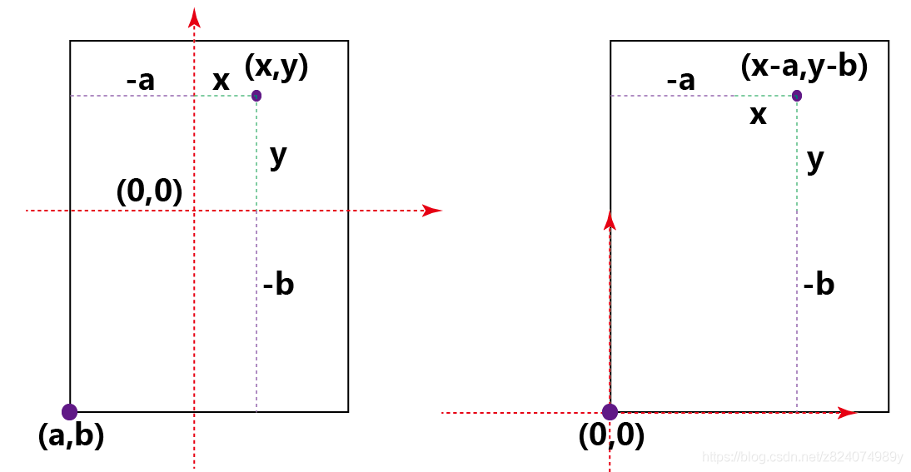
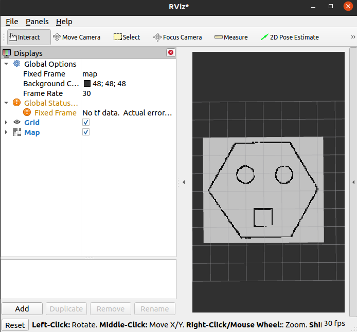
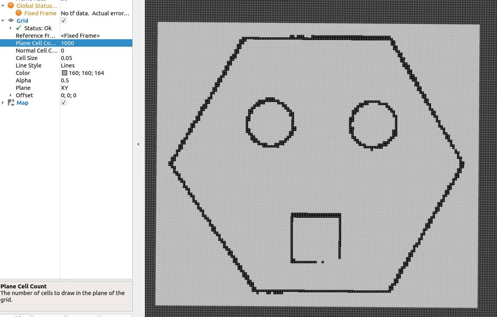
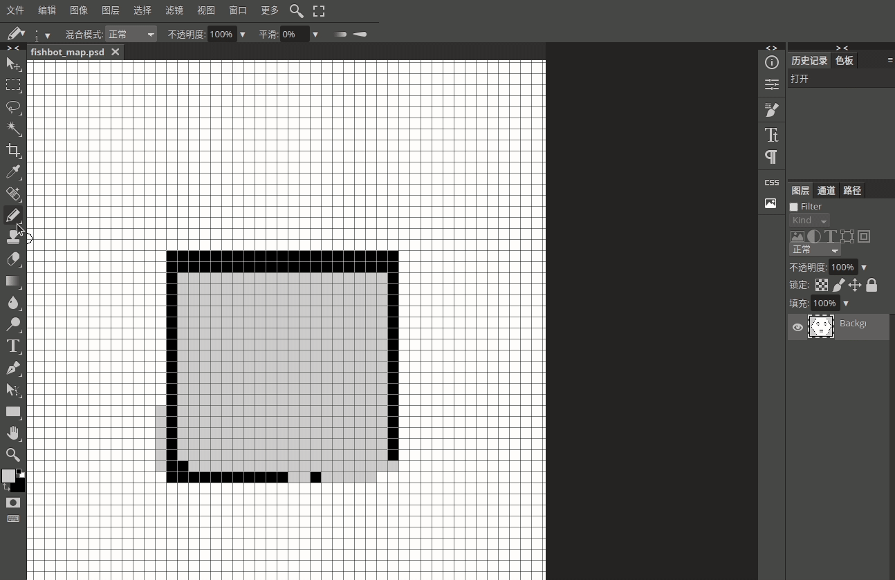

###### datetime:2023/10/10 11:03

###### author:nzb

> 该项目来源于[大佬的动手学ROS2](https://fishros.com/d2lros2)

# 1.地图文件介绍

## 1.地图数据文件.pgm介绍

OccupancyGrid由一个`.yaml格式`的元数据文件，和.pgm图片格式的地图数据文件组成。从上节课建图后保存的文件也可以看出。

```
.
├── fishbot_map.pgm
└── fishbot_map.yaml

0 directories, 2 files
```


打开上节课建好的地图，观察下，你应该会有几点疑问：

1. 不是说占据栅格地图每个栅格都有一个概率吗？为什么看不出来？
2. 立方体内和圆柱体内和墙之外的区域为什么是灰色的？

原因如下：

1. 一个栅格对应到图片上其实是一个像素，每一个像素的值在0-255之间，所以将像素值和占据率之间的映射即可，而像素值反应到图像上就是颜色的深浅，1.2图对应的像素颜色如下：


2. 建图的时候物体内和墙之外的区域机器人并没有探索到，没有数据参考就认为其值是未知的。

## 2.地图描述文件.yaml介绍

除了`fishbot_map.pgm`文件外，还有另外一个`fishbot_map.yaml`的文件，`fishbot_map.yaml`文件是地图的配置文件，该文件内容如下：

```yaml
image: fishbot_map.pgm
mode: trinary
resolution: 0.05
origin: [ -3.37, -2.88, 0 ]
negate: 0
occupied_thresh: 0.65
free_thresh: 0.25
```

- image：图像名称

- mode：图像模式，默认为trinary(三进制)，还有另外两个可选项scale(缩放的)和raw(原本的值)。

- resolution：分辨率，一个栅格对应的物理尺寸，单位为m。0.05则表示一个栅格为0.05m

- origin：地图原点位置，单位是m。


- negate：是否反转图像

- cooupied_thresh：占据阈值

- free_thresh：空闲阈值

#### 如何在地图上找出机器人原点的像素位置？

1. 图像的像素原点在左下角

2. 借张图左边的`0,0`是地图原点，右边的图`0,0`是图像的像素原点

   

3. 假如机器人地图原点是[-3.37m, -2.88m]，除上分辨率则可得到像素原点[-67.4px,-57.6px]。`地图原点`在x和y轴分别偏移[-67.4px,-57.6px]
   就到了像素原点，反过来说，地图原点就在像素原点的[67.4px,57.6px]处。

4. 转换公式

- **像素点转地图点：地图点 = 地图原点 + (像素点 * 分辨率)**
- **地图点转像素点：像素点= (地图点 - 地图原点) / 分辨率**

## 3.地图加载

### 3.1 启动地图

了解完地图的格式和描述文件，接着我们看看如何将地图加载到rviz2中进行显示。我们使用nav2_map_server进行地图的保存，也可以使用它来加载地图。

打开终端，进入`src/map/`运行下面指令：

```shell
#启动cartographer
ros2 launch fishbot_cartographer cartographer.launch.py 
# 启动地图
ros2 run nav2_map_server map_server --ros-args --param yaml_filename:=fishbot_map.yaml
```

其中`--ros-args --param yaml_filename:=fishbot_map.yaml`指定地图描述文件名称`.fishbot_map.yaml`。

### 3.2 打开rviz2

打开终端

```
rviz2
```

通过`add->bytopic->选择map组件`。此时你应该什么都看不到，没关系，这是正常的。

### 3.3 配置并激活map_server

`map_server`节点采用的是ROS2的生命周期进行编写的，除了启动节点，我们还需要手动的配置和激活节点才能使用。

打开新的终端，使用下面指令进行配置：

```
ros2 lifecycle set /map_server configure
```

使用下面的指令进行激活：

```
ros2 lifecycle set /map_server activate
```

完成这一步，你应该就可以在`rviz2`中看到地图了。



将栅格数量改大，然后将Grid的cellsize改成0.05,你就可以看到我们之间建立的地图每一个栅格的占据情况了。



> 生命周期节点转换图如下：
>
> 

## 4.地图编辑

最后我们来说一下如何对地图进行编辑，地图编辑的方法有很多，你可以手动改图片，也可以通过opencv等图像处理库进行图像的去除噪点等操作。

这里介绍的是手动添加一个地图用PS进行编辑 。

打开网址：https://www.gaituya.com/ps/

接着点击文件打开选择我们的.pgm文件，即可看到下图。


接着将下面的正方形给补上。



保存后在文件选择导出为`png`格式即可，因为PS并不支持`pgm`格式的导出，所以我们选择`png`格式，幸运的是`png`格式的地图也是被map_server所支持的。

把导出的图片放到map文件夹下，接着我们需要修改下yaml配置文件中图片的后缀。

```
image: fishbot_map.png
mode: trinary
resolution: 0.05
origin: [-3.37, -2.88, 0]
negate: 0
occupied_thresh: 0.65
free_thresh: 0.25
```

接着你可以重新运行下map_server（记得先关闭rviz2），然后看一下map是否发生了改变。

## 5. 总结

本节我们主要学习了地图的相关概念以及加载和编辑的方式，下一节我们就开始正式学习Nav2导航框架。

参考文章：

- https://zhuanlan.zhihu.com/p/21738718

--------------