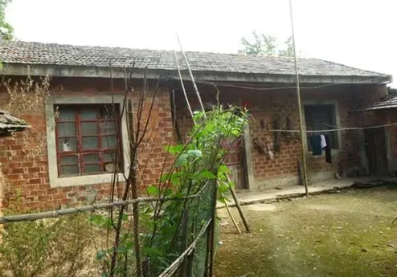
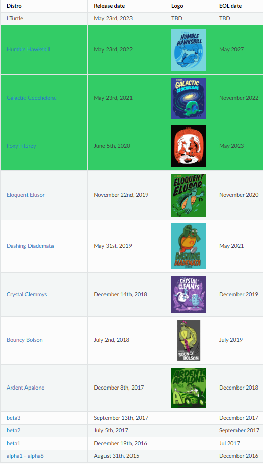
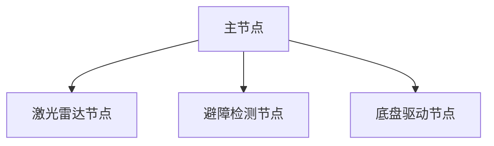

###### datetime:2023/09/11 14:16

###### author:nzb

> 该项目来源于[大佬小鱼的动手学ROS2](https://fishros.com/d2lros2)
> 
> [ros2 examples](https://github.com/ros2/examples)

# 1 ROS2的前世今生

要说ROS2，那就不得不提起ROS，ROS就是传说中的机器人操作系统，英文全称（Robot Operating System），但ROS本身并不是一个操作系统，而是可以安装在现在已有的操作系统上（Linux、Windows、Mac）上的**
软件库和工具集**。

ROS出生于2007年，ROS的出现解决了机器人各个组件之间的通信问题，同时基于ROS的完善的通信机制，越来越多的优秀的机器人算法集成到了ROS中来。

现在的ROS功能已经变得非常的丰富和强大。但随着对ROS功能上要求越来越多，一些原始的架构和设计不能够满足目前的使用需求，这也是ROS2出现的原因。

ROS2继承了ROS原有的优秀之处，同时又带来了很多新的功能,ROS2相对于ROS更加的强大。

## 1.1.ROS为什么会出现？

> ROS的设计目的是：简化在各种机器人平台上创建复杂而强大的机器人行为的任务即不重复造轮子

在ROS没有出现之前，做一个机器人是非常复杂的一件事情，因为一个机器人需要涉及到多个部分，而且这些部分之间还要进行通信。

例如设计一个像下图一样的轮式移动机器人，我们对其进行拆解。可以分为**感知、决策、控制**三个部分。

- **感知部分**有：激光雷达、深度相机、IMU、里程计、碰撞感知、建图
- **决策部分**有：路径规划（navigation）算法、定位算法
- **控制部分**有：轮子驱动

机器人复杂之处就在于此，如果想要整个机器人可以跑起来，那么必须要有一个东西将上面的几个部分合理的连接到一起，这个东西就是ROS。

ROS的作用就像我们的身体的神经系统一样，通过神经系统将我们身体的各个部分接入大脑。

## 1.2.有了ROS1为什么还要ROS2？

讲个故事，小鱼小时候，鱼爸鱼妈决定给小鱼盖一个新房，留着将来取媳妇，当时盖房子还不用钢筋混凝土，也没有啥设计图，一砖一瓦加上木制大梁就盖好了。盖好房子一家人开心的住了进去之后才发现没有建厕所，后来只能把杂物室给拆出来一空间建了厕所。

若干年后，小鱼出息了年薪百万，自然要过无比奢华糜烂的生活，什么样的生活才算无比奢华糜烂？

肯定要有一个全自动洗衣机，于是小鱼决定给家里买个洗衣机，某东上买好送到家，安装师傅一到小鱼家，人给整蒙了，连个下水道都没有。师傅说小鱼必须要先装个下水道，小鱼想了一下这咋办，盖房子时根本没想到会用洗衣机。

与其重新挖个下水道，不如直接盖个大楼房，请个专业设计师，用上最新最好的的材料，给邻居看看啥叫`壕无鱼性`

小鱼的故事讲完啦，接着说说ROS和ROS2，2007年ROS开发人员设计和制作ROS时，当时只想着**简化机器人的开发**
，并没有想到过今天那么多的功能需求，比如商业化要求的稳定性、生命周期管理、多机协同、数据加密等。就像小鱼建房子时没想要未来会用全自动洗衣机一样~

ROS发展的后面的几年里，机器人对ROS的功能要求越来越多，ROS开发人员只能在原有的ROS上修修补补。

随着ROS不断的添加新功能，ROS变得越来越臃肿，祖传代码也越来越多。ROS开发人员发现在原有的ROS架构上修修补补十分消耗头发，于是像决定把房子推倒重建一样，ROS官方也重新设计制作了ROS2。

## 1.3.ROS2介绍

ROS2是在ROS的基础上设计开发的第二代机器人操作系统，可以帮助我们简化机器人开发任务，加速机器人落地的**软件库和工具集**。

### 1.3.1 ROS2很年轻吗

答案并不是，ROS2第一个`alpha1 - alpha8`版本从2015年8月31号就开始了，截至到目前（2021年7月）已经发布了12个版本（9个已经不再更新），所以ROS2并不年轻。

### 1.3.2 ROS2版本对照表

**参考资料：**

- ROS2官方更新计划：http://docs.ros.org/en/humble/Releases.html

--------------

# 2 ROS与ROS2对比

## 2.1.ROS问题举例

上节课说到ROS的设计目标是简化机器人的开发，如何简化呢？ROS为此设计了一整套通信机制（话题、服务、参数、动作）。

通过这些通信机制，ROS实现了将机器人的各个组件给的连接起来，在设计这套通信机制的时候就设计了一个叫做`Ros Master`的东西，所有节点（可以理解为某一个组件，比如：激光雷达）的通信建立必须经过这个主节点。

这种组合结构图如下：

一旦`Ros Master`主节点挂掉后，就会**造成整个系统通信的异常**,此时避障策略将会失效，如果机器人正在运行，碰到障碍物会径直装上去，机毁人亡！

> ROS的不稳定这个问题在虽然对大家做机器人研究问题不大，但如果是想基于ROS做商业化机器人（比如无人驾驶汽车），就会造成非常严重的后果

除了不稳定这个问题，ROS还有很多其他地方存在着问题：

- 通信基于TCP实现，实时性差、系统开销大
- 对Python3支持不友好，需要重新编译
- 消息机制不兼容
- 没有加密机制、安全性不高

## 2.2.ROS与ROS2架构对比？

所以在ROS2中，首当其冲的将ROS的主节点干掉了，这里放一张网上流传最广的ROS/ROS2架构图，接下来就会按照这篇架构图给大家讲解。

> 该图出自论文：`Exploring the Performance of ROS2`，论文在线阅读地址：https://www.researchgate.net/profile/Takuya-Azumi/publication/309128426_Exploring_the_performance_of_ROS2/links/5c908801299bf14e7e84ce61/Exploring-the-performance-of-ROS2.pdf

给大家讲解下这张图，我们从下往上看。

### 2.2.1 OS层

从原来的只支持linux平台变成了支持windows、mac甚至是嵌入式RTOS平台，这一点要点个赞。

### 2.2.2 MiddleWare中间件层

> 如果大家觉得中间件太玄乎可以点击小鱼的文章链接：[扩展阅读1-ROS2和ROS最大的区别中间件到底有什么不一样？](https://zhuanlan.zhihu.com/p/390607053)
>
> 下一节的扩展阅读讲了ROS的中心化特性： [扩展阅读2-ROS镇长与艳娘传奇](https://zhuanlan.zhihu.com/p/423581390)

那么中间层ROS2到底相对于ROS做了哪些优化呢？

1. **去中心化master**，ROS和ROS2中间件不同之处在于，ROS2取消了master节点。

   去中心化后，各个节点之间可以通过DDS的节点相互发现，各个节点都是平等的，且可以1对1、1对n、n对n进行互相通信。

2. **不造通信的轮子**，通信直接更换为DDS进行实现

   采用DDS通信，使得ROS2的实时性、可靠性和连续性上都有了增强。

### 2.2.3 应用层

对于应用层来说ROS2也做了很大的改进，上面那张图没有体现出来。

ROS2进行改进有：

1. Python2到Python3的支持
2. 编译系统的改进（catkin到ament）
3. C++标准更新到c++11
4. 可以使用相同 API 的进程间和进程内通信

## 2.3 ROS2新概念例举

- 可用Python编写的Launch文件
- 多机器人协同通信支持
- 支持安全加密通信
- 同一个进程支持多个节点、
- 支持Qos服务质量
- 支持节点生命周期管理
- 高效的进程间通信

## 2.4 更详细的对比

请看扩展阅读3：[扩展阅读3-ROS2VSROS详细对比](https://zhuanlan.zhihu.com/p/423581728)

--------------
