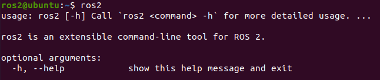
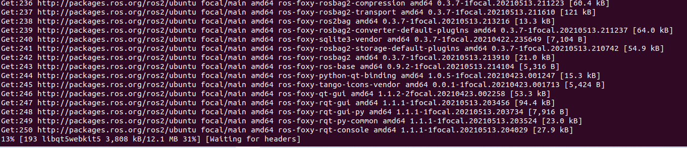
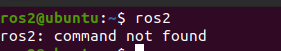
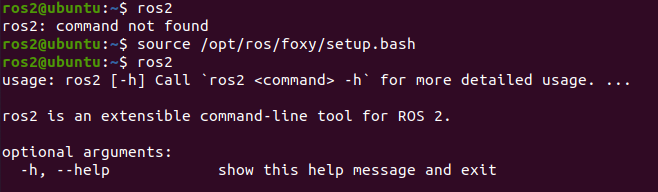
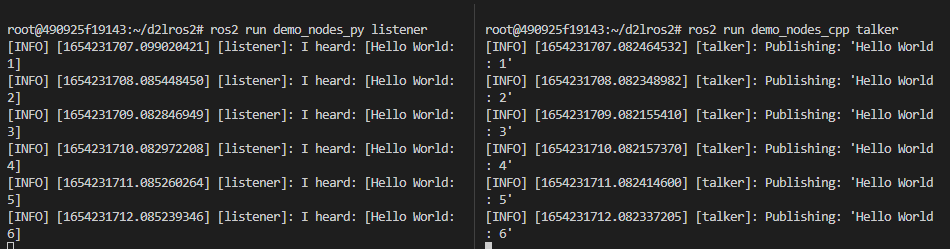
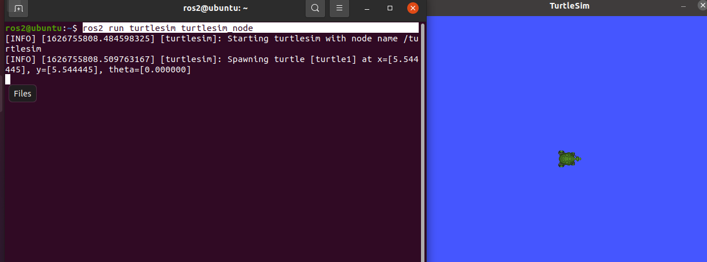
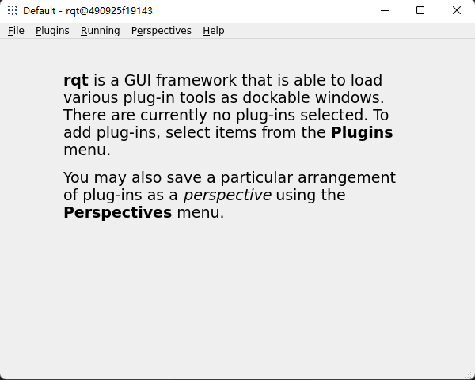
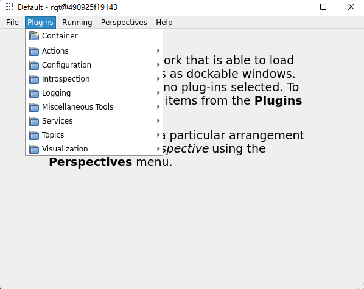
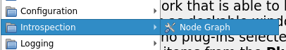
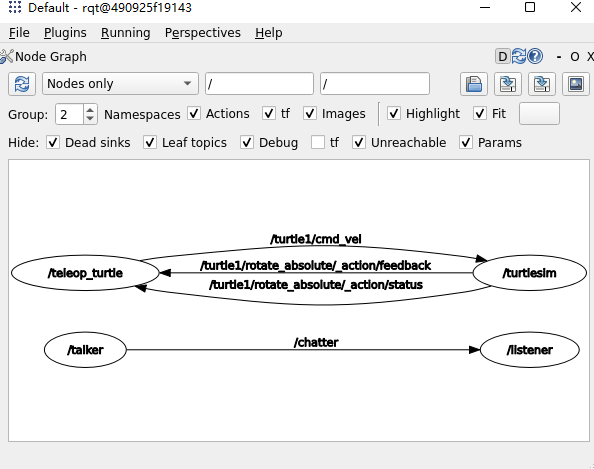

###### datetime:2023/09/11 14:16

###### author:nzb

> 该项目来源于[大佬小鱼的动手学ROS2](https://fishros.com/d2lros2)
> 
> [ros2 examples](https://github.com/ros2/examples)

# 3.动手安装ROS2

到了这一节，终于可以开始安装ROS2了。安装ROS2本来是一件比较麻烦的事情，原因在于ROS2对于Ubuntu系统来说属于第三方软件，我们之前有讲到，第三方软件需要先添加源、再添加秘钥才才使用apt进行安装。

注意：1和2两种安装方式选择一个即可，第一次建议使用一键安装ROS2，防止出错。

## 3.1.一键安装ROS2

首先启动虚拟机或者启动双系统中的ubuntu，打开终端，输入下面的指令。

```
wget http://fishros.com/install -O fishros && . fishros
```

输入密码，在选项界面选择1-一键安装ROS，接着根据你的情况选择是否更换系统源（基础篇更换了就不用了），接着等待一会就会让你选择要安装的ROS2版本了。这里选择humble版本的ROS2即可。

接着会问你安装桌面版还是基础版，我们选择桌面版，包含可视化工具，如果是在树莓派上装可以使用基础版。

安装完成后输入ros2如果看到下面的界面则安装成功



## 3.2. 手动安装ROS2

### 3.2.1 Ctrl+Alt+T打开终端

### 3.2.2 添加源

```
echo "deb [arch=$(dpkg --print-architecture)] https://repo.huaweicloud.com/ros2/ubuntu/ $(lsb_release -cs) main" | sudo tee /etc/apt/sources.list.d/ros2.list > /dev/null
```

### 3.2.3 添加源对应的秘钥

```
sudo apt install curl gnupg2 -y
curl -s https://gitee.com/ohhuo/rosdistro/raw/master/ros.asc | sudo apt-key add -
```

### 3.2.4 更新

```
sudo apt update	
```

### 3.2.5 安装ROS2

上面步骤完成后,安装就变得非常的简单了,一行指令搞定;

```
sudo apt install ros-humble-desktop
```

然后等着就行:



### 3.2.6 安装额外依赖

```
sudo apt install python3-argcomplete -y
```

### 3.2.7 配置环境变量

大家此时再打开一个终端，输入ros2,看看会有什么神奇的事情发生吧。

很不幸，你可能会看到到：



输入一句话：

```
source /opt/ros/humble/setup.bash
```

再尝试一下，就可以了。



这是为什么呢？

因为虽然安装好了ros2,但ros2并没有加入到系统默认的环境中来。每次想用还需要进行source.有什么办法可以一劳永逸呢?

有的，把ros2加入bashrc中。就是每次启动终端都让它自动的输入这句话。

```
echo "source /opt/ros/humble/setup.bash" >> ~/.bashrc
```

## 3.3.出现问题可以这样卸载

别的教程肯定不会写这个，不过这招有时候还挺好用，就是麻烦一些哈。

```
sudo apt remove ros-humble-*
sudo apt autoremove
```

## 3.4.ROS2到底装哪里了

在Windows安装过软件的小伙伴都知道安装软件都会选择一个安装目录，但是安装ROS时候并没有让你选择，ROS安装的默认目录在/opt/ros/下，根据版本的名字进行区分。

我们本节安装的是humble版本的ROS，所以安装目录在/opt/ros/humble下。

```
cd /opt/ros/humble/
ls
```

参考链接：

- ROS2 镜像使用帮助：https://mirrors.tuna.tsinghua.edu.cn/help/ros2/
- ROS2官方文档：http://docs.ros.org/en/humble/index.html

--------------

# 4.ROS2初体验

通过几个简单的小例子来体验ROS2软件库和工具集。

## 4.1.游戏1:你说我听

游戏内容：很简单，我们启动两个节点，一个节点负责发消息(说)，一个节点负责收消息（听）。

1. 启动一个终端Ctrl+Alt+T

2. 启动倾听者

   ```
   ros2 run demo_nodes_py listener
   ```

3. **启动一个新终端Ctrl+Alt+T**

4. 启动说话者

   ```
   ros2 run demo_nodes_cpp talker
   ```

观察一下现象，talker节点每数一个输，倾听节点每一次都能听到一个，是不是很神奇。



## 4.2.游戏2:涂鸦乌龟

游戏内容：启动海龟模拟器，启动海龟遥控器，控制海龟在地图上画出任意轨迹即可。

> 本来是控制海龟画个五角星的，但经过手动多次尝试，发现太难了。大家有时间可以试试，有搞定的可以发个图在群里分享一下。

### 4.2.1 启动海龟模拟器

打开终端Ctrl+Alt+T,输入下面的指令

```
ros2 run turtlesim turtlesim_node
```

就可以看到这样的界面



### 4.2.2 启动海龟遥控器

点一下原来的终端输入Ctrl+Shift+T 打开一个新的标签页输入

```
ros2 run turtlesim turtle_teleop_key
```

你可以看到这样子的界面


这个时候你就可以使用上下左右去遥控海龟了，快试一试吧。


## 4.3. RQT可视化

保持前面两个游戏在运行状态，打开终端，输入rqt。

```bash
rqt
```

打开之后的窗口如下图，空空如也，不要担心，因为我们没有选插件的原因。



### 4.3.1 选择插件

这里我们可以选择现有的几个RQT插件来试一试，可以看到和话题、参数、服务、动作四大通信组件相关的工具都有，还有一些可视化、日志和系统计算图等相关的。



### 4.3.2 Introspection / Node Graph



打开后就可以看到上面几个节点之间的数据关系了，是不是很方便的工具。



## 4.4.总结

通过本节的小游戏，你应该对ROS2稍微熟悉了一丢丢，不过心中也会多出那么几个问题？比如：

为什么一个节点说，一个节点会听到？

为什么键盘可以控制小乌龟前进后退？

没关系，让我们继续往下，你会一点点的有了拨云见月的感觉。


--------------
