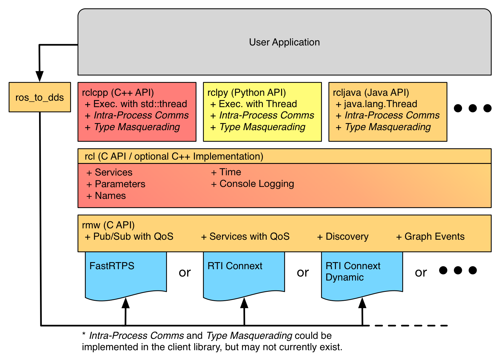
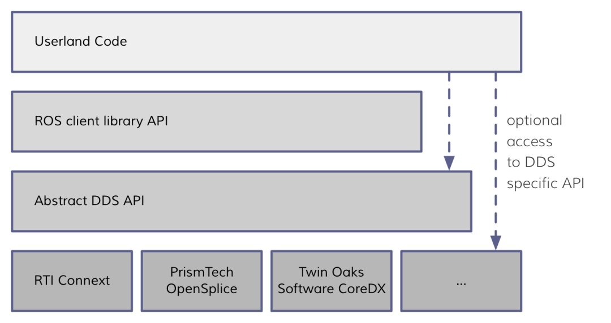
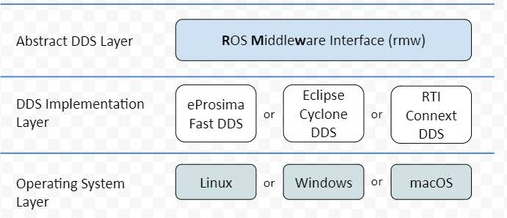
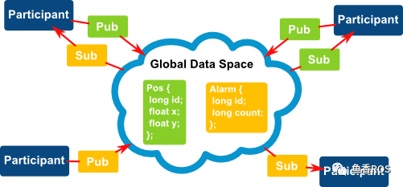
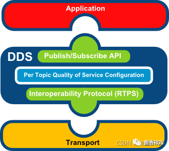

###### datetime:2023/09/11 14:16

###### author:nzb

> 该项目来源于[大佬小鱼的动手学ROS2](https://fishros.com/d2lros2)

# 1.ROS2系统架构

## 1.架构图

## 2.操作系统层

操作系统层比较好理解，ROS2本身就是基于Linux、Windows或者macOS系统建立的，驱动计算机硬件、底层网络通信等实现都是交由操作系统来实现的。

## 3.DDS实现层

要想理解这一层就需要你了解DDS是什么? 以及为什么ROS2框架中会有多个DDS的实现。

### 3.1 DDS是什么？

- [一文读懂“数据分发服务DDS”（Data Distribution Service，RTPS，OMG）_DDS数据分发服务的博客-CSDN博客_corba dds](https://blog.csdn.net/DDS_CSIT/article/details/104607476)

DDS，全称 Data Distribution Service (数据分发服务)。是由对象管理组 (OMG) 于 2003 年发布并于 2007 年修订的开分布式系统标准。

通过类似于ROS中的话题发布和订阅形式来进行通信，同时提供了丰富的服务质量管理来保证可靠性、持久性、传输设置等。

### 3.2 DDS实现层用来做什么

DDS实现层其实就是对不同常见的DDS接口进行再次的封装，让其保持统一性，为DDS抽象层提供统一的API。

## 4. 抽象DDS层-RMW

这一层将DDS实现层进一步的封装，使得DDS更容易使用。原因在于DDS需要大量的设置和配置（分区，主题名称，发现模式，消息创建,...），这些设置都是在ROS2的抽象层中完成的。

## 5.ROS2客户端库 RCL

RCL（ROS Client Library）ROS客户端库，其实就是ROS的一种API，提供了对ROS话题、服务、参数、Action等接口。

> #### GUI和CLI
>
> - GUI（Graphical User Interface）就是平常我们说的图形用户界面，大家用的Windows是就是可视化的，我们可以通过鼠标点击按钮等图形化交互完成任务。
> - CLI（Command-Line Interface）就是命令行界面了，我们所用的终端，黑框框就是命令行界面，没有图形化。
>
> 很久之前电脑还是没有图形化界面的，所有的交互都是通过命令行实现，就学习机器人而言，命令行操作相对于图形化优势更加明显。
>
> #### API是什么
>
> 知道了CUI和CLI是根据是否有图形界面划分的，那API又是什么？
>
> API（ Application Programming Interface）应用程序编程接口。比如你写了一个库，里面有很多函数，如果别人要使用你这个库，但是并不知道每个函数内部是怎么实现的。使用的人需要看你的文档或者注释才知道这个函数的入口参数和返回值或者这个函数是用来做什么的。对于使用者来说来说 ，你的这些函数就是API。（摘自知乎）
>
> API在不同语言中的表现形式不同，在C和C++表现为头文件，在Python中表现为Python文件。

### 5.1 ROS2客户端库

ROS的客户端库就是上面所说的RCL，不同的语言对应着不同的rcl，但基本功能都是相同的。

比如Python语言提供了rclpy来操作ROS2的节点话题服务等，而C++则使用rclcpp提供API操作ROS2的节点话题和服务等。

所以后面我们使用Python和C++来编写ROS2节点实现通讯等功能时，我们就会引入rclpy和rclcpp的库。

上面这张图时ROS2，API的实现层级，最新下面的是第三方的DDS，rmw（中间件接口）层是对各家DDS的抽象层，基于rmw实现了rclc，有了rclc，我们就可以实现各个语言的库，大家都知道C语言是各个语言的鼻祖（汇编除外）所以基于rclc，ROS2官方实现了rclpy和rclcpp.

基于rclpy和rclcpp我们就可以实现上层的应用了，这张ros2的内部api架构图也算大概说清楚了。

有的同学可能还想着既然基于rclc可以实现多个语言的ROS2的库那rcljava有没有,有的: [java](https://github.com/esteve/ros2_java) ,还有很多，这里搜集放一下,说不定大家以后会用得到，比如在AndroidAPP上或者在Web上开发可以使用rcljava或rclnodejs。

| 语言              | 地址                                           |
| ----------------- | ---------------------------------------------- |
| python-rclpython  | https://github.com/ros2/rclpy                  |
| c++ - rclcpp      | https://github.com/ros2/rclcpp                 |
| java-rcljava      | https://github.com/esteve/ros2_java            |
| rust-rclrust      | https://github.com/ros2-rust/ros2_rust         |
| node.js-rclnodejs | https://github.com/RobotWebTools/rclnodejs     |
| go-rclgo          | https://github.com/juaruipav/rclgo             |
| lua-rcllua        | https://github.com/jbbjarnason/rcllua          |
| kotlin-rclkin     | https://github.com/ros2java-alfred/ros2_kotlin |
| swift-rclswift    | https://github.com/atyshka/ros2_swift          |
| c#-rclcs          | https://github.com/RobotecAI/ros2cs            |

## 6.应用层

应用层就是我们写代码以及ROS2开发的各种常用的机器人相关开发工具所在的层了。后面我们写的所有代码其实都是属于这一层的。

--------------

# 2.ROS2中间件DDS架构

本文主要带你了解DDS是什么、ROS2使用DDS所带来的优缺点，以及ROS2为了让DDS在机器人开发上变得简单做了哪些努力。

## 1. 中间件

### 1.1 中间件是什么

**顾名思义**

中间件就是**介于某两个或者多个节点中间的组件**。干嘛用的呢？

就是**提供多个节点中间通信**用的。

官方解释就比较玄乎了：

> 中间件是一种独立的系统软件或服务程序，分布式应用软件借助这种软件在不同的技术之间共享资源。中间件位于客户机/ 服务器的操作系统之上，管理计算机资源和网络通讯。是连接两个独立应用程序或独立系统的软件。相连接的系统，即使它们具有不同的接口，但通过中间件相互之间仍能交换信息。执行中间件的一个关键途径是信息传递。通过中间件，应用程序可以工作于多平台或OS环境。

### 1.2 ROS中间件VS ROS2中间件

话不多说先上图

#### 1.2.1 ROS1中间件

ROS1的中间件是ROS组织自己基于TCP/UDP机制建立的，为了维护该部分ROS1组织花费了大量的精力，但是依然存在很多问题。

#### 1.2.2 ROS2中间件

ROS2采用了第三方的DDS作为中间件，将DDS服务接口进行了一层抽象，保证了上层应用层调用接口的统一性。

基于DDS的互相发现协议，ROS2终于干掉了ROS1中的Master节点。

## 2. DDS和ROS2架构

ROS2为每家DDS供应商都开发了对应的DDS_Interface即DDS接口层，然后通过DDS Abstract抽象层来统一DDS的API。

ROS2架构中的DDS部分

## 3. DDS 通信模型

DDS的模型是非常容易理解，我们可以定义话题的数据结构（类似于ROS2中的接口类型）。下图中的例子:

- Pos：一个编号id的车子的位置x,y

DDS的参与者(Participant)通过发布和订阅主题数据进行通信。

DDS的应用层通过DDS进行数据订阅发布，DDS通过传输层进行数据的收发。

## 4. DDS的优势与劣势

### 4.1 优势

- 发布/订阅模型：简单解耦，可以轻松实现系统解耦
- 性能：在发布/订阅模式中，与请求/回复模式相比，延迟更低，吞吐量更高。
- 远程参与者的自动发现：此机制是 DDS 的主要功能之一。通信是匿名的、解耦的，开发者不必担心远程参与者的本地化。
- 丰富的 Qos 参数集，允许调整通信的各个方面：可靠性、持久性、冗余、寿命、传输设置、资源......
- 实时发布订阅协议 ( RTPS )：该协议几乎可以通过任何传输实现，允许在 UDP、TCP、共享内存和用户传输中使用 DDS，并实现不同 DDS 实现之间的真正互操作性。

### 4.2 劣势

-  API复杂，DDS 的灵活性是以复杂性为代价的。
-  系统开销相对较大，小鱼实际体会，待数据论证。
-  社区支持问题，但ROS2近两年来使用DDS后社区表现还是不错的。

### 5. ROS2使用DDS的几个理由

- DDS已经应用在军事、潜艇各个领域，稳定性实时性经过实际检验。
- 使用DDS需要维护的代码要少得多，可以让ROS2开发人员腾出手专注机器人开发。
- DDS有定义好的行为和规范并且有完善的文档。
- DDS提供了推荐的用例和软件API，有较好的语言支持。
