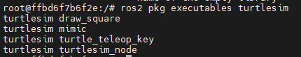
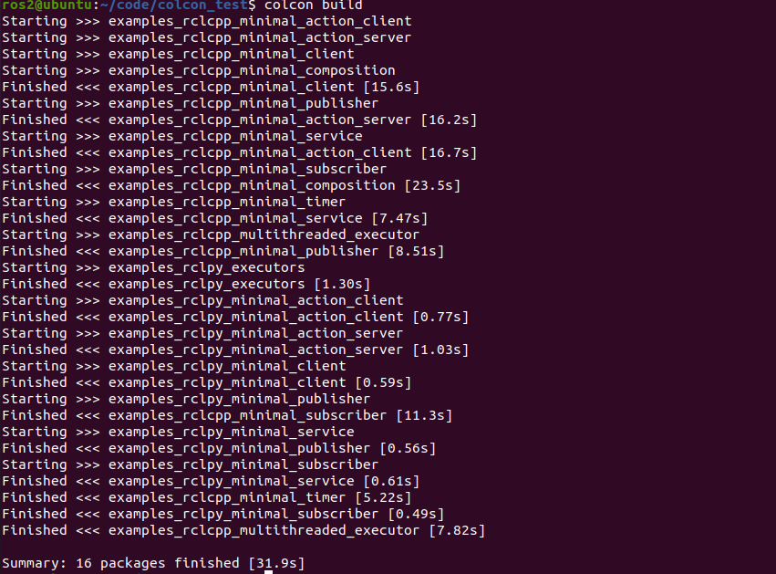
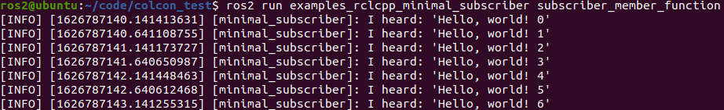

###### datetime:2023/09/12 14:16

###### author:nzb

> 该项目来源于[大佬的动手学ROS2](https://fishros.com/d2lros2)
> 
> [ros2 examples](https://github.com/ros2/examples)

# 1.ROS2节点介绍

## 1. ROS2节点是什么

ROS2中每一个节点也是只负责一个单独的模块化的功能（比如一个节点负责控制车轮转动，一个节点负责从激光雷达获取数据、一个节点负责处理激光雷达的数据、一个节点负责定位等等）


## 2.节点之间如何交互？

上面举了一个激光雷达的例子，一个节点负责获取激光雷达的扫描数据，一个节点负责处理激光雷达数据，比如去除噪点。

那节点与节点之间就必须要通信了，那他们之间该如何通信呢？ROS2早已为你准备好了一共四种通信方式:

- 话题-topics
- 服务-services
- 动作-Action
- 参数-parameters

这四种种通信方式的用途和使用方法，放到了第四和第五章来介绍，到时候同时会带大家手撸代码。

官方给了一张图，大家先大概看一下，帮助理解

## 3. 如何启动一个节点？

知道了节点的概念之后，我们该如何启动一个节点呢？

因为工作空间和包的概念，放到了下一讲，这里跟着一起运行一个节点，感受一下。

使用指令：

```
ros2 run <package_name> <executable_name>
```

指令意义：启动 <package_name>包下的 <executable_name>中的节点。

**使用样例：**

```
ros2 run turtlesim turtlesim_node
```

大家可以尝试一下上面的指令，就是我们在第一章中启动小乌龟模拟器的那条指令。

运行之后可以看到一只小乌龟，接下来就可以试试下一节中提到的几个指令来查看节点信息和列表。

## 4. 通过命令行界面查看节点信息

### 4.1 ROS2命令行

ROS2的CLI，就是和ROS2相关的命令行操作。什么是命令行界面呢？这里再讲解一个概念，CLI（Command-Line Interface）和GUI（Graphical User Interface）

- GUI（Graphical User Interface）就是平常我们说的图形用户界面，大家用的Windows是就是可视化的，我们可以通过鼠标点击按钮等图形化交互完成任务。
- CLI（Command-Line Interface）就是命令行界面了，我们所用的终端，黑框框就是命令行界面，没有图形化。

很久之前电脑还是没有图形化界面的，所有的交互都是通过命令行实现，就学习机器人而言，命令行操作相对于图形化优势更加明显。

ROS2为我们提供了一系列指令，通过这些指令，可以实现对ROS2相关模块信息的获取设置等操作。

### 4.2 节点相关的CLI

运行节点(常用)

```
ros2 run <package_name> <executable_name>
```

查看节点列表(常用)：

```
ros2 node list
```

查看节点信息(常用)：

```
ros2 node info <node_name>
```

重映射节点名称

```
ros2 run turtlesim turtlesim_node --ros-args --remap __node:=my_turtle
```

运行节点时设置参数

```
ros2 run example_parameters_rclcpp parameters_basic --ros-args -p rcl_log_level:=10
```

## 5.总结

- ROS2命令行工具源码;[ros2/ros2cli: ROS 2 command line interface tools (github.com)](https://github.com/ros2/ros2cli)

--------------

# 2.ROS2工作空间

运行一个节点的时候使用的是

```
ros2 run 包名字 可执行文件名字
```

那你有没有想过，我们想找到一个节点（可执行文件），就必须要先知道它在哪个包，那问题就来了，想要找到某个包，该去哪里找？

**答案就是：工作空间**

> 注意：一个工作空间下可以有多个功能包，一个功能包可以有多个节点存在

## 1. 工作空间

定义：工作空间是包含若干个功能包的目录，一开始大家把工作空间理解成一个文件夹就行了。这个文件夹包含下有`src`。所以一般新建一个工作空间的操作就像下面一样

```shell
cd d2lros2/chapt2/
mkdir -p chapt2_ws/src
```

是不是觉得就像创建一个目录（其实就是创建一个目录）

## 2.功能包是什么

功能包可以理解为存放节点的地方，ROS2中功能包根据编译方式的不同分为三种类型。

- ament_python，适用于python程序
- cmake，适用于C++
- ament_cmake，适用于C++程序,是cmake的增强版

## 3.功能包获取的两种方式

### 3.1 安装获取

安装一般使用

```
sudo apt install ros-<version>-package_name
```

安装获取会自动放置到系统目录，不用再次手动source。

### 3.2 手动编译获取

手动编译相对麻烦一些，需要下载源码然后进行编译生成相关文件。

> 什么时候需要手动编译呢?一般我们能安装的功能包都是作者编译好程序将可执行文件上传到仓库中，然后我们才能够通过apt进行安装，如果作者还没来得及测试上传，或者忘记了测试上传，就会找不到对应的包，这时候就需要手动编译安装了。
>
> 另外一种就是我们需要对包的源码进行修改，这个时候也需要自己编译修改。

手动编译之后，需要手动source工作空间的install目录。

下一节学习完编译器colcon会通过实例带大家一起下载编译安装功能包~

## 4.与功能包相关的指令 ros2 pkg

```
create       Create a new ROS2 package
executables  Output a list of package specific executables
list         Output a list of available packages
prefix       Output the prefix path of a package
xml          Output the XML of the package manifest or a specific tag
```

**1.创建功能包**

```
ros2 pkg create <package-name>  --build-type  {cmake,ament_cmake,ament_python}  --dependencies <依赖名字>
```

**2.列出可执行文件**

列出所有

```
ros2 pkg executables
```

列出`turtlesim`功能包的所有可执行文件

```
ros2 pkg executables turtlesim
```



**3.列出所有的包**

```
ros2 pkg list
```

**4.输出某个包所在路径的前缀**

```
ros2 pkg prefix  <package-name>
```

比如小乌龟

```
ros2 pkg prefix turtlesim
```

**5.列出包的清单描述文件**

> 每一个功能包都有一个标配的manifest.xml文件，用于记录这个包的名字，构建工具，编译信息，拥有者，干啥用的等信息。
>
> 通过这个信息，就可以自动为该功能包安装依赖，构建时确定编译顺序等

查看小乌龟模拟器功能包的信息。

```
ros2 pkg xml turtlesim 
```

## 5.总结

介绍完工作空间和功能包，接下来就可以讲讲ROS2的编译工具colcon，下一讲我们就开始对代码动手了~


--------------

# 3. ROS2构建工具—Colcon

本节会从下面几个方面来介绍：

1. Colcon是个啥
2. 安装colcon
3. 编个东西测试一下
4. 运行一个自己编的节点
5. colcon学习总结指令

## 1.Colcon是个啥

colcon其实是一个功能包构建工具，这个工具用来做什么的呢？

简单点说就是用来编译代码的，上几节跟大家讲了如何进行ROS2工作空间的创建，但没有说如何进行编译，其实就是用colcon。

ROS2默认是没有安装colcon的，所以就从如何安装colcon开始跟大家讲解colcon的使用方法。

> colcon想当于ros1中的catkin工具，学过ros1的同学可以辅助理解。没学过也没关系，用多了自然也就懂了。

## 2.安装colcon

如果使用一键安装ROS2，会帮你安装好这个工具，以防万一我们再装一次，打开终端复制粘贴进去即可。

```
sudo apt-get install python3-colcon-common-extensions
```

安装完成后，打开终端输入`colcon`即可看到其使用方法。

## 3. 编个东西测试一下

1. 创建一个工作区文件夹`colcon_test_ws`

   ```
   cd d2lros2/chapt2/
   mkdir colcon_test_ws && cd colcon_test_ws
   ```

2. 下载个ROS2示例源码测试一下

   ```
   git clone https://github.com/ros2/examples src/examples -b humble
   ```

3. 编译工程

   ```
   colcon build
   ```

   

   > 如果在编译中遇到`Setuptools DeprecationWarning: setup.py install is deprecated.`这个警告，可以通过更新setuptools解决。
   >
   > 详细操作见社区帖子：https://fishros.org.cn/forum/topic/254/

4. 编完之后的目录结构

   构建完成后，在`src`同级目录我们应该会看到 `build` 、 `install` 和 `log` 目录:

   ```
   .
   ├── build
   ├── install
   ├── log
   └── src
   
   4 directories, 0 files
   ```

    - `build` 目录存储的是中间文件。对于每个包，将创建一个子文件夹，在其中调用例如CMake
    - `install` 目录是每个软件包将安装到的位置。默认情况下，每个包都将安装到单独的子目录中。
    - `log` 目录包含有关每个colcon调用的各种日志信息。

## 4.运行一个自己编的节点

1. 打开一个终端使用 cd colcon_test_ws进入我们刚刚创建的工作空间，先source 一下资源

   ```
   source install/setup.bash
   ```

2. 运行一个订者节点，你将看不到任何打印，因为没有发布者

   ```
   ros2 run examples_rclcpp_minimal_subscriber subscriber_member_function
   ```

3. 打开一个新的终端，先source，再运行一个发行者节点

   ```
   source install/setup.bash
   ros2 run examples_rclcpp_minimal_publisher publisher_member_function
   ```

   

## 5.本节学习指令

> 这个要特别说一下，因为ros2的build没有ros中的devel概念了，如果想达到devel目录那样的效果，就需要加这个参数。没有学过ros的请主动忽略这句话。

### 5.1 只编译一个包

```
colcon build --packages-select YOUR_PKG_NAME 
```

### 5.2 不编译测试单元

```
colcon build --packages-select YOUR_PKG_NAME  --cmake-args -DBUILD_TESTING=0
```

### 5.3 运行编译的包的测试

```
colcon test
```

### 5.4 允许通过更改src下的部分文件来改变install（重要）

每次调整 python 脚本时都不必重新build了

```
colcon build --symlink-install
```

参考资料:

- [colcon官方文档](https://colcon.readthedocs.io/en/released/user/installation.html)
- [ROS2官网文档](https://docs.ros.org/en/foxy/Tutorials/Colcon-Tutorial.html)

--------------