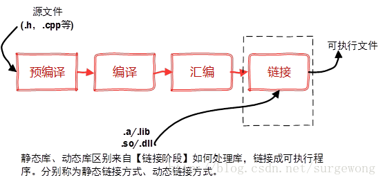
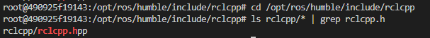
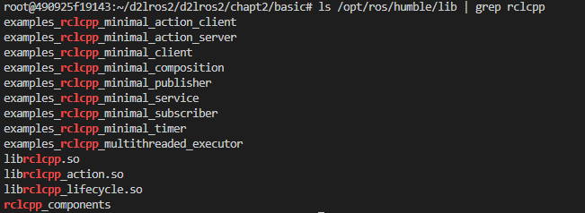
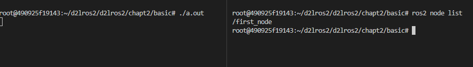
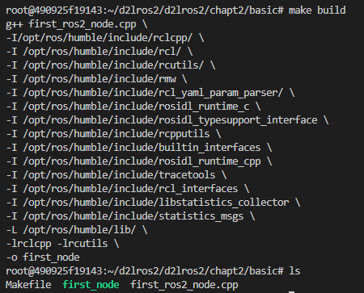
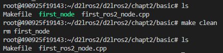
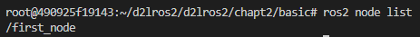
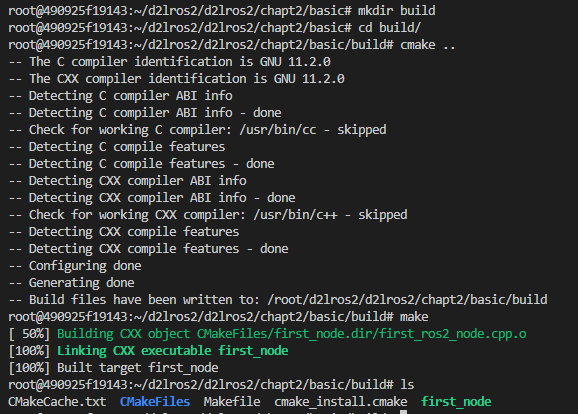
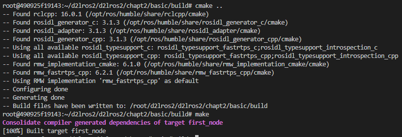

###### datetime:2023/09/12 14:16

###### author:nzb

> 该项目来源于[大佬小鱼的动手学ROS2](https://fishros.com/d2lros2)
> 
> [ros2 examples](https://github.com/ros2/examples)

# 1.使用g++编译ROS2节点

## 1.动态链接库

### 动态链接库介绍

> 引用文章：
>
> - [gcc/g++ 链接库的编译与链接_surgewong的博客-CSDN博客_g++ 使用动态库](https://blog.csdn.net/surgewong/article/details/39236707)

程序编译一般需要经预处理、编译、汇编和链接几个步骤。在实际应用中，有些公共代码需要反复使用，就把这些代码编译成为“库”文件。在链接步骤中，链接器将从库文件取得所需的代码，复制到生成的可执行文件中，这种库称为静态（链接）库，其特点是可执行文件中包含了库代码的一份完整拷贝，缺点是被多次使用就会多份冗余拷贝。还有一种库，就是程序在开始运行后调用库函数时才被载入，这种库独立于现有的程序，其本身不可执行，但包含着程序需要调用的一些函数，这种库称为动态（链接）库（Dynamic
Link Library）。



在widows平台下，静态链接库是.lib文件，动态库文件是.dll文件。在linux平台下，静态链接库是.a文件，动态链接库是.so文件。

## 2. 用g++编译ROS2的C++节点

### 2.1 编写节点

编写一个ROS2的C++节点非常简单，只需三行代码即可完成。

打开终端，创建`chapt2/basic`目录，用VSCODE打开d2lros2目录。

```shell
mkdir -p d2lros2/chapt2/basic/
code d2lros2
```

接着在左侧chapt2上新建first_ros2_node.cpp，然后在first_ros2_node.cpp中输入下面的代码。

```c++
// 包含rclcpp头文件，如果Vscode显示红色的波浪线也没关系
// 我们只是把VsCode当记事本而已，谁会在意记事本对代码的看法呢，不是吗？
#include "rclcpp/rclcpp.hpp"

int main(int argc, char **argv)
{
    // 调用rclcpp的初始化函数
    rclcpp::init(argc, argv);
    // 调用rclcpp的循环运行我们创建的first_node节点
    rclcpp::spin(std::make_shared<rclcpp::Node>("first_node"));
    return 0;
}
```

### 2.2 编译

接着我们使用g++来编译`first_ros2_node`节点。正常的话一定会报错。

```
g++ first_ros2_node.cpp 
```

报错内容如下：

```
root@490925f19143:~/d2lros2/d2lros2/chapt2/basic# g++ first_ros2_node.cpp 
first_ros2_node.cpp:3:10: fatal error: rclcpp/rclcpp.hpp: No such file or directory
    3 | #include "rclcpp/rclcpp.hpp"
      |          ^~~~~~~~~~~~~~~~~~~
compilation terminated.
```

一定要记住这个错误` No such file or directory`，这将是你接下来机器人学习工作生涯中最常见的错误之一。

接着来说说错误原因和解决方案。

**原因我们在代码里包含了"rclcpp/rclcpp.hpp"头文件，但是g++找不到这个头文件，解决方法就是告诉g++这个头文件的目录。**

首先我们要找到这个头文件在哪里，这个头文件是ROS2的客户端库，其地址肯定在ROS2的安装目录下，即`/opt/ros/humble/include/rclcpp`。

```
cd /opt/ros/humble/include/rclcpp
ls rclcpp/* | grep rclcpp.h
```

> ls指令列出命令 | grep rclcpp.h 是对列出的结果进行过滤，只显示包含`rclcpp.h`的行。

使用上面的指令，可以看到这个文件确实在这里。



接着我们可以用-I（大写i）来为g++指定这个目录，然后再次运行，你会发现依然报错

```
g++ first_ros2_node.cpp -I /opt/ros/humble/include/rclcpp/ 
```

报错如下

```
root@490925f19143:~/d2lros2/d2lros2/chapt2/basic# g++ first_ros2_node.cpp -I/opt/ros/humble/include/rclcpp/ 
In file included from /opt/ros/humble/include/rclcpp/rclcpp/executors/multi_threaded_executor.hpp:25,
                 from /opt/ros/humble/include/rclcpp/rclcpp/executors.hpp:21,
                 from /opt/ros/humble/include/rclcpp/rclcpp/rclcpp.hpp:155,
                 from first_ros2_node.cpp:3:
/opt/ros/humble/include/rclcpp/rclcpp/executor.hpp:30:10: fatal error: rcl/guard_condition.h: No such file or directory
   30 | #include "rcl/guard_condition.h"
      |          ^~~~~~~~~~~~~~~~~~~~~~~
compilation terminated.
```

虽然错误有些不一样，但是核心的文件都是一样的，你应该都看到了`No such file or directory`
这个问题，并且错误信息还提示你了，在`/opt/ros/humble/include/rclcpp/rclcpp/executors/multi_threaded_executor.hpp:25`
这个位置，包含了`rcl/guard_condition.h`发现找不到这个头文件。

既然错误一样，那么解决方案也是相同的，`rcl/guard_condition.h`所在的路径是` /opt/ros/humble/include/rcl/ `我们再次指定后运行。

```
g++ first_ros2_node.cpp -I /opt/ros/humble/include/rclcpp/ -I /opt/ros/humble/include/rcl/
```

你会发现还是相同错误，因为头文件的包含是类似于套娃形式的，一层层加下去，总有终点，直到最终这个样子

```shell
g++ first_ros2_node.cpp \
-I/opt/ros/humble/include/rclcpp/ \
-I /opt/ros/humble/include/rcl/ \
-I /opt/ros/humble/include/rcutils/ \
-I /opt/ros/humble/include/rmw \
-I /opt/ros/humble/include/rcl_yaml_param_parser/ \
-I /opt/ros/humble/include/rosidl_runtime_c \
-I /opt/ros/humble/include/rosidl_typesupport_interface \
-I /opt/ros/humble/include/rcpputils \
-I /opt/ros/humble/include/builtin_interfaces \
-I /opt/ros/humble/include/rosidl_runtime_cpp \
-I /opt/ros/humble/include/tracetools \
-I /opt/ros/humble/include/rcl_interfaces \
-I /opt/ros/humble/include/libstatistics_collector \
-I /opt/ros/humble/include/statistics_msgs
```

运行完上面这段代码，你会发现报的错误变了。

```
/usr/bin/ld: /tmp/ccoA8hho.o: in function `main':
first_ros2_node.cpp:(.text+0x37): undefined reference to `rcutils_get_default_allocator'
/usr/bin/ld: first_ros2_node.cpp:(.text+0x5c): undefined reference to `rclcpp::InitOptions::InitOptions(rcutils_allocator_s)'
/usr/bin/ld: first_ros2_node.cpp:(.text+0x7d): undefined reference to `rclcpp::init(int, char const* const*, rclcpp::InitOptions const&, rclcpp::SignalHandlerOptions)'
/usr/bin/ld: first_ros2_node.cpp:(.text+0x89): undefined reference to `rclcpp::InitOptions::~InitOptions()'
/usr/bin/ld: first_ros2_node.cpp:(.text+0xb1): undefined reference to `rclcpp::spin(std::shared_ptr<rclcpp::Node>)'
/usr/bin/ld: first_ros2_node.cpp:(.text+0xe9): undefined reference to `rclcpp::InitOptions::~InitOptions()'
/usr/bin/ld: /tmp/ccoA8hho.o: in function `void __gnu_cxx::new_allocator<rclcpp::Node>::construct<rclcpp::Node, char const (&) [11]>(rclcpp::Node*, char const (&) [11])':
first_ros2_node.cpp:(.text._ZN9__gnu_cxx13new_allocatorIN6rclcpp4NodeEE9constructIS2_JRA11_KcEEEvPT_DpOT0_[_ZN9__gnu_cxx13new_allocatorIN6rclcpp4NodeEE9constructIS2_JRA11_KcEEEvPT_DpOT0_]+0x86): undefined reference to `rcutils_get_default_allocator'
/usr/bin/ld: first_ros2_node.cpp:(.text._ZN9__gnu_cxx13new_allocatorIN6rclcpp4NodeEE9constructIS2_JRA11_KcEEEvPT_DpOT0_[_ZN9__gnu_cxx13new_allocatorIN6rclcpp4NodeEE9constructIS2_JRA11_KcEEEvPT_DpOT0_]+0xb7): undefined reference to `rclcpp::NodeOptions::NodeOptions(rcutils_allocator_s)'
/usr/bin/ld: first_ros2_node.cpp:(.text._ZN9__gnu_cxx13new_allocatorIN6rclcpp4NodeEE9constructIS2_JRA11_KcEEEvPT_DpOT0_[_ZN9__gnu_cxx13new_allocatorIN6rclcpp4NodeEE9constructIS2_JRA11_KcEEEvPT_DpOT0_]+0xe7): undefined reference to `rclcpp::Node::Node(std::__cxx11::basic_string<char, std::char_traits<char>, std::allocator<char> > const&, rclcpp::NodeOptions const&)'
collect2: error: ld returned 1 exit status
```

**请记住上面错误中的`undefined reference to xxxxx`，这将是你接下来机器人学习工作生涯中另一个最常见的错误。**

原因在于g++找不到库文件，解决方法就是我们帮助它定位到库文件的位置，并通过-L参数指定库目录，-l（小写L）指定库的名字。

ROS2相关的库的地址都在`/opt/ros/humble/lib`下，你可以使用下面的指定看到rclcpp的动态链接库。

```
ls /opt/ros/humble/lib | grep rclcpp
```



**指定库目录和使用的库后的终极命令**

```shell
g++ first_ros2_node.cpp \
-I/opt/ros/humble/include/rclcpp/ \
-I /opt/ros/humble/include/rcl/ \
-I /opt/ros/humble/include/rcutils/ \
-I /opt/ros/humble/include/rmw \
-I /opt/ros/humble/include/rcl_yaml_param_parser/ \
-I /opt/ros/humble/include/rosidl_runtime_c \
-I /opt/ros/humble/include/rosidl_typesupport_interface \
-I /opt/ros/humble/include/rcpputils \
-I /opt/ros/humble/include/builtin_interfaces \
-I /opt/ros/humble/include/rosidl_runtime_cpp \
-I /opt/ros/humble/include/tracetools \
-I /opt/ros/humble/include/rcl_interfaces \
-I /opt/ros/humble/include/libstatistics_collector \
-I /opt/ros/humble/include/statistics_msgs \
-L /opt/ros/humble/lib/ \
-lrclcpp -lrcutils
```

运行后，你会发现没有任何报错了，但是在当前目录下多出了一个`a.out`，这个就是我们将上面的代码编译和链接完库之后得出的可执行文件。

> 如果你觉得a.out不好听，可以在g++指定后添加 `-o 名字`  ，比如 `-o first_node`

## 3. 运行节点

执行代码

```
./a.out
```

打开新的终端，使用`ros2 node list`查看正在运行的节点，是否有`first_node`。



# 2.使用make编译ROS2节点

有没有觉得用g++编译节点无比的麻烦，的确是这样子，为此先行者们发明了一个叫做make的**批处理**工具，我们可以将g++的指令写成脚本，就可以通过make自动的调用脚本完成操作。

## 1. 安装make

```shell
sudo apt install make
```

## 2. 编写Makefile

在`d2lros2/d2lros2/chapt2/basic`下新建`Makefile`，然后将上面的g++编译指令用下面的形式写到Makefile里。

```makefile
build:
	g++ first_ros2_node.cpp \
	-I/opt/ros/humble/include/rclcpp/ \
	-I /opt/ros/humble/include/rcl/ \
	-I /opt/ros/humble/include/rcutils/ \
	-I /opt/ros/humble/include/rmw \
	-I /opt/ros/humble/include/rcl_yaml_param_parser/ \
	-I /opt/ros/humble/include/rosidl_runtime_c \
	-I /opt/ros/humble/include/rosidl_typesupport_interface \
	-I /opt/ros/humble/include/rcpputils \
	-I /opt/ros/humble/include/builtin_interfaces \
	-I /opt/ros/humble/include/rosidl_runtime_cpp \
	-I /opt/ros/humble/include/tracetools \
	-I /opt/ros/humble/include/rcl_interfaces \
	-I /opt/ros/humble/include/libstatistics_collector \
	-I /opt/ros/humble/include/statistics_msgs \
	-L /opt/ros/humble/lib/ \
	-lrclcpp -lrcutils \
	-o first_node
    
# 顺便加个clean指令，用来删掉first_node
clean:
	rm first_node
```

## 3. 编译

在Makefile同级目录输入

```
make build
```



可以看到make指令调用了脚本里的build下的指令，对代码进行了编译。同级目录下也产生了first_node可执行文件（绿色代表可执行）。

使用`make clean`指令即可删掉`first_node`节点。



## 4. 运行测试

```
./first_node
```

新开终端

```
ros2 node list
```



# 3.使用CMakeLists.txt编译ROS2节点

虽然通过make调用Makefile编译代码非常的方便，但是还是需要我们手写gcc指令来编译，那有没有什么办法可以自动生成Makefile呢？

答案是有的，那就是cmake工具。

**cmake通过调用CMakeLists.txt直接生成Makefile。**

## 1.安装Cmake

```shell
sudo apt install cmake
```

## 2.新建CMakeLists.txt

在`d2lros2/d2lros2/chapt2/basic`新建`CMakeLists.txt`，输入下面内容。

```cmake
cmake_minimum_required(VERSION 3.22)

project(first_node)

#include_directories 添加特定的头文件搜索路径 ，相当于指定g++编译器的-I参数
include_directories(/opt/ros/humble/include/rclcpp/)
include_directories(/opt/ros/humble/include/rcl/)
include_directories(/opt/ros/humble/include/rcutils/)
include_directories(/opt/ros/humble/include/rcl_yaml_param_parser/)
include_directories(/opt/ros/humble/include/rosidl_runtime_c/)
include_directories(/opt/ros/humble/include/rosidl_typesupport_interface/)
include_directories(/opt/ros/humble/include/rcpputils/)
include_directories(/opt/ros/humble/include/builtin_interfaces/)
include_directories(/opt/ros/humble/include/rmw/)
include_directories(/opt/ros/humble/include/rosidl_runtime_cpp/)
include_directories(/opt/ros/humble/include/tracetools/)
include_directories(/opt/ros/humble/include/rcl_interfaces/)
include_directories(/opt/ros/humble/include/libstatistics_collector/)
include_directories(/opt/ros/humble/include/statistics_msgs/)

# link_directories - 向工程添加多个特定的库文件搜索路径，相当于指定g++编译器的-L参数
link_directories(/opt/ros/humble/lib/)

# add_executable - 生成first_node可执行文件
add_executable(first_node first_ros2_node.cpp)

# target_link_libraries - 为first_node(目标) 添加需要动态链接库，相同于指定g++编译器-l参数
# 下面的语句代替 -lrclcpp -lrcutils
target_link_libraries(first_node rclcpp rcutils)
```

## 3.编译代码

我们一般会创建一个新的目录，运行cmake并进行编译，这样的好处是不会显得那么乱。

```shell
mkdir build
cd build
```

创建好文件夹，接着运行cmake指令，`..`代表到上级目录找`CMakeLists.txt`。

```
cmake ..
```

运行完cmake你应该可以在build目录下看到cmake自动生成的Makefile了，接着就可以运行make指令进行编译

```
make
```

运行完上面的指令，就可以在build目录下发现`first_node`节点了。



# 4.CMake依赖查找流程

上面我们用g++、make、cmake三种方式来编译ros2的C++节点。用cmake虽然成功了，但是CMakeLists.txt的内容依然非常的臃肿，我们需要将其进一步的简化。

## 1.优化CMakeList.txt

将上面的CmakLists.txt改成下面的样子

```cmake
cmake_minimum_required(VERSION 3.22)
project(first_node)

find_package(rclcpp REQUIRED)
add_executable(first_node first_ros2_node.cpp)
target_link_libraries(first_node rclcpp::rclcpp)
```

接着继续生成和编译

```
cmake ..
make
```



是不是非常的神奇，为什么可以浓缩成那么短的几句指令呢？

## 2.find_package查找路径

find_package查找路径对应的环境变量如下。

```
<package>_DIR
CMAKE_PREFIX_PATH
CMAKE_FRAMEWORK_PATH
CMAKE_APPBUNDLE_PATH
PATH
```

打开终端，输入指令：

```shell
echo $PATH
```

结果

```
PATH=/opt/ros/humble/bin:/usr/local/sbin:/usr/local/bin:/usr/sbin:/usr/bin:/sbin:/bin
```

观察PATH变量，你会发现`/opt/ros/humble/bin`赫然在其中，`PATH`中的路径如果以`bin`或`sbin`结尾，则自动回退到上一级目录，接着检查这些目录下的

```text
<prefix>/(lib/<arch>|lib|share)/cmake/<name>*/          (U)
<prefix>/(lib/<arch>|lib|share)/<name>*/                (U)
<prefix>/(lib/<arch>|lib|share)/<name>*/(cmake|CMake)/  (U)
```

cmake找到这些目录后，会开始依次找`<package>Config.cmake`或`Find<package>.cmake`文件。找到后即可执行该文件并生成相关链接信息。

打开`/opt/ros/humble/share/rclcpp/cmake`你会发现`rclcppConfig.cmake`就在其中。

## 3.总结

本节通过多种方式进行节点的编译，主要是让你了解C++编译工具cmake以及其路径查找规则，以后在学习生涯中再遇到`undefined reference to xxxxx`和` No such file or directory`
就再也不用慌张了。


--------------