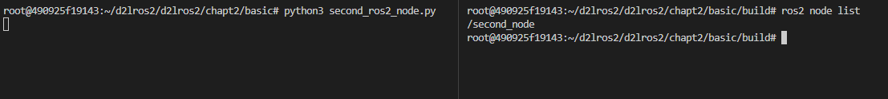

###### datetime:2023/09/12 14:16

###### author:nzb

> 该项目来源于[大佬小鱼的动手学ROS2](https://fishros.com/d2lros2)
> 
> [ros2 examples](https://github.com/ros2/examples)

# 5.Python依赖查找流程

python的打包和引入依赖的方式相比C++要容易太多。本节通过几个实例学习下Python的路径查找机制。

## 1.编写ROS2的Python节点

在`d2lros2/d2lros2/chapt2/basic`新建`second_ros2_node.py`，输入下面的内容

```python
# 导入rclpy库，如果Vscode显示红色的波浪线也没关系
# 我们只是把VsCode当记事本而已，谁会在意记事本对代码的看法呢，不是吗？
import rclpy
from rclpy.node import Node
# 调用rclcpp的初始化函数
rclpy.init() 
# 调用rclcpp的循环运行我们创建的second_node节点
rclpy.spin(Node("second_node"))
```

## 2.运行Python节点

打开终端，输入指令

```
ls
python3 second_ros2_node.py
```

打开新的终端，输入

```shell
ros2 node list
```



完美，四行代码写了个ROS2的Python节点。

那么问题来了，我们import rclpy，rclpy到底在哪里？python是如何找到的？


## 3.Python包查找流程

Python3运行`import rclpy`时候如何找到它的呢？答案是通过环境变量`PYTHONPATH`

Ctrl+C打断节点运行，接着输入下面指令

```shell
echo $PYTHONPATH
```

结果

```python
/opt/ros/humble/lib/python3.10/site-packages:/opt/ros/humble/local/lib/python3.10/dist-packages
```

你会发现里面有关于humble的python路径，在上面两个目录下找一下rclpy，看看能不能找到rclpy

查找第一个路径

```
ls -l /opt/ros/humble/lib/python3.10/site-packages | grep rclpy
```

没找到，第二个

```
ls -l /opt/ros/humble/local/lib/python3.10/dist-packages/ | grep rclpy
```

找到了

```
drwxr-xr-x 1 root root 4096 Jun  3 04:45 rclpy
drwxr-xr-x 2 root root 4096 May 23 22:23 rclpy-3.3.4-py3.10.egg-info
```

## 4.删除路径实验

使用`export`指令可以重新修改环境变量的值，尝试修改掉`PYTHONPATH`中ROS 2 相关内容后之后再运行代码，看看是否还可以导入`rclpy`。

```shell
export PYTHONPATH=/opt/ros/humble/lib/python3.10/site-packages
echo $PYTHONPATH #重新echo查看
python3 second_ros2_node.py
```

提示如下

```
root@490925f19143:~/d2lros2/d2lros2/chapt2/basic# python3 second_ros2_node.py 
Traceback (most recent call last):
  File "/root/d2lros2/d2lros2/chapt2/basic/second_ros2_node.py", line 3, in <module>
    import rclpy
ModuleNotFoundError: No module named 'rclpy'
```

请你记住这个报错信息`ModuleNotFoundError: No module named 'xxx'`，这也是你未来学习过程中可能会经常会遇到的。

下**次遇到时，接着找到这个库所在的目录，把它加到环境里。**

---

# 2.Python打包工具之Setup

> 本文摘自：[Python 之打包工具 setup.py_奔跑的大西吉的博客-CSDN博客_python setup 打包](https://blog.csdn.net/fenglepeng/article/details/119296632)

本部分只做了解即可，我们平时用的并不多，因为python的依赖并不是靠setup来查找的，但是C++却靠着CmakeLists.txt进行查找。

## 1. 为什么需要对项目分发打包？

平常我们习惯了使用 pip 来安装一些第三方模块，这个安装过程之所以简单，是因为模块开发者为我们默默地为我们做了所有繁杂的工作，而这个过程就是 `打包`。

打包，就是将你的源代码进一步封装，并且将所有的项目部署工作都事先安排好，这样使用者拿到后即装即用，不用再操心如何部署的问题（如果你不想对照着一堆部署文档手工操作的话）。

不管你是在工作中，还是业余准备自己写一个可以上传到 PyPI 的项目，你都要学会如何打包你的项目。

Python 发展了这么些年了，项目打包工具也已经很成熟了。他们都有哪些呢？

你可能听过 `distutils` 、`distutils2`、`setuptools`等等，好像很熟悉，却又很陌生，他们都是什么关系呢？

## 2. 包分发的始祖：distutils

`distutils` 是 Python 的一个标准库，从命名上很容易看出它是一个分发（distribute）工具（utlis），它是 Python 官方开发的一个分发打包工具，所有后续的打包工具，全部都是基于它进行开发的。

`distutils` 的精髓在于编写 setup.py，它是模块分发与安装的指导文件。

那么如何编写 setup.py 呢？我会在后面进行详细的解析。

你有可能没写过 setup.py ，但你绝对使用过 setup.py 来做一些事情，比如下面这条命令，我们经常用它来进行模块的安装。

```text
python setup.py install
```

这样的安装方法是通过源码安装，与之对应的是通过二进制软件包的安装，同样我也会在后面进行介绍。

## 3. 分发工具升级：setuptools

`setuptools` 是 distutils 增强版，不包括在标准库中。其扩展了很多功能，能够帮助开发者更好的创建和分发 Python 包。大部分 Python 用户都会使用更先进的 setuptools 模块。

**distribute**，或许你在其他地方也见过它，这里也提一下。

distribute 是 setuptools 一个分支版本，分支的原因可能是有一部分开发者认为 setuptools 开发太慢了。但现在，distribute 又合并回了 setuptools 中。因此，我们可以认为它们是同一个东西。

还有一个大包分发工具是 **distutils2**，其试图尝试充分利用distutils，detuptools 和 distribute 并成为 Python 标准库中的标准工具。但该计划并没有达到预期的目的，且已经是一个废弃的项目。

因此，setuptools 是一个优秀的，可靠的 Python 包安装与分发工具。

## 4. 超详细讲解 setup.py 的编写？

打包分发最关键的一步是编写 `setup.py` 文件。

以下是一个 setup.py 简单的使用示例

```
from setuptools import setup, find_packages

setup(
    # 指定项目名称，我们在后期打包时，这就是打包的包名称，当然打包时的名称可能还会包含下面的版本号哟~
    name="mytest",
    # 指定版本号
    version="1.0",
    author="flp",
    author_email="flepeng@163.com",
    # 这是对当前项目的一个描述
    description="这只是一次测试",

    # 项目主页
    url="http://iswbm.com/", 

    # 你要安装的包，通过 setuptools.find_packages 找到当前目录下有哪些包
    packages=find_packages()
    
    # 指定包名，即你需要打包的包名称，要实际在你本地存在哟，它会将指定包名下的所有"*.py"文件进行打包哟，但不会递归去拷贝所有的子包内容。
    # 综上所述，我们如果想要把一个包的所有"*.py"文件进行打包，应该在packages列表写下所有包的层级关系哟~这样就开源将指定包路径的所有".py"文件进行打包!
    packages=['devops', "devops.dev", "devops.ops"],
)
```

setup 函数常用的参数如下：

| 参数                 | 说明                                                     |
| -------------------- | -------------------------------------------------------- |
| name                 | 包名称                                                   |
| version              | 包版本                                                   |
| author               | 程序的作者                                               |
| author_email         | 程序的作者的邮箱地址                                     |
| maintainer           | 维护者                                                   |
| maintainer_email     | 维护者的邮箱地址                                         |
| url                  | 程序的官网地址                                           |
| license              | 程序的授权信息                                           |
| description          | 程序的简单描述                                           |
| long_description     | 程序的详细描述                                           |
| platforms            | 程序适用的软件平台列表                                   |
| classifiers          | 程序的所属分类列表                                       |
| keywords             | 程序的关键字列表                                         |
| packages             | 需要处理的包目录(通常为包含 **init**.py 的文件夹)        |
| py_modules           | 需要打包的 Python 单文件列表                             |
| download_url         | 程序的下载地址                                           |
| cmdclass             | 添加自定义命令                                           |
| package_data         | 指定包内需要包含的数据文件                               |
| include_package_data | 自动包含包内所有受版本控制(cvs/svn/git)的数据文件        |
| exclude_package_data | 当 include_package_data 为 True 时该选项用于排除部分文件 |
| data_files           | 打包时需要打包的数据文件，如图片，配置文件等             |
| ext_modules          | 指定扩展模块                                             |
| scripts              | 指定可执行脚本,安装时脚本会被安装到系统 PATH 路径下      |
| package_dir          | 指定哪些目录下的文件被映射到哪个源码包                   |
| entry_points         | 动态发现服务和插件，下面详细讲                           |
| python_requires      | 指定运行时需要的Python版本                               |
| requires             | 指定依赖的其他包                                         |
| provides             | 指定可以为哪些模块提供依赖                               |
| install_requires     | 应用于指定项目正确运行**所需的最低**要求                 |
| extras_require       | 当前包的高级/额外特性需要依赖的分发包                    |
| tests_require        | 在测试时需要使用的依赖包                                 |
| setup_requires       | 指定运行 setup.py 文件本身所依赖的包                     |
| dependency_links     | 指定依赖包的下载地址                                     |
| zip_safe             | 不压缩包，而是以目录的形式安装                           |

推荐资料：

- [Python 打包用户指南 — Python 打包用户指南](https://packaging.python.org/en/latest/#)


---