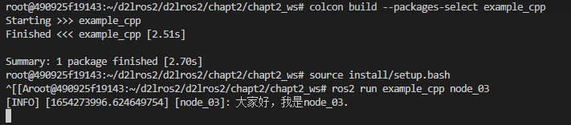
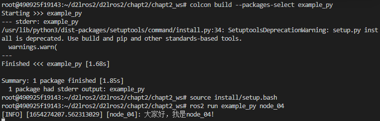

###### datetime:2023/09/13 09:36

###### author:nzb

> 该项目来源于[大佬的动手学ROS2](https://fishros.com/d2lros2)
> 
> [ros2 examples](https://github.com/ros2/examples)

# 1. OOP介绍

除了使用上节中的只定义一个main函数就完成编写一个Python节点外，还有另外两种方式。

本节就来讲一讲出现么多种编写节点的原因，并对其中较为重要的OOP方法进行介绍。

要做机器人离不开计算机编程，而计算机编程经过多年的发展，演变出了三种不同且常用的编程思想，分别是：

1. 面向过程编程思想。缩写：POP
2. 面向对象编程思想。缩写：OOP
3. 函数式思想。缩写：FP

## 1.Why

为什么了解这些编程思想呢？尤其是OOP。

遇到过很多同学，在阅读机器人相关开源程序代码时，比如导航框架Nav2、机械臂运动控制框架Moveit时发现，别人的代码，每一行好像都看得懂，但放一起就看不懂了，看别人函数调来调去，很快人就给整蒙了。不知道如何下手。

这其实就是对别人的编程思想不了解造成的，所以本节课就给提一提常见的三种编程思想，让大家脑子里有个概念，以后遇到了看不明白的程序，知道该往哪个方向去学习。

编程思想博大精深，这里只是对三种思想的基本介绍。

## 2.思想辨析

首先明确一件事情，编程是为了什么？

是为了赚钱吗？

不，我们写程序肯定是为了解决实际的问题的，那编程思想编程思想就是解决问题的思路（赚钱工具）

那这三种思想有什么区别呢？

### 2.1 用三种思想把大象装进冰箱

比如我们想把一只大象装进冰箱，分别用三种思想，我们看看有什么不一样。


#### 2.1.1 面向过程思想

如果我们采用面向过程的思想，可以分为三步：

1. 打开冰箱门
2. 把大象塞进去
3. 关上冰箱门

面向过程编程就是分析出解决问题所需要步骤，然后分别实现每一步，再一步步执行即可。

#### 2.1.2 面向对象思想

面向对象编程思想（OOP）怎么做呢？

那就要先知道面向对象是什么？搞清楚啥是对象？


对象是女朋友吗？答案肯定不是。

任何我们想要探究的事物都可以当作一个对象，比如我们可以把你家的冰箱理解为一个对象，我们就可以研究你家冰箱由哪些部分（指令装置等）组成，你家冰箱能干什么（制冷、调温等）？

接着我们开始下定义，就是取个高大上的名字

| 冰箱           | 定义       | 举例                     |
| -------------- | ---------- | ------------------------ |
| 冰箱的组成部分 | 冰箱的属性 | 制冷器，调温旋钮、灯带等 |
| 冰箱能干什么   | 冰箱的行为 | 制冷，调温、照明等       |

对象的行为其实是对其属性的操作，比如对制冷器操作就可以制冷，给灯带通电就可以照明。

**对象 = 属性+行为**

接着我们开始采用OOP的方法把大象装进冰箱

1. 调用：冰箱->打开门(行为)
2. 调用：冰箱->装东西(行为)
3. 调用：冰箱->关闭门(行为)

看起来和面向过程没啥区别，但我们的思想发生了重大的转变，我们把冰箱当作了一个独立的对象，我们是通过和冰箱这个对象交互完成了整个过程。

接着来看函数式编程

1. 定义关进（冰箱，大象）函数
2. 实现函数：关门(放入(开门(冰箱)，大象))

可以看到多层的函数嵌套调用，这就是函数编程的魅力，因为FP不是我们的机器人学习中的重点，这里就不过多讲解啦！

## 3.面向对象编程

简单介绍完，我们来说说今天的主角，面向对象编程OOP。

面向对象中有五个重要的概念，理解这五个概念相当于对OOP编程有了了解，下面一个个来介绍。

### 3.1 类与对象（抽象与具体）

我们通过调用你家美的冰箱的开门、装东西和关门三个行为来把大象装进冰箱。这时我们可以把`你家的美的冰箱`（具体的）称之为一个对象，而冰箱（抽象的）就称为一个类。

比如说鱼类和，鱼类就是一个类，而就是鱼类（抽象的）中的一个对象（具体的）。

在ROS2设计时这种抽象和具体的思想发挥着非常重要的作用，比如说DDS是有很多厂家的，ROS2为了匹配不同厂家的DDS，就设计除了DDS抽象层，而每一个具体的DDS厂家，我们可以称之为一个DDS的对象，是具体的。

### 3.2 封装、继承与多态

所谓封装就是将属性和行为封装在一起。上面已经介绍了**对象 = 属性+行为**，比如冰箱将冰箱的温度值（属性）和对温度值的操作（行为）等封装在一起。

继承，继承可以帮我们减少很多的工作量（比如王撕聪从他爹那里继承了很多钱，这样他就少奋斗了很多年），比如ROS2中的执行器类，通过继承执行器类实现了单线程执行器和多线程执行器，更多具体的例子我们在后续的学习中遇到再说。

多态，其实很简单，我们可以说鲤鱼是鱼类，草鱼是鱼类，鲤鱼是鱼类。同一个鱼类可以有多种不同的类型，即多态。更多的用法，等到写代码的时候再和一起解锁

## 4.如何选择code思想

三种编程思想，我们写程序的时候该如何选择呢?

个人的拙见是根据你的功能需求来，如果只需要实现一个很简单的功能，比如只是做一个键盘控制器，实现控制小车前进后退，直接采用面向过程的设计思想即可。

但如果是做一个稍大的工程，且后续要考虑功能的拓展性，这个时候就需要采用面向对象的思路来了。

<!-- 那后续的课程会采用哪一种编程思想呢？

答案是面向对象的方式，原因在于

- 带大家熟悉面向对象的套路有利于大家对ROS2源码和开源代码进行阅读 
- 有助于培养大家工程化的能力和模块化的思想  -->


参考链接：

-[浅谈面向对象的编程思想：如何优雅地把大象装进冰箱？_SYSU_101的博客-CSDN博客](https://blog.csdn.net/SYSU_101/article/details/78057008)

--------------

# 2.使用面向对象方式编写ROS2节点

## 1.C++版本

在`d2lros2/chapt2/chapt2_ws/src/example_cpp/src`下新建`node_03.cpp`，接着输入下面的代码。

```c++

#include "rclcpp/rclcpp.hpp"

/*
    创建一个类节点，名字叫做Node03,继承自Node.
*/
class Node03 : public rclcpp::Node
{

public:
    // 构造函数,有一个参数为节点名称
    Node03(std::string name) : Node(name)
    {
        // 打印一句
        RCLCPP_INFO(this->get_logger(), "大家好，我是%s.",name.c_str());
    }

private:
   
};

int main(int argc, char **argv)
{
    rclcpp::init(argc, argv);
    /*产生一个node_03的节点*/
    auto node = std::make_shared<Node03>("node_03");
    /* 运行节点，并检测退出信号*/
    rclcpp::spin(node);
    rclcpp::shutdown();
    return 0;
}
```

接着修改`CMakeLists.txt`，添加下方代码。

```
add_executable(node_03 src/node_03.cpp)
ament_target_dependencies(node_03 rclcpp)

install(TARGETS
  node_03
  DESTINATION lib/${PROJECT_NAME}
)
```

接着即可自行编译测试

```shell
colcon build --packages-select example_cpp
source install/setup.bash
ros2 run example_cpp node_03
```



## 2.Python版本

在`d2lros2/d2lros2/chapt2/chapt2_ws/src/example_py/example_py`下新建`node_04.py`，输入下面的代码

```python
#!/usr/bin/env python3
import rclpy
from rclpy.node import Node


class Node04(Node):
    """
    创建一个Node04节点，并在初始化时输出一个话
    """

    def __init__(self, name):
        super().__init__(name)
        self.get_logger().info("大家好，我是%s!" % name)


def main(args=None):
    rclpy.init(args=args)  # 初始化rclpy
    node = Node04("node_04")  # 新建一个节点
    rclpy.spin(node)  # 保持节点运行，检测是否收到退出指令（Ctrl+C）
    rclpy.shutdown()  # 关闭rclpy

```

接着修改`setup.py`

```python
    entry_points = {
                       'console_scripts': [
                           "node_02 = example_py.node_02:main",
                           "node_04 = example_py.node_04:main"
                       ],
                   },
```

> 注意格式和结尾的`,`符号，`console_scripts`是个数组。

编译测试

```shell
colcon build --packages-select example_py
source install/setup.bash
ros2 run example_py node_04
```



## 3.总结

把节点写成一个类的形式对我们组织代码和使用ROS2的新特性有很多的好处，后面我们将以此种方式（用类建立节点）来学习后续内容。