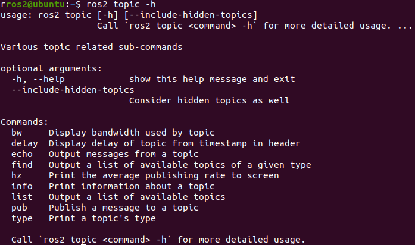

###### datetime:2023/09/13 16:38

###### author:nzb

> 该项目来源于[大佬的动手学ROS2](https://fishros.com/d2lros2)

# 1.ROS2话题入门

话题是ROS2中最常用的通信方式之一，话题通信采取的是订阅发布模型。

## 1.订阅发布模型

一个节点发布数据到某个话题上，另外一个节点就可以通过订阅话题拿到数据。

```mermaid
graph LR
A[节点1] --发布-->B[topic_name]
B -- 订阅 --> C[节点2]
```

除了上述这种一个节点发布，一个节点接受的形式外，ROS2话题通信其实还可以是`1对n`,`n对1`,`n对n`的。

1对n

```mermaid
graph LR
A[节点1] --发布-->B[topic_name]
B -- 订阅 --> C[节点2]
B -- 订阅 --> D[节点3]
B -- 订阅 --> E[节点4]
```

n对1（同一个话题可以有多个发布者）

```mermaid
graph LR
A[节点1] --发布-->B[topic_name]
D[节点2] --发布-->B[topic_name]
B -- 订阅 --> C[节点2]
```

n对n

```mermaid
graph LR
A[节点1] --发布-->B[topic_name]
F[节点2] --发布-->B[topic_name]
G[节点3] --发布-->B[topic_name]
B -- 订阅 --> C[节点4]
B -- 订阅 --> D[节点5]
B -- 订阅 --> E[节点6]
```

还有一种就是ROS2节点可以订阅本身发布的话题

```mermaid
graph LR
A[节点] --发布-->B[topic_name]
B -- 订阅 --> A[节点]
```

## 2. 消息接口

为了方便发送者和接收者进行数据的交换，ROS2帮我们在数据传递时做好了消息的序列化和反序列化（有关消息序列化相关内容请参考本章基础篇），而且ROS2的消息序列化与反序列化通信是可以做到跨编程语言、跨平台和跨设备之间的。

ROS2如何做到跨编程语言、跨平台和跨设备之间的数据收发呢？这就得益于通过定义消息接口文件了。

因为跨平台和设备实现较为复杂，这里简单说一下如何实现跨语言的。当我们定义好消息接口后，ROS2会根据消息接口内容生成不同语言的接口类，在不同编程语言中调用相同的类即可实现无感的消息序列化和反序列化。

通过对消息接口介绍，相信你肯定能猜到这样一条规则：**同一个话题，所有的发布者和接收者必须使用相同消息接口**。

## 3. ROS2话题工具

#### 3.1 GUI工具

#### 3.1.1 RQT工具之rqt_graph

ROS2作为一个强大的工具，在运行过程中，我们是可以通过命令来看到节点和节点之间的数据关系的。

运行我们第二章中的你说我听小demo。依次打开三个终端，分别输入下面三个命令。

```
ros2 run demo_nodes_py listener
ros2 run demo_nodes_cpp talker
rqt_graph
```

你将看到下面这张图


> 你可以尝试改变菜单栏的Hide或者Group选项，看一看下面图的变化，感受一下rqt_graph工具的强大。

这是一个很重要的工具，在学习和使用ROS2的过程中经常会用到它，来看一看数据到底是怎么走的，它可以帮我们搞清楚一个节点的输入和输出是什么。

### 3.2 CLI工具

还记得上一章的ros2 node指令吗？ros2也支持很多强大的topic指令。可以使用下面的指令查看。

```
ros2 topic -h
```



本着学以致用的目的，先对比较常用的几个命令进行介绍，其他的我们用到的时候再介绍（现在介绍反而不好理解）。

#### 3.2.1 `ros2 topic list` 返回系统中当前活动的所有主题的列表

命令

```
ros2 topic list
```

结果


#### 3.2.2 `ros2 topic list -t` 增加消息类型

命令

```
ros2 topic list -t
```

结果


#### 3.2.3 `ros2 topic echo <topic_name>` 打印实时话题内容

命令

```
ros2 topic echo /chatter
```

结果


- 输出过滤：`ros2 topic echo /tf --filter "m.transforms[0].child_frame_id == 'vive_command_master'"`

#### 3.2.4 `ros2 topic info <topic_name>` 查看主题信息

命令

```
ros2 topic info  /chatter
```

结果


#### 3.2.5 `ros2 interface show` 查看消息类型

上面一个指令告诉大家这个消息是std_msgs/msg/String，那String里面有什么呢？不妨来试一试。

命令

```
ros2 interface show std_msgs/msg/String
```

结果


#### 3.2.6 `ros2 topic pub <topic_name> <msg_type>  arg` 手动发布命令

关闭发布者，我们受到来发布

命令

```
ros2 topic pub /chatter std_msgs/msg/String 'data: "123"'
```

结果


## 4.话题名设置

- 全局话题
  - 格式：定义时以`/`开头的名称，和命名空间、节点名称无关。
  - `rclcpp` 示例：`publisher_ = this->create_publisher<std_msgs::msg::String>("/topic/chatter", 10);`
  - `rclpy` 示例：`self.publisher_ = self.create_publisher(String, '/topic/chatter', 10)`
  - 话题：话题名称为 `/topic/chatter`，与命名空间 `xxx` 以及节点名称 `yyy` 无关。

- 相对话题
  - 格式：非`/`开头的名称，参考命名空间设置话题名称，和节点名称无关。
  - `rclcpp` 示例：`publisher_ = this->create_publisher<std_msgs::msg::String>("topic/chatter", 10);`
  - `rclpy` 示例：`self.publisher_ = self.create_publisher(String, 'topic/chatter', 10)`
  - 话题：话题名称为 `/xxx/topic/chatter`，与命名空间 `xxx` 有关，与节点名称 `yyy` 无关。

- 私有话题
  - 格式：定义时以`~/`开头的名称，和命名空间、节点名称都有关系。
  - `rclcpp` 示例：`publisher_ = this->create_publisher<std_msgs::msg::String>("~/topic/chatter", 10);`
  - `rclpy` 示例：`self.publisher_ = self.create_publisher(String, '~/topic/chatter', 10)`
  - 话题：话题名称为 `/xxx/yyy/topic/chatter`，使用命名空间 `xxx` 以及节点名称 `yyy` 作为话题名称前缀。

## 5.最后

了解完话题，下一节就会带大家来动手写一写话题通信代码。

参考链接：[Understanding ROS 2 topics — ROS 2 Documentation: Humble documentation](http://docs.ros.org/en/humble/Tutorials/Topics/Understanding-ROS2-Topics.html)


--------------