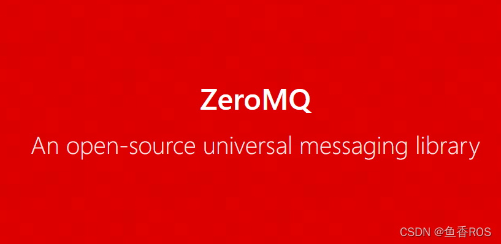

###### datetime:2023/09/13 16:38

###### author:nzb

> 该项目来源于[大佬的动手学ROS2](https://fishros.com/d2lros2)

# 从底层理解通信

当涉及到底层通信时，通过在Linux命令行中执行一些相关操作可以更好地理解通信的工作方式。下面是一些通过Linux命令行来说明通信方式的示例：

### 通信的目的
通信的目的是在计算机系统中实现不同组件、进程或设备之间的信息和数据传递。通过通信，各个实体可以共享信息、协调行动并实现协同工作。在计算机领域，通信是构建分布式系统、网络和协议的基础。

### 通信原理
通信的原理涉及两个主要方面：通信协议和通信方式。通信协议定义了数据的格式、传输方式、错误检测和纠正等规则，以确保可靠的数据传输。通信方式涉及了不同的通信介质和技术，包括网络通信和进程间通信（IPC）。

### 通信方式

#### 1. 基于TCP/UDP的网络通信方式

基于TCP/UDP的网络通信方式通过计算机网络进行信息交换。其中，TCP（传输控制协议）提供可靠的、面向连接的通信，而UDP（用户数据报协议）则是无连接的通信方式。在Linux命令行中，可以使用诸如`ping`和`nc`命令来演示网络通信。

例如，使用`ping`命令进行基于UDP的网络通信：
```
ping 192.168.0.1
```
该命令将向IP地址为192.168.0.1的主机发送ICMP Echo请求，并等待接收相应的回复。

使用`nc`命令进行基于TCP的网络通信：
```
nc -l 1234
```
该命令将在本地监听端口1234，并等待与之建立TCP连接的客户端。通过在另一个终端窗口中执行以下命令，可以建立与本地1234端口的TCP连接并在连接上发送消息：
```
echo "Hello, TCP!" | nc 127.0.0.1 1234
```

#### 2. 基于共享内存的进程间通信（IPC）方式

基于共享内存的IPC方式通过共享内存区域在同一计算机系统内的不同进程之间进行通信。在Linux命令行中，可以使用`ipcs`和`ipcrm`命令来管理共享内存段。

通过`ipcs`命令查看当前系统中的共享内存段：
```
ipcs -m
```
使用`ipcrm`命令删除不再需要的共享内存段：
```
ipcrm -m <shmid>
```

通过以上示例，我们可以更好地理解通信的目的和原理，并使用Linux命令行演示了基于TCP/UDP的网络通信和基于共享内存的IPC通信的示例。这有助于进一步理解通信的实际应用和操作。


# 2.通信中间件之ZMQ

- [零MQ (zeromq.org)](https://zeromq.org/)

## 1.什么是ZeroMQ

在说pyzmq之前，肯定要了解一下ZeroMQ，了解ZeroMQ还是从FastDDS那里，因为FastDDS官网老是在哪里强调自己比ZeroMQ性能要好。

大家知道FastDDS是ROS2的通信中间件，那既然FastDDS比ZeroMQ性能好，那为啥还要介绍ZeroMQ呢？

原因是ZeroMQ非常的轻量，也就是小巧，占用资源少，看名字，Zero Message Queue，零消息队列。

ZeroMQ提供了各种（如进程内、进程间、TCP 和多播）消息传输的套接字，是不是听起来很强大的样子。

## 2.PyZmq

了解完ZMQ是啥后，我们再来看看PyZMQ。

因为文档过于完善，不打算跟大家费解释了，给一个官方网址，大家自行阅读

- https://pyzmq.readthedocs.io/en/latest/

pyzmq也提供了类似于订阅发布的方式来传递消息，还有更多的使用方法，比如客户端服务端这种，网上有大佬已经探索了，贴个链接在这里，大家有需要使用的可以去瞅一瞅。

- https://www.php.cn/python-tutorials-459626.html

## 3.总结

如果你在做机器人，需要去ROS，需要找一个高效的消息中间件，我想ZMQ应该比较适合你，当然也可以根据机器人的处理器和性能试试ROS2的FastDDS。