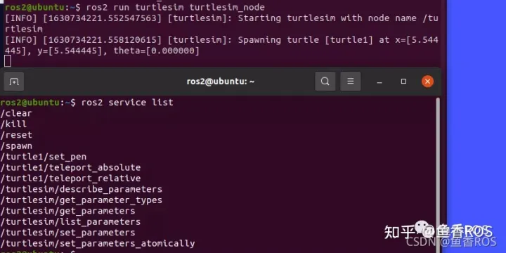
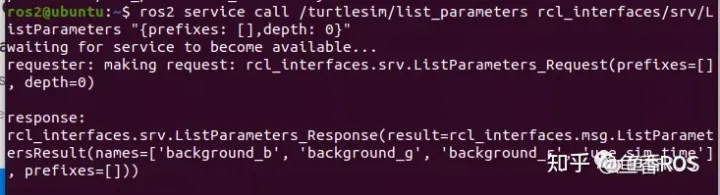

###### datetime:2023/09/19 14:02

###### author:nzb

> 该项目来源于[大佬的动手学ROS2](https://fishros.com/d2lros2)

# 1.ROS参数通信原理介绍

ROS2的参数其实是用服务实现的，是怎么知道的呢？

随意运行一个节点，你使用下面的指令，就可以看到多出来很多的参数相关的服务。

```
ros2 service list
```

比如启动乌龟模拟器

```
ros2 run turtlesim turtlesim_node
```



多出来的这些服务就是用于操作这个节点的参数的

```shell
/turtlesim/describe_parameters
/turtlesim/get_parameter_types
/turtlesim/get_parameters
/turtlesim/list_parameters
/turtlesim/set_parameters
/turtlesim/set_parameters_atomically
```

我们如何使用服务查看参数呢？

手动调一下服务就行了~

```shell
ros2 service call /turtlesim/list_parameters rcl_interfaces/srv/ListParameters "{prefixes: [],depth: 0}"
```



这里可以看到结果里的四个参数

```
names=['background_b', 'background_g', 'background_r','use_sim_time']
```

采用`ros2 param list`再看看对不对

```
ros2 param list
```

是不是长的一样

### 总结

通过上面的实验告诉我们ROS2的参数操作其实就是通过服务通信方式实现的，获取参数列表，set和get操作就是操作相应的服务


--------------
