###### datetime:2023/10/16 11:03

###### author:nzb

> 该项目来源于[大佬的动手学ROS2](https://fishros.com/d2lros2)
> 
> [ros2 examples](https://github.com/ros2/examples)

# 1.什么是单片机MCU

## 一、什么是MCU？和CPU什么区别？

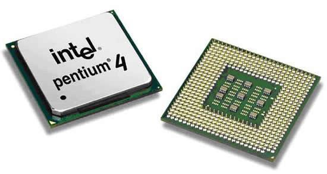

你知道我们电脑用的处理器叫做CPU（Central Processing Unit 中央处理器），那你知道现在的智能家电里的处理器是什么吗？比如可以连WIFI和蓝牙的空调，比如在寒冷的冬天里常用的小米电暖器是什么处理器吗？

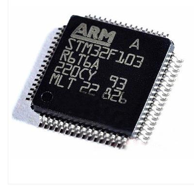

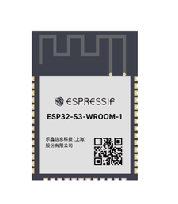

答案就是微型控制单元-MCU（Micro Control Unit），我们常说单片微型计算机，简称就是单片机，上面两张图就是两种不同类型的单片机。

如果你有组装过电脑，你应该知道，电脑想要运行起来除了CPU还要内存条、硬盘等设备才能正常运行，而单片机则将CPU、内存、蓝牙等外设集成到了一起，这一点也是CPU和MCU之间的主要区别。

## 二、单片机为什么有那么多种类？

在上面的单片机介绍中，放了两种单片机图片，事实上单片机的种类是非常之多的，用在洗衣机上的单片机、用在3D打印机的单片机和用在电暖气上的单片机都是不同的类型，那为什么有那么多分类呢？

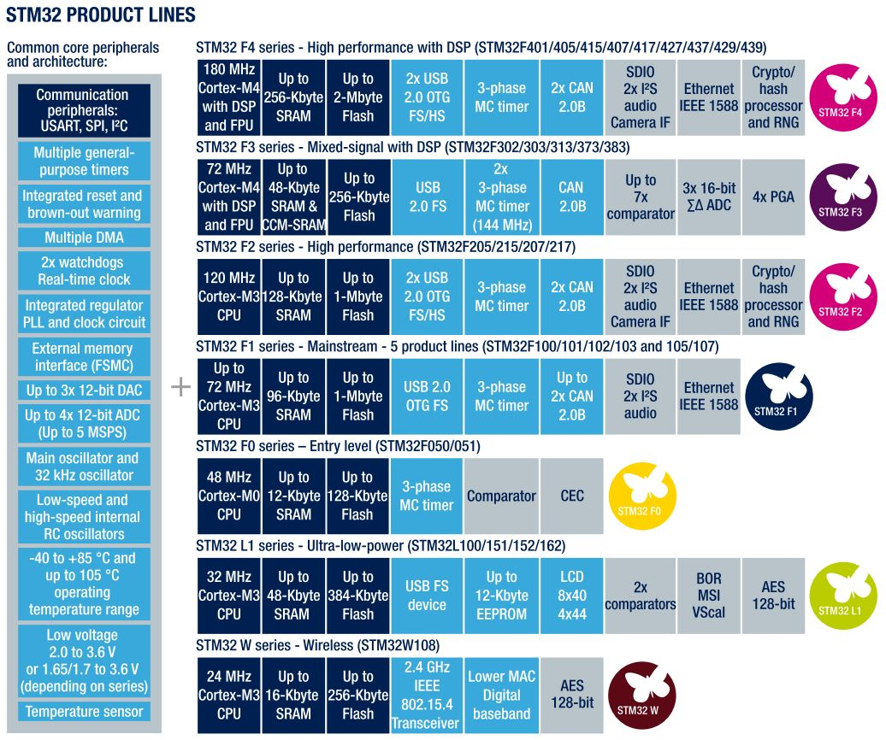

答案是不同单片机具有不同的配置，比如不同的主频，慢的有几兆赫兹，快的有几百兆赫兹，不同的外设，比如有的支持USB、有的支持WIFI、有的支持蓝牙、还有的甚至多加了个处理器（比如卖的MicroROS学习板主控就是双核的）。

# 2.微处理器开发平台

上一节我们对单片机硬件进行了简单介绍，但单片机运行不仅仅需要硬件，类似于电脑需要配套的操作系统一样，单片机还需要与之配套的软件，本节我们学习下常见的开发平台。

我们的MicroROS板采用的单片机是ESP32芯片，该芯片支持蓝牙和WIFI并且是双核的国产芯片，用途很广，所以就介绍下该芯片的常用的几个开发平台。

## 一、官方平台-ESPIDF(ESP IoT Development FrameWork)

官网地址：https://www.espressif.com/zh-hans/products/sdks/esp-idf

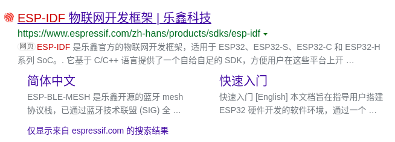

所谓官方平台就是单片机的厂商，针对单片机提供的开发框架，该框架为我们提供了一个C/C++ SDK，我们通过include相应的头文件就可以实现对硬件的控制。

下面这一段是官方介绍

> ESP-IDF 是乐鑫官方的物联网开发框架，适用于 ESP32、ESP32-S、ESP32-C 和 ESP32-H 系列 SoC。它基于 C/C++ 语言提供了一个自给自足的 SDK，方便用户在这些平台上开发通用应用程序。ESP-IDF 目前已服务支持数以亿计的物联网设备，并已开发构建了多种物联网产品，例如照明、消费电子大小家电、支付终端、工控等各类物联网设备。

ESP-IDF的核心其实是基于开源的FreeRTOS优化而来的，而FreeRTOS是一个迷你（几k大小）的实时操作系统内核，所以别看它小，照样跑了个操作系统。

展示一段ESP_IDF版本的HelloWorld，感受一下

```
/*
 * SPDX-FileCopyrightText: 2010-2022 Espressif Systems (Shanghai) CO LTD
 *
 * SPDX-License-Identifier: CC0-1.0
 */

#include <stdio.h>
#include <inttypes.h>
#include "sdkconfig.h"
#include "freertos/FreeRTOS.h"
#include "freertos/task.h"

void app_main(void)
{
    printf("Hello world!\n");
    vTaskDelay(1000 / portTICK_PERIOD_MS);
    fflush(stdout);
    esp_restart();
}
```

## 二、Arduino平台

官网地址：https://www.arduino.cc/en/about


Arduino是一款便捷灵活、方便上手的开源电子原型平台，本次MicroROS学习就是基于该平台进行开发。

展示一段Arduino版本的HelloWorld代码，感受一下

```
#include <Arduino.h>
void setup() {
  // put your setup code here, to run once:
  Serial.begin(9600);
  Serial.println("Hello World!");
}

void loop() {
  // put your main code here, to run repeatedly:

}
```

## 三、MicroPython平台

官网地址：https://micropython.org/

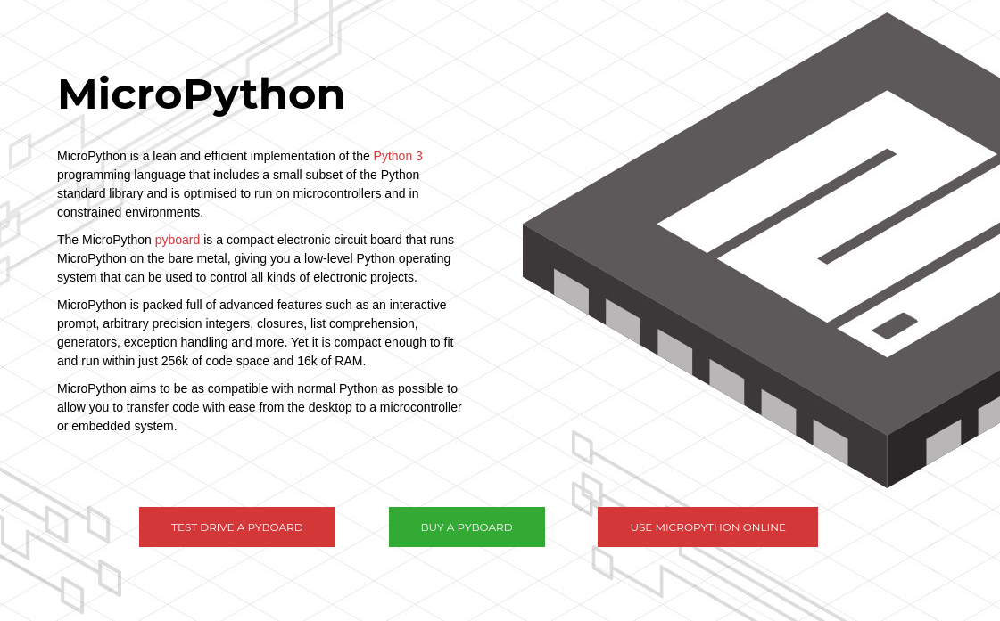

大家都知道，人生苦短，我用Python，针对单片机平台，有没有可能使用Python开发呢？——MicroPython来了。

MicroPython是 Python 3 语言的精简实现 ，包括Python标准库的一小部分，经过优化可在微控制器和受限环境中运行。

同样的我们的MicroROS板同时也是支持使用MicroPython进行开发，只需要刷入相应的固件即可。

展示一段MicroPython的HelloWorld代码，感受下它的简单

```python
print('Hello, World!')
```

## 四、对比与总结

上面介绍了三种常见的平台，做个表格对比下三种平台的优缺点。

| 平台名称    | 优点                                                         | 缺点                                         |
| ----------- | ------------------------------------------------------------ | -------------------------------------------- |
| ESP_IDF     | 官方出品、测试完成度高、安全稳定、有官方支持、适合产品化、支持microROS | 三方教程少、工程复杂、新手不友好             |
| Arduino     | 社区庞大，教程丰富、新手友好，简单易用、支持microROS         | 封装较多                                     |
| MicroPython | Python语言、简单易用                                         | 解释执行，效率低下，封装较多，不支持microROS |

看完上面的对比，对于新手来说选择Ardunio平台容易入门且教程丰富，并且ESP32单片机是官方出品了Arduino支持（开源地址：https://github.com/espressif/arduino-esp32）。

了解完单片机开发平台，下一节我们正式搭建开发环境，然后开始编写我们的第一个HelloWorld工程！

# 3.搭建PlateFormIO开发环境

我们开始介绍并搭建PlatformIO（以下简称PIO）的开发环境。因为网络原因，PIO搭建起来是一个挺困难的事情，但是在一键安装里添加了一键安装PIO，为你解决这一难题。

开始之前，想和你约定好本次学习之旅的开发环境和平台，这里采用的开发环境信息如下：

- 系统版本：Ubuntu 22.04（虚拟机实体机都可）

- ROS版本：ROS2-Humble

- 开发板：[MicroROS学习板V1.0.0](https://item.taobao.com/item.htm?id=695473143304)

## 一、PIO介绍

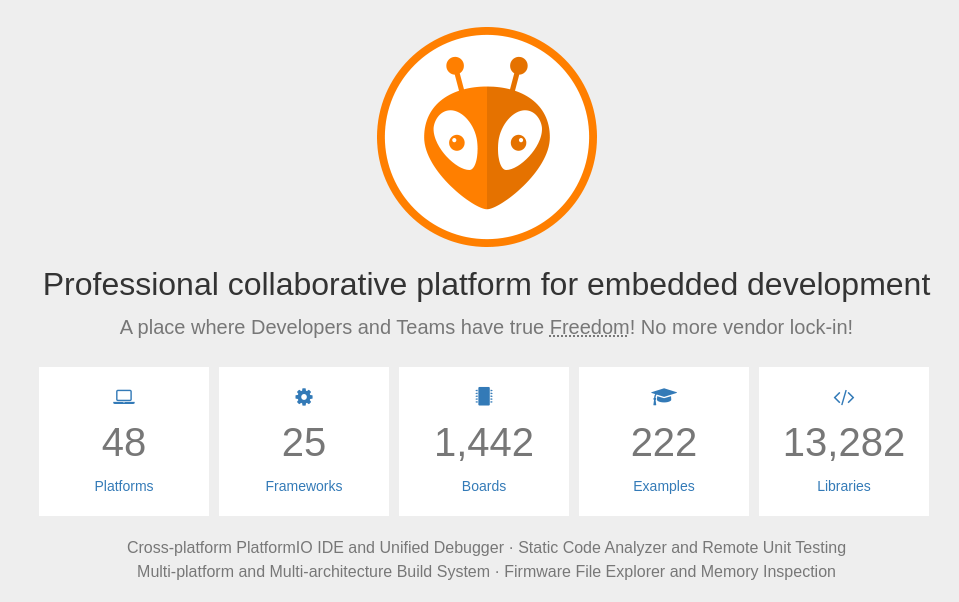

官网地址：https://platformio.org/

PIO是一个面向嵌入式开发的专业协作平台，它提供了一个适配VsCode的插件，它具有一个用户友好且可扩展的集成开发环境，具有一组专业开发工具，提供现代而强大的功能，以加快并简化嵌入式产品的创建和交付。

## 二、安装PIO

PIO的开发我们采用VsCode，所以在这之前你需要安装VsCode，VsCode安装可以使用一键安装，快速且稳定。

### 2.1 安装VsCode

运行一键安装指令，之后选择7即可

```
wget http://fishros.com/install -O fishros && . fishros
```

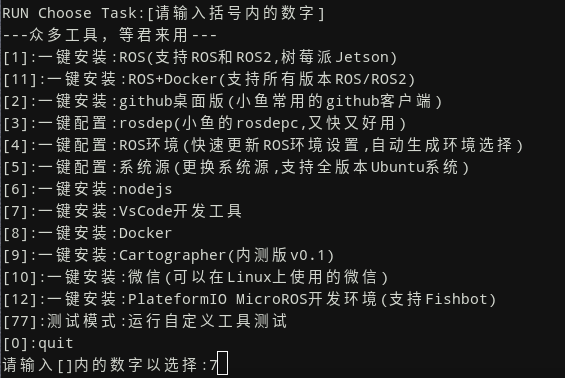

安装完成VsCode后，推荐你继续使用一键安装来安装PIO。

### 2.2 安装PIO（可跳过）

**注意这一步仅适用Ubuntu22.04系统，非该系统请直接跳过**

继续使用一键安装，选项12

```
wget http://fishros.com/install -O fishros && . fishros
```

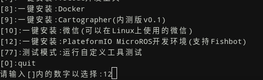

### 2.3 安装VsCode插件

打开VsCode，我们还需安装一个PlatformIO插件就能正常Work了。

任意终端输入code，或者在菜单中找到vscode都可以打开vscode，接着在扩展中搜索`PlatformIO`，选择后点击安装即可。

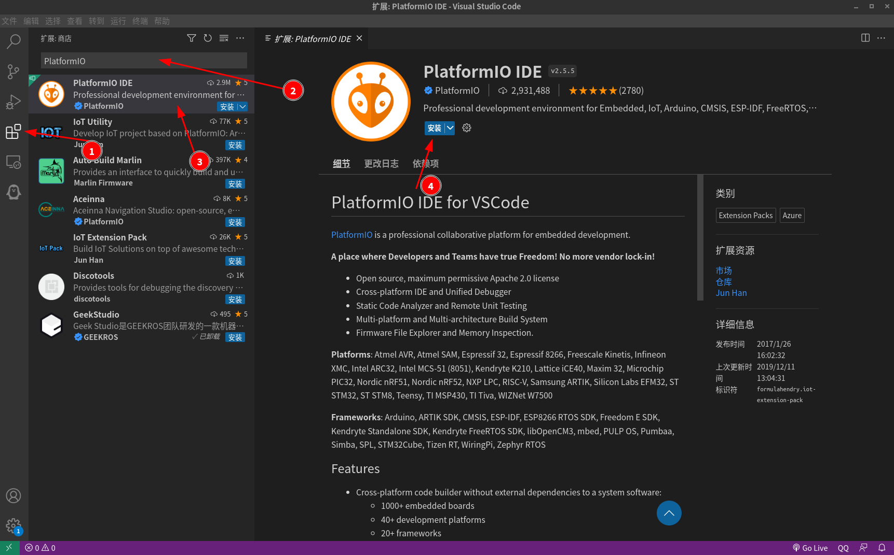

安装完成后在侧方栏应该可以看到一个蚂蚁头的图标，这个就是PIO，点击图标，点击上访的Open就可以打开PIO HOME。

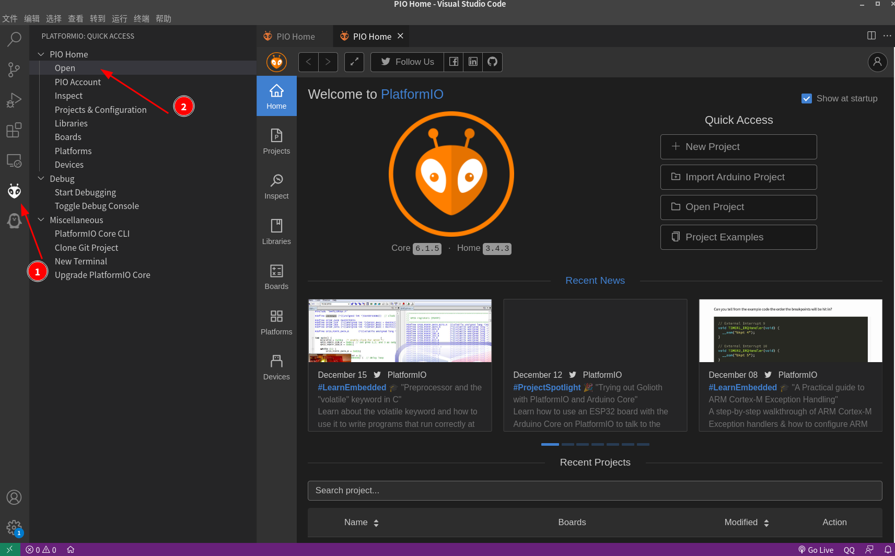

## 三、新建工程测试

接着我们就可以利用PIO建立第一个Arduino工程进行测试，首先点击New Project。

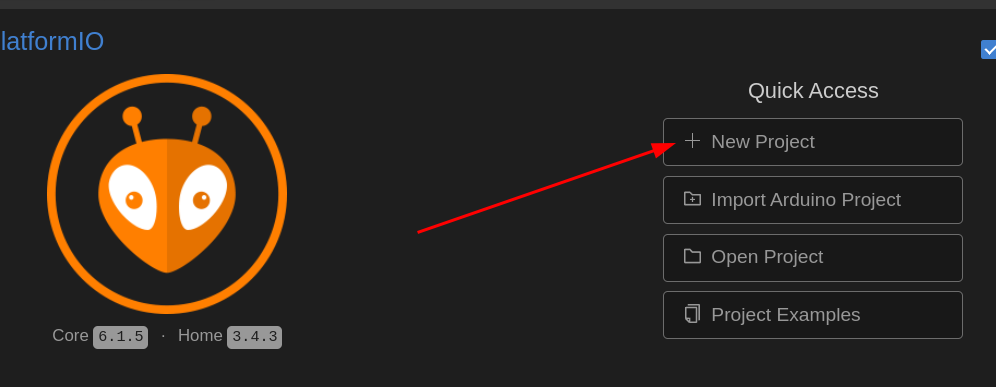

### 四步新建工程

1. 输入工程名 `example01_helloworld`
2. 选择开发板，这里选择`Adafruit ESP32 Feather`
3. 选择开发框架，这里我们用Arduino，PIO还支持IDF（IoT Development FrameWork）
4. 开发位置可以选择默认的位置，也可以自定义位置

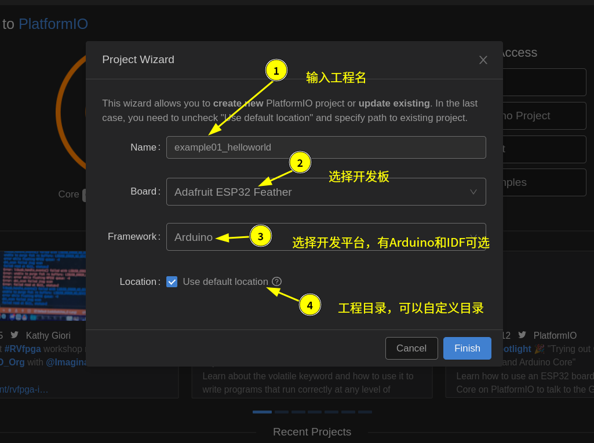

最后点击`Finish`即可，这样我们就得到了一个支持ESP32的Arduino工程。

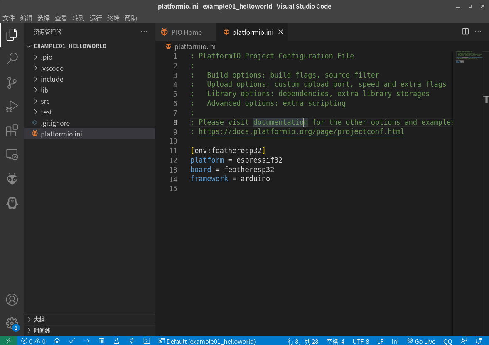

# 4.PIO工程结构&构建方式

上一节我们搭建好了PIO的开发环境，并新建了第一个工程。本节我们详细了解下该工程，了解我们需要在哪里写代码，在哪里改配置。

## 一、工程目录概述

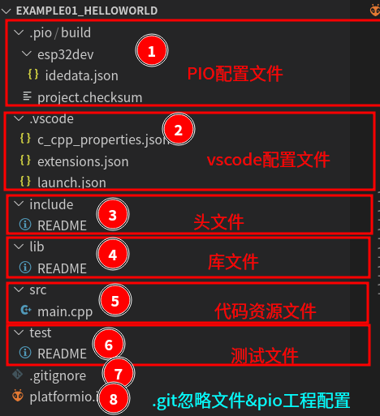

首先展开工程，可以看到工程一共有8个部分如上图所示。

1. PIO配置文件
2. VsCode配置文件
3. **头文件放置目录**
4. **库文件放置目录**
5. **代码资源放置目录，主函数就在这里**
6. 测试文件放置目录
7. git忽略文件
8. **platformio配置文件**

## 二、在哪里写代码？

打开`src/main.cpp`就是我们工程的程序入口文件，打开该文件，已经默认给我们生成了9行代码，后续的主要开发就在这里进行。

```c++
#include <Arduino.h>

void setup() {
  // put your setup code here, to run once:
}

void loop() {
  // put your main code here, to run repeatedly:
}
```

## 三、工程配置文件-platformio.ini

打开工程主目录下的`platformio.ini`文件，预生成的配置文件如下

```ini
; PlatformIO Project Configuration File
;
;   Build options: build flags, source filter
;   Upload options: custom upload port, speed and extra flags
;   Library options: dependencies, extra library storages
;   Advanced options: extra scripting
;
; Please visit documentation for the other options and examples
; https://docs.platformio.org/page/projectconf.html

[env:featheresp32]
platform = espressif32
board = featheresp32
framework = arduino
```

这里用到的主要配置有四个

1. `[env:featheresp32]`编译环境
2. `platform = espressif32`，单片机平台
3. `board = featheresp32`，开发板
4. `framework = arduino`，开发框架-arduino

后续还有很多关于工程的配置都放在这里，同时我们可以添加一条配置`board_build.f_cpu = 240000000L`，将单片机的主频提高到`240MHZ`的主频。

```ini
[env:featheresp32]
platform = espressif32
board = featheresp32
framework = arduino
board_build.f_cpu = 240000000L
```

## 四、编译工程

在VsCode中编译PIO，编译工程和将编译结果下载到开发板上都非常的方便。

编译工程可以手动点击左下角的对号进行，其他操作也可以通过按钮进行。

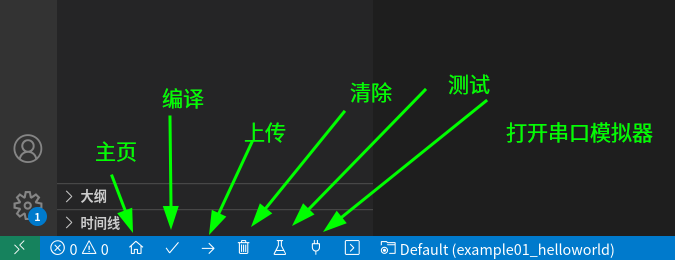

点击编译按钮，看到如下界面则代表编译成功

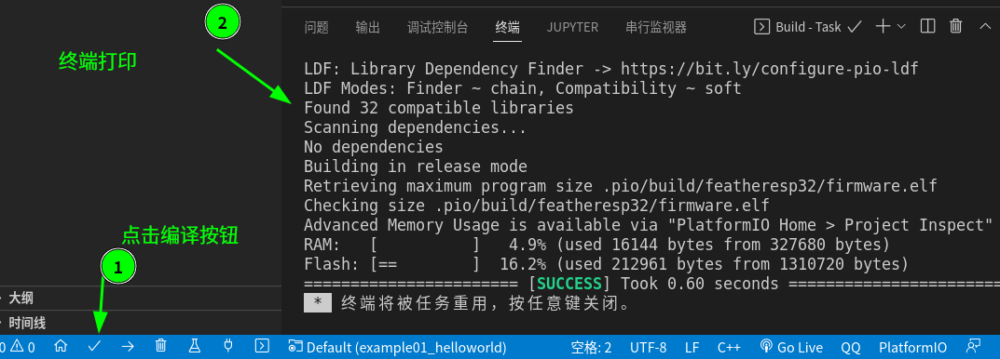

其中打印信息有很多有用的提示，比如工程占用的RAM和Flash大小（可以理解为系统程序大小）

```
RAM:   [          ]   4.9% (used 16144 bytes from 327680 bytes)
Flash: [==        ]  16.2% (used 212961 bytes from 1310720 bytes)
```

编译完成工程，在`.pio/build/featheresp32`目录下可以看到`firmware.bin`，这个就是我们工程编译之后生成的二进制文件，将该文件下载到开发板上就可以运行了。

## 五、PIO快捷键

这里再介绍几个PIO的快捷键，在接下来的学习中你肯定能用到

| 快捷键     | 内容                   |
| ---------- | ---------------------- |
| Ctrl+Alt+B | 编译工程               |
| Ctrl+Alt+U | 将程序上传烧录到开发板 |
| Ctrl+Alt+S | 打开串口Monitor        |


