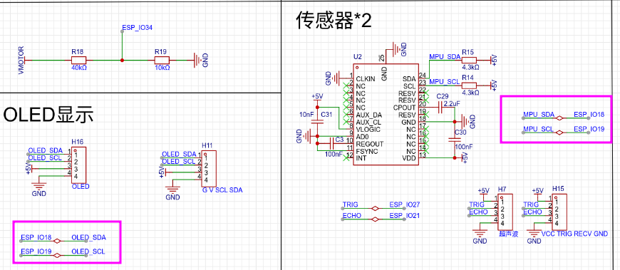
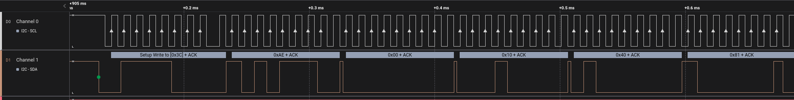
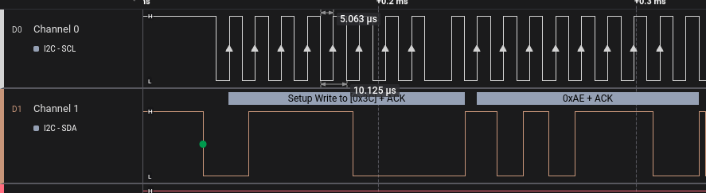
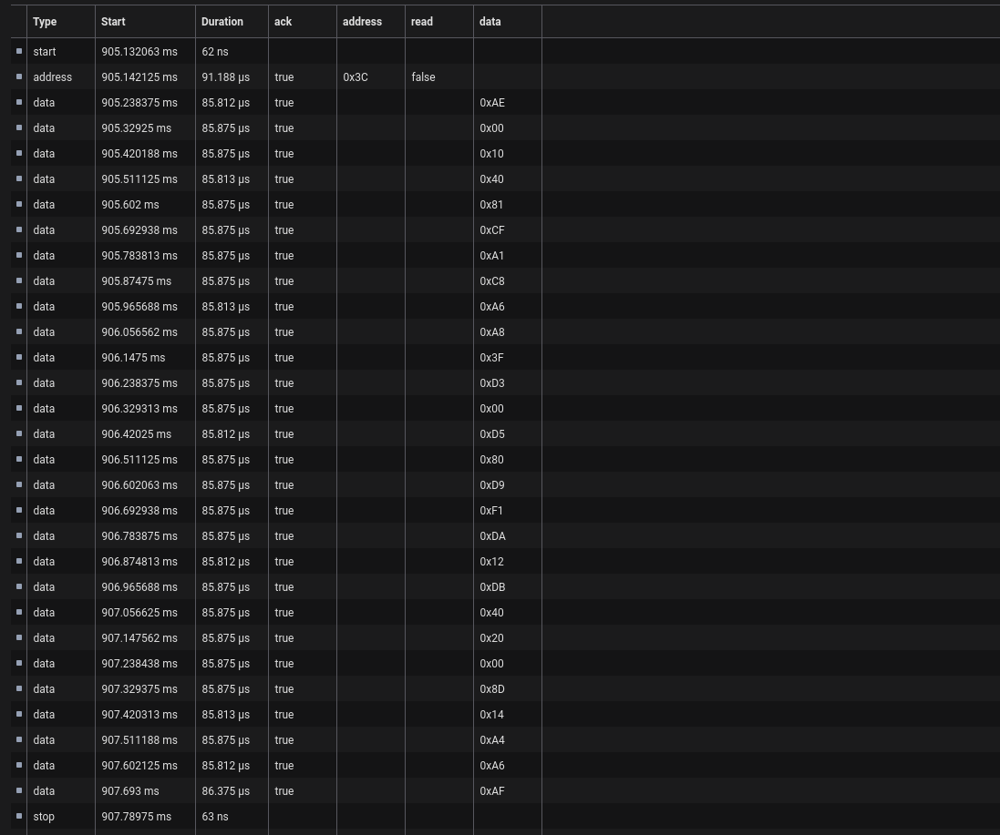
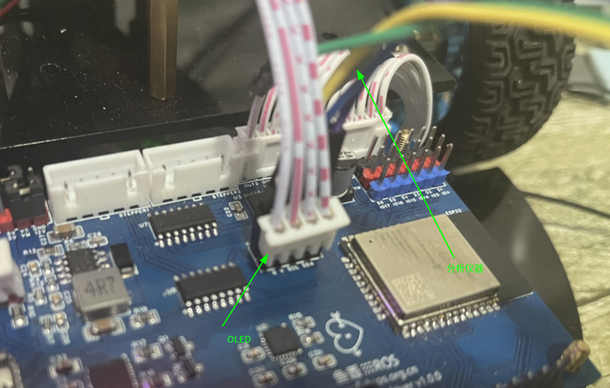
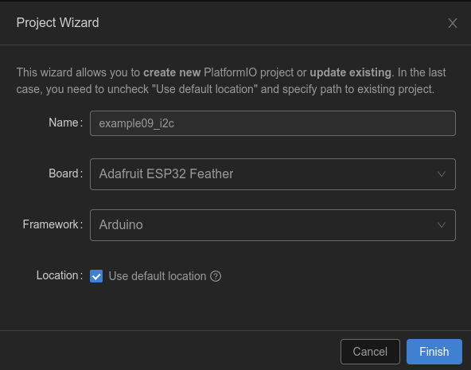
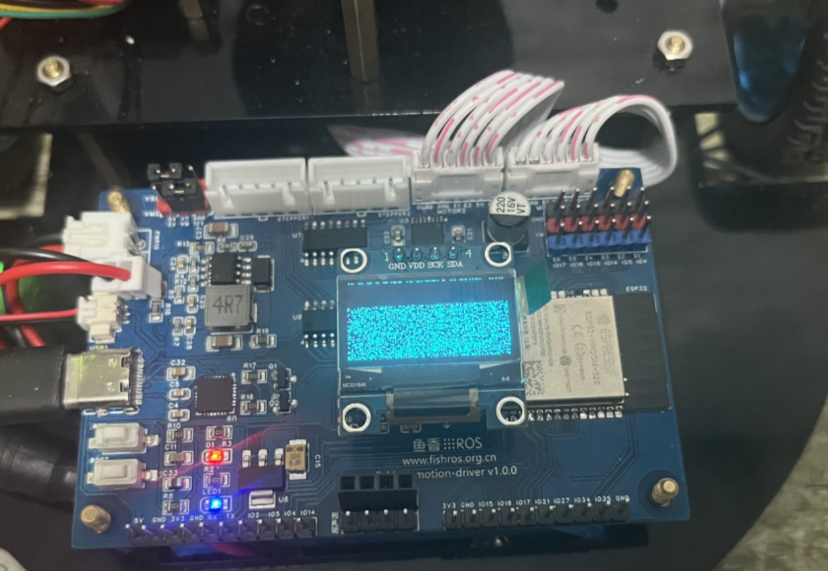

###### datetime:2023/10/24 10:23

###### author:nzb

> 该项目来源于[大佬的动手学ROS2](https://fishros.com/d2lros2)
> 
> [ros2 examples](https://github.com/ros2/examples)

# 5.通讯协议小课堂-I2C通信

本节主要介绍I2C协议，并将其主要特点拎出来和大家说说。

网上关于I2C协议介绍的有很多，但大都非常细致，将高低电平数据协议等等都介绍了，但新手学习时不用关注那么多底层的东西，比起了解通信原理，了解它是什么，怎么用对我们更加重要。

## 一、I2C是一种总线通讯协议

和之前我们介绍的串口通信类似，I2C也是一种通信协议。但它是一种总线通讯协议，也就是说，一个I2C可以连接多个设备，物理连接上像这样。


那它串的设备数量有没有上限呢？有的，上限是127个。

那为什么我们都是用18和19来驱动OLED和MPU6050呢？原因很简单，他们都是连在同一跟线上。

上原理图



> 像ESP32这种引脚资源匮乏的单片机，引脚的复用就显得很重要了，这里我们就将OLED和MPU6050都接在同一个I2C上，减少引脚占用。

## 二、I2C是一种两线协议

在上几节我们驱动OLED和IMU的时候，都导入了"Wire.h"，这个就是Arudino提供的好的头文件。我们使用的Wire的定义如下

```
TwoWire Wire = TwoWire(0);
```

TwoWire也就是两线的意思，两线也就是一个是SCL，一个是SDA

SCL即时钟线，以一个固定的周期进行电平变换，SDA即数据线，用于数据的传输，这样说有些抽象，用逻辑分析仪**截取了一段OLED初始化时的SCl（GPIO18）和SDA（GPIO19）上的电平变化**，并分析出其对应的数据。



再放大一些看



可以直观的看到SCL在数据传输开始前一直保持高电平，SDA变成了低电平，这意为着数据传输的开始，也就是那个绿点的地方。

**根据I2C协议规定：SCL处于高电平时，SDA由高到低变化，这种信号是起始信号。**

继续观察，你会发现，在**传输过程中SCL引脚电平在以一个固定的周期来回跳变**，从机这边 **当检测到SCL电平跳变后就开始读取SDA上的的电平，高记为1,低记为0**。 所以你可以看到逻辑分析仪检测到
**八个上升箭头，一共传输了八位数据，这八位数据用16进制表示就是0X3C**。

0X3C是什么，就是我们OLED的设备地址，所以这段信号的意思就是，我接下来要给0X3C的设备发数据了，请编号为0X3C的设备准备接收。

**这个信号会被0X3C的设备接收和处理，而同一总线上ID非0X3C的接收到数据后就会将其扔掉，这就是I2C支持多个设备的核心原因。**

**在我们的开发板上，OLED的默认地址为：0X3C，IMU的默认地址为：0x68**

> 附件:OLED初始化时I2C引脚数据图
>
> 
>
> 从该表可以看出，数据从905ms开始，到907ms完成了初始化数据的传输，下一节我们将按照这个数据传输内容编写代码，初始化OLED。

## 三、I2C是一种半双工协议

上面我们仔细分析了I2C协议，SCL用于周期的变换，SDA用于传输数据，所以同一时间，SDA要么用于接收，要么用于发送。所以我们可以得到I2C是一种半双工协议，同一时间只能进行接收或发送。

## 四、总结

本节带你从I2C协议信号入手，详细介绍了I2C数据的特点，如果你手头也有逻辑分析工具，也可以尝试进行分析，开发板设计的时也非常人性化，你可以这样随手拿几个杜邦线就可以接入进行测量。



# 6.I2C通信实验-点亮OLED

本节我们就尝试直接使用I2C协议来点亮OLED，因为主要测试I2C协议，所以对于复杂的显示处理部分就掠过了，毕竟有方便的开源库使用，我们也不用那么纠结，如果实在想使用I2C直接驱动OLED，可以去看在雷达驱动板上手撸的[代码](https://github.com/fishros/fishbot-laser-control/blob/main/components/oled/oled.c)
。

## 一、新建工程

还是老样子，不过这次不需要添加任何依赖。



## 二、I2CAPI介绍

这里我们需要了解几个Wire常用的API。

1.`Wire.begin` 初始化可以设置引脚，如` Wire.begin(18, 19);`

2.`Wire.beginTransmission`，开始传输，传入目标地址，如`OLED-0x3C` `Wire.beginTransmission(0x3c);`

3.`Wire.write` 开始写数据， 直接传如要写的数据即可

4.`Wire.endTransmission` 结束传输，写入完成后调用

## 三、编写代码

```c++
#include <Arduino.h>
#include "Wire.h"

uint8_t cmd_ssd1315[] = {0xae, 0x00, 0x10, 0x40, 0x81, 0xcf, 0xa1, 0xc8, 0xa6, 0xa8,
                         0x3f, 0xd3, 0x00, 0xd5, 0x80, 0xd9, 0xf1, 0xda, 0x12, 0xdb,
                         0x40, 0x20, 0x00, 0x8d, 0x14, 0xa4, 0xa6, 0xaf};

void setup()
{
  Wire.begin(18, 19);
  Wire.beginTransmission(0x3c);
  for (int i = 0; i < 28; i++)
  {
    Wire.write(cmd_ssd1315[i]);
  }
  Wire.endTransmission();
}

void loop()
{
  // put your main code here, to run repeatedly:
}
```

这里的代码，我们将`cmd_ssd1315`中的数据依次通过I2C写入地址为0x3C的设备中，这些数据分别代表这初始化OLED所需要的参数，如亮度、方向等信息，具体请参考SSD1315的手册，或自行百度。

## 四、测试

将代码下载到开发板，查看OLED,可以看到OLED此时成功亮起，有很多半点，属于正常现象。



## 五、总结

本节我们主要尝试通过I2C尝试发送一段指令给OLED，并将其成功点亮。至此我们嵌入式开发基础篇的内容就全部完成了，下一章开始我们将正是进入MicroROS的开发中来，到时更有我们熟悉的WIFI、蓝牙等模块的使用。