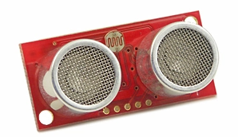
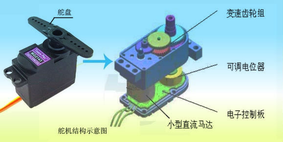
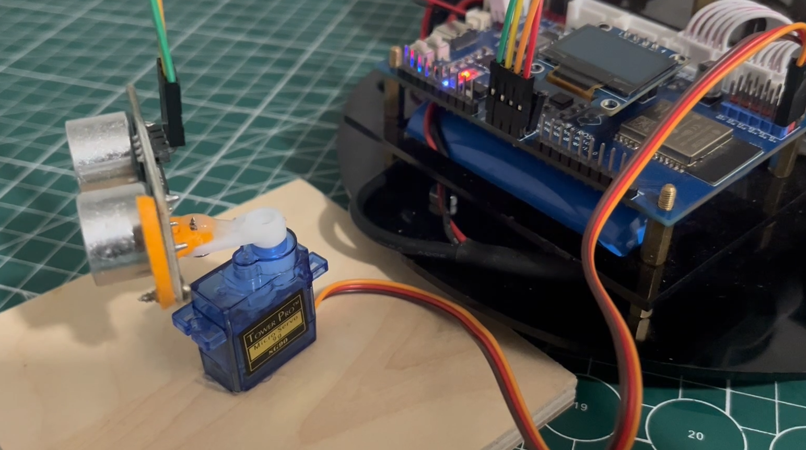
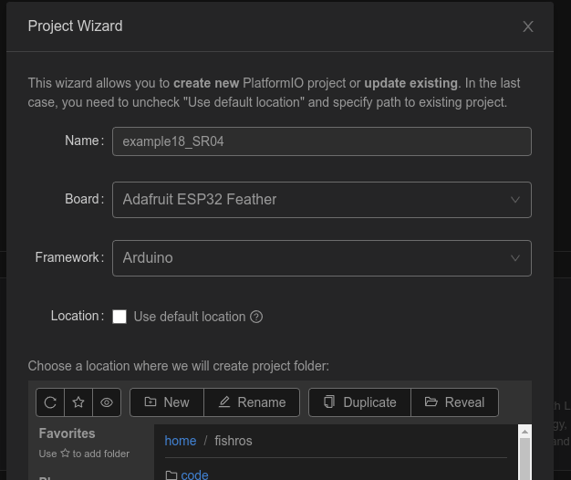
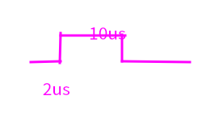
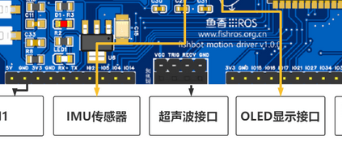
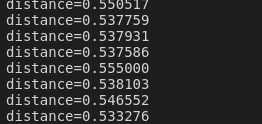

###### datetime:2023/10/26 10:23

###### author:nzb

> 该项目来源于[大佬的动手学ROS2](https://fishros.com/d2lros2)
> 
> [ros2 examples](https://github.com/ros2/examples)

# 1.简易雷达原理介绍

在正式开始制作我们的简易雷达前，我们先了解下原理。

我们所说的雷达是一种测距设备，比如FishBot上搭载的雷达就可以实现360度的旋转测距——测量指定角度前方障碍物的距离。

所以要实现一个简易雷达，我们必须要有一个可以测量距离的传感器，一个可以指定角度的电机。

## 一、测距传感器超声波

百度百科介绍

超声波传感器是将超声波信号转换成其它能量信号（通常是电信号）的传感器。超声波是[振动频率](https://baike.baidu.com/item/振动频率/8068137)
高于20kHz的机械波。它具有频率高、波长短、绕射现象小，特别是方向性好、能够成为[射线](https://baike.baidu.com/item/射线/327964)
而定向传播等特点。超声波对液体、固体的穿透本领很大，尤其是在阳光不透明的固体中。超声波碰到杂质或分界面会产生显著反射形成反射回波，碰到活动物体能产生[多普勒效应](https://baike.baidu.com/item/多普勒效应/115710)
。超声波传感器广泛应用在工业、国防、生物医学等方面。

接着看看长什么样子：



便宜的就长这样子，一共两个头，一个头用于发送波，一个头接收波。

那么超声波传感器原理是什么呢？

```
距离=(发送时间-接收时间)*速度/2
```

下一节我们将通过代码根据这一原理进行距离测量测试。

## 二、常用执行器舵机

舵机是可以根据指定角度进行旋转的特殊电机。



其硬件结构如上图所示，当我们把角度信息发送到控制板时，控制板通过电位器测量出当前的角度，然后根据当前角度和目标角度的角度差控制电机旋转，直到角度差变的几乎为零。

## 三、结构设计

主控板依然使用MicroROS学习板，购买雷达套餐[购买链接](https://item.taobao.com/item.htm?id=695473143304)
的小伙伴可以通过赠送的支架将超声波固定到舵机上，也可以自行用胶枪之类的固定。最终的结构示意图如下



# 2.测量距离学会超声波传感器

上一节简单的介绍了超声波传感器，但是没有介绍如何通过代码使用，本节我们尝试使用并封装超声波模块。

我们使用的超声波模块一共有四个引脚，分别是

- `TRIG` 即发送引脚，用于发送超声波
- `ECHO 即接收引脚，用于接收反射回来的超声波`
- `VCC` 电源接5V
- `GND` 电源地

## 一、新建工程

新建`example18_sr04`



## 二、编写代码

带注释的代码如下

```c++
#include <Arduino.h>
#define Trig 27 // 设定SR04连接的Arduino引脚
#define Echo 21

void setup()
{
  Serial.begin(115200);
  pinMode(Trig, OUTPUT); // 初始化舵机和超声波
  pinMode(Echo, INPUT);  // 要检测引脚上输入的脉冲宽度，需要先设置为输入状态
}

void loop()
{
  static double mtime;
  digitalWrite(Trig, LOW); // 测量距离
  delayMicroseconds(2);    // 延时2us
  digitalWrite(Trig, HIGH); 
  delayMicroseconds(10); // 产生一个10us的高脉冲去触发SR04
  digitalWrite(Trig, LOW);
  mtime = pulseIn(Echo, HIGH);                  // 检测脉冲宽度，注意返回值是微秒us
  float detect_distance = mtime / 58.0 / 100.0; // 计算出距离,输出的距离的单位是厘米cm
  Serial.printf("distance=%f\n", detect_distance);
  delay(500);
}
```

## 三、代码注解

核心代码分为两部分

### 3.1发送超声

方波产生，低-高-低



```c++
  digitalWrite(Trig, LOW); // 测量距离
  delayMicroseconds(2);    // 延时2us
  digitalWrite(Trig, HIGH); 
  delayMicroseconds(10); // 产生一个10us的高脉冲去触发SR04
  digitalWrite(Trig, LOW);
```

### 3.2 检测回响计算距离

```c++
mtime = pulseIn(Echo, HIGH);                  // 检测脉冲宽度，注意返回值是微秒us
float detect_distance = mtime / 58.0 / 100.0; // 计算出距离,输出的距离的单位是米m
```

58是一个时间系数，根据声音在空气中传播速度计算而来。`pulseIn`函数用于检测某个引脚从当前时间跳变到高电平之间持续的时间。

## 四、下载测试

将超声波模块连接到开发板上的超声波接口上



下载代码，打开串口，查看距离不断变化



## 五、总结

本节我们成功实现使用超声波实现距离测量功能，下一节我们尝试使用第三方库驱动舵机。