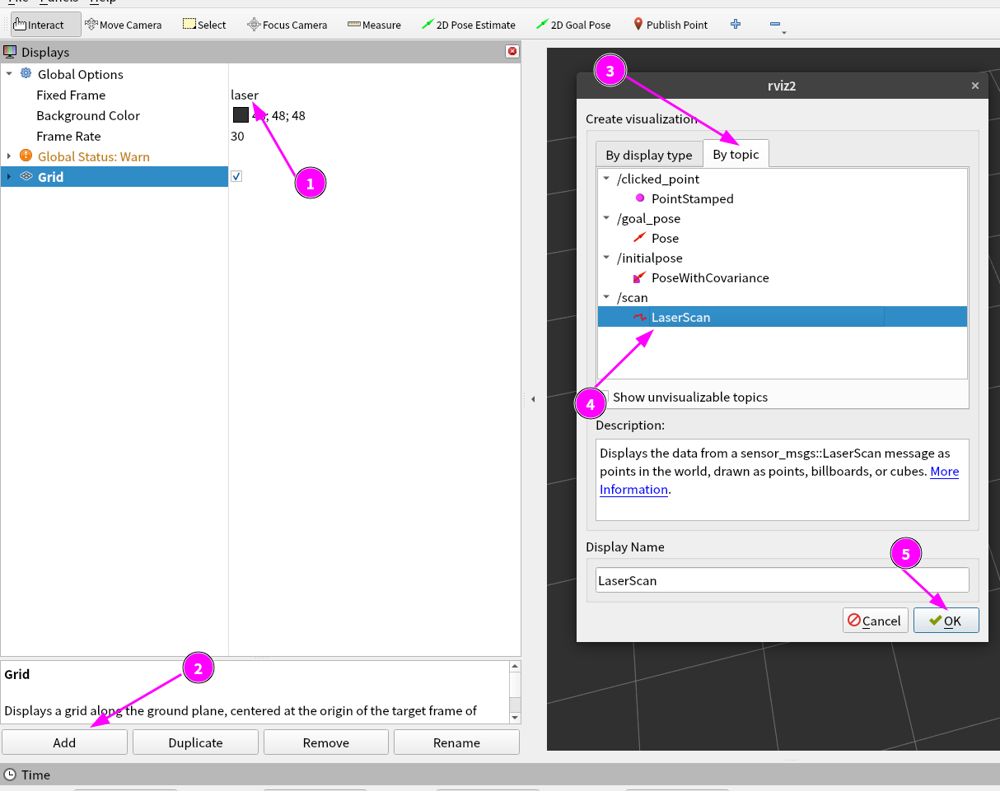
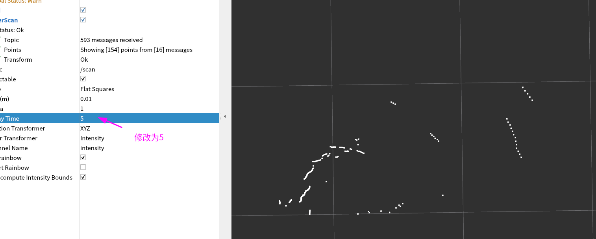

###### datetime:2023/10/26 10:23

###### author:nzb

> 该项目来源于[大佬的动手学ROS2](https://fishros.com/d2lros2)

# 5.可视化点云-雷达消息合成

上一节完成了指定角度距离的测量这一节我们将其合成ROS的laserscan消息，并将其通过microros发布到上位机，最终实现rviz2的可视化。


## 一、雷达消息介绍

使用指令`ros2 interface show sensor_msgs/msg/LaserScan`，可以看到ROS2对雷达数据接口的定义。

```
# Single scan from a planar laser range-finder
#
# If you have another ranging device with different behavior (e.g. a sonar
# array), please find or create a different message, since applications
# will make fairly laser-specific assumptions about this data

std_msgs/Header header # timestamp in the header is the acquisition time of
	builtin_interfaces/Time stamp
		int32 sec
		uint32 nanosec
	string frame_id
                             # the first ray in the scan.
                             #
                             # in frame frame_id, angles are measured around
                             # the positive Z axis (counterclockwise, if Z is up)
                             # with zero angle being forward along the x axis

float32 angle_min            # start angle of the scan [rad]
float32 angle_max            # end angle of the scan [rad]
float32 angle_increment      # angular distance between measurements [rad]

float32 time_increment       # time between measurements [seconds] - if your scanner
                             # is moving, this will be used in interpolating position
                             # of 3d points
float32 scan_time            # time between scans [seconds]

float32 range_min            # minimum range value [m]
float32 range_max            # maximum range value [m]

float32[] ranges             # range data [m]
                             # (Note: values < range_min or > range_max should be discarded)
float32[] intensities        # intensity data [device-specific units].  If your
                             # device does not provide intensities, please leave
                             # the array empty.
```

### 1.1 header部分

头部分，主要是设置雷达的frame_id和时间戳，在microros中可以这样赋值

```c++
pub_msg.header.frame_id = micro_ros_string_utilities_set(pub_msg.header.frame_id, "laser"); // 初始化消息内容
int64_t current_time = rmw_uros_epoch_millis();
pub_msg.header.stamp.sec = current_time * 1e-3;
pub_msg.header.stamp.nanosec = current_time - pub_msg.header.stamp.sec * 1000;
```

### 1.2 数据部分

- angle_min 当前数据中最小的测量角度

- angle_max 当前数据中最大的测量角度

- angle_increment 我们默认就是一次1度，所以可以直接写

  ```
    pub_msg.angle_increment = 1.0 / 180 * PI;
  ```

- time_increment 每个数据之间递增的时间，可以直接使用扫描的总之间除点数
- scan_time 扫描时间，开始扫描到结束扫描的时间
- range_min 最小范围可以直接赋值 我们设置成`0.05`即5cm
- range_max 最大范围，我们直接设置成5.0m

- ranges 测量的距离值数组
- intensities 测量的强度，这里我们直接忽略即可

## 二、代码编写

直接在上一节工程上修改，全部代码如下，一次我们发布10个点，并且启动了ESP32的双核，同时采取了时间同步，保证雷达数据的时间戳正常。

```c++
#include <Arduino.h>
#include <micro_ros_platformio.h>
#include <WiFi.h>
#include <rcl/rcl.h>
#include <rclc/rclc.h>
#include <rclc/executor.h>
#include <ESP32Servo.h>

#include <sensor_msgs/msg/laser_scan.h>
#include <micro_ros_utilities/string_utilities.h>

#define PCOUNT 10
#define Trig 27 // 设定SR04连接的Arduino引脚
#define Echo 21

rclc_executor_t executor;
rclc_support_t support;
rcl_allocator_t allocator;
rcl_node_t node;

rcl_publisher_t publisher;           // 声明话题发布者
sensor_msgs__msg__LaserScan pub_msg; // 声明消息文件

Servo servo1;
bool connected_agent = false;

void microros_task(void *param)
{

  IPAddress agent_ip;                                                    // 设置通过WIFI进行MicroROS通信
  agent_ip.fromString("192.168.2.105");                                  // 从字符串获取IP地址
  set_microros_wifi_transports("fishbot", "12345678", agent_ip, 8888);   // 设置wifi名称，密码，电脑IP,端口号
  delay(2000);                                                           // 延时时一段时间，等待设置完成
  allocator = rcl_get_default_allocator();                               // 初始化内存分配器
  rclc_support_init(&support, 0, NULL, &allocator);                      // 创建初始化选项
  rclc_node_init_default(&node, "example20_simple_laser", "", &support); // 创建节点
  rclc_publisher_init_default(                                           // 发布初始化
      &publisher,
      &node,
      ROSIDL_GET_MSG_TYPE_SUPPORT(sensor_msgs, msg, LaserScan),
      "/scan");

  rclc_executor_init(&executor, &support.context, 1, &allocator);                             // 创建执行器
  pub_msg.header.frame_id = micro_ros_string_utilities_set(pub_msg.header.frame_id, "laser"); // 初始化消息内容
  pub_msg.angle_increment = 1.0 / 180 * PI;
  pub_msg.range_min = 0.05;
  pub_msg.range_max = 5.0;

  while (true)
  {
    delay(10);
    if (!rmw_uros_epoch_synchronized()) // 判断时间是否同步
    {
      rmw_uros_sync_session(1000); //  同步时间
      continue;
    }
    connected_agent = true;
    rclc_executor_spin_some(&executor, RCL_MS_TO_NS(100)); // 循环处理数据
  }
}

float get_distance(int angle)
{
  static double mtime;
  servo1.write(angle);     // 移动到指定角度
  delay(25);               // 稳定身形
  digitalWrite(Trig, LOW); // 测量距离
  delayMicroseconds(2);
  digitalWrite(Trig, HIGH);
  delayMicroseconds(10); // 产生一个10us的高脉冲去触发SR04
  digitalWrite(Trig, LOW);
  mtime = pulseIn(Echo, HIGH);                  // 检测脉冲宽度，注意返回值是微秒us
  float detect_distance = mtime / 58.0 / 100.0; // 计算出距离,输出的距离的单位是厘米cm
  Serial.printf("point(%d,%f)\n", angle, detect_distance);
  return detect_distance;
}

void setup()
{
  Serial.begin(115200);
  pinMode(Trig, OUTPUT);     // 初始化舵机和超声波
  pinMode(Echo, INPUT);      // 要检测引脚上输入的脉冲宽度，需要先设置为输入状态
  servo1.setPeriodHertz(50); // Standard 50hz servo
  servo1.attach(4, 500, 2500);
  servo1.write(90.0);
  xTaskCreatePinnedToCore(microros_task, "microros_task", 10240, NULL, 1, NULL, 0);
}

void loop()
{
  if (!connected_agent)
    return;

  static float ranges[PCOUNT + 1];
  for (int i = 0; i < int(180 / PCOUNT); i++)
  {
    int64_t start_scan_time = rmw_uros_epoch_millis();
    for (int j = 0; j < PCOUNT; j++)
    {
      int angle = i * 10 + j;
      ranges[j] = get_distance(angle);
    }
    pub_msg.angle_min = float(i * 10) / 180 * PI;       // 结束角度
    pub_msg.angle_max = float(i * (10 + 1)) / 180 * PI; // 结束角度

    int64_t current_time = rmw_uros_epoch_millis();
    pub_msg.scan_time = float(current_time - start_scan_time) * 1e-3;
    pub_msg.time_increment = pub_msg.scan_time / PCOUNT;
    pub_msg.header.stamp.sec = current_time * 1e-3;
    pub_msg.header.stamp.nanosec = current_time - pub_msg.header.stamp.sec * 1000;
    pub_msg.ranges.data = ranges;
    pub_msg.ranges.capacity = PCOUNT;
    pub_msg.ranges.size = PCOUNT;
    rcl_publish(&publisher, &pub_msg, NULL);
    delay(10);
  }
}

```

## 三、下载测试

下载代码


启动agent。

```shell
docker run -it --rm -v /dev:/dev -v /dev/shm:/dev/shm --privileged --net=host microros/micro-ros-agent:$ROS_DISTRO udp4 --port 8888 -v6
```


测试

```
ros2 node list
ros2 topic list
ros2 topic echo /scan
```


接着打开终端，输入rviz2打开rviz



修改配置，显示过去5s数据



## 四、总结

本节我们成功实现了使用超声波和舵机模拟雷达数据，并将其合成scan发布到电脑上使用rviz2进行可视化。至此我们完成了ROS2硬件控制的所有课程。下面迎接你的将是移动机器人和机械臂开发课程，请做好准备，继续出发。