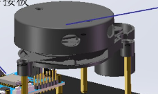
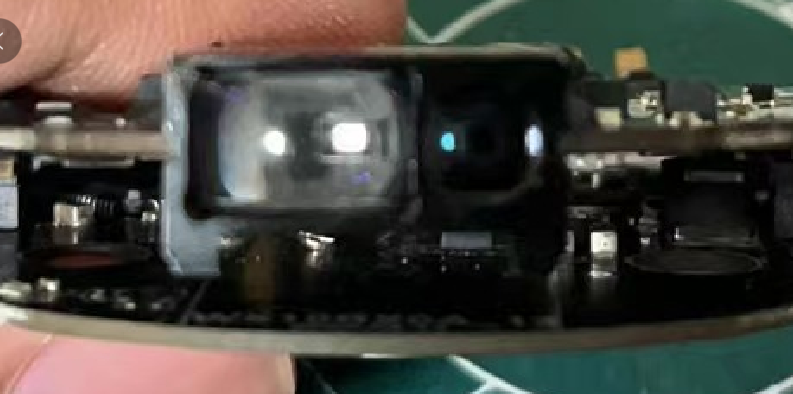
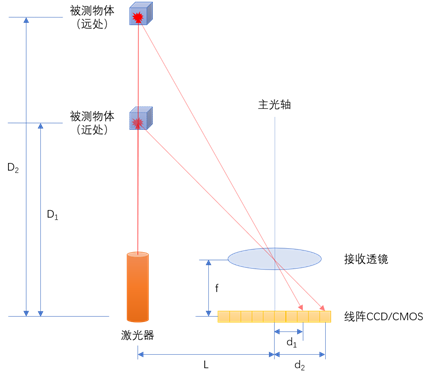
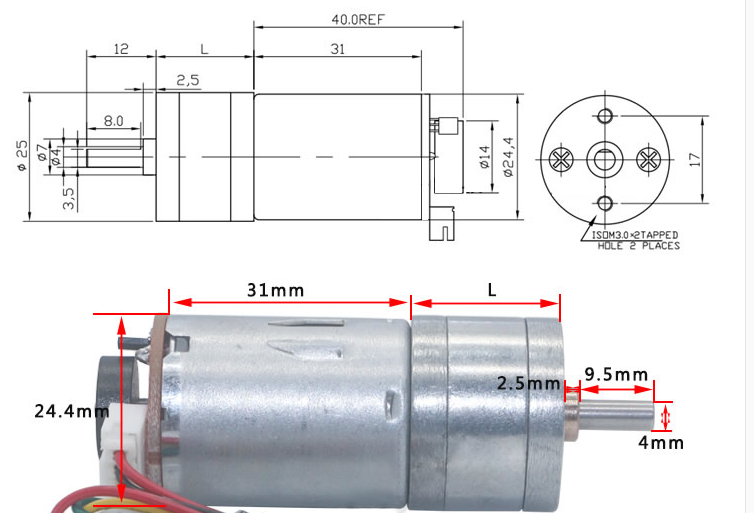

###### datetime:2023/10/31 14:20

###### author:nzb

> 该项目来源于[大佬的动手学ROS2](https://fishros.com/d2lros2)

# 1.移动机器人底盘结构介绍

本节我们对移动机器人底盘结构进行简单的介绍，并着重介绍FishBot基础版的组成结构。

对于一个移动底盘来说，所要提供的核心功能有两个-感知和执行能力，我们分别进行介绍。

## 一、感知-传感器

所谓感知即通过给类传感器获取环境信息的能力。在移动机器人中，我们常用的传感器有

- 距离传感器——雷达、超声波
- 轮子速度传感器——编码器
- 惯性测量单元——IMU传感器
- 图像传感器——单目、双目、深度摄像头

除了上面几类之外，你也可以根据需求挂载其他你需要的传感器，比如温湿度测量传感器等。

对于FishBot基础版来说，搭载的传感器有雷达、超声波、编码器和IMU四种。

在上一篇中我们已经使用了超声波和IMU，所以本节我们对雷达和编码器这两种传感器进行简单介绍。

### 1.1 雷达

我们采用的激光雷达是单线旋转式三角测距激光雷达。

#### 1.1.1 雷达测距原理介绍

在雷达的头部分别有一个激光发射头和线性的CCD接收头。

特意拆了个雷达，放张图给大家看看

右边黑色的是发射头，左边是CCD接收头，发射头发射出的光属于波长大约在1000nm左右的红外光，肉眼是不可见的。

FishBot所采用的这种激光雷达的测距原理是三角测距法

从上图可以看出，当我们已知L（机械安装值）和d1（CCS测量值）和f（机械安装值）的情况下，我们可以得到D1的值，即激光雷达到被测物体的距离

$$ D_1/(L+d_2)=f/d_2 \\ D_1 = (f*(L+d_2))/d_2 = fL/d_2+f $$

激光头通过不断旋转，这样就可以测量出360度的深度信息。

### 1.2 编码器

在移动机器人中我们需要实时的获取到机器人各个轮子的转速，通过转速根据机器人的运动学模型将轮子的速度转换成机器人的速度，通过对速度进行积分（速度*距离）得到机器人行走的距离。

我们如何对轮子速度的测量所使用的传感器就是编码器，在FishBot上，我们采用的是AB电磁编码器。

电磁编码器是由1和2两个霍尔传感器和圆形磁铁3共同组成的，该磁铁的磁性是间隔分布的，磁铁固定在电机的转子上，当电机转动时，带动磁铁转动，此时用于检测磁性的霍尔传感器就会检测到磁性的变化，从而就可以测量出电机在某段时间内转了多少圈即电机的转速。

## 二、执行器

所谓执行器就是负责动的部件，在移动机器人上，最重要的一个执行器就是电机了，除此之外我们也可以把OLED这种显示设备看作一个可以操作的执行器。

电机有很多分类，大类可以按照有刷无刷、直流交流来分类，具体就不展开了，我们下面主要介绍FishBot所采用的电机。

### 2.1 电机

我们FishBot上采用的是一个额定电压12V的370减速电机，额定转速为130转/分、额定电流0.5A，转矩600克力厘米。

电机相信你很熟悉，那什么是减速电机呢？减速电机指的是带减速器的电机。

电机一般由定子和转子组成的，一般转速都比较快，但输出的力矩比较小，所以我们会给电机配备减速器，让转速降低，提高力矩。

## 三、其他配件

除了执行器和传感器外，还有一些必要配件

- 电池，提供电力支持
- 稳压模块，提供电压转换，FishBot以将其集成到主控板上
- 万向轮等必要支撑结构
