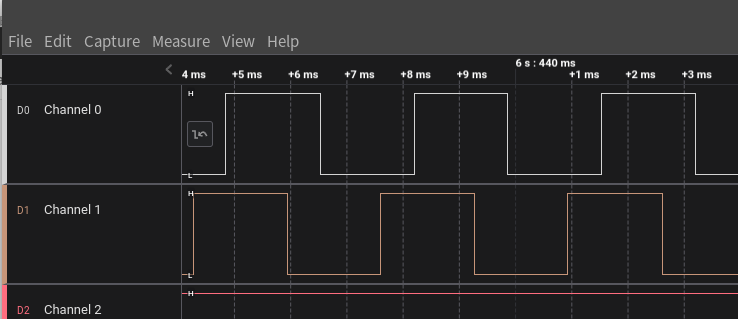

###### datetime:2023/11/01 10:06

###### author:nzb

> 该项目来源于[大佬的动手学ROS2](https://fishros.com/d2lros2)
> 
> [ros2 examples](https://github.com/ros2/examples)

# 7.从编码器说起-速度测量原理介绍

上节做完小车，遥控时小车前进时你应该会发现，小车很难走一条直线，但明明我们给到两个电机的PWM占空比都是相同的，原因在于每一个电机的硬件参数并不能完全的保证一致，所以当我们采用开环控制时，即使我们给到每个电机相同的电压，也不能让两个电机保持相同的转速。

要解决这个问题我们就要把开环控制改成闭环控制，我们要实现的是速度闭环，所以第一步我们要实现的是对电机速度的测量。

## 一、轮速测量原理

第一节中介绍过，我们采用的是AB磁编码器，编码器直接连接到了我们的单片机IO上，当电机转动时，IO上的电平高低就会产生变化，我们称这种电平从低到高再到低的过程称作一个脉冲。

因为有减速机的存在，当减速器的输出轴（轮胎）转动了一圈，我们会检测到多个脉冲。所以要想通过编码器得出轮子的速度，我们需要知道检测到一个脉冲时，轮子行走多远距离。

我们FishBot上的电机轮子直径为`65mm`，当轮子转一圈时产生N个脉冲，那么一个脉冲轮子前进的距离D可以这样计算，单位是mm。

$$ D = 65*PI/N $$

下面我们将通过实际的测试确定D的值，已知D的情况下，我们测得，某一段时间 $$\Delta T$$ (ms)内测得脉冲数为 $$P_T$$ ，则此时电机的转速为 $$V_T$$ (m/s)

$$ V_T = ((P_T*D)/1000)/(\Delta T/1000) \\ =(P_T*D)/\Delta T $$

## 二、轮速测量原理

你可能会好奇，为什么我们的电机后面有两个霍尔传感器，用一个不就可以对电机进行测速了吗？原因是使用两个会更精准，同时可以测量方向。

我们把磁铁看作小汽车，AB两个传感器是一条路上前后两个摄像头，如果汽车是正着行驶的，你会发现总是A摄像头先看到汽车，然后再是B，但如果反过来行驶，则是B摄像头先看到设备。

```
			[A]  		[B]
-------------------------------------------------------------
	[汽车-->]								[<--汽车]
-------------------------------------------------------------
```

为了更加直观也分别用逻辑分析仪测量了两段轮子正转和反转时，AB编码器上电平的变化。


放大正转时，当A（通道0）电平为高电平后（A摄像头先看到了汽车），过了一段时间B（通道1）才变为高电平（B摄像头看到了汽车）。


放大反转部分，当A（通道0）电平为高电平后（A摄像头看到了汽车），在A之前B（通道1）已经为高电平了（B摄像头先看到了汽车）。



所以在代码中我们可以检测到当A通道从低电平变成高电平时，B通道的电平值，如果为低则表示正转，为高则表示反转。

# 8.脉冲测量与校准实验

有了上面的理论，这一节我们编写代码来尝试下是否能够读取到电机上编码器的脉冲数，并通过实验测试出小车的输出轴转速和编码器脉冲的比值。

## 一、新建工程并导入开源库

新建`example25_encoder`


添加依赖

```ini
[env:featheresp32]  ; 这是一个环境配置标签，指定了代码将运行的硬件平台和框架
platform = espressif32  ; 指定了使用的平台为Espressif 32
board = featheresp32  ; 指定使用的硬件板为Feather ESP32
framework = arduino  ; 指定使用的框架为Arduino
lib_deps = ; 列出所有依赖库的URL，这些库将被下载和安装
    https://github.com/fishros/Esp32PcntEncoder.git  ; ESP32 编码器驱动库
```

这里我们使用的是`Esp32PcntEncoder`开源库，这个库调用了`ESP32`的脉冲计算外设进行编码器脉冲的计算，使用非常简单。

## 二、代码实现

编写代码

```cpp
#include <Arduino.h>
#include <Esp32PcntEncoder.h>

Esp32PcntEncoder encoders[2]; // 创建一个数组用于存储两个编码器

void setup()
{
  // 1.初始化串口
  Serial.begin(115200); // 初始化串口通信，设置通信速率为115200

  // 2.设置编码器
  encoders[0].init(0, 32, 33); // 初始化第一个编码器，使用GPIO 32和33连接
  encoders[1].init(1, 26, 25); // 初始化第二个编码器，使用GPIO 26和25连接
}

void loop()
{
  delay(10); // 等待10毫秒

  // 读取并打印两个编码器的计数器数值
  Serial.printf("tick1=%d,tick2=%d\n", encoders[0].getTicks(), encoders[1].getTicks());
}
```

上面这段代码使用了`ESP32PcntEncoder`库来读取两个旋转编码器的计数器数值。其中，函数`setup()`用于初始化串口和编码器；函数`loop()`用于读取并打印两个编码器的计数器数值。以下是代码的详细解释：

1. 首先包含了两个头文件`Arduino.h`和`Esp32PcntEncoder.h`，用于编写`Arduino`程序和使用`ESP32PcntEncoder`库。
2. 在全局变量中创建了一个长度为2的`Esp32PcntEncoder`数组，用于存储两个编码器。
3. 函数setup()用于初始化串口和编码器。在本代码中，首先通过`Serial.begin()`函数初始化串口，设置通信速率为`115200`。然后通过`encoders[0].init()`和`encoders[1].init()`
   函数分别初始化了两个编码器。其中，函数init()需要传入三个参数，分别是编码器的`ID`、引脚A的`GPIO`编号和引脚B的`GPIO`编号。在本代码中，第一个编码器的`ID`为`0`，引脚A连接的`GPIO`为`32`
   ，引脚B连接的`GPIO`为`33`；第二个编码器的`ID`为`1`，引脚A连接的`GPIO`为`26`，引脚B连接的`GPIO`为`25`。
4. 函数loop()用于读取并打印两个编码器的计数器数值。在本代码中，首先通过delay()函数等待10毫秒。然后通过`encoders[0].getTicks()`和`encoders[1].getTicks()`
   函数分别读取了两个编码器的计数器数值。最后通过`Serial.printf()`函数将这两个数值打印。

## 三、下载测试

将代码下载进入开发板，打开串口监视器，查看输出。


## 四、脉冲/圈计算

为了计算一个脉冲轮子前进的距离，我们可以通过手动将轮子旋转10圈，然后利用前面的公式进行计算。

这里将轮子转动10圈后得到脉冲数为`19419`，也就是说当前电机1941.8个脉冲/圈


根据公式可以算出，一个脉冲轮子前进的距离为 $$ D = 65*PI/(19419/10)\\ =0.1051566 $$ 接着我们可以利用公式计算速度。