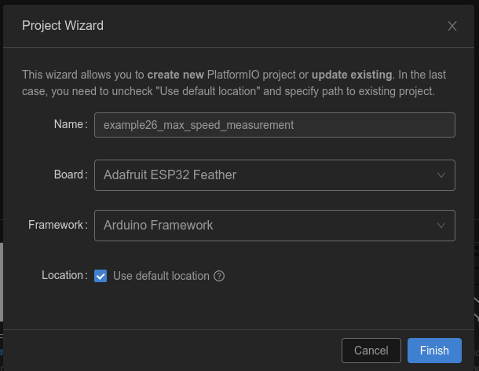

###### datetime:2023/11/01 10:06

###### author:nzb

> 该项目来源于[大佬的动手学ROS2](https://fishros.com/d2lros2)

# 9.速度转换-机器人最大速度测量

有了上一节的测量值，这一节我们尝试对电机最大速度进行测量。

## 一、新建工程并导入开源库

新建`example26_max_speed_measurement`



添加依赖

```ini
[env:featheresp32]  ; 这是一个环境配置标签，指定了代码将运行的硬件平台和框架
platform = espressif32  ; 指定了使用的平台为Espressif 32
board = featheresp32  ; 指定使用的硬件板为Feather ESP32
framework = arduino  ; 指定使用的框架为Arduino
lib_deps = ; 列出所有依赖库的URL，这些库将被下载和安装
    https://github.com/fishros/Esp32PcntEncoder.git  ; ESP32 编码器驱动库
```

## 二、编写代码

编写代码

```cpp
#include <Arduino.h>
#include <Esp32PcntEncoder.h>

Esp32PcntEncoder encoders[2]; // 创建一个数组用于存储两个编码器
int64_t last_ticks[2]; // 记录上一次读取的计数器数值
int32_t pt[2]; // 记录两次读取之间的计数器差值
int64_t last_update_time; // 记录上一次更新时间
float speeds[2]; // 记录两个电机的速度

void setup()
{
  // 1.初始化串口
  Serial.begin(115200); // 初始化串口通信，设置通信速率为115200

  // 2.设置编码器
  encoders[0].init(0, 32, 33); // 初始化第一个编码器，使用GPIO 32和33连接
  encoders[1].init(1, 26, 25); // 初始化第二个编码器，使用GPIO 26和25连接

  // 3.让电机1以最大速度转起来
  pinMode(23, OUTPUT);
  digitalWrite(23, HIGH);
}

void loop()
{
  delay(10); // 等待10毫秒

  // 4.计算两个电机的速度
  uint64_t dt = millis() - last_update_time; // 计算两次读取之间的时间差
  pt[0] = encoders[0].getTicks() - last_ticks[0]; // 计算第一个编码器两次读取之间的计数器差值
  pt[1] = encoders[1].getTicks() - last_ticks[1]; // 计算第二个编码器两次读取之间的计数器差值

  speeds[0] = float(pt[0] * 0.1051566) / dt; // 计算第一个电机的速度
  speeds[1] = float(pt[1] * 0.1051566) / dt; // 计算第二个电机的速度

  // 5.更新记录
  last_update_time = millis(); // 更新上一次更新时间
  last_ticks[0] = encoders[0].getTicks(); // 更新第一个编码器的计数器数值
  last_ticks[1] = encoders[1].getTicks(); // 更新第二个编码器的计数器数值

  // 6.打印信息
  Serial.printf("tick1=%d,tick2=%d\n", encoders[0].getTicks(), encoders[1].getTicks()); // 打印两个编码器的计数器数值
  Serial.printf("spped1=%f,spped2=%f\n", speeds[0], speeds[1]); // 打印两个电机的速度
}
```

在`loop()`函数中，首先等待10毫秒，然后读取两个编码器的计数器数值，并且计算出它们的旋转速度。

其中，`last_ticks`数组用于存储上一次读取的计数器数值，`pt`数组存储两次读取之间的计数器增量，`last_update_time`变量存储上一次读取的时间，`speeds`数组存储两个编码器的旋转速度。

最后，通过串口打印出两个编码器的计数器数值和旋转速度。此外，还让GPIO 23输出高电平，使电机1以最大速度转动。

## 三、下载测试

下载代码，观察串口打印


最大速度为`-0.389079m/s`。

## 四、总结

本节我们完成了对电机速度的测量，下一节我们尝试利用PID动态的控制电机保持在某个转速。
