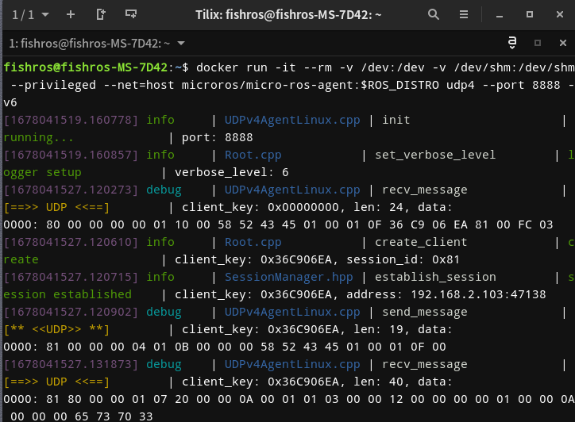
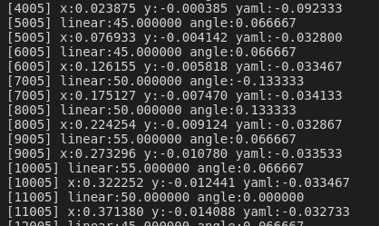

###### datetime:2023/11/02 10:06

###### author:nzb

> 该项目来源于[大佬的动手学ROS2](https://fishros.com/d2lros2)

## 14.里程计计算-速度积分

前面两节中我们完成机器人底盘正逆解的计算，我们通过机器人的运动学逆解完成了机器人实时的角速度和线速度的测量，那我们能不能利用对线速度和角速度的积分，计算机器人当前的位置呢？答案肯定是可以的，那么本节我们就来编写代码实现机器人的里程计。

## 一、里程计计算原理

在某一个时间段$$t$$中，机器人的线速度为$$v_t$$ ，角速度为$$w_t$$ ，机器人在初始时刻的位置为 $$x_t,y_t$$ 朝向为 $$\theta _t$$ ,求经过$$t$$时刻是机器人新的位置和朝向，这一过程中假设机器人仅在平面上运动。

在这一段时间内机器人前进的距离为$$d$$ $$ d = v_t*t $$ 转过的角度为 $$\theta$$ 

$$ \theta =\omega _t*t $$ 

则机器人新的角度为

$$\theta _{t+1}$$ 

$$ \theta _{t+1} = \theta _{t}+\theta $$ 

我们将机器人前进的距离根据其朝向分解为在x和y轴上的位移量，则可得出 

$$ x_{t+1} = x_t + d*cos(\theta_{t+1}) \\ y_{t+1} = y_t + d*sos(\theta_{t+1}) $$ 

有了公式，我们开始撸代码。

## 二、编写代码

先修改`Kinematics.h`头文件，增加角度范围限制，里程计更新和里程计结构体定义，完成后代码如下：

```cpp
/**
 * @file Kinematics.h
 * @author fishros@foxmail.com
 * @brief 机器人模型设置,编码器轮速转换,ODOM推算,线速度角速度分解
 * @version V1.0.0
 * @date 2022-12-10
 *
 * @copyright Copyright www.fishros.com (c) 2022
 *
 */
#ifndef __KINEMATICS_H__
#define __KINEMATICS_H__
#include <Arduino.h>

typedef struct
{
    uint8_t id;                // 电机编号
    uint16_t reducation_ratio; // 减速器减速比，轮子转一圈，电机需要转的圈数
    uint16_t pulse_ration;     // 脉冲比，电机转一圈所产生的脉冲数
    float wheel_diameter;      // 轮子的外直径，单位mm

    float per_pulse_distance;  // 无需配置，单个脉冲轮子前进的距离，单位mm，设置时自动计算
                               // 单个脉冲距离=轮子转一圈所行进的距离/轮子转一圈所产生的脉冲数
                               // per_pulse_distance= (wheel_diameter*3.1415926)/(pulse_ration*reducation_ratio)
    uint32_t speed_factor;     // 无需配置，计算速度时使用的速度因子，设置时自动计算，speed_factor计算方式如下
                               // 设 dt（单位us,1s=1000ms=10^6us）时间内的脉冲数为dtick
                               // 速度speed = per_pulse_distance*dtick/(dt/1000/1000)=(per_pulse_distance*1000*1000)*dtic/dt
                               // 记 speed_factor = (per_pulse_distance*1000*1000)
    int16_t motor_speed;       // 无需配置，当前电机速度mm/s，计算时使用
    int64_t last_encoder_tick; // 无需配置，上次电机的编码器读数
    uint64_t last_update_time; // 无需配置，上次更新数据的时间，单位us
} motor_param_t;


/**
 * @brief 里程计相关信息，根据轮子速度信息和运动模型推算而来
 *
 */
typedef struct
{
    float x;                 // 坐标x
    float y;                 // 坐标y
    float yaw;               // yaw
    float linear_speed;      // 线速度
    float angular_speed;     // 角速度
} odom_t;


class Kinematics
{
private:
    motor_param_t motor_param_[2];
    float wheel_distance_; // 轮子间距
    odom_t odom_;          // 里程计数据
public:
    Kinematics(/* args */) = default;
    ~Kinematics() = default;

    static void TransAngleInPI(float angle,float& out_angle);

    /**
     * @brief 设置电机相关参数
     * 
     * @param id 
     * @param reducation_ratio 
     * @param pulse_ration 
     * @param wheel_diameter 
     */
    void set_motor_param(uint8_t id, uint16_t reducation_ratio, uint16_t pulse_ration, float wheel_diameter);
    /**
     * @brief 设置运动学相关参数
     * 
     * @param wheel_distance 
     */
    void set_kinematic_param(float wheel_distance);

    /**
     * @brief 运动学逆解，输入机器人当前线速度和角速度，输出左右轮子应该达到的目标速度
     * 
     * @param line_speed 
     * @param angle_speed 
     * @param out_wheel1_speed 
     * @param out_wheel2_speed 
     */
    void kinematic_inverse(float line_speed, float angle_speed, float &out_wheel1_speed, float &out_wheel2_speed);


    /**
     * @brief 运动学正解，输入左右轮子速度，输出机器人当前线速度和角速度
     * 
     * @param wheel1_speed 
     * @param wheel2_speed 
     * @param line_speed 
     * @param angle_speed 
     */
    void kinematic_forward(float wheel1_speed, float wheel2_speed, float &line_speed, float &angle_speed);

    /**
     * @brief 更新轮子的tick数据
     * 
     * @param current_time 
     * @param motor_tick1 
     * @param motor_tick2 
     */
    void update_motor_ticks(uint64_t current_time, int32_t motor_tick1, int32_t motor_tick2);

    /**
     * @brief 获取轮子当前速度
     * 
     * @param id 
     * @return float 
     */
    float motor_speed(uint8_t id);

    /**
     * @brief 更新机器人里程计信息
     * 
     * @param dt 间隔时间dt
     */
    void update_bot_odom(uint32_t dt);
    
    /**
     * @brief 获取里程计函数
     * 
     * @return odom_t& 
     */
    odom_t &odom();

};

#endif // __KINEMATICS_H__
```

接着在`Kinematics.cpp`中实现刚刚定义的函数，主要添加函数代码如下：

```cpp
void Kinematics::update_bot_odom(uint32_t dt)
{
    static float linear_speed, angular_speed;
    float dt_s = (float)(dt / 1000) / 1000;

    this->kinematic_forward(motor_param_[0].motor_speed, motor_param_[1].motor_speed, linear_speed, angular_speed);

    odom_.angular_speed = angular_speed;
    odom_.linear_speed = linear_speed / 1000; // /1000（mm/s 转 m/s）

    odom_.yaw += odom_.angular_speed * dt_s;

    Kinematics::TransAngleInPI(odom_.yaw, odom_.yaw);
    

    /*更新x和y轴上移动的距离*/
    float delta_distance = odom_.linear_speed * dt_s; // 单位m
    odom_.x += delta_distance * std::cos(odom_.yaw);
    odom_.y += delta_distance * std::sin(odom_.yaw);

}

void Kinematics::TransAngleInPI(float angle, float &out_angle)
{
    if (angle > PI)
    {
        out_angle -= 2 * PI;
    }
    else if (angle < -PI)
    {
        out_angle += 2 * PI;
    }
}

odom_t &Kinematics::odom()
{
    return odom_;
}

```

同时修改`update_motor_ticks`函数，在其中添加`update_bot_odom`。

```cpp
void Kinematics::update_motor_ticks(uint64_t current_time, int32_t motor_tick1, int32_t motor_tick2)
{

    uint32_t dt = current_time - motor_param_[0].last_update_time;   // 计算时间差
    int32_t dtick1 = motor_tick1 - motor_param_[0].last_encoder_tick;   // 计算电机1脉冲差
    int32_t dtick2 = motor_tick2 - motor_param_[1].last_encoder_tick;   // 计算电机2脉冲差
    // 轮子速度计算
    motor_param_[0].motor_speed = dtick1 * (motor_param_[0].speed_factor / dt);   // 计算电机1轮子速度
    motor_param_[1].motor_speed = dtick2 * (motor_param_[1].speed_factor / dt);   // 计算电机2轮子速度

    motor_param_[0].last_encoder_tick = motor_tick1;   // 更新电机1上一次的脉冲计数
    motor_param_[1].last_encoder_tick = motor_tick2;   // 更新电机2上一次的脉冲计数
    motor_param_[0].last_update_time = current_time;   // 更新电机1上一次更新时间
    motor_param_[1].last_update_time = current_time;   // 更新电机2上一次更新时间

    // 更新机器人里程计
    this->update_bot_odom(dt);
}

```

修改main.cpp中加入打印里程计数据

```cpp
void loop()
{
  static float out_motor_speed[2];
  static uint64_t last_update_info_time = millis();
  kinematics.update_motor_ticks(micros(), encoders[0].getTicks(), encoders[1].getTicks());
  out_motor_speed[0] = pid_controller[0].update(kinematics.motor_speed(0));
  out_motor_speed[1] = pid_controller[1].update(kinematics.motor_speed(1));
  motor.updateMotorSpeed(0, out_motor_speed[0]);
  motor.updateMotorSpeed(1, out_motor_speed[1]);

  unsigned long currentMillis = millis(); // 获取当前时间
  if (currentMillis - previousMillis >= interval)
  {                                 // 判断是否到达间隔时间
    previousMillis = currentMillis; // 记录上一次打印的时间
    float linear_speed, angle_speed;
    kinematics.kinematic_forward(kinematics.motor_speed(0), kinematics.motor_speed(1), linear_speed, angle_speed);
    Serial.printf("[%ld] linear:%f angle:%f\n", currentMillis, linear_speed, angle_speed);                       // 打印当前时间
    Serial.printf("[%ld] x:%f y:%f yaml:%f\n", currentMillis,kinematics.odom().x, kinematics.odom().y, kinematics.odom().yaw); // 打印当前时间
  }

  // 延迟10毫秒
  delay(10);
}
```

## 三、下载测试

下载代码，运行agent，点击RST按键。

```shell
sudo docker run -it --rm -v /dev:/dev -v /dev/shm:/dev/shm --privileged --net=host microros/micro-ros-agent:$ROS_DISTRO udp4 --port 8888 -v6
```



看到连接建立表示通信成功，接着用`ros2 topic list`

```shell
ros2 topic list
```


看到`/cmd_vel`表示正常，接着我们使用`teleop_twist_keyboard`进行键盘控制

```shell
ros2 run teleop_twist_keyboard teleop_twist_keyboard
```

先调整下速度，降低到0.05左右（50cm/s），然后使用i\j\j\k\,测试。

可以先让机器人空转，点击i，让机器人前进用串口查看数据变化。



可以看到每次大约增加0.5左右，数据正常。

## 四、总结

最后记得提交代码

```shell
git add .
git commit -m "feat(13.14):完成里程计计算-速度积分"
```
