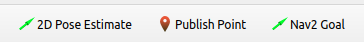
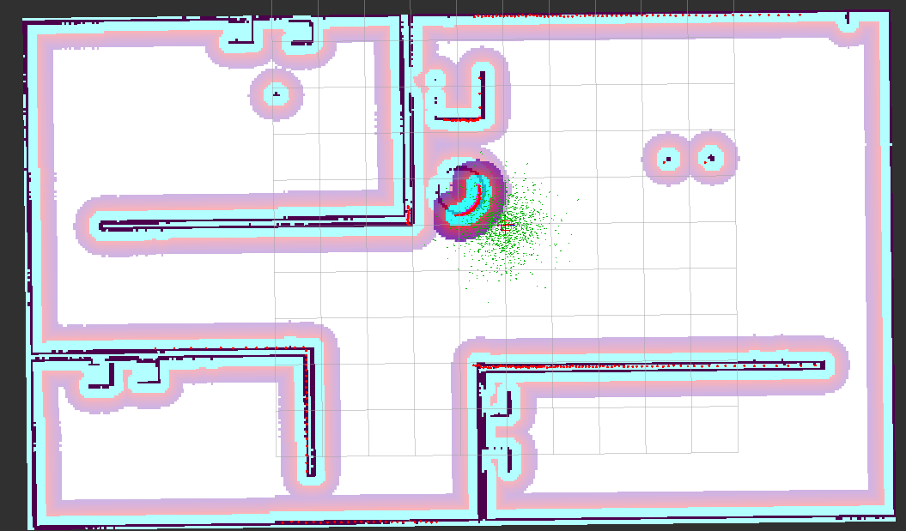
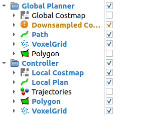
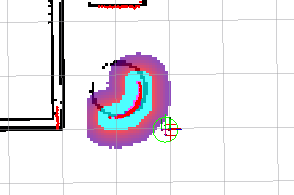
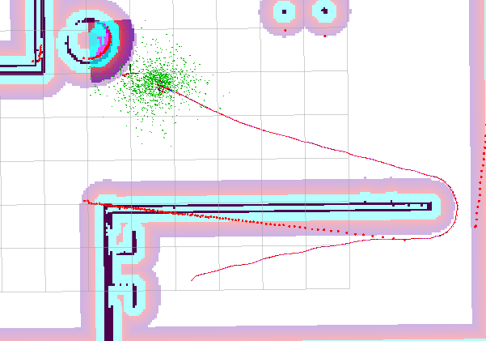
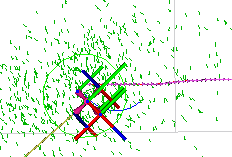
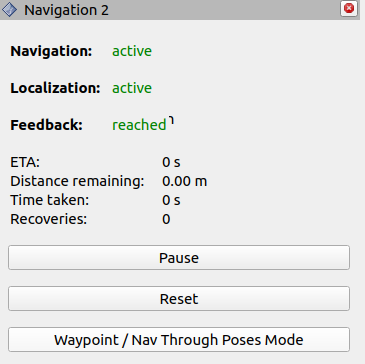
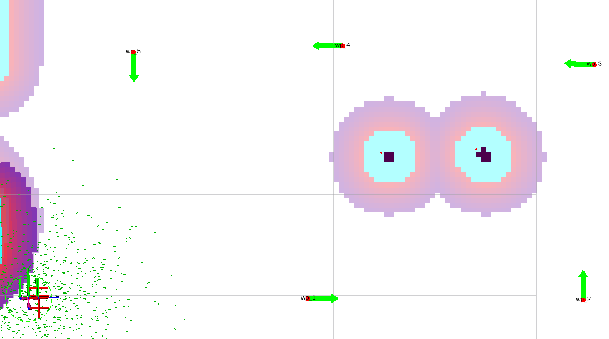
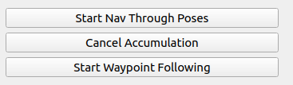
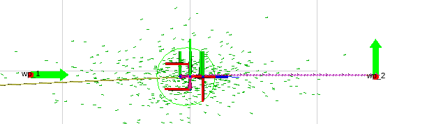

###### datetime:2023/11/09 17:27

###### author:nzb

> 该项目来源于[大佬的动手学ROS2](https://fishros.com/d2lros2)
> 
> [ros2 examples](https://github.com/ros2/examples)

# 3. 编写 Launch 并启动导航

有了参数，接着我们来编写一个 Launch 文件来传递参数并启动导航。

在编写 launch 前，需要将slam部分建立好的地图保存拷贝一份到 src/fishbot_navigation2/maps 文件夹下。

## 一、编写Launch

在 fishbot_navigation2 功能包下新建 launch 目录，然后再目录下新建 navigation2.launch.py，输入如下代码：

```
import os
import launch
import launch_ros
from ament_index_python.packages import get_package_share_directory
from launch.launch_description_sources import PythonLaunchDescriptionSource


def generate_launch_description():
    # 获取与拼接默认路径
    fishbot_navigation2_dir = get_package_share_directory(
        'fishbot_navigation2')
    nav2_bringup_dir = get_package_share_directory('nav2_bringup')
    rviz_config_dir = os.path.join(
        nav2_bringup_dir, 'rviz', 'nav2_default_view.rviz')
    
    # 创建 Launch 配置
    use_sim_time = launch.substitutions.LaunchConfiguration(
        'use_sim_time', default='false')
    map_yaml_path = launch.substitutions.LaunchConfiguration(
        'map', default=os.path.join(fishbot_navigation2_dir, 'maps', 'fishbot_map.yaml'))
    nav2_param_path = launch.substitutions.LaunchConfiguration(
        'params_file', default=os.path.join(fishbot_navigation2_dir, 'config', 'nav2_params.yaml'))

    return launch.LaunchDescription([
        # 声明新的 Launch 参数
        launch.actions.DeclareLaunchArgument('use_sim_time', default_value=use_sim_time,
                                             description='Use simulation (Gazebo) clock if true'),
        launch.actions.DeclareLaunchArgument('map', default_value=map_yaml_path,
                                             description='Full path to map file to load'),
        launch.actions.DeclareLaunchArgument('params_file', default_value=nav2_param_path,
                                             description='Full path to param file to load'),

        launch.actions.IncludeLaunchDescription(
            PythonLaunchDescriptionSource(
                [nav2_bringup_dir, '/launch', '/bringup_launch.py']),
            # 使用 Launch 参数替换原有参数
            launch_arguments={
                'map': map_yaml_path,
                'use_sim_time': use_sim_time,
                'params_file': nav2_param_path}.items(),
        ),
        launch_ros.actions.Node(
            package='rviz2',
            executable='rviz2',
            name='rviz2',
            arguments=['-d', rviz_config_dir],
            parameters=[{'use_sim_time': use_sim_time}],
            output='screen'),
    ])

```

我们让这个 Launch 对外提供三个可配置的参数，是否使用仿真时间 use_sim_time，地图文件路径 map_yaml_path 和导航参数路径 nav2_param_path，默认值都已经设好了。

接着修改 CMakeLists.txt，添加 launch、config 和 maps 三个目安装到 install 目录下的指令，然后重新构建功能包完成文件拷贝。

## 二、启动底盘和雷达

必要步骤，不再赘述

## 三、启动导航

```
colcon build
source install/setup.bash
ros2 launch fishbot_navigation2 navigation2.launch.py
```

启动后可以看到 RViz 已经正确加载出我们建的地图了，但是此时启动终端中会报 TF 相关的错误，这是因为我们还没有设定机器人初始位置。在 RViz 的工具栏可以看到如下图所示的几个操作按钮。



2D Pose Estimate 就是用于初始化位置的工具，而 Nav2 Goal 则是设置导航目标点的工具。选中 2D Pose
Estimate，然后使用鼠标左键点击地图中机器人目前所在的大概位置，不要松开左键，拖动鼠标调整机器人朝向，如果觉得设置的不够准确，可以多次设置。

设置完成后，此时终端就不再报错了，初始化位置后的地图发生了些变化，初始化完成位置之后的地图如下图所示。



可以看到，原有的障碍物边界好像变都变大了，这个其实就是代价地图的膨胀图层，膨胀图层是 Navigation 2 为了防止机器人和障碍物发生碰撞，在原有的地图基础上，将图中障碍物的周围按照一定的半径进行膨胀形成的。

因为全局路径规划和局部路径规划使用的地图并不同，所以在机器人周围障碍物在会在局部代价地图上进行膨胀。在 RViz 左侧显示部分，修改 Global Planner 配置，取消全局代价地图 Global Costmap
的显示，配置如下左图所示，接着就可以看到如下右图所示的局部代价地图及其膨胀层了。





# 4.进行单点与路点导航

简单了解下地图结构，我们可以使用 Nav2 Goal 按钮给定目标点，让机器人自主进行导航。点击该工具，选择一个目标位置和朝向，就可以看到规划出来的全局路径，并且机器人已经开始移动了。



如果在机器人移动的过程中，放大图像，你将看到如下图所示的一条很短的蓝色线条，这个线条就是局部路径规划的结果。



接着我们来测试指定路点的导航，路点就是指路过的点，比如你要从家前往学校可以有多个路线，但你希望可以经过某家店买些东西，就可以指定要经过这家店。使用路点导航，Navigation 2 就会在规划路径按照你指定的顺序进行导航。



通过这个插件可以取消导航任务，也可以设置多个目标点的导航，点击最下面的 Waypoint/Nav Through Poses Mode ，接着使用 Nav2 Goal
依次设置多个路点，比如下图中设置了五个路点，让机器人绕过咖啡桌再到左前方的目标点。



设置完成后，就可以开启路点导航了。如下图所示在 RViz 的左下角的窗口上有三个按钮，点击最下面一个 Start Waypoint Follwing 就可以启动路点导航。



接着就可以看到机器人依次走向每一个目标点了，行走路径如下图所示。



# 5.使用API进行导航

Navigation 2 对外提供了动作服务用于导航调用。动作通信是 ROS 2 四大通讯机制之一。

动作通信和其名字一样，主要用于控制场景，它的优点在于其反馈机制，当客户端发送目标给服务端后，除了等待服务端处理完成，还可以收到服务端的处理进度。启动导航后在终端中使用动作相关命令可以查看当前系统所有动作列表，命令及结果如下：

```
ros2 action list
--
/assisted_teleop
/backup
/compute_path_through_poses
/compute_path_to_pose
/drive_on_heading
/follow_path
/follow_waypoints
/navigate_through_poses
/navigate_to_pose
/smooth_path
/spin
/wait
```

其中 /navigate_to_pose 就是用于处理导航到点请求的动作。继续使用命令查看该动作的具体信息。

```
ros2 action info /navigate_to_pose -t
---
Action: /navigate_to_pose
Action clients: 4
    /bt_navigator [nav2_msgs/action/NavigateToPose]
    /waypoint_follower [nav2_msgs/action/NavigateToPose]
    /rviz2 [nav2_msgs/action/NavigateToPose]
    /rviz2 [nav2_msgs/action/NavigateToPose]

Action servers: 1
    /bt_navigator [nav2_msgs/action/NavigateToPose]
```

可以看到该动作的客户端、服务端以及消息接口情况，使用指令查看 nav2_msgs/action/NavigateToPose 接口定义，命令及结果如下：

```
ros2 interface show nav2_msgs/action/NavigateToPose
---
#goal definition
geometry_msgs/PoseStamped pose
	std_msgs/Header header
		builtin_interfaces/Time stamp
			int32 sec
			uint32 nanosec
		string frame_id
	Pose pose
		Point position
			float64 x
			float64 y
			float64 z
		Quaternion orientation
			float64 x 0
			float64 y 0
			float64 z 0
			float64 w 1
string behavior_tree
---
#result definition
std_msgs/Empty result
---
#feedback definition
geometry_msgs/PoseStamped current_pose
	std_msgs/Header header
		builtin_interfaces/Time stamp
			int32 sec
			uint32 nanosec
		string frame_id
	Pose pose
		Point position
			float64 x
			float64 y
			float64 z
		Quaternion orientation
			float64 x 0
			float64 y 0
			float64 z 0
			float64 w 1
builtin_interfaces/Duration navigation_time
	int32 sec
	uint32 nanosec
builtin_interfaces/Duration estimated_time_remaining
	int32 sec
	uint32 nanosec
int16 number_of_recoveries
float32 distance_remaining
```

从该接口定义可以看出，动作消息的接口分为目标、结果和反馈三个部分，相比服务通信接口的目标和结果多出了反馈这一部分。如果在机器人导航时仔细观察 RViz 左下角 Navigation 2
部分，你会发现它会实时的显示当前导航所花费的时间，距离目标点之间的距离，花费的时间以及脱困次数，这些数据就是来自动作服务的反馈部分。

使用命令行工具可以发送动作请求并接收反馈和结果，以请求机器人移动到地图的指定目标点为例，命令及反馈如下。

```
ros2 action send_goal /navigate_to_pose nav2_msgs/action/NavigateToPose "{pose: {header: {frame_id: map}, pose: {position: {x: 2, y: 2}}}}" --feedback 
---
Waiting for an action server to become available...
Sending goal:
 pose:
  header:
    stamp:
      sec: 0
      nanosec: 0
    frame_id: map
  pose:
    position:
      x: 2.0
      y: 2.0
      z: 0.0
    orientation:
      x: 0.0
      y: 0.0
      z: 0.0
      w: 1.0
behavior_tree: ''
Goal accepted with ID: c5c52646de774f55b4ee71ca5ed3267a
...
Feedback:
    current_pose:
  header:
    stamp:
      sec: 4679
      nanosec: 504000000
    frame_id: map
  pose:
    position:
      x: 2.079677095742107
      y: 1.947119186243544
      z: 0.09189999999999998
    orientation:
      x: 0.0
      y: 0.0
      z: 0.054114175706008266
      w: 0.998534754521674
navigation_time:
  sec: 18
  nanosec: 164000000
estimated_time_remaining:
  sec: 0
  nanosec: 0
number_of_recoveries: 2
distance_remaining: 0.10830961167812347
Result:
    result: {}
Goal finished with status: SUCCEEDED
```

上面的命令用于请求机器人移动到地图坐标系中的 xy 都为 2.0 的点，反馈结果中，Sending goal 部分表示目标，Feedback 部分是反馈，Result 部分为最终结果。

要灵活使用自然还需要学习如何用代码调用，在 Python 中 nav2_simple_commander 库已经将动作客户端代码封装到 BasicNavigator 节点中，使用该节点的对应函数就可以实现导航操作。在
src/fishbot_application/fishbot_application 下新建文件 `nav_to_pose.py`，然后编写如下代码：

```

from geometry_msgs.msg import PoseStamped
from nav2_simple_commander.robot_navigator import BasicNavigator, TaskResult
import rclpy
from rclpy.duration import Duration


def main():
    rclpy.init()
    navigator = BasicNavigator()
    # 等待导航启动完成
    navigator.waitUntilNav2Active()
    # 设置目标点坐标
    goal_pose = PoseStamped()
    goal_pose.header.frame_id = 'map'
    goal_pose.header.stamp = navigator.get_clock().now().to_msg()
    goal_pose.pose.position.x = 1.0
    goal_pose.pose.position.y = 1.0
    goal_pose.pose.orientation.w = 1.0
    # 发送目标接收反馈结果
    navigator.goToPose(goal_pose)
    while not navigator.isTaskComplete():
        feedback = navigator.getFeedback()
        navigator.get_logger().info(
            f'预计: {Duration.from_msg(feedback.estimated_time_remaining).nanoseconds / 1e9} s 后到达')
        # 超时自动取消
        if Duration.from_msg(feedback.navigation_time) > Duration(seconds=600.0):
            navigator.cancelTask()
    # 最终结果判断
    result = navigator.getResult()
    if result == TaskResult.SUCCEEDED:
        navigator.get_logger().info('导航结果：成功')
    elif result == TaskResult.CANCELED:
        navigator.get_logger().warn('导航结果：被取消')
    elif result == TaskResult.FAILED:
        navigator.get_logger().error('导航结果：失败')
    else:
        navigator.get_logger().error('导航结果：返回状态无效')
```

上面的代码中有关键函数有四个，第一个是 navigator.goToPose 用于发布目标，第二个是 navigator.getFeedback() 用于获取状态反馈，第三个是 navigator.cancelTask()
用于中途取消，第四个是 navigator.getResult() 用于获取最终结果。跳转到 goToPose 的源码可以发现最终发送请求是通过 self.nav_to_pose_client.send_goal_async 函数完成的，而
nav_to_pose_client 就是在 BasicNavigator 函数中定义的动作客户端，定义代码如下：

```
self.nav_to_pose_client = ActionClient(self, NavigateToPose, 'navigate_to_pose')
```

保存好代码，注册该节点并重新构建功能包，再次运行仿真和导航，初始化位姿后启动该节点，观察 RViz 中机器人运动情况，启动命令及终端打印如下。

```
ros2 run fishbot_application nav_to_pose
---
[INFO] [1685599886.677153365] [basic_navigator]: Nav2 is ready for use!
[INFO] [1685599886.707280550] [basic_navigator]: Navigating to goal: 1.0 1.0...
[INFO] [1685599886.852565845] [basic_navigator]: 预计剩余: 0.0 s
[INFO] [1685599891.432155882] [basic_navigator]: 预计剩余: 170.591972225 s
[INFO] [1685599891.532646643] [basic_navigator]: 预计剩余: 98.418445514 s
[INFO] [1685599891.635079916] [basic_navigator]: 预计剩余: 77.541805557 s
[INFO] [1685599914.104374413] [basic_navigator]: 预计剩余: 1.833780316 s
...
[INFO] [1685599918.156745102] [basic_navigator]: 导航结果：成功
```

使用 Python 可以通过调用 nav2_simple_commander 库方便的实现导航，但如果项目需要换成 C++ 也并不复杂，使用动作客户端也可以方便的调用，如何实现我并不打算再操作一遍，但我将提供给你一份详细的 C++
调用导航服务的实现代码。

```
#include <memory>
#include "nav2_msgs/action/navigate_to_pose.hpp"  // 导入导航动作消息的头文件
#include "rclcpp/rclcpp.hpp"  // 导入ROS 2的C++客户端库
#include "rclcpp_action/rclcpp_action.hpp"  // 导入ROS 2的C++ Action客户端库

using NavigationAction = nav2_msgs::action::NavigateToPose;  // 定义导航动作类型为NavigateToPose

class NavToPoseClient : public rclcpp::Node {
 public:
  using NavigationActionClient = rclcpp_action::Client<NavigationAction>;  // 定义导航动作客户端类型
  using NavigationActionGoalHandle =
      rclcpp_action::ClientGoalHandle<NavigationAction>;  // 定义导航动作目标句柄类型

  NavToPoseClient() : Node("nav_to_pose_client") {
    // 创建导航动作客户端
    action_client_ = rclcpp_action::create_client<NavigationAction>(
        this, "navigate_to_pose");
  }

  void sendGoal() {
    // 等待导航动作服务器上线，等待时间为5秒
    while (!action_client_->wait_for_action_server(std::chrono::seconds(5))) {
      RCLCPP_INFO(get_logger(), "等待Action服务上线。");
    }
    // 设置导航目标点
    auto goal_msg = NavigationAction::Goal();
    goal_msg.pose.header.frame_id = "map";  // 设置目标点的坐标系为地图坐标系
    goal_msg.pose.pose.position.x = 2.0f;  // 设置目标点的x坐标为2.0
    goal_msg.pose.pose.position.y = 2.0f;  // 设置目标点的y坐标为2.0

    auto send_goal_options =
        rclcpp_action::Client<NavigationAction>::SendGoalOptions();
    // 设置请求目标结果回调函数
    send_goal_options.goal_response_callback =
        [this](NavigationActionGoalHandle::SharedPtr goal_handle) {
          if (goal_handle) {
            RCLCPP_INFO(get_logger(), "目标点已被服务器接收");
          }
        };
    // 设置移动过程反馈回调函数
    send_goal_options.feedback_callback =
        [this](
            NavigationActionGoalHandle::SharedPtr goal_handle,
            const std::shared_ptr<const NavigationAction::Feedback> feedback) {
          (void)goal_handle;  // 假装调用，避免 warning: unused
          RCLCPP_INFO(this->get_logger(), "反馈剩余距离:%f",
                      feedback->distance_remaining);
        };
    // 设置执行结果回调函数
    send_goal_options.result_callback =
        [this](const NavigationActionGoalHandle::WrappedResult& result) {
          if (result.code == rclcpp_action::ResultCode::SUCCEEDED) {
            RCLCPP_INFO(this->get_logger(), "处理成功！");
          }
        };
    // 发送导航目标点
    action_client_->async_send_goal(goal_msg, send_goal_options);
  }

  NavigationActionClient::SharedPtr action_client_;
};

int main(int argc, char** argv) {
  rclcpp::init(argc, argv);
  auto node = std::make_shared<NavToPoseClient>();
  node->sendGoal();
  rclcpp::spin(node);
  rclcpp::shutdown();
  return 0;
}
```


