###### datetime:2023/11/08 16:27

###### author:nzb

> 该项目来源于[大佬的动手学ROS2](https://fishros.com/d2lros2)
> 
> [ros2 examples](https://github.com/ros2/examples)

# 1.可视化雷达点云-学会驱动雷达

在购买FishBot送的快速上手教程中，直接使用 Docker 来运行了雷达和直接建图，本章我们将介绍从源码的方式驱动雷达和完成建图和导航配置，本节我们来学习如何驱动雷达。

## 一、激光雷达介绍

激光雷达（Light Detection And Ranging）,缩写`LiDAR`，翻译一下叫——激光探测与测距。

### 1.1 激光雷达原理介绍

激光雷达的原理也很简单，就像蝙蝠的定位方法一样，蝙蝠定位大家都知道吧，像下面这样子的回声定位。

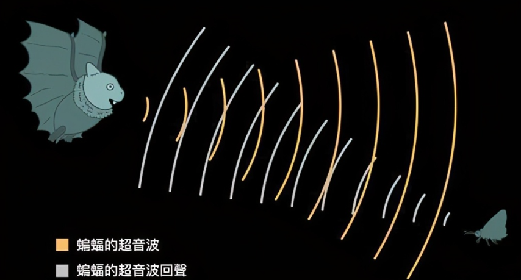

普通的单线激光雷达一般有一个发射器，一个接收器，发射器发出激光射线到前方的目标上，物品会将激光反射回来，然后激光雷达的接受器可以检测到反射的激光。

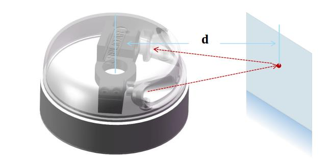

通过计算发送和反馈之间的时间间隔，乘上激光的速度，就可以计算出激光飞行的距离，该计算方法称为TOF（飞行时间法Time of flight，也称时差法）。

除了TOF之外还有其他方法进行测距，比如三角法，这里就不拓展了放一篇文章，大家自行阅读。

- [激光三角测距原理详述](https://www.slamtec.com/cn/News/Detail/190)

目前市面上的激光雷达，几乎都是采用三角测距，比如思岚的：

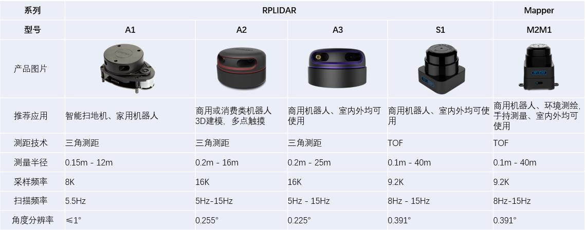

**需要注意的是虽然只有一个发射器和一个接受器，激光雷达通过电机可以进行旋转，这样就可以达到对周围环境360度测距的目的。**

## 二、驱动雷达

目前FishBot主要配套雷达型号为EAI-X2，后续可能会引入其他雷达。

针对EAI-X2，采用的驱动为修改后的ROS2驱动:

- 代码仓库为：https://github.com/fishros/ydlidar_ros2
- 代码分支为：v1.0.0/fishbot

### 2.1 有线驱动-树莓派工控机直连都可以通过这种方式

将配套的雷达转接板模式调整到UART模式，拔掉EN跳线帽（可以关闭ESP8266,节省能源）， 找一根USB线，将 雷达板接入到你要驱动的电脑或者各种PI上。

创建fishbot_ws工作空间，下载源码到src目录：

```
mkdir -p ~/fishbot_ws/src
cd ~/fishbot_ws/src
git clone http://github.fishros.org/https://github.com/fishros/ydlidar_ros2 -b  v1.0.0/fishbot 
```

进入到源码，修改串口编号ydlidar_ros2/params/ydlidar.yaml，一般是/dev/ttyUSB0

```
ydlidar_node:
  ros__parameters:
    port: /dev/ttyUSB0
    frame_id: laser_frame
    ignore_array: ""
```

接着编译 ：

```
cd ydlidar_ros2
colcon build
```

接着修改串口权限，然后运行驱动

```
sudo chmod 666 /dev/ttyUSB0
source install/setup.bash
ros2 launch ydlidar ydlidar_launch.py
---
[INFO] [launch]: All log files can be found below /home/pi/.ros/log/2023-07-21-23-13-28-893425-raspberrypi-4518
[INFO] [launch]: Default logging verbosity is set to INFO
[INFO] [ydlidar_node-1]: process started with pid [4539]
[INFO] [static_transform_publisher-2]: process started with pid [4541]
[static_transform_publisher-2] [WARN] [1689952409.891692804] []: Old-style arguments are deprecated; see --help for new-style arguments
[static_transform_publisher-2] [INFO] [1689952409.975433434] [static_tf_pub_laser]: Spinning until stopped - publishing transform
[static_transform_publisher-2] translation: ('0.020000', '0.000000', '0.000000')
[static_transform_publisher-2] rotation: ('0.000000', '0.000000', '0.000000', '1.000000')
[static_transform_publisher-2] from 'base_link' to 'laser_frame'
[ydlidar_node-1] [YDLIDAR INFO] Current ROS Driver Version: 1.4.5
[ydlidar_node-1] [YDLIDAR]:SDK Version: 1.4.5
[ydlidar_node-1] [YDLIDAR]:Lidar running correctly ! The health status: good
[ydlidar_node-1] [YDLIDAR] Connection established in [/dev/ttyUSB0][115200]:
[ydlidar_node-1] Firmware version: 1.5
[ydlidar_node-1] Hardware version: 1
[ydlidar_node-1] Model: S4
[ydlidar_node-1] Serial: 2020112400007024
[ydlidar_node-1] [YDLIDAR]:Fixed Size: 370
[ydlidar_node-1] [YDLIDAR]:Sample Rate: 3K
[ydlidar_node-1] [YDLIDAR INFO] Current Sampling Rate : 3K
[ydlidar_node-1] [YDLIDAR INFO] Now YDLIDAR is scanning ......
```

最后使用ros2 topic list 就可以看到话题list了，scan就是雷达话题

```
ros2 topic list
---
/parameter_events
/rosout
/scan
/tf_static
/ydlidar_node/transition_event
```

### 2.2 无线驱动

如果想通过源码的方式也可以，**雷达板的主要作用是将雷达 数据生成一个虚拟的串口**，这样就相当于有线连接了。

首先要给雷达板烧录固件，这个固件的作用就是将串口转成无线TCP,所以对于这段固件的开发，没有要学习的知识点，直接使用即可，固件烧录及配置方式如下：[配置](https://www.fishros.org.cn/forum/topic/940/fishbot%E6%95%99%E7%A8%8B-5-%E9%9B%B7%E8%BE%BE%E5%9B%BA%E4%BB%B6%E7%83%A7%E5%BD%95%E5%8F%8A%E9%85%8D%E7%BD%AE/1?lang=zh-CN)

烧录完成固件后，接着我们就可以启动服务让雷达板连接上来，在电脑上直接运行下面这段Python代码，当连接建立后，就会直接生成 一个虚拟串口，然后按照 2.1 的方式就可以直接驱动了。

```
#!/usr/bin/env python3

import subprocess
import os
import pty
import socket
import select
import argparse
import subprocess
import time

class LaserScanRos2():

    def __init__(self) -> None:
        self.laser_pro = None
    

class SocketServer():
    def __init__(self,lport=8889,uart_name="/tmp/fishbot_laser") -> None:
        self.lport = lport
        self.uart_name = uart_name
        self.laser_ros2 = LaserScanRos2()
        self.main()

    def main(self):
        s = socket.socket(socket.AF_INET, socket.SOCK_STREAM)
        s.setsockopt(socket.SOL_SOCKET, socket.SO_REUSEADDR, 1)
        s.bind(('0.0.0.0', self.lport))
        s.listen(5)
        master, slave = pty.openpty()
        if os.path.exists(self.uart_name):
            os.remove(self.uart_name)
        os.symlink(os.ttyname(slave), self.uart_name)
        print(f"UART2SOCKET:{self.lport}->{self.uart_name}")
        mypoll = select.poll()
        mypoll.register(master, select.POLLIN)
        try:
            while True:
                print("Prepare to Accept connect!")
                client, client_address = s.accept()
                mypoll.register(client.fileno(), select.POLLIN)
                print(s.fileno(), client, master)
                print('PTY: Opened {} for {}:{}'.format(
                    os.ttyname(slave), '0.0.0.0', self.lport))
                is_connect = True
                try:
                    while is_connect:
                        fdlist = mypoll.poll(256)
                        for fd, event in fdlist:
                            data = os.read(fd, 256)
                            write_fd = client.fileno() if fd == master else master
                            if len(data) == 0:
                                is_connect = False
                                break
                            os.write(write_fd, data)
                            # print(fd, event, data)
                except ConnectionResetError:
                    is_connect = False
                    print("远程被迫断开链接")
                finally:
                    mypoll.unregister(client.fileno())
        finally:
            s.close()
            os.close(master)
            os.close(slave)
            os.remove(self.uart_name)

def main():
    SocketServer()


if __name__ == "__main__":
    main()

```

连接成功后，会生成/tmp/fishbot_laser 虚拟串口，修改雷达驱动的端口号到这个虚拟串口，确定雷达连接上，然后启动雷达驱动就可以了。

```
python3 test.py
---
UART2SOCKET:8889->/tmp/fishbot_laser
Prepare to Accept connect!
3 <socket.socket fd=6, family=AddressFamily.AF_INET, type=SocketKind.SOCK_STREAM, proto=0, laddr=('192.168.4.136', 8889), raddr=('192.168.4.49', 52843)> 4
PTY: Opened /dev/pts/4 for 0.0.0.0:8889
```

## 三、可视化雷达数据

雷达驱动成功后，可以用RVIV2可视化雷达数据。在终端中输入rviz2,然后修改fixedframe为雷达驱动配置文件中的`   frame_id: laser_frame`
，接着通过话题添加可视化模块。因为雷达也属于传感器，所以需要修改QOS部分 可靠政策为 Best Effort，具体配置如下：

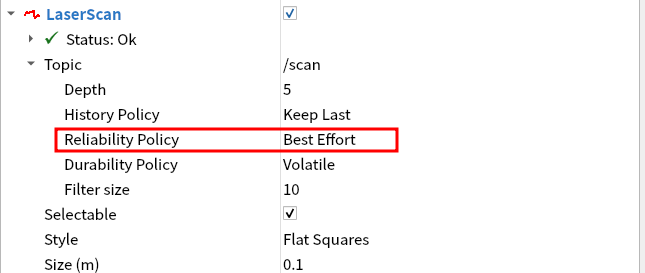

最终现实效果如下

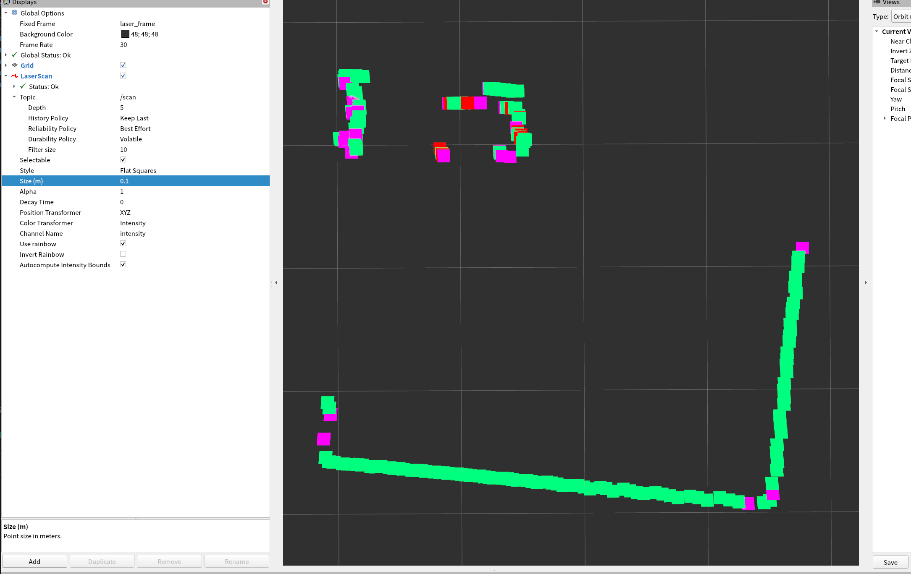

## 扩展：雷达固件烧录

### FishBot雷达转接板介绍

Fishbot雷达转接板主要作用是将雷达的数据通过Wifi网络转发出去，以时间雷达数据的无线传输功能。

FishBot转接板的工作模式有三种

- Flash模式，该模式下可以给转接板进行固件的升级和参数配置。
- Uart有线模式，该模式可以用于直接通过有线方式连接树莓派等主控板。
- Wifi无线模式，该模式将雷达数据通过无线方式传给上位机。

这三种工作模式可以根据板子上的标记调整跳线帽的位置进行切换。

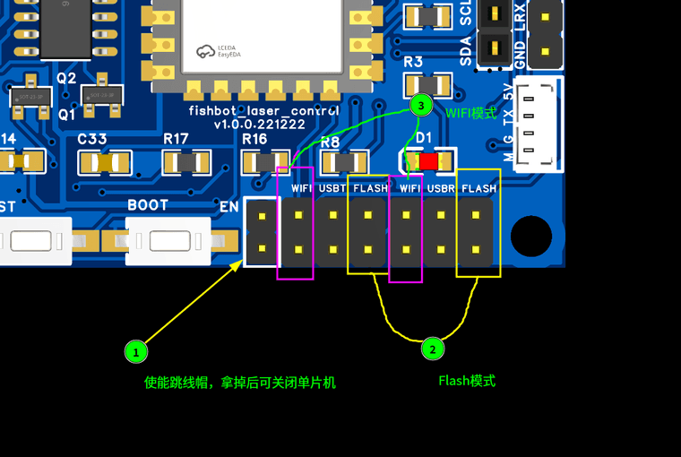

当你第一次使用的时候需要将板子调节到Flash模式，该模式下我们可以对板子进行配置以及升级。

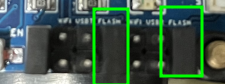

### 烧录雷达固件

将跳线帽手动改到配置模式，如果你有OLED或者FISHBOT可以将其插在雷达板的OLED接口上，等升级配置结束后再拿走即可。

接着运行配置助手

```shell
xhost + && sudo docker run -it --rm --privileged -v /dev:/dev -v /tmp/.X11-unix:/tmp/.X11-unix -e DISPLAY=unix$DISPLAY fishros2/fishbot-tool:v1.0.0.20230108 python3 main.py
```

点击刷新，查看是否正确加载到端口号，如没有端口号可能是驱动占用问题，请根据教程检查：https://blog.csdn.net/qq_27865227/article/details/125538516

接着手动将设备类型切换到雷达转接板

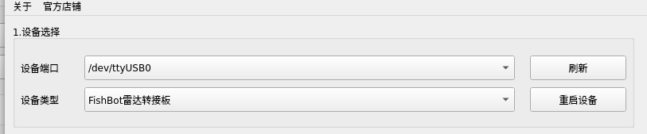

接着下方固件烧录会自动加载出最新的固件地址，点击一键下载即可完成对雷达转接板固件的更新。

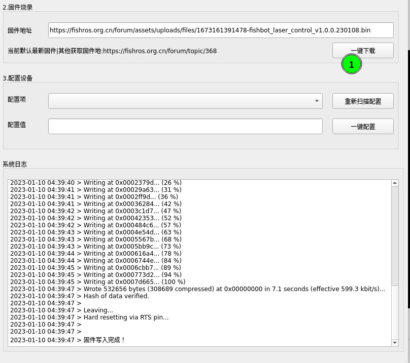

如果你想更换其他版本的固件，请到FishBot固件发布页面在对应的固件上右击，复制链接，粘贴到配置助手固件地址栏目再点击一键烧录即可。

如果你有OLED，此时屏幕应该亮起，并显示当前在配置模式，当前状态在等待配置。

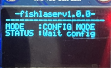

如果没有OLED可以观察板子上的蓝色LED灯，长亮表示在等待配置。

如果不在配置模式可以双击板子上的BOOT按键进行模式的切换。

### 配置转接板

在配置模式下，点击配置助手的重新扫描配置即可出现配置选项，

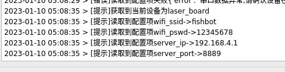

这里我们需要修改三个参数。

- `wifi_ssid`，当前机器人可以连接到的wifi用户名
- `wifi_pswd`，wifi密码
- `server_ip`，接收雷达数据的服务器端口地址

#### 配置WIFI

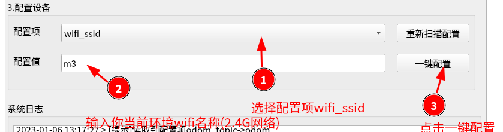

这里你需要修改wifi_ssid和wifi_pswd为你当前环境的WIFI地址。

#### 配置服务IP

转接板要想将数据通过网络分享给我们的计算机，那么在计算机上就需要一个程序来接收数据，所以我们要指定接收数据的服务的IP地址——当前计算机的IP。

第一步是获取当前主机的IP地址

打开一个新的终端，输入`ip -4 a | grep inet`看看电脑的ip地址，一般可以看到多个网卡的，此时可以忽略172(docker)和127(本地)
开头的ip地址，剩下的一般就是我们要的ip地址，比如这里的就是`192.168.0.105`

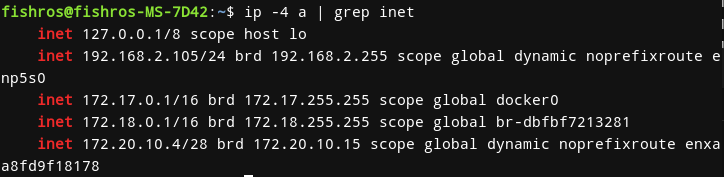

接着配置

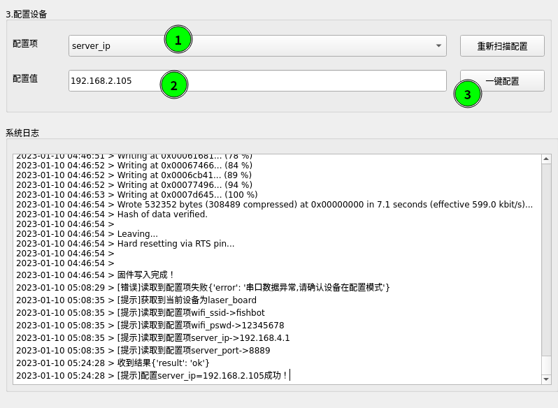

配置完成后，双击BOOT按钮，切换至运行模式，即可从OLED上观察到目前的配置信息以及连接状态信息。

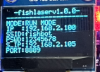

其中IP即转接板的IP地址，虽然wifi连接成功了，但我们的计算机不一定在网络链路上就和雷达转接板能够打通，最简单的测试方式就是手动ping 一下雷达转接板的ip地址。

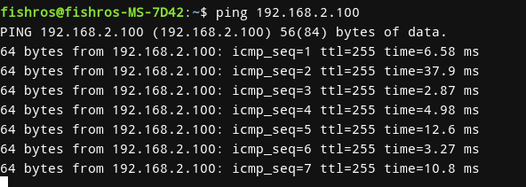

如上面这样的结果表示链路是通的。

有条件的小伙伴可以尝试： 启动串口工具和tcpserver工具，手动通过串口发送数据，看看tcpserver是否可以正常接收。


