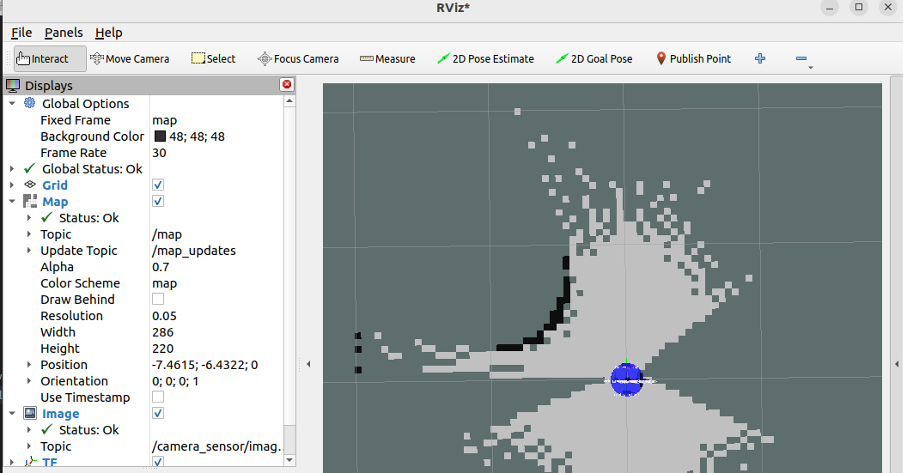
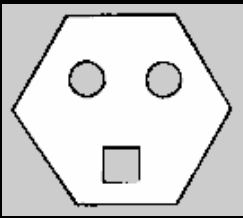
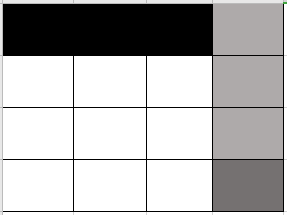
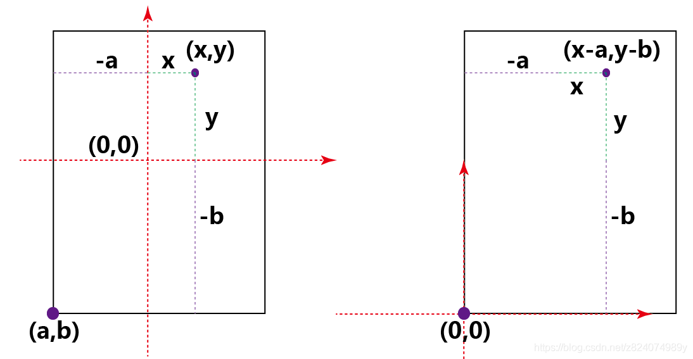
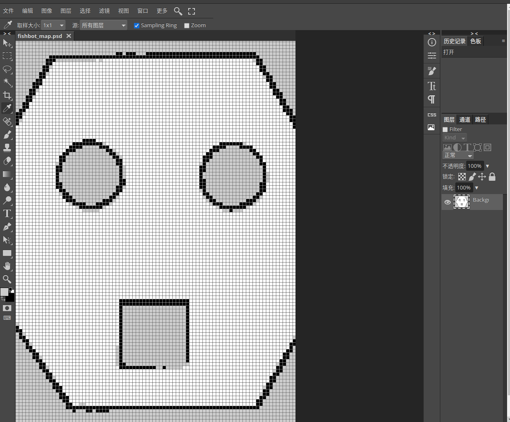
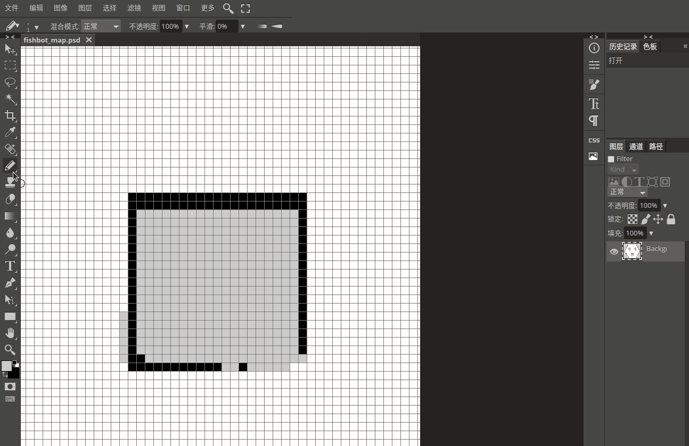

###### datetime:2023/11/08 16:27

###### author:nzb

> 该项目来源于[大佬的动手学ROS2](https://fishros.com/d2lros2)

# 5.使用SLAM_TOOLBOX完成建图

SLAM 是通过传感器获取环境信息然后进行定位和建图。在 ROS 2 中，提供了很多的 SLAM 功能包，比如 slam_toolbox，cartographer_ros 和 rtabmap_slam 等。针对二维场景，其中
slam_toolbox 开箱即用，上手较为简单，就用它类来构建我们的第一张地图。

## 一、安装slam-toolbox

slam_toolbox 是一套用于2D SLAM的开源工具，使用 apt 可以方便的进行安装，命令如下：

```plain
sudo apt install ros-$ROS_DISTRO-slam-toolbox
```

## 二、启动底盘和雷达

1.运行TF转换Launch-Bringup

```bash
source install/setup.bash
ros2 launch fishbot_bringup fishbot_bringup.launch.py
```

2.运行Agent

```
sudo docker run -it --rm -v /dev:/dev -v /dev/shm:/dev/shm --privileged --net=host microros/micro-ros-agent:$ROS_DISTRO udp4 --port 8888 -v6
```

3.启动雷达

直接使用Docker：

```
xhost + && sudo docker run  -it --rm  -v /dev:/dev -v /dev/shm:/dev/shm --privileged  -v /tmp/.X11-unix:/tmp/.X11-unix --device /dev/snd -e DISPLAY=unix$DISPLAY -p 8889:8888 registry.cn-hangzhou.aliyuncs.com/fishros/fishbot_laser
```

如果不用Docker需要修改下代码，因为 ydlidar_launch.py 会发布 base_link 和 laser_frame 之间的坐标变换，这和使用URDF发布的相冲突，所以需要做一次修改再运行：

```
def generate_launch_description():
    ...

    return LaunchDescription([
        params_declare,
        driver_node,
        #tf2_node,  ----注释这一行就可以了-----
    ])

```

确定有雷达话题后，我们就可以运行建图了。

## 三、运行建图

接着打开一个新的终端， 入下面的命令，启动slam_toolbox 的在线建图：

```plain
ros2 launch slam_toolbox online_async_launch.py 
---
INFO] [launch]: All log files can be found below /home/fishros/.ros/log/2023-05-25-16-47-11-319871-fishros-VirtualBox-11288
[INFO] [launch]: Default logging verbosity is set to INFO
[INFO] [async_slam_toolbox_node-1]: process started with pid [11290]
[async_slam_toolbox_node-1] [INFO] [1685004431.442212575] [slam_toolbox]: Node using stack size 40000000
[async_slam_toolbox_node-1] [INFO] [1685004431.503891373] [slam_toolbox]: Using solver plugin solver_plugins::CeresSolver
[async_slam_toolbox_node-1] [INFO] [1685004431.505007754] [slam_toolbox]: CeresSolver: Using SCHUR_JACOBI preconditioner.
[async_slam_toolbox_node-1] Info: clipped range threshold to be within minimum and maximum range!
[async_slam_toolbox_node-1] [WARN] [1685004431.658413039] [slam_toolbox]: maximum laser range setting (20.0 m) exceeds the capabilities of the used Lidar (8.0 m)
[async_slam_toolbox_node-1] Registering sensor: [Custom Described Lidar]
```

slam-toolbox 的输入有两个，第一个是订阅来自雷达的 /scan 话题，用于获取雷达数据，第二个是获取里程计坐标系 odom 到机器人坐标系 base_footprint 之间的变换。这些数据都是有时间戳的，所以在上面的命令中将
use_sim_time 参数的值设置为 True 表示使用仿真的时间，以防止因时间戳造成数据不合法。

### 用RVIZ2可视化图像

打开 RViz，修改 Fixed Frame 为 map，接着通过 Add/By Topic 添加 /map 话题，也可以添加 TF 和 RobotModel 等你感兴趣的话题进行显示，最终配置及效果如下图所示。



### 遥控机器人建图(记得减速哦)

```undefined
ros2 run teleop_twist_keyboard teleop_twist_keyboard
```

房间已经探索了差不多后，接着我们来将地图保存下来。

# 6.地图保存与编辑

## 一、 安装NAV2_MAP_SERVER

```perl
sudo apt install ros-$ROS_DISTRO-nav2-map-server
```

## 二、 保存地图

```bash
ros2 run nav2_map_server map_saver_cli --help
```

可以看到有下面的用法

```shell
Usage:
  map_saver_cli [arguments] [--ros-args ROS remapping args]
 
Arguments:
  -h/--help
  -t <map_topic>
  -f <mapname>
  --occ <threshold_occupied>
  --free <threshold_free>
  --fmt <image_format>
  --mode trinary(default)/scale/raw
 
NOTE: --ros-args should be passed at the end of command line
```

我们的地图话题为map，文件名字我们用fishbot_map,所以有下面这个这样写的命令行。

```shell
ros2 run nav2_map_server map_saver_cli -t map -f fishbot_map
```

接着我们就可以得到下面的两个文件

```shell
.
├── fishbot_map.pgm
└── fishbot_map.yaml
 
0 directories, 2 files
```

这两个文件就是对当前地图保存下来的文件，其中.pgm是地图的数据文件，.yaml后缀的是地图的描述文件。

## 三、 地图数据文件.pgm介绍

OccupancyGrid由一个`.yaml格式`的元数据文件，和.pgm图片格式的地图数据文件组成。从上节课建图后保存的文件也可以看出。

```
.
├── fishbot_map.pgm
└── fishbot_map.yaml

0 directories, 2 files
```



打开上节课建好的地图，观察下，你应该会有几点疑问：

1. 不是说占据栅格地图每个栅格都有一个概率吗？为什么看不出来？
2. 立方体内和圆柱体内和墙之外的区域为什么是灰色的？

原因如下：

1. 一个栅格对应到图片上其实是一个像素，每一个像素的值在0-255之间，所以将像素值和占据率之间的映射即可，而像素值反应到图像上就是颜色的深浅，1.2图对应的像素颜色如下：



2. 建图的时候物体内和墙之外的区域机器人并没有探索到，没有数据参考就认为其值是未知的。

## 四、地图描述文件.yaml介绍

除了`fishbot_map.pgm`文件外，还有另外一个`fishbot_map.yaml`的文件，`fishbot_map.yaml`文件是地图的配置文件，该文件内容如下：

```yaml
image: fishbot_map.pgm
mode: trinary
resolution: 0.05
origin: [ -3.37, -2.88, 0 ]
negate: 0
occupied_thresh: 0.65
free_thresh: 0.25
```

- image：图像名称

- mode：图像模式，默认为trinary(三进制)，还有另外两个可选项scale(缩放的)和raw(原本的值)。

- resolution：分辨率，一个栅格对应的物理尺寸，单位为m。0.05则表示一个栅格为0.05m

- origin：地图原点位置，单位是m。


- negate：是否反转图像

- cooupied_thresh：占据阈值

- free_thresh：空闲阈值

#### 如何在地图上找出机器人原点的像素位置？

- 1、图像的像素原点在左下角

- 2、左边的0,0是地图原点，右边的图是图像的像素原点



- 3、假如机器人地图原点是[-3.37m, -2.88m]，除上分辨率则可得到像素原点[-67.4px,-57.6px]。`地图原点`在x和y轴分别偏移[-67.4px,-57.6px]
  就到了像素原点，反过来说，地图原点就在像素原点的[67.4px,57.6px]处。
  
- 4、转换公式
    - **像素点转地图点：地图点 = 地图原点 + (像素点 * 分辨率)**
    - **地图点转像素点：像素点= (地图点 - 地图原点) / 分辨率**

## 五、编辑地图

最后我们来说一下如何对地图进行编辑，地图编辑的方法有很多，你可以手动改图片，也可以通过opencv等图像处理库进行图像的去除噪点等操作。

这里介绍的是手动添加一个地图用PS或[Krita](https://krita.org/zh/) 进行编辑 。

打开网址：https://www.gaituya.com/ps/

接着点击文件打开选择我们的.pgm文件，即可看到下图。



接着将下面的正方形给补上。



保存后在文件选择导出为`png`格式即可，因为PS并不支持`pgm`格式的导出，所以我们选择`png`格式，幸运的是`png`格式的地图也是被map_server所支持的。

把导出的图片放到map文件夹下，接着我们需要修改下yaml配置文件中图片的后缀。

```
image: fishbot_map.png
mode: trinary
resolution: 0.05
origin: [-3.37, -2.88, 0]
negate: 0
occupied_thresh: 0.65
free_thresh: 0.25
```

## 六、总结

到这里我们总算把地图搞定了，接下来我们一起搞定导航。