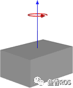

###### datetime:2023/09/26 18:28

###### author:nzb

> 该项目来源于[大佬的动手学ROS2](https://fishros.com/d2lros2)
> 
> [ros2 examples](https://github.com/ros2/examples)

# 一.惯性矩阵是什么

惯性矩阵描述的是物体的惯性张量在x,y,z三个坐标轴上的投影的矩阵形式（若不对还请指出哈）

# 二.为什么需要自定义

从solidworks中导出的urdf模型，惯量矩阵一般都是不对的，我们拿到的模型基本都是只有机械臂的外壳，减速机等都没有包含在内，质量和材料设置也都不对，生成关节的内参也是不对的。

如果内参已经有问题到影响我们仿真了，这个时候就需要我们来手动修改内参，如何手动修改呢？

# 三.如何自定义

根据我们机械臂关节的近似形状和常见几何形状的内参公式进行计算设置，比如说机械臂关节一般都是圆柱体，所以我们可以根据圆柱体的惯性张量公式进行设置。

# 四.常见三维几何物体张量矩阵

常见几何物体的内参惯性张量矩阵，也就是张量公式。

## 1.实心球体

半径为r，质量为m的是实心球体

形状


矩阵


## 2.空心球体

半径为r，质量为m的是空心球体

形状


矩阵


## 3.实心椭球

半轴长度为a , b , c，质量m的实心椭球

形状


矩阵


## 4.实心长方体

宽度为w，高度为h，深度为d，质量为m 的实心长方体

形状



矩阵


## 5.绕细长杆末端

沿y轴长度为l，质量为m 的绕末端旋转的细长杆

形状


矩阵


## 6.绕细长杆中心

沿y轴长度为l，质量为m 的绕中心旋转的细长杆

形状


矩阵


## 7.实心圆柱体

半径为r，高度为h，质量为m 的实心圆柱体

形状


矩阵


## 8.圆柱管

内径为r1，外径为r2，长度为h，质量为m 的带有开口端的厚壁圆柱管

形状


矩阵


## 9.正圆锥

半径为r，高度为h，质量为m 的正圆锥

形状


矩阵


# 五、如何使用矩阵

惯性矩阵是一个3*3的对称矩阵，所以在urdf中只使用六个值描述该矩阵，对应着上面的公式赋值即可。

示例：

```xml

<inertial>
    <mass value="10"/>
    <inertia ixx="0.4" ixy="0.0" ixz="0.0" iyy="0.4" iyz="0.0" izz="0.2"/>
</inertial>
```


