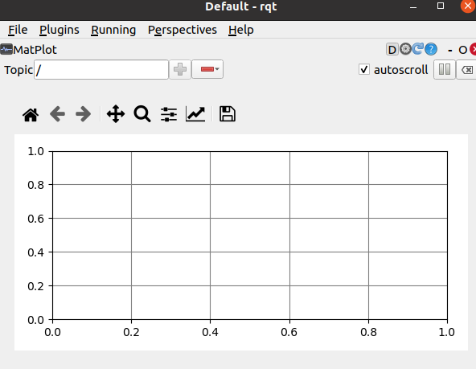
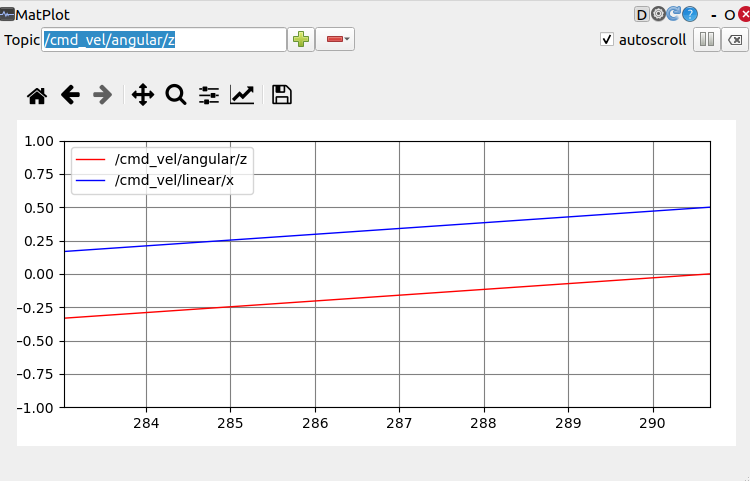
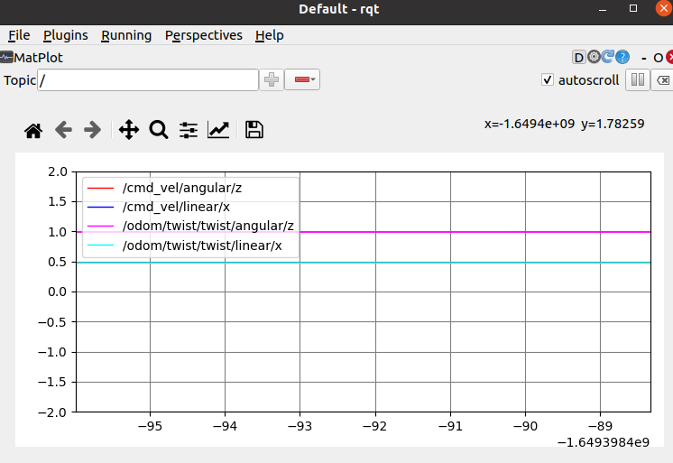
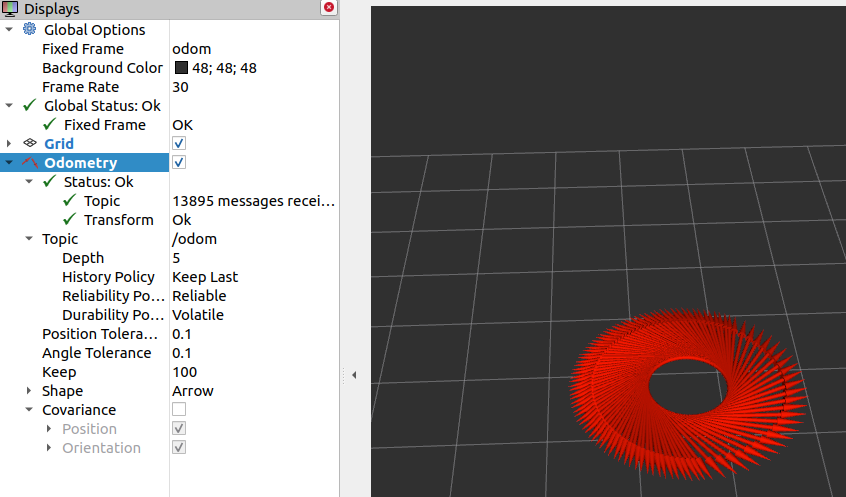

###### datetime:2023/10/07 10:21

###### author:nzb

> 该项目来源于[大佬的动手学ROS2](https://fishros.com/d2lros2)

# 9.4.Gazebo仿真插件之两轮差速

完成了上节课的Gazebo加载FishBot，但是机器人还是不会动，你一定很不开心吧，本节课就带你一起通过配置两轮差速控制插件，让我们的机器人动起来~

最终效果：


## 1.Gazebo插件介绍

之前说过Gazebo是一个独立于ROS的软件，对外提供了丰富的API可以使用，gazebo的插件按照用途大致可以分为两种：

1. **用于控制的插件**，通过插件可以控制机器人关节运动，可以进行位置、速度、力的控制，比如我们这节课的两轮差速控制器。
2. **用于数据采集的插件**，比如IMU传感器用于采集机器人的惯性，激光雷达用于采集机器人周围的点云信息。

当然上面两类插件功能也可以写到一个插件里，两轮差速插件就是一个二合一加强版。

## 2.两轮差速插件介绍

两轮差速插件用于控制机器人轮子关节的位置变化，同时该插件还会获取轮子的位置以及速度的信息的反馈，根据反馈的位置信息结合运动学模型即可计算出当前机器人的位姿（里程计）。

> 该插件的名称为：gazebo_ros_diff_drive
>
<!-- 源码地址：https://github.com/ros-simulation/gazebo_ros_pkgs/blob/foxy/gazebo_plugins/src/gazebo_ros_diff_drive.cpp -->

**两轮差速控制器和Gazebo的关系**

两轮差速控制器可以将轮子的目标转速发送给Gazebo，并从Gazebo获取到实际的速度和位置。

> 注意：发送给Gazebo是目标速度，反馈回来的是实际速度。目标!=实际，比如轮子卡住了，无论你发什么目标速度，实际速度都是0。

要想快速了解一个系统的功能，最直接的就是看系统的对外的输入和输出是什么？什么都不要说，看下图：

```mermaid
graph LR;
D[配置参数-轮距直径等]-->B
A[控制指令-cmdvel]-->B[gazebo_ros_diff_drive]
B-->C[里程计-odom]
B-->E[里程计tf-可选]
B-->F[轮子tf-可选]
```

上图就是对gazebo_ros_diff_drive的输入和输出信息的总结，可以很直观的看到该插件主要**输入控制指令**，主要**输出里程计信息**。接着带你分别认识一下输入和输出两个部分。

### 2.2 输入参数

#### 2.2.1 配置参数

不知道你是否还记得在第七章中，对两轮差速底盘的运动学正的介绍。如果要完成底盘的正逆解和里程计的推算就必须要知道轮子的直径和间距。

同时该插件还提供了一些可以控制输出的选项，因为是仿真，所以还要告诉插件轮子对应的joint名称等信息，这样就有了下面这个参数表格：

| 配置项                 | 含义                                    |
| ---------------------- | --------------------------------------- |
| ros                    | ros相关配置，包含命名空间和话题重映射等 |
| update_rate            | 数据更新速率                            |
| left_joint             | 左轮关节名称                            |
| right_joint            | 右轮关节名称                            |
| wheel_separation       | 左右轮子的间距                          |
| wheel_diameter         | 轮子的直径                              |
| max_wheel_torque       | 轮子最大的力矩                          |
| max_wheel_acceleration | 轮子最大的加速度                        |
| publish_odom           | 是否发布里程计                          |
| publish_odom_tf        | 是否发布里程计的tf开关                  |
| publish_wheel_tf       | 是否发布轮子的tf数据开关                |
| odometry_frame         | 里程计的framed ID，最终体现在话题和TF上 |
| robot_base_frame       | 机器人的基础frame的ID                   |

#### 2.2.2 控制指令

两轮差速控制器默认通过订阅话题`cmd_vel`来获取目标线速度和角速度。该话题的类型为：`geometry_msgs/msg/Twist`

我们通过ros2的CLI来看一下这个消息包含的内容有哪些？

```
ros2 interface show geometry_msgs/msg/Twist
```

```
# This expresses velocity in free space broken into its linear and angular parts.

Vector3  linear
Vector3  angular
```

可以看到包含线速度和角速度，我们用proto在看一下包含的基本数据类型有哪些？

```
ros2 interface proto geometry_msgs/msg/Twist
```

```
"linear:
  x: 0.0
  y: 0.0
  z: 0.0
angular:
  x: 0.0
  y: 0.0
  z: 0.0
"
```

线速度和角速度都包含在x、y、z，代表坐标系的三个方向上的对应速度。

两轮差速控制器收到这个话题数据后将其中的角速度和线速度转换上两个轮子的转动速度发送给Gazebo。

### 2.3 输出参数

#### 2.3.1 里程计

里程计信息默认的输出话题为`odom`，其消息类型为：`nav_msgs/msg/Odometry`

同样的使用CLI看一下其消息的组成结构：

```
ros2 interface show nav_msgs/msg/Odometry
```

```
# This represents an estimate of a position and velocity in free space.
# The pose in this message should be specified in the coordinate frame given by header.frame_id
# The twist in this message should be specified in the coordinate frame given by the child_frame_id

# Includes the frame id of the pose parent.
std_msgs/Header header

# Frame id the pose points to. The twist is in this coordinate frame.
string child_frame_id

# Estimated pose that is typically relative to a fixed world frame.
geometry_msgs/PoseWithCovariance pose

# Estimated linear and angular velocity relative to child_frame_id.
geometry_msgs/TwistWithCovariance twist

```

```
ros2 interface proto nav_msgs/msg/Odometry
```

```
"header:
  stamp:
    sec: 0
    nanosec: 0
  frame_id: ''
child_frame_id: ''
pose:
  pose:
    position:
      x: 0.0
      y: 0.0
      z: 0.0
    orientation:
      x: 0.0
      y: 0.0
      z: 0.0
      w: 1.0
  covariance:
  - 0.0
  - 0.0
    ...
twist:
  twist:
    linear:
      x: 0.0
      y: 0.0
      z: 0.0
    angular:
      x: 0.0
      y: 0.0
      z: 0.0
  covariance:
  - 0.0
  - 0.0
	...
"
```

可以看到其数据主要包含三个部分：

- header，表示该消息发布的时间
- pose，表示当前机器人位置和朝向
- twist，表示当前机器人的线速度和角速度

> 数据中还包含一个covariance，其代表协方差矩阵，后面写篇文章来介绍下，这里只需了解其含义即可。

#### 2.3.2 里程计TF信息

设为true，订阅tf话题里你就可以看到像下面的msg，建议后面配置好后，手动修改下，对比区别

```
- header:
    stamp:
      sec: 6157
      nanosec: 907000000
    frame_id: odom
  child_frame_id: base_footprint
  transform:
    translation:
      x: 0.0005557960241049835
      y: -0.0007350446303238693
      z: 0.01599968753145574
    rotation:
      x: 4.691143395208505e-07
      y: 7.115496626557812e-06
      z: -0.018531475772549166
      w: 0.9998282774331005
```

#### 2.3.3 左右轮子TF信息

设为true，订阅tf话题里你就可以看到像下面的msg，建议后面配置好后，手动修改下，对比区别

```
- header:
    stamp:
      sec: 6157
      nanosec: 941000000
    frame_id: base_link
  child_frame_id: left_wheel_link
  transform:
    translation:
      x: -0.02
      y: 0.1
      z: -0.06
    rotation:
      x: 0.0
      y: 0.049519025127821005
      z: 0.0
      w: 0.9987731805321918
- header:
    stamp:
      sec: 6157
      nanosec: 941000000
    frame_id: base_link
  child_frame_id: right_wheel_link
  transform:
    translation:
      x: -0.02
      y: -0.1
      z: -0.06
    rotation:
      x: 0.0
      y: -0.0663387077034509
      z: 0.0
      w: 0.9977971616817898
```

## 3.在URDF中配置两轮差速模型

上面该介绍的我们都给介绍了，接着我们直接来配置。

因为是给Gazebo的插件，所以在`URDF`中，我们需要使用`<gazebo>`进行配置，因为是要给`gazebo`配置插件，所有要在`gazebo`标签下添加`plugin`子插件。

话不多说，上代码

```
  <gazebo>
    <plugin name='diff_drive' filename='libgazebo_ros_diff_drive.so'>
          <ros>
            <namespace>/</namespace>
            <remapping>cmd_vel:=cmd_vel</remapping>
            <remapping>odom:=odom</remapping>
          </ros>
          <update_rate>30</update_rate>
          <!-- wheels -->
          <left_joint>left_wheel_joint</left_joint>
          <right_joint>right_wheel_joint</right_joint>
          <!-- kinematics -->
          <wheel_separation>0.2</wheel_separation>
          <wheel_diameter>0.065</wheel_diameter>
          <!-- limits -->
          <max_wheel_torque>20</max_wheel_torque>
          <max_wheel_acceleration>1.0</max_wheel_acceleration>
          <!-- output -->
          <publish_odom>true</publish_odom>
          <publish_odom_tf>true</publish_odom_tf>
          <publish_wheel_tf>true</publish_wheel_tf>
          <odometry_frame>odom</odometry_frame>
          <robot_base_frame>base_footprint</robot_base_frame>
      </plugin>
```

将这段代码加到我们的URDF中，然后对着上面介绍的配置项，一一看下，接着我们就可以来测试运行了。

完整的URDF可以参考：

## 4.两轮差速插件测试

修改完了URDF模型我们将代码编译一下，让更新后的URDF文件安装到install目录，接着就可以运行9.2中的launch文件，将模型加载到Gazebo中。

### 4.1 编译-启动

```
colcon build
```

```
ros2 launch fishbot_description gazebo.launch.py
```


接着你可以使用CLI工具看一下系统有哪些节点在运行

```
ros2 node list
ros2 topic list
```

```
ros2 node list
---------------
/diff_drive
/gazebo

ros2 topic list
---------------
/clock
/cmd_vel
/odom
/parameter_events
/performance_metrics
/rosout
/tf
```

相信此时你已经看到了我们插件订阅的的/cmd_vel和发布的/odom了。

### 4.3 使用键盘控制fishbot

你还记得第二章中带你玩的小乌龟吗？当时我们用键盘来控制小乌龟运动，现在我们可以用键盘来控制fishbot动起来了。

你需要一个键盘控制工具，可以用下面的指令安装

```
sudo apt install ros-humble-teleop-twist-keyboard
```

这个功能包下有一个节点，这个节点会监听键盘的按键事件，然后发布cmd_vel话题，该话题被gazebo的两轮差速插件所订阅。所以我们就可以通过这个节点来控制fishbot。

```
ros2 run teleop_twist_keyboard teleop_twist_keyboard
```

> 如果你想让这个节点不是发布cmd_vel话题，而是别的，可以采用ROS2的话题重映射功能。
> eg: `ros2 run teleop_twist_keyboard teleop_twist_keyboard --ros-args --remap cmd_vel:=cmd_vel1`

接着尝试使用来控制机器人运动

```
   U    I    O
   J    K    L
   M    <    >
```

点一下I，你就能看到fishbot在Gazebo中飞速的移动。接着打开终端，打印一下odom话题和tf话题，移动机器人观察数据变化。

此时你应该玩一会，体验一下各种花式走法。

### 4.4 使用rqt显示速度数据

接着我们尝试使用rqt将数据在rqt中可视化出来，打开终端输入rqt。

```
rqt
```

选择Plugin->Visualization->Plot



在上方Topic输入`/cmd_vel/linear/x`，再输入`/cmd_vel/angular/z`，然后用键盘控制机器人移动。



cmd_vel中的速度代表目标速度，接着我们显示一下当前速度（在odom.twist中）



### 4.5 在RVIZ2中显示Fishbot及其轨迹

打开rviz2

```
rviz2
```

1. 修改FixedFrame为odom
2. 添加插件，Add->Odometry->OK
3. 选择话题，Odometry->Topic->选/odom
4. 去除协方差显示，Odometry->Covariance>取消勾选
5. 键盘控制节点，点个U，原地转圈圈

最终结果：



### 4.6 在RVIZ2中显示机器人模型

虽然机器人的轨迹已经在RVIZ中显示出来了，但是并没有机器人的模型，也看不到轮子的转动，来带你一起解决这个问题。

前面介绍过，要发布机器人模型我们所使用的节点是`robot_state_publisher`,所以我们在`gazebo.launch.py`中加入这个节点，同时再加上rviz2的启动节点，最终的`gazebo.launch.py`
内容如下：

```python
import os
from launch import LaunchDescription
from launch.actions import ExecuteProcess
from launch_ros.actions import Node
from launch_ros.substitutions import FindPackageShare


def generate_launch_description():
    robot_name_in_model = 'fishbot'
    package_name = 'fishbot_description'
    urdf_name = "fishbot_gazebo.urdf"

    ld = LaunchDescription()
    pkg_share = FindPackageShare(package=package_name).find(package_name)
    urdf_model_path = os.path.join(pkg_share, f'urdf/{urdf_name}')

    # Start Gazebo server
    start_gazebo_cmd = ExecuteProcess(
        cmd=['gazebo', '--verbose', '-s', 'libgazebo_ros_init.so', '-s', 'libgazebo_ros_factory.so', gazebo_world_path],
        output='screen')

    # Launch the robot
    spawn_entity_cmd = Node(
        package='gazebo_ros',
        executable='spawn_entity.py',
        arguments=['-entity', robot_name_in_model, '-file', urdf_model_path], output='screen')

    # Start Robot State publisher
    start_robot_state_publisher_cmd = Node(
        package='robot_state_publisher',
        executable='robot_state_publisher',
        arguments=[urdf_model_path]
    )

    # Launch RViz
    start_rviz_cmd = Node(
        package='rviz2',
        executable='rviz2',
        name='rviz2',
        output='screen',
        # arguments=['-d', default_rviz_config_path]
    )

    ld.add_action(start_gazebo_cmd)
    ld.add_action(spawn_entity_cmd)
    ld.add_action(start_robot_state_publisher_cmd)
    ld.add_action(start_rviz_cmd)

    return ld
```

保存编译启动

```shell
colcon build
```

```shell
ros2 launch fishbot_description gazebo.launch.py
```

然后继续启动键盘控制，Enjoy It!


--------------
