###### datetime:2025/09/04 16:16

###### author:nzb

# 机器人基础知识学习笔记—理论篇

## 1. 机器人运动学

### 1.1 机器人运动学简介

机器人运动学：是在**不考虑力和机体质量**等因素的影响下运用几何学的方法来研究机器人的运动。主要研究的是机器人**位姿、关节与末端执行器的速度和加速度**。

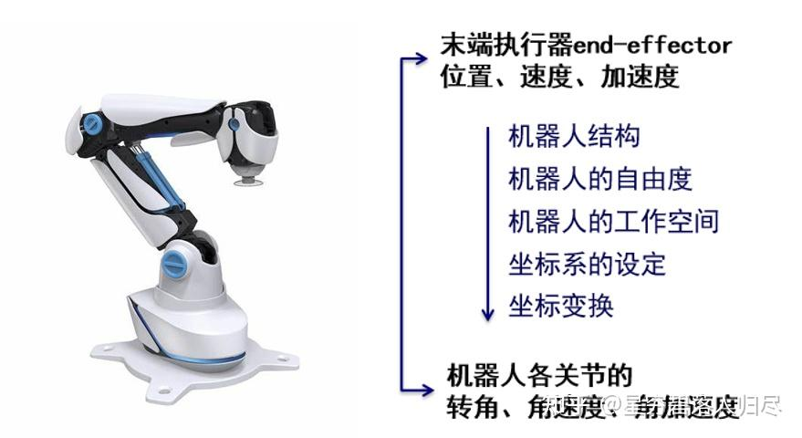

这里设置的研究对象是串联型垂直多关节机器人，是由若干关节以串联的形式连接在一起，由杆件组成的具有多个自由度的开链型空间连杆机构，既串联型垂直多关节型机械臂，后续章节我们将它简称为串联型机器人。

其结构特点有：

1. 开链的一端固定在基座上，
2. 另一端是机器人的手部，
3. 中间由一些杆件（刚体）用关节串接而成
4. 常用的活动关节为移动关节或旋转关节。

如左图所示，机器人由 4 个旋转关节构成，1个是固定连接于基座能够无限回转的旋转关节，3 个是在有限角度内旋转的旋转关节。由多个关节组合运动后，构成了机器人整体的运动形态。通常我们关心的是手部最前端，也就是末端执行器或者工具的运动方式。如果从基座开始向手部方向为关节标号，分别为第 1、2、3、4 关节，某一个瞬间，第 1 个关节做运动后对手部最前端的位置有怎样的影响？第 2 或第 3 关节运动后又会怎样？以此类问题可以看出，要研究机器人的运动，实际是要分析关节运动与末端执行器之间的关系。

如右图所示，上端是末端执行器，包括它的位置、速度和加速度。下端是机器人关节，包括其**转角（或角度）、角速度、角加速度**。左侧是双箭头，代表关节和末端的相互关系：**位置和转角、速度和角速度、加速度和角加速度**。

所以关于臂式机器人分析的手段和方法是按照图示的顺序，首先分析机器人的组成结构，有几个自由度，其工作空间的特点，设定坐标系，最后进行坐标变换实现关节与末端执行器之间的运动联系。

机器人运动学的主要目的就是要**建立各运动杆件关节的运动与机器人手部空间的位置、姿态之间的关系，从而为机器人的运动控制提供分析的手段和方法**。

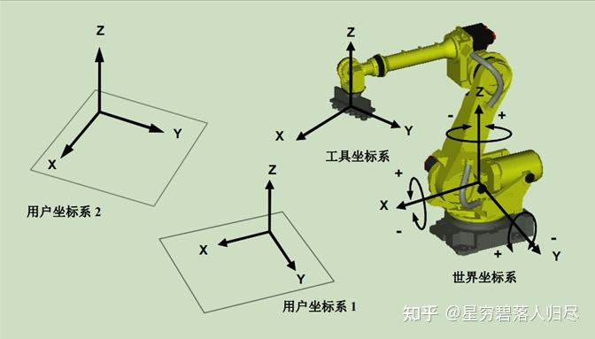

如上图所示的典型的串联型机器人，首先观察其结构构成：基座、连杆、关节、工具，这里还包括了被操作对象，设置好各个坐标系，从基座开始，关节坐标系，腕部坐标系（手部最前端的坐标系），工具坐标系，相应的还需要设置工作台和用户坐标系。设置好了坐标系后才能够开始分析它们之间的手部位置与关节角度、手部速度与关节角速度的相应关系。

### 1.2 机器人的位姿描述

机器人的位姿主要是指**机器人手部在空间的位置和姿态（方向）**，有时也会用到其他各个活动杆件在空间的位置和姿态。机器人位姿是建立在机器人坐标系之上的描述形式；有了位姿，机器人手部和各个活动杆件相对于其他坐标系的位置和姿态就可以用一个 $$3 \times 1$$ 的位置矩阵和一个 $$3 \times 3$$ 的姿态矩阵来描述。

$${ }^{A} \boldsymbol{P}=\left[\begin{array}{lll}p_{x} & p_{y} & p_{z}\end{array}\right]$$

$${ }^{A} R=\left[\begin{array}{ccc}n_{x} & o_{x} & a_{x} \\ n_{y} & o_{y} & a_{y} \\ n_{z} & o_{z} & a_{z}\end{array}\right]$$

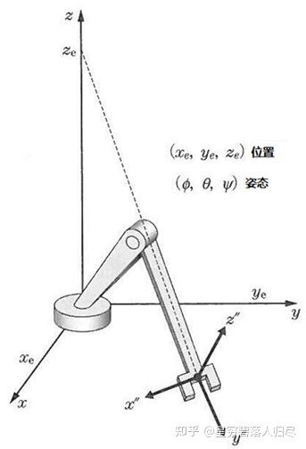

机器人的位姿主要是指机器人手部在空间的位置和姿态 (在 2 维空间中称之为方向)。此外, 有时位姿不仅仅指手部, 也会用到其他各个活动杆件在空间的位置和姿态。以人手为例, 伸出食指后在空间内确定一个位置, 通常我们用直角坐标系下的 XYZ 来描述。在食指确定的这个位置, 可以采用不同的方向指向它,也就是说在空间中的一个位置可以对应无穷多个姿态。而我们需要在机器人手部的每一个运动瞬间, 都有唯一的描述来确定, 这就需要在位置 XYZ 之外, 指定唯一的姿态。

以上图为例, 同样一个手部前端执行器的位置不能够唯一确定机器人的状态,同时具备多个姿势与该位置对应, 所以要**描述机器人需要由位置和姿态同时确定**。通常, 机器人位姿是建立在机器人坐标系之上的描述形式, 机器人手部和各个活动杆件相对于其他坐标系的位置和姿态, 可以用一个 $$3 \times 1$$ 的位置矩阵 $$\mathbf{P}$$ 和一个 $$3 \times 3$$ 的姿态矩阵 $$\mathbf{R}$$ 来描述。

#### 1.2.1 机器人的姿态

(1)机械手的最前端的姿态, 可以用三个旋转的角度来表现

(2)姿态的表示常使用欧拉角或横滚角、俯仰角、偏转角

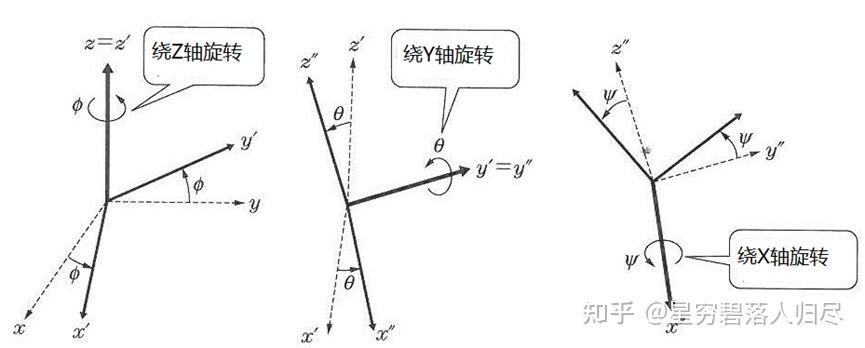

首先，机器人位姿是建立在机器人坐标系之上的描述形式，对于确定的坐标系我们通常可以用三个旋转的角度来表现。对于这个以三个旋转的角度描述姿态的表示，常使用欧拉角或横滚角、俯仰角、偏转角，两种方式。欧拉角是每次沿着运动坐标系的各轴旋转而不是绕固定坐标系的各轴旋转，这样三个一组的旋转被称作欧拉角。

注意：是绕特定的轴旋转但不连续，每次旋转所绕的轴的方向取决于上次旋转后的结果，这是因为前后绕同一轴旋转可以合并，则旋转形式可以分为2类：一类是欧拉，第1和第3轴一致，如，XVX, XZX, YXY等，一类是卡尔丹，3轴均不一致，如，XVZ, YXZ等，将这两种形式统称为欧拉。

#### 1.2.2 姿态角的表示方法 RPY

姿态角的表示，其中横滚角R: roll，俯仰角P: pitch，偏航角Y: yaw。这三个角都是绕着固定参考坐标系的角旋转，以右下图的右手定则为准，伸出食指、拇指、中指，各成90度，以食指为X轴，中指为Y轴，拇指为Z轴。定义其旋转角顺序XYZ，即，先食指、再中指，最后拇指。食指X轴为横滚角R，roll，也就是飞机的侧向滚动；中指Y轴为俯仰角P，pitch，飞机的起飞、着陆；拇指Z轴为偏转角Y，yaw，飞机的航向偏转。

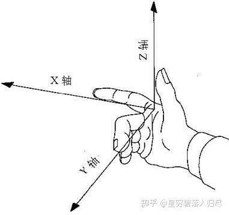

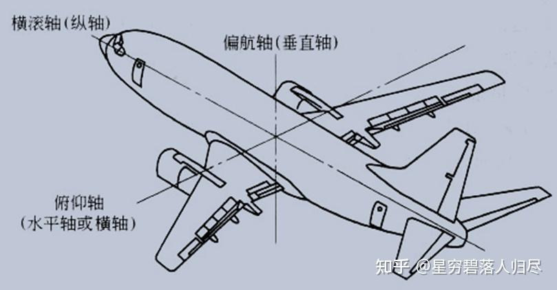

这三个角都是绕着固定参考坐标系的角旋转。这个固定是指每次的旋转都是在固定即不运动的参考坐标系中确定的，由此，我们可以不带证明的介绍欧拉定理，它指出**任何旋转都可以用不超过 3 次绕坐标轴的旋转表述**。这也意味着，一般情况下，两个坐标系之间的任意旋转，均可以分解为一组绕 3 个旋转轴转动的角度。根据上述例子，可知**机器人手臂的位置和姿态由合计 6 个变量所决定。要达到机械臂的位置和姿态最少要提供 6 个自由度。**

### 1.3 齐次坐标变换

#### 1.3.1 直角坐标变换介绍

在机器人中建立直角坐标系后，机器人的手部和各活动杆件之间相对位置和姿态就可以看成是直角坐标系之间的坐标变换，**连杆之间的运动是由转动和平移组成的**。在选定的直角坐标系 {A} 中，空间任一点 P 的位置可以用 3×1 的位置矢量 $${}^{A} \mathbf{P}$$ 表示，其左上标表示选定的坐标系 {A}，此时有

$${}^{A} \mathbf{P} = [P_x \quad P_y \quad P_z]^T$$

PX、PY、PZ 是点 P 在坐标系 {A} 中的三个位置坐标分量

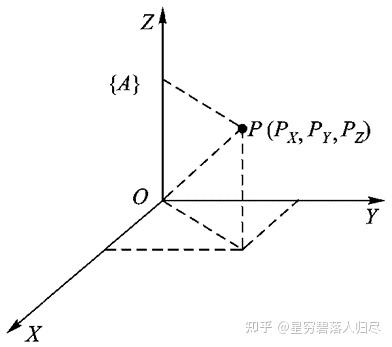

#### 1.3.2 旋转变换介绍

设坐标系 $$\{i\}$$ 和坐标系 $$\{j\}$$ 的原点重合，但两者的姿态不同，这坐标系 $$\{j\}$$ 就可以看成是由坐标系 $$\{i\}$$ 旋转变换而来的。其中，旋转变换包括：

1. 绕坐标轴的旋转变换；
2. 绕过原点的任意轴旋转变换。

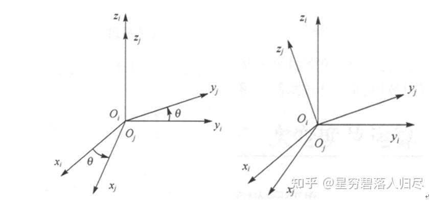

定义旋转变换，有前面欧拉角的描述和定义，设坐标系 $$\{i\}$$ 和坐标系 $$\{j\}$$ 的原点重合，但两者的姿态不同，坐标系 $$\{j\}$$ 就可以看成是由坐标系 $$\{i\}$$ 旋转变换而来的。其旋转变换可以分为两种：如左图所示，绕某坐标轴的旋转变换；如右图所示，绕过原点的任意轴的旋转变换。下面先介绍绕某坐标轴变换的数学表达形式。

##### A. 点在坐标系中绕坐标轴的旋转变换

空间某一点 $$A$$，坐标为 $$(X_A, Y_A, Z_A)$$，当它绕 $$Z$$ 轴旋转 $$\theta$$ 角后至 $$A'$$ 点，坐标为 $$(X'_A, Y'_A, Z'_A)$$。$$A'$$ 点和 $$A$$ 点的坐标关系为

$$\begin{cases} X'_A = X_A \cos \theta - Y_A \sin \theta \\ Y'_A = X_A \sin \theta + Y_A \cos \theta \\ Z'_A = Z_A \end{cases}$$

$$\begin{bmatrix} X'_A \\ Y'_A \\ Z'_A \end{bmatrix} = \begin{bmatrix} \cos \theta & -\sin \theta & 0 \\ \sin \theta & \cos \theta & 0 \\ 0 & 0 & 1 \end{bmatrix} \begin{bmatrix} X_A \\ Y_A \\ Z_A \end{bmatrix}$$

$$X_{A}^{'}$$ 计算过程

$$\frac{a}{Y_{A} } = \tan \theta, (\tan \theta = \frac{\sin \theta }{\cos \theta } )$$

$$a = \frac{\sin \theta Y_{A}}{\cos \theta }$$

$$b = X_{A} - a = X_{A} - \frac{\sin \theta Y_{A}}{\cos \theta }$$

$$\frac{X_{A}^{'}}{b}= \cos \theta$$

$$X_{A}^{'} = (X_{A} - \frac{\sin \theta Y_{A}}{\cos \theta }) * \cos \theta = X_{A}\cos \theta - \sin \theta Y_{A}$$

$$Y_{A}^{'}$$ 计算过程

$$\frac{d}{X_{A}^{'}} = \frac{\sin \theta }{\cos \theta }$$

$$d =  \frac{\sin \theta X_{A}^{'}}{\cos \theta }$$

$$\frac{Y_{A}}{c} = \cos \theta$$

$$c = \frac{Y_{A}}{\cos \theta}$$

$$Y_{A}^{'} = c + d = \frac{Y_{A}}{\cos \theta} + \frac{\sin \theta X_{A}^{'}}{\cos \theta }
= \frac{Y_{A}}{\cos \theta} + \frac{\sin \theta }{\cos \theta }(X_{A}\cos \theta - \sin \theta Y_{A})
= \frac{Y_{A}}{\cos \theta} + \sin \theta X_{A} - \frac{\sin \theta ^{2} Y_{A}}{\cos \theta } 
= \frac{Y_{A}}{\cos \theta }(1 - \sin \theta ^{2} ) + \sin \theta X_{A}= \sin \theta X_{A} + Y_{A}\cos \theta;(\cos \theta^{2} = 1 - \sin \theta ^{2}  )$$

最后，可以简化为：

$$A' = R_\theta A$$

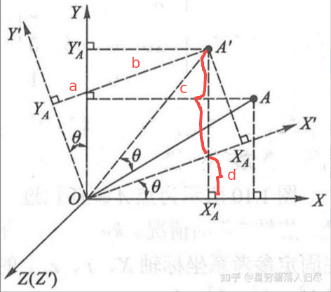

##### B. 点在坐标系中的平移变换

空间某一点 A, 坐标为 (X_A, Y_A, Z_A)，当它平移至 A' 点，坐标为 (X'_A, Y'_A, Z'_A)。A' 点和 A 点的坐标关系为

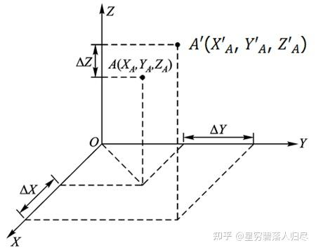

$$\begin{cases} X'_A = X_A + \Delta X \\ Y'_A = Y_A + \Delta Y \\ Z'_A = Z_A + \Delta Z \end{cases}$$

$$\begin{bmatrix} X'_A \\ Y'_A \\ Z'_A \end{bmatrix} = \begin{bmatrix} \Delta X \\ \Delta Y \\ \Delta Z \end{bmatrix} + \begin{bmatrix} X_A \\ Y_A \\ Z_A \end{bmatrix}$$

最后，可简化为：

$$A' = T_{xyz} + A$$

#### 1.3.3 齐次坐标联合变换介绍

联合变换时，平移 T 是矩阵相加，旋转 R 则是矩阵相乘，则有：

$$P' = P * R + T$$

为了能用同一矩阵运算形式表示转动和平移（并且区分空间向量和点），引入齐次坐标变换矩阵。即转换为：P' = P * M 的形式，将 R 和 T 统一由 M 表述。讨论联合变换时，平移是矩阵相加，旋转则是矩阵相乘，直接使用该式进行连续变换和计算，等号右侧将不断出现不同尺寸的矩阵，不但不利于计算，也难以使用标准矩阵的性质和运算规则。为了能用同一矩阵运算形式表示转动和平移，并且能够区分空间向量和点，引入齐次坐标变换矩阵。

齐次变换提供了使用矩阵运算，将 2 维或 3 维中的一个点集，从一个坐标系变换到另一个坐标系的有效方法。也就是将一个 n 维空间的点用 n+1 维坐标表示，则该 n+1 维坐标即为 n 维坐标的齐次坐标。简单的，将前面位置的定义，式 1 所示，P=[PX PY PZ] 的转置，增加一项 w。

将一个 n 维空间的点用 n+1 维坐标表示，则该 n+1 维坐标即为 n 维坐标的齐次坐标。

$$\mathbf{P}=\left[\begin{array}{llll}\mathrm{PX} & \mathrm{PY} & \mathrm{PZ} & \mathrm{w}\end{array}\right]^{\mathrm{T}}$$

一般情况下，w 称为该齐次坐标中的比例因子，当取 w=1 时，其表示方法称为齐次坐标的规格化形式，即

$$\mathbf{P}=\left[\begin{array}{llll}\mathrm{PX} & \mathrm{PY} & \mathrm{PZ} & 1\end{array}\right]^{\mathrm{T}}$$

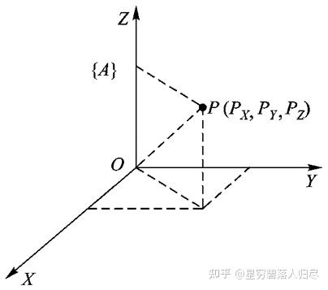

坐标轴的方向表示

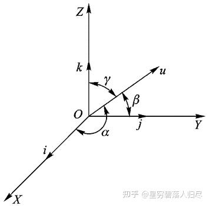

i、j、k 分别表示直角坐标系中 X、Y、Z 坐标轴的单位矢量，用齐次坐标表示，则有

$$\mathbf{X}=\left[\begin{array}{llll}1 & 0 & 0 & 0\end{array}\right]^{\mathrm{T}}$$

$$\begin{aligned}& \mathbf{Y}=\left[\begin{array}{llll}0 & 1 & 0 & 0\end{array}\right]^{\mathrm{T}} \\& \mathbf{Z}=\left[\begin{array}{llll}0 & 0 & 1 & 0\end{array}\right]^{\mathrm{T}}\end{aligned}$$

规定:

- $$4 \times 1$$ 矩阵 $$\left[\begin{array}{lllll}a & b & c & w & 0\end{array}\right]^{\mathrm{T}}$$ 中第四个元素为零, 且满足 $$a^{2}+b^{2}+c^{2}=1$$, 则 $$\left[\begin{array}{llll}a & b & c & 0\end{array}\right]^{\mathrm{T}}$$ 中 a、b、c 的表示某轴的方向;

- $$4 \times 1$$ 矩阵 $$\left[\begin{array}{llll}a & b & c & w\end{array}\right]^{\mathrm{T}}$$ 中第四个元素不为零, 则 $$\left[\begin{array}{llll}a & b & c & w\end{array}\right]^{\mathrm{T}}$$ 表示空间某点的位置。

则: 所示的矢量 u 的方向用 $$4 \times 1$$ 列阵可表达为:

$$\mathbf{u}=\left[\begin{array}{llll}a & b & c & 0\end{array}\right]^{\mathrm{T}}$$

$$a=\cos \alpha, \quad b=\cos \beta,$$

则: 矢量 u 的起点 O 为坐标原点可表达为:

$$\mathbf{O}-\left[\begin{array}{llll}0 & 0 & 0 & 1\end{array}\right]^{\mathrm{T}}$$

故使用齐次变换, 可以表示坐标轴、矢量方向和坐标原点。

需要注意的是, 这里为了表述方便, 省略了转置矩阵的说明。

#### 1.3.4 齐次坐标变化及运算

齐次坐标下的旋转变换

空间某一点 A, 坐标为 $$\left(X_{A}, Y_{A}, Z_{A}\right)$$, 当它绕 Z 轴旋转 $$\theta$$ 角后至 $$A^{\prime}$$ 点, 坐标为 $$\left(X_{A}^{\prime}\right.$$, $$\left.Y_{A}^{\prime}, Z_{A}^{\prime}\right)$$ 。 $$A^{\prime}$$ 点和 A 点的坐标关系为

有了齐次坐标的设定, 我们再次考虑坐标系的旋转和平移变换。

首先, 列出旋转变换矩阵的等式, 如下左式 1 , 其次将变换前和变换后的位罝矩阵改为齐次坐标表述方式, 都加一维, 数值为 1 , 最后将旋转矩阵按照计算的要求增加第 4 行和第 4 列, 均为 [0 0 0 1] 将其简化描述为下式 3 等式右侧的 rot 为简写的齐次坐标变换下的旋转矩阵。

$$\begin{gathered}\left[\begin{array}{l}X_{A}^{\prime} \\ Y_{A}^{\prime} \\ Z_{A}^{\prime}\end{array}\right]=\left[\begin{array}{ccc}\cos \theta & -\sin \theta & 0 \\ \sin \theta & \cos \theta & 0 \\ 0 & 0 & 1\end{array}\right]\left[\begin{array}{l}X_{A} \\ Y_{A} \\ Z_{A}\end{array}\right] \\\left[\begin{array}{l}X_{A}^{\prime} \\ Y_{A}^{\prime} \\ Z_{A}^{\prime} \\ 1\end{array}\right]=\left[\begin{array}{cccc}\cos \theta & -\sin \theta & 0 & 0 \\ \sin \theta & \cos \theta & 0 & 0 \\ 0 & 0 & 1 & 0 \\ 0 & 0 & 0 & 1\end{array}\right]\left[\begin{array}{l}X_{A} \\ Y_{A} \\ Z_{A} \\ 1\end{array}\right]\end{gathered}$$

最后，它的简化描述为

$$\hat{A}^{\prime}=\operatorname{Rot}(Z, \theta) A$$

由此，可得绕 $$z$$ 轴旋转 $$\theta$$ 角的旋转变换矩阵也即点在坐标系中绕 $$z$$ 轴的旋转变换通式为

$$\operatorname{Rot}(Z, \theta)=\left[\begin{array}{cccc}\mathrm{c} \theta & -\mathrm{s} \theta & 0 & 0 \\\mathrm{s} \theta & \mathrm{c} \theta & 0 & 0 \\0 & 0 & 1 & 0 \\0 & 0 & 0 & 1\end{array}\right]$$

同理，可得绕 $$x$$ 轴旋转 $$\theta$$ 角的旋转变换矩阵为

$$\operatorname{Rot}(X, \theta)=\left[\begin{array}{cccc}1 & 0 & 0 & 0 \\0 & \mathrm{c} \theta & -\mathrm{s} \theta & 0 \\0 & \mathrm{s} \theta & \mathrm{c} \theta & 0 \\0 & 0 & 0 & 1\end{array}\right]$$

绕 $$y$$ 轴旋转 $$\theta$$ 角的旋转变换矩阵为

$$\operatorname{Rot}(Y, \theta)=\left[\begin{array}{cccc}\mathrm{c} \theta & 0 & \mathrm{s} \theta & 0 \\0 & 1 & 0 & 0 \\-\mathrm{s} \theta & 0 & \mathrm{c} \theta & 0 \\0 & 0 & 0 & 1\end{array}\right]$$

#### 1.3.5 坐标系中绕过原点的任意轴旋转变换

##### A. 齐次坐标下的旋转变换

下面介绍绕过原点的任意轴的旋转变换。如图所示，为点 A 绕任意过原点的单位矢量 K，旋转 $$\theta$$ 角的情况。KX、KY、KZ 分别为矢量 k 在固定参考系坐标轴 X、Y、Z 上的三个分量。

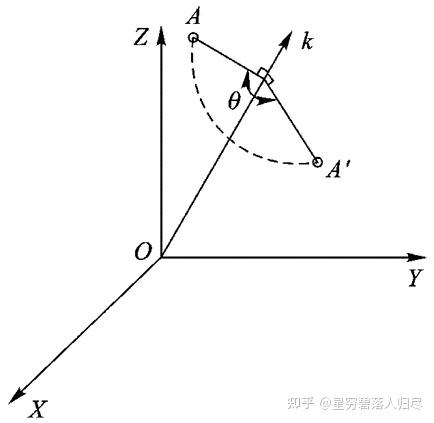

$$\text { Rot }(k, \theta)=\left[\begin{array}{cccc} k_{x} k_{x} \operatorname{vers} \theta+c \theta & k_{y} k_{x} \operatorname{vers} \theta-k_{z} s \theta & k_{z} k_{x} \operatorname{vers} \theta+k_{y} s \theta & 0 \\ k_{x} k_{y} \operatorname{vers} \theta+k_{z} s \theta & k_{y} k_{y} \operatorname{vers} \theta+c \theta & k_{z} k_{y} \operatorname{vers} \theta-k_{x} s \theta & 0 \\ k_{x} k_{z} \operatorname{vers} \theta-k_{y} s \theta & k_{y} k_{z} \operatorname{vers} \theta+k_{x} s \theta & k_{z} k_{z} \operatorname{vers} \theta+c \theta & 0 \\ 0 & 0 & 0 & 1 \end{array}\right]$$

$$\operatorname{vers} \theta=1-\cos \theta$$

(1) 该式为一般旋转齐次变换通式，概括了绕 X、Y、Z 轴进行旋转变换的情况。反之，当给出某个旋转齐次变换矩阵，则可求得 $$\mathbf{k}$$ 及转角 $$\theta$$。

(2) 变换算子公式不仅适用于点的旋转，也适用于矢量、坐标系、物体的旋转。

(3) 左乘是相对固定坐标系的变换；右乘是相对动坐标系的变换。

$$\operatorname{Rot}(\mathbf{k}, \theta)=\left[\begin{array}{llll} n_{x} & o_{x} & a_{x} & 0 \\ n_{y} & o_{y} & a_{y} & 0 \\ n_{z} & o_{z} & a_{z} & 0 \\ 0 & 0 & 0 & 1 \end{array}\right]$$

从结果来看，绕任意轴旋转变换算子可以由 $$4 * 4$$ 的矩阵描述，其简化形式是令 $$\mathbf{n}, \mathbf{o}, \mathbf{a}$$ 分别为 X、Y、Z 坐标轴的单位矢量，各单位方向矢量在静系上的分量为动系各坐标轴的方向余弦，以齐次坐标形式分别表示：

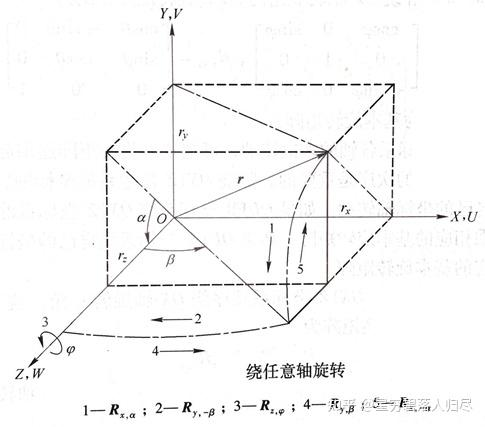

也就是将绕某矢量的一次旋转代替坐标系之间坐标轴的多次旋转。即：

$$\operatorname{Rot}(\boldsymbol{k}, \theta)=\boldsymbol{R}_{x,-\alpha} \boldsymbol{R}_{y, \beta} \boldsymbol{R}_{z, \varphi} \boldsymbol{R}_{y,-\beta} \boldsymbol{R}_{x, \alpha}$$

先旋转将 $$\mathbf{r}$$ 与 $$Z$$ 轴重合，绕过指定的角度 $$\varphi$$ 后，再绕回原来的位置。步骤如下:

1. 绕 X 轴旋转 $$\alpha, \mathbf{r}$$ 在 ZX 平面

2. 绕 Y 轴旋转 $$\beta, \mathbf{r}$$ 与 Z 轴重合

3. 旋转要求的角度

4. 再绕回来，绕 Y 轴旋转 $$\beta$$

5. 绕 X 轴旋转 $$\alpha$$

最终得到:

$$\mathbf{r}^{\prime}=\operatorname{Rot}(\boldsymbol{k}, \theta) \mathbf{r}$$

##### B. 齐次坐标下的平移变换

空间某一点 A，坐标为 $$\left(X_{A}, Y_{A}, Z_{A}\right)$$ ，当它平移至 $$A^{\prime}$$ 点，坐标为 $$\left(X_{A}^{\prime}, Y_{A}^{\prime}, Z_{A}^{\prime}\right)$$ 。 $$A^{\prime}$$ 点和 $$A$$ 点的坐标关系为

$$\begin{aligned}& \left\{\begin{array}{l}X_{A}^{\prime}=X_{A}+\Delta X \\Y_{A}^{\prime}=Y_{A}+\Delta Y \\Z_{A}^{\prime}=Z_{A}+\Delta Z\end{array}\right. \\& \left[\begin{array}{c}X_{A}^{\prime} \\Y_{A}^{\prime} \\Z_{A}^{\prime} \\1\end{array}\right]=\left[\begin{array}{cccc}1 & 0 & 0 & \Delta X \\0 & 1 & 0 & \Delta Y \\0 & 0 & 1 & \Delta Z \\0 & 0 & 0 & 1\end{array}\right]\left[\begin{array}{c}X_{A} \\Y_{A} \\Z_{A} \\1\end{array}\right] \\& A^{\prime}\left(X_{A}^{\prime}, Y_{A}^{\prime}, Z_{A}^{\prime}\right)\end{aligned}$$

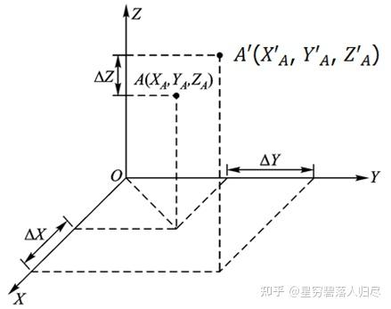

得到平移变换算子:

$$\operatorname{Trans}(\Delta X, \Delta Y, \Delta Z)=\left[\begin{array}{cccc}1 & 0 & 0 & \Delta X \\0 & 1 & 0 & \Delta Y \\0 & 0 & 1 & \Delta Z \\0 & 0 & 0 & 1\end{array}\right]$$

最终，其简化形式为:

$$\boldsymbol{A}^{\prime}=\operatorname{Trans}(\Delta X, \Delta Y, \Delta Z) \boldsymbol{A}$$

##### C. 齐次坐标下的联合变换

联合变换是将平移变换与旋转变换组合在同一次变换中，如图所示

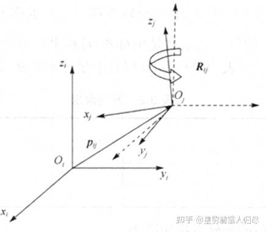

设坐标系 $$\{i\}$$ 和坐标系 $$\{j\}$$ 之间存在一个平移变换和一个旋转变换，其对应的变换矩阵分别为 $$\mathbf{P}_{ij}$$ 和 $$\mathbf{R}_{ij}$$，则空间任一点 $$\mathbf{p}$$ 在坐标系 $$\{i\}$$ 和坐标系 $$\{j\}$$ 中的矢量 $$\mathbf{r}_i$$ 和 $$\mathbf{r}_j$$ 之间有以下关系

$$\mathbf{r}_i = \mathbf{p}_{ij} + \mathbf{R}_{ij} \mathbf{r}_j$$

例：若坐标系 $$\{j\}$$ 是由坐标系 $$\{i\}$$ 先沿矢量 $$\mathbf{p}_{ij} = p_x \mathbf{i} + p_y \mathbf{j} + p_z \mathbf{k}$$ 平移，再绕 $$z_i$$ 轴旋转 $$\theta$$ 角得到的，则空间任一点 $$\mathbf{p}$$ 在坐标系 $$\{i\}$$ 和坐标系 $$\{j\}$$ 中的矢量 $$\mathbf{r}_i$$ 和 $$\mathbf{r}_j$$ 和对应的变换矩阵 $$\mathbf{p}_{ij}$$ 和 $$\mathbf{R}_{ij}$$ 之间就有 $$\mathbf{r}_i = \mathbf{p}_{ij} + \mathbf{R}_{ij} \mathbf{r}_j$$。写成矩阵形式为

$$\begin{bmatrix} x_i \\ y_i \\ z_i \end{bmatrix} = \begin{bmatrix} p_x \\ p_y \\ p_z \end{bmatrix} + \begin{bmatrix} \cos \theta & -\sin \theta & 0 \\ \sin \theta & \cos \theta & 0 \\ 0 & 0 & 1 \end{bmatrix} \begin{bmatrix} x_j \\ y_j \\ z_j \end{bmatrix}$$

改写为齐次坐标下的矩阵形式

$$\begin{bmatrix} x_i \\ y_i \\ z_i \\ 1 \end{bmatrix} = \begin{bmatrix} \cos \theta & -\sin \theta & 0 & p_x \\ \sin \theta & \cos \theta & 0 & p_y \\ 0 & 0 & 1 & p_z \\ 0 & 0 & 0 & 1 \end{bmatrix} \begin{bmatrix} x_j \\ y_j \\ z_j \\ 1 \end{bmatrix}$$

齐次坐标下的坐标联合变换方程通式

$$M_{ij}=\left[\begin{array}{llll}n_x & o_x & a_x & p_x \\ n_y & o_y & a_y & p_y \\ n_z & o_z & a_z & p_z \\ 0 & 0 & 0 & 1\end{array}\right]=\left[\begin{array}{cccc}1 & 0 & 0 & p_x \\ 0 & 1 & 0 & p_y \\ 0 & 0 & 1 & p_z \\ 0 & 0 & 0 & 1\end{array}\right]\left[\begin{array}{cccc}n_x & o_x & a_x & 0 \\ n_y & o_y & a_y & 0 \\ n_z & o_z & a_z & 0 \\ 0 & 0 & 0 & 1\end{array}\right]$$

$$=\operatorname{Trans}(p_x, p_y, p_z) \operatorname{Rot}(k_n, \theta)$$

#### 1.3.6 齐次坐标变换总结

齐次坐标系之间的变换就称为齐次坐标变换，齐次坐标变换的引入是为了更简便的计算和更直观的描述直角坐标系中的联合变换。

若将齐次坐标变换矩阵分块，则有

$$M_{ij}=\left[\begin{array}{ccc|c}\cos \theta & -\sin \theta & 0 & p_x \\\sin \theta & \cos \theta & 0 & p_y \\0 & 0 & 1 & p_z \\0 & 0 & 0 & 1\end{array}\right]=\left[\begin{array}{cc|c}R_{ij} & p_{ij} \\0 & 1\end{array}\right]$$

由此可见，在齐次坐标变换矩阵的分块矩阵中，左上角的 $$3 \times 3$$ 矩阵是两个坐标系之间的**旋转变换矩阵**，它描述了它们之间的姿态关系；右上角的 $$3 \times 1$$ 矩阵是两个坐标系之间的**平移变换矩阵**，它描述了它们之间的位置关系；此外，任意轴的旋转变换、平移变换的联合变换矩阵与**变换后的位姿矩阵形式一致**。所以齐次坐标变换矩阵又称为位姿矩阵

$$M_{ij}=\left[\begin{array}{ccc|c}n_x & o_x & a_x & p_x \\n_y & o_y & a_y & p_y \\n_z & o_z & a_z & p_z \\0 & 0 & 0 & 1\end{array}\right]=\left[\begin{array}{cc|c}R_{ij} & p_{ij} \\0 & 1\end{array}\right]$$

其中：

$$p_x, p_y, p_z$$ —— 坐标系 $$\{j\}$$ 的原点在坐标系 $$\{i\}$$ 中的坐标分量；

$$n_x, n_y, n_z$$ —— 坐标系 $$\{j\}$$ 的 $$x$$ 轴对坐标系 $$\{i\}$$ 的三个方向余弦；

$$o_x, o_y, o_z$$ —— 坐标系 $$\{j\}$$ 的 $$y$$ 轴对坐标系 $$\{i\}$$ 的三个方向余弦；

$$a_x, a_y, a_z$$ —— 坐标系 $$\{j\}$$ 的 $$z$$ 轴对坐标系 $$\{i\}$$ 的三个方向余弦。

#### 1.3.7 静系、动系及算子左右乘规则

在所建立的机器人坐标系中，运动时相对于连杆不动的坐标系称为静坐标系，简称**静系**（一般情况下是基座坐标系）；跟随连杆运动的坐标系称为动坐标系，简称为**动系**（关节坐标系）。动系位置与姿态的描述称为动系的位姿表示，是对动系原点位置及各坐标轴方向的描述。

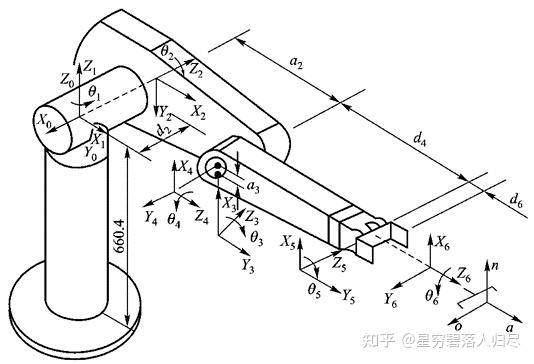

相对固定坐标系进行变换，则算子**左乘**；若相对动坐标系进行变换，则算子**右乘**。

#### 1.3.8 机器人手部位姿描述

机器人手部的位置和姿态也可以用固连于手部的坐标系 {B} 的位姿来表示，如图所示。坐标系 {B} 可以这样来确定：取手部的中心点为原点 $$O_{\mathrm{B}}$$；关节轴为 $$Z_{\mathrm{B}}$$ 轴，$$Z_{\mathrm{B}}$$ 轴的单位方向矢量 $$\mathbf{a}$$ 称为接近矢量，指向朝外；两手指的连线为 $$Y_{\mathrm{B}}$$ 轴，$$Y_{\mathrm{B}}$$ 轴的单位方向矢量 $$\mathbf{o}$$ 称为姿态矢量，指向可任意选定；$$X_{\mathrm{B}}$$ 轴与 $$Y_{\mathrm{B}}$$ 轴及 $$Z_{\mathrm{B}}$$ 轴垂直，$$X_{\mathrm{B}}$$ 轴的单位方向矢量 $$\mathbf{n}$$ 称为法向矢量，且 $$\mathbf{n} = \mathbf{o} \times \mathbf{a}$$，指向符合右手法则。

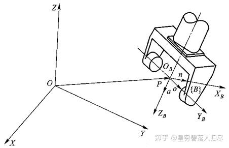

手部的位置矢量为固定参考系原点指向手部坐标系 {B} 原点的矢量 $$\mathbf{P}$$，手部的方向矢量为 $$\mathbf{n}$$、$$\mathbf{o}$$、$$\mathbf{a}$$。于是手部的位姿可用 4×4 矩阵表示为

$$T = \begin{bmatrix}
\mathbf{n} & \mathbf{o} & \mathbf{a} & \mathbf{P} \\
0 & 0 & 0 & 1
\end{bmatrix} = \begin{bmatrix}
n_x & o_x & a_x & P_x \\
n_y & o_y & a_y & P_y \\
n_z & o_z & a_z & P_z \\
0 & 0 & 0 & 1
\end{bmatrix}$$

### 1.4 机器人的运动关系

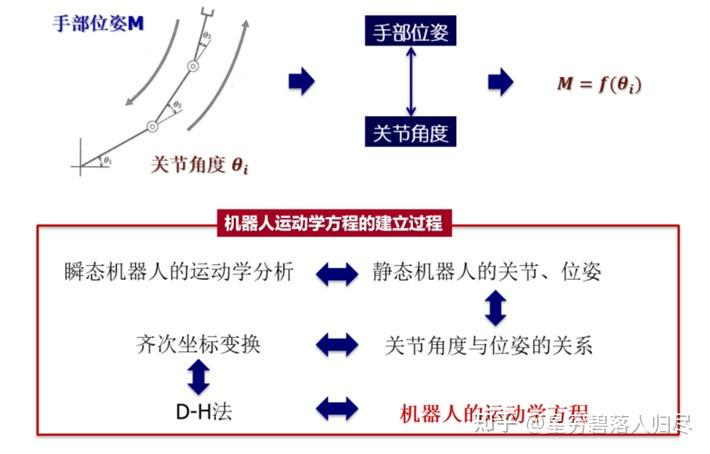

**机器人运动学的研究方法**: 通过建立**运动学方程**研究机器人手部**位姿与关节角度**的关系。

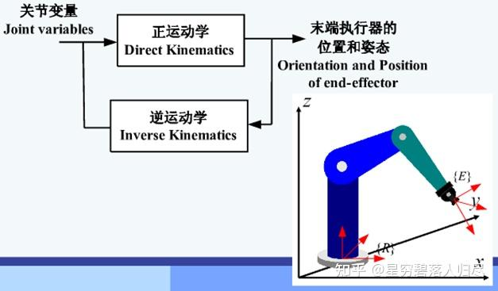

#### 建立机器人的运动学方程步骤:

利用坐标变换, 就可以确定机器人手部的位姿矩阵 $$M$$ 与关节变量 $$\theta_{i}$$ 之间的函数关系。具体的过程是:

1. 先建立机器人的手部、机座和各个活动杆（关节）坐标系;
2. 确定各个坐标系之间的变换参数;
3. 相邻两个坐标系之间的齐次坐标变换关系 (位姿矩阵);
4. 通过乘积运算得到机器人的运动学方程。