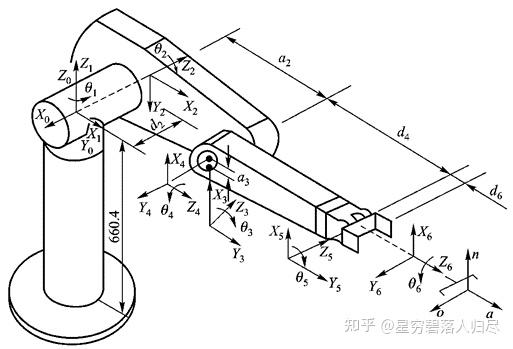

###### datetime:2025/09/04 16:16

###### author:nzb

# 机器人基础知识学习笔记—理论篇

## 1. 机器人运动学

#### 1.6.1 串联机器人的运动学方程

举例说明：三自由度串联机器人运动学方程

| 手部位置 | Xe,Ye |
| --- | --- |
| 手部姿态 | a |
| 关节角度 | 01, 02, 03 |
| 连杆长度 | l1,l2,l3 |

列写手部位姿与关节角度之间的关系方程：

$$x_{e}=l_{1} \cos \theta_{1}+l_{2} \cos \left(\theta_{1}+\theta_{2}\right)+l_{3} \cos \left(\theta_{1}+\theta_{2}+\theta_{3}\right)$$

$$y_{e}=l_{1} \sin \theta_{1}+l_{2} \sin \left(\theta_{1}+\theta_{2}\right)+l_{3} \sin \left(\theta_{1}+\theta_{2}+\theta_{3}\right)$$

$$\alpha=\theta_{1}+\theta_{2}+\theta_{3}$$

简化描述为：

$$M=f\left(\theta_{i}\right)$$

$$M=\left[x_{e} \quad y_{e} \quad \alpha\right]^{T}$$

$$f\left(\theta_{i}\right)=\left[\begin{array}{c} l_{1} \cos \theta_{1}+l_{2} \cos \left(\theta_{1}+\theta_{2}\right)+l_{3} \cos \left(\theta_{1}+\theta_{2}+\theta_{3}\right) \\ l_{1} \sin \theta_{1}+l_{2} \sin \left(\theta_{1}+\theta_{2}\right)+l_{3} \sin \left(\theta_{1}+\theta_{2}+\theta_{3}\right) \\ \theta_{1}+\theta_{2}+\theta_{3} \end{array}\right]$$

#### 1.6.2 运动学方程的建立

##### A. 坐标系号的分配

机器人的各连杆通过关节连接在一起，关节有移动副与转动副两种。按从基座到末端执行器的顺序，由低到高依次为各关节和各连杆编号，如图所示。

杆件编号：0—N，N+1个，基座的编号为杆件0，连杆N与末端操作器固接，与基座相连的连杆编号为杆件1，依此类推。

关节编号：1—N，N个关节，基座与连杆1的关节编号为关节1，关节i是将杆件i-1与杆件i相连接，依此类推。

##### B. 转动关节的 D-H 方法确定坐标系位置

###### 确定坐标系 Oi

建立坐标系：基体坐标 $$O_0$$，末端操作器 $$O_{N}$$，坐标系 $$O_{i-1}$$（$$i=1\cdots N$$），共 $$N+1$$ 个。

(1) 坐标系 $$O_i$$ 固接于连杆 $$i$$ 的远端，关节 $$i+1$$ 的转动轴线为坐标系 $$O_i$$ 的 Z 轴 $$Z_i$$，位于连杆 $$i$$ 与连杆 $$i+1$$ 的转动关节轴线上（拇指）；连杆 $$i$$ 位于关节 $$i$$ 和 $$i+1$$ 之间。

(2) 连杆 $$i$$ 的两端轴线（$$Z_{i-1}$$—$$Z_i$$）的公垂线为坐标系 $$i$$ 的 X 轴（食指），方向指向下一根连杆；

(3) 公垂线与 $$Z_i$$ 的交点为坐标系原点；

(4) 坐标系的 $$Y_i$$ 轴由 $$X_i$$ 和 $$Z_i$$ 按照右手准则确定（D-H 法中用不到 Y 轴）。

###### 确定相邻坐标系 $$O_{i-1}, O_i$$ 关系：连杆 $$i$$ 和关节 $$i$$ 的参数

参数描述：

(1) **连杆 $$i$$ 长度**：连杆 $$i$$ 两端关节轴线（$$Z_{i-1}$$ 和 $$Z_i$$）沿公垂线的距离 $$a_i$$；

(2) **连杆 $$i$$ 扭角**：垂直于 $$a_i$$ 所在平面内两关节轴线（$$Z_{i-1}$$ 和 $$Z_i$$）的夹角 $$\alpha_i$$；

(3) **关节 $$i$$ 距离**：关节平移量，相连两个杆件 $$i-1$$ 和 $$i$$ 在关节轴线 $$Z_{i-1}$$ 上的距离（$$X_{i-1}$$ 到 $$X_i$$ 公垂线的长度），两连杆的相对位置 $$d_i$$；

(4) **关节 $$i$$ 夹角**：绕 $$Z_{i-1}$$ 轴的关节角，（$$X_{i-1}$$ 到 $$X_i$$）的夹角 $$\theta_i$$；

##### C. 平动关节的 D-H 法确定关节坐标系位置

平动关节（棱柱联轴器）联轴器移动方向为关节的移动方向，距离 $$d_i$$ 为关节变量，其长度 $$a_i$$ 没有意义，通常令其为零

移动连杆 i 的坐标系:

1. 原点 $$O_i$$: 关节 i 与关节 i+1 轴线的公垂线交点
2. $$Z_i$$ 与 i+1 关节轴线重合
3. $$X_i$$ 沿移动关节 i 轴线与关节 i+1 轴线的公垂线，过原点 $$O_i$$ 且平行于移动关节 i 的轴线，指向 i+1 关节

移动连杆相邻 i-1 坐标系:

1. $$Z_{i-1}$$ 过原点 $$O_i$$ 且平行于移动关节 i 的轴线
2. $$O_{i-1}$$ 关节轴线 i-1 与 $$Z_{i-1}$$ 轴的公垂线与 $$Z_{i-1}$$ 轴的交点，公垂线为 $$X_{i-1}$$ 轴，指向关节 i-1

##### D. 运动学方程的建立

###### D.1、建立机器人坐标系

要用坐标变换描述机器人各个杆件在空间的位姿，就要在每个杆件上固定一个直角坐标系，机器人要建立的坐标系主要有三种：

a. 基座坐标系  
b. 关节坐标系（杆件坐标系）  
c. 手部坐标系

###### D.2、确定参数和关节变量

在机器人运动学方程中，所涉及的参数有两类：

a. 机器人杆件的几何参数

在串联机器人的机构中，除机座和手部杆件外，其余机器人的杆件都是通过两端的关节与其他杆件连接起来的。给定任意一个机器人的活动杆件 i，如图所示

在描述该杆件时，要用到两个几何参数：

1. 杆件长度 $$l_i$$：机器人杆件两端关节轴线之间的距离（公垂线长度）
2. 杆件扭角 $$\alpha_i$$：机器人杆件两端关节轴线之间的夹角（沿公垂线方向看下去）。

b. 关节的运动参数

当杆件 i-1 和杆件 i 通过关节 i 连接起来之后，如图所示

当两个杆件运动时，它们之间的运动关系可以通过关节 i 的两个运动参数来进行描述：

(1) 关节平移量 $$d_i$$：机器人相连两个杆件的长度在关节轴线上的距离（公垂线长度）；

(2) 关节回转量 $$\theta_i$$：机器人相连两个杆件的长度在关节轴线上的夹角。

| 连杆本身的参数 | 连杆长度 | $$a_{n}$$ | 连杆两个轴的公垂线距离（x方向） |
| --- | --- | --- | --- |
|  | 连杆扭转角 | $$\alpha_{n}$$ | 连杆两个轴的夹角（x轴的扭转角） |
| 连杆之间的参数 | 连杆之间的距离 | $$d_{n}$$ | 相连两连杆公垂线距离（z方向平移距） |
|  | 连杆之间的夹角 | $$\theta_{n}$$ | 相连两连杆公垂线的夹角（z轴旋转角） |

##### E. 求解相邻杆件的位姿矩阵一【连杆 i-1 与连杆 i，坐标系 $$O_{i-1}$$ 与坐标系 $$O_{i}$$】

相邻杆件的位姿矩阵就是两个相邻杆件坐标系之间的齐次坐标变换矩阵，它表达了两个杆件之间的位置与姿态关系。

坐标系对齐：

$$\mathbf{M}_{a}=\operatorname{Trans}(0,0,d_{i})=\left[\begin{array}{cccc}1 & 0 & 0 & 0 \\0 & 1 & 0 & 0 \\0 & 0 & 1 & d_{i} \\0 & 0 & 0 & 1\end{array}\right] \quad $$

$$ \mathbf{M}_{b}=\operatorname{Rot}\left(z_{i-1}, \theta_{i}\right)=\left[\begin{array}{cccc}\cos \theta_{i} & -\sin \theta_{i} & 0 & 0 \\\sin \theta_{i} & \cos \theta_{i} & 0 & 0 \\0 & 0 & 1 & 0 \\0 & 0 & 0 & 1\end{array}\right]$$

$$\mathbf{M}_{c}=\operatorname{Trans}\left(l_{i}, 0,0\right)=\left[\begin{array}{cccc}1 & 0 & 0 & l_{i} \\0 & 1 & 0 & 0 \\0 & 0 & 1 & 0 \\0 & 0 & 0 & 1\end{array}\right] \quad $$ 

$$\mathbf{M}_{d}=\operatorname{Rot}\left(x_{i}, \alpha_{i}\right)=\left[\begin{array}{cccc}1 & 0 & 0 & 0 \\0 & \cos \alpha_{i} & -\sin \alpha_{i} & 0 \\0 & \sin \alpha_{i} & \cos \alpha_{i} & 0 \\0 & 0 & 0 & 1\end{array}\right]$$

说明: 同一个坐标轴的旋转和平移变换顺序可交换

$$M_{i-1, i}=M_{a} M_{b} M_{c} M_{d}=\operatorname{Trans}\left(0,0, d_{i}\right) \operatorname{Rot}\left(z_{i-1}, \theta_{i}\right) \operatorname{Trans}\left(l_{i}, 0,0\right) \operatorname{Rot}\left(x_{i}, \alpha_{i}\right)$$

$$=\left[\begin{array}{cccc}\cos \theta_{i} & -\sin \theta_{i} \cos \alpha_{i} & \sin \theta_{i} \sin \alpha_{i} & l_{i} \cos \theta_{i} \\\sin \theta_{i} & \cos \theta_{i} \cos \alpha_{i} & -\cos \theta_{i} \sin \alpha_{i} & l_{i} \sin \theta_{i} \\0 & \sin \alpha_{i} & \cos \alpha_{i} & d_{i} \\0 & 0 & 0 & 1\end{array}\right]$$

##### F. 建立运动学方程

求解出所有相邻坐标系的位姿矩阵 $$\mathbf{M}_{01}, \mathbf{M}_{12}, \cdots \mathbf{M}_{(i-1), i}, \cdots \mathbf{M}_{(n-1), n}$$ 以后，则机器人手部的位姿矩阵 $$\mathbf{M}_{n}$$ 与各个关节变量 $$\theta_{i}(i=1,2, \cdots, n)$$ 之间就有了确定的函数关系，根据齐次变换矩阵的运算原理，可得

$$\mathbf{M}_{0n} = \mathbf{M}_{01}\mathbf{M}_{12}\cdots \mathbf{M}_{(i-1), i}\cdots \mathbf{M}_{(n-1), n} = f(\theta _{i} ) ;i=1,2,\cdot\cdot \cdot ,n$$

称为机器人的运动学方程，它描述了机器人手部在机座坐标中的位置和姿态与机器人所有关节变量之间的数学关系

#### 1.6.3 机器人运动学方程的解

- 1、正运动学求解

> 关节角度θ -> 运动学方程 -> 手部位姿M

由机械臂的各关节的角度求解先端位置，即针对机器人运动学问题的求解称为**运动学方程的正解**。

若机器人结构参数已知，则当给出机器人各个运动关节的关节变量时，就可确定机器人手部在机座坐标系中所处的位置和姿态，即可确定运动学方程中位姿矩阵 $$\mathbf{M}_{oh}$$ 的各元素值。

- 2、逆运动学求解

> 关节角度θ <- 运动学方程 <- 手部位姿M

从机械臂的先端位置开始求各关节的角度，即针对机器人运动学逆问题的求解称为**运动学方程的逆解**。

当给出机器人手部在机座坐标系中所处的位置和姿态时，即给定了运动学方程中位姿矩阵 $$\mathbf{M}_{oh}$$ 的各元素值。如何求出机器人各个运动关节变量值，是求解机器人运动学的逆问题，也称为间接位置求解。

a. 机器人运动学逆问题的求解方法是利用机器人运动学方程两端矩阵元素应相等的原理得到一组多变量的三角函数方程，通过求解这组方程来确定机器人各个关节变量的值。

b. 机器人运动学方程的正解是唯一的，但机器人运动学方程的逆解却有无解、唯一解、多解三种情况。

- 3、 多解性

机器人的运动学逆解具有多解性（如图所示），对于给定的位置与姿态它具有两组解

针对平面内三自由度机械臂进行逆运动学计算，如果目标的位置是 ($$x_{ed}$$, $$y_{ed}$$) 姿势 a，那么关节长度为 $$l_{3}$$，第三关节 ($$x_{3}$$ $$y_{3}$$) 的位置作为目标位置和姿势时，可以有下面的式子

$$x_{3}=x_{e d}-l_{3} \cos \alpha$$

$$y_{3}=y_{e d}-l_{3} \sin \alpha$$

求得了第三关节的位置，可以看出第二关节和第一关节构成了三角形的两边，通过这个组合可以看出各关节的长度即使是相同的情况，如上文右图所示，就会有两种情况存在，不管哪一种情况，第三关节的位置都将是 (x3, y3)。

由例可看出，造成机器人运动学逆解具有多解的原因是**由于解反三角函数方程产生的**。对于一个真实的机器人，只有一组解与实际情况对应，为此必须做出判断，以选择合适的解。通常采用剔除多余解的方法：

(1) 根据关节运动空间来选择合适的解；

(2) 最接近原则，选择一个与目前位姿状态最接近的解；

(3) 根据避障要求选择合适的解；

(4) 逐级剔除多余解。

- 4、可解性

机器人的可解性问题是能否求得机器人运动学逆解的解析式。

所有具有转动和移动关节的机器人系统，在一个单一串联链中共有 6 个自由度（或小于 6 个自由度）时是可解的。其通解是数值解，不是解析表达式，是利用数值迭代原理求解得到的，其计算量比求解析解大得多。一般采用机器人运动学逆解的计算方法是逆推变换法，如下式：

$$\begin{aligned} M_{0 n} & =M_{01} \cdot M_{12} \cdots M_{i-1 i} \cdots M_{n-1 n} \\ M_{01}^{-1} \cdot M_{0 n} & =M_{12} \cdot M_{23} \cdots M_{i-1 i} \cdots M_{n-1 n} \\ M_{12}^{-1} \cdot M_{01}^{-1} \cdot M_{0 n} & =M_{23} \cdot M_{34} \cdots M_{i-1 i} \cdots M_{n-1 n} \\ & \vdots \end{aligned}$$

求解机器人逆运动问题所建立的方程可以直接用于驱动机器人到达一个位置。事实上，很少有机器人真正用正运动方程求解这个问题，所用到的仅为计算关节值的 6 个方程，并反过来用它们驱动机器人到达期望位置。

这样做是必要的，其实际原因是：**计算机计算运动方程的逆或将值代入正运动方程，并用高斯消去法来求解未知量（关节变量）将花费大量时间。**

为使机器人按预定的轨迹运动，譬如说如下图的直线，那么需要在很短的时间（一秒）内必须多次反复计算关节变量。

假设机器人沿直线从起点 A 运动到终点 B，这样指定了两点间运行的路径，让机器人按照分好的小段路径在两点间依次运动。这就意味着对每一小段路径都必须计算新的逆运动学解。典型情况下，每秒钟要对位置反复计算 50~200 次。如果计算逆解耗时超过 5~20ms，那么机器人将丢失精度或不能按照指定路径运动。因此，必须尽量减少不必要的计算，设计者必须事先做好所有的数学处理。
