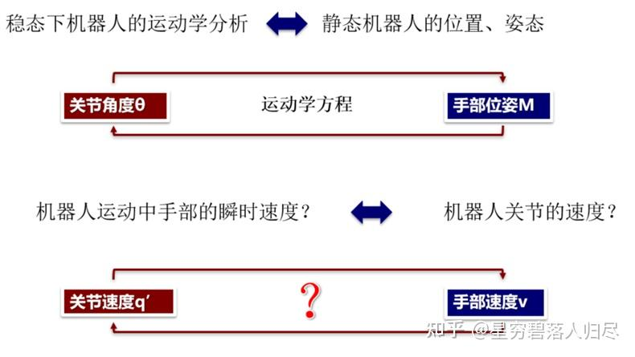
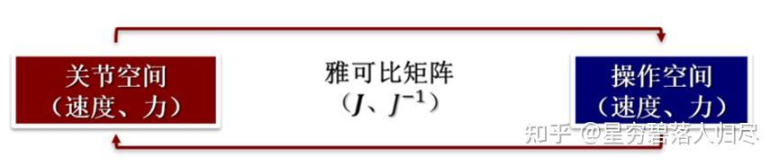

###### datetime:2025/09/04 16:16

###### author:nzb

# 机器人基础知识学习笔记—理论篇

## 2. 机器人速度分析和雅可比矩阵

### 2.1 机器人的微分运动

**机器人的微分运动**：通过建立雅可比矩阵研究机器人**关节变量的微小变化**与机器人**手部位姿的微小变化**之间的关系

如果已知两者之间的微分关系，就可以解决机器人微分运动的两类基本问题：

a. 是在已知机器人各个关节变量的微小变化时求机器人手部位姿的微小变化；

b. 是在已知机器人手部位姿的微小变化时求机器人各个关节变量相应的微小变化。

类似与运动学方程 $$\mathrm{M}=\mathrm{f}(\theta)$$ 建立映射关系

$$\Delta x=J \Delta \theta$$

$$\Delta \theta=J^{-1} \Delta x$$

### 2.2 机器人的雅可比矩阵

机器人雅可比矩阵（简称雅可比）表示了操作空间与关节空间的**速度映射**关系，同时也表示二者之间**力的传递**关系，为确定机器人的静态关节力矩以及不同坐标系间速度、加速度和静力的变换提供了便捷的分析方法。

在机器人速度分析和静力分析中都将用到雅可比。

雅可比矩阵的求解方法

(1) 求解机械臂各关节单独做微小运动时，分别产生的手先端的移动量

(2) 针对所有关节按照 (1) 的方法进行计算，然后将产生的移动合并计算

对于 n 自由度机器人，关节变量可用**广义关节变量** q 表示，$$q = [q_1, q_2, \ldots, q_n]^T$$，

(1) 当关节为**旋转**关节时 $$q_i = \theta_i$$，关节在空间的微小转动；

(2) 当关节为**移动**关节时 $$q_i = d_i$$，$$\mathrm{d}q = [\mathrm{d}q_1, \mathrm{d}q_2, \ldots, \mathrm{d}q_n]^T$$，反映了关节空间的微小运动。

机器人末端在操作空间的位置和方位可用末端手部的位姿 X 表示，它是关节变量的函数，$$X = X(q)$$，并且是一个 6 维列矢量。

$$\mathrm{d}X = [\mathrm{d}X, \mathrm{d}Y, \mathrm{d}Z, \Delta\varphi_X, \Delta\varphi_Y, \Delta\varphi_Z]^T$$ 反映了机器人在操作空间的微小运动，它由机器人**末端微小线位移和微小角位移（微小旋转）**组成，反映了机器人手部坐标系的微分运动与各关节微分运动的关系。

$$\mathrm{d}x = J(q)\mathrm{d}q$$

$$J(q)$$ 是 $$6 \times n$$ 维偏导数矩阵，称为 n 自由度机器人**雅可比矩阵**。

$$J$$ 为机器人的雅可比矩阵，它反映了机器人手部在空间的速度与各个关节速度之间的线性变换关系，也可认为是机器人关节速度与手部速度之间的传动比。

$$\mathbf{J}(q)=\frac{\partial \mathbf{X}}{\partial \mathbf{q}}=\left[\begin{array}{cccc}\frac{\partial X}{\partial q_{1}} & \frac{\partial X}{\partial q_{2}} & \cdots & \frac{\partial X}{\partial q_{n}} \\\frac{\partial Y}{\partial q_{1}} & \frac{\partial Y}{\partial q_{2}} & \cdots & \frac{\partial Y}{\partial q_{n}} \\\frac{\partial Z}{\partial q_{1}} & \frac{\partial Z}{\partial q_{2}} & \cdots & \frac{\partial Z}{\partial q_{n}} \\\frac{\partial \varphi_{x}}{\partial q_{1}} & \frac{\partial \varphi_{x}}{\partial q_{2}} & \cdots & \frac{\partial \varphi_{x}}{\partial q_{n}} \\\frac{\partial \varphi_{y}}{\partial q_{1}} & \frac{\partial \varphi_{y}}{\partial q_{2}} & \cdots & \frac{\partial \varphi_{y}}{\partial q_{n}} \\\frac{\partial \varphi_{z}}{\partial q_{1}} & \frac{\partial \varphi_{z}}{\partial q_{2}} & \cdots & \frac{\partial \varphi_{z}}{\partial q_{n}}\end{array}\right]$$

### 2.3 速度雅可比

利用机器人速度雅可比可对机器人进行速度分析，对雅可比左右除以 $$\mathrm{d}t$$

$$\frac{\mathrm{d} X}{\mathrm{~d} t}=J(q) \frac{\mathrm{d} q}{\mathrm{~d} t} \quad v=\dot{X}=J(q) \dot{q}$$

v 为机器人末端在操作空间中的广义速度（笛卡尔速度）; $$\boldsymbol{q}$$ 为机器人关节在关节空间中的关节速度; $$J(\boldsymbol{q})$$ 为确定关节空间速度 $$\dot{q}$$ 与操作空间速度 $$\boldsymbol{v}$$ 之间关系的雅可比矩阵

$$v=J_{1} \dot{\theta}_{1}+J_{2} \dot{\theta}_{2}$$

因此, 机器人速度雅可比的每一列表示其他关节不动而某一关节运动产生的端点速度。

二自由度机器人手部的速度为

$$\begin{aligned} \boldsymbol{v} & =\left[\begin{array}{l} v_{x} \\ v_{y} \end{array}\right] \\ & =\left[\begin{array}{cc} -l_{1} s \theta_{1}-l_{2} s_{12} & -l_{2} s_{12} \\ l_{1} c \theta_{1}+l_{2} c_{12} & l_{2} c_{12} \end{array}\right]\left[\begin{array}{c} \dot{\theta}_{1} \\ \dot{\theta}_{2} \end{array}\right] \\ & =\left[\begin{array}{l} -\left(l_{1} s \theta_{1}+l_{2} s_{12}\right) \dot{\theta}_{1}-l_{2} s_{12} \dot{\theta}_{2} \\ \left(l_{1} c \theta_{1}+l_{2} c_{12}\right) \dot{\theta}_{1}+l_{2} c_{12} \dot{\theta}_{2} \end{array}\right] \end{aligned}$$

已知的 $$\theta_{1}, \theta_{2}$$ 是时间的函数, 即: $$\theta_{1}=f_{1}(t), \theta_{2}=f_{2}(t)$$,

则可求出该机器人手部在某一时刻的速度 $$\boldsymbol{v}=f(t)$$, 即**手部瞬时速度**，反之, 假如给定机器人手部速度, 可解出相应的关节速度为

$$\dot{q}=J^{-1} v$$

$$J^{-1}$$ 称为机器人**逆速度雅可比**.

### 2.4 雅可比求解方法

雅可比矩阵给出了由关节空间速度到手部操作空间速度的映射关系

$$\dot{x}=J \dot{q}$$

$$J=\left[\begin{array}{ccc} \frac{d x_{1}}{d q_{1}} & \cdots & \frac{d x_{1}}{d q_{n}} \\ \vdots & \ddots & \vdots \\ \frac{d x_{m}}{d q_{1}} & \cdots & \frac{d x_{m}}{d q_{n}} \end{array}\right]$$

J 为雅可比矩阵, m 行 n 列

m: 操作空间自由度

n: 关节空间自由度，关节数量

以机械臂的基准坐标系（基座坐标系）为参考坐标系，描述线速度和角速度。

$$\dot{x}=\left[\begin{array}{c} v_{x} \\ v_{y} \\ v_{z} \\ \omega_{x} \\ \omega_{y} \\ \omega_{z} \end{array}\right]=\left[\begin{array}{l} \vec{v} \\ \vec{\omega} \end{array}\right]$$

$$J=\left[\begin{array}{l} J_{v} \\ J_{\omega} \end{array}\right]$$

雅可比求逆存在的问题

dx 不能过大。因为雅可比是随着关节位置变化不断在变化的，一旦关节位置变化很大，算出来的雅可比逆解就不再准确了。矩阵求逆是一个非常消耗计算资源的运算。难以处理机器人奇异状态或接近奇异状态的情况。很小的 dx 可能求得很大的 dq，方程对数值误差也更加敏感；而当机器人处于 Singularity 时，线性方程可能无解、也可能有无数多个解。

### 2.5 6自由度和7自由度机械臂雅可比矩阵

#### 2.5.1 雅可比矩阵的核心概念

首先，我们需要理解雅可比矩阵是什么。

*   **定义**：雅可比矩阵 $$J$$ 是一个将**关节速度** $$\dot{\theta}$$（一个 n×1 向量，n 是关节数）映射到**末端执行器的笛卡尔空间速度** $$\dot{x}$$（一个 m×1 向量，通常 m=6，包含线速度 v 和角速度 ω）的矩阵。
    
    $$ \dot{x} = J(\theta) \dot{\theta} $$

    其中，$$\dot{x} = \begin{bmatrix} v \\ \omega \end{bmatrix}$$

*   **几何意义**：雅可比矩阵的每一列代表一个关节的运动对末端执行器产生的**运动旋量**（即线速度和角速度）。例如，对于一个旋转关节，其对应的雅可比矩阵列描述了该关节以 1 rad/s 的速度旋转时，末端执行器产生的瞬时线速度和角速度。

*   **维度**：
    *   任务空间速度通常是 6 维的（3个线速度，3个角速度）。
    *   因此，雅可比矩阵的**行数总是 6**。
    *   雅可比矩阵的**列数等于机械臂的关节数量 n**。
    *   所以，雅可比矩阵 $$J$$ 是一个 6 × n 的矩阵。

#### 2.5.2 6自由度（6-DOF）机械臂的雅可比矩阵

这是最常见和标准的工业机械臂配置。

*   **特点**：
    *   关节数 n = 6。
    *   雅可比矩阵 $$J$$ 是一个 **6 × 6** 的**方阵**。

*   **重要性**：
    *   因为它是方阵，所以我们可以讨论它的**可逆性**。
    *   当 $$J$$ **满秩**（即行列式不为零，秩为6）时，它是可逆的。这意味着：
        *   对于任务空间中的任何一个期望的末端速度 $$\dot{x}$$，我们都可以通过计算 $$\dot{\theta} = J^{-1} \dot{x}$$ 来找到唯一对应的关节速度组合。
        *   机械臂在此位形下具备了在任意方向运动的全部能力，这个位形被称为**非奇异形位**。

*   **问题：奇异性（Singularity）**
    *   当机械臂完全展开或完全折叠时，雅可比矩阵会**降秩**（行列式变为0），此时矩阵不可逆。这个位形称为**奇异形位**。
    *   在奇异点附近：
        1.  **逆运动学无解或多解**：某些笛卡尔空间方向上的运动无法实现。
        2.  **关节速度趋于无穷大**：为了实现某个方向的微小运动，某些关节需要以极高的速度旋转（因为 $$\dot{\theta} = J^{-1} \dot{x}$$ 中的 $$J^{-1}$$ 元素变得非常大）。
    *   6自由度机械臂在工作空间中存在确定的奇异点，需要在轨迹规划中避免。

*   **总结**：6自由度机械臂的雅可比是方阵，在其非奇异位形下，关节空间和任务空间存在**一一对应**的映射关系，可以进行有效的速度控制和力控制。

#### 2.5.3. 7自由度（7-DOF）机械臂的雅可比矩阵

7自由度机械臂是**冗余机械臂**的一个典型例子。

*   **特点**：
    *   关节数 n = 7。
    *   雅可比矩阵 $$J$$ 是一个 **6 × 7** 的**瘦长型矩阵**（行数 < 列数）。

*   **冗余性（Redundancy）**：
    *   由于任务空间的维度（6）小于关节空间的维度（7），存在**无限多组**关节角度 $$\theta$$ 可以对应同一个末端位姿 $$x$$。
    *   同样，对于同一个末端速度 $$\dot{x}$$，也存在**无限多组**关节速度解 $$\dot{\theta}$$。

*   **求解逆问题（从 $$\dot{x}$$ 求 $$\dot{\theta}$$）**：
    *   因为 $$J$$ 不是方阵，无法求逆。我们需要使用**伪逆（Pseudoinverse）**，最常用的是 Moore-Penrose 伪逆 $$J^+$$。
    *   方程 $$\dot{x} = J \dot{\theta}$$ 的通解为：
        $$\dot{\theta} = J^+ \dot{x} + (I - J^+ J) \dot{\theta_0}$$
        其中：
        *   $$\dot{\theta} = J^+ \dot{x}$$ 是**最小范数解**，即在所有能满足末端速度要求的关节速度中，它的欧几里得范数（$$\| \dot{\theta} \|$$）最小，最省能量。
        *   $$(I - J^+ J)$$ 是投影到 $$J$$ 的**零空间（Null Space）** 的投影矩阵。
        *   $$\dot{\theta_0}$$ 是任意一个关节速度向量。

*   **零空间的妙用**：
    *   零空间内的运动 $$(I - J^+ J) \dot{\theta_0}$$ **不会影响末端执行器的位姿**（因为 $$J \cdot (I - J^+ J) \dot{\theta_0} = 0$$）。
    *   这为我们提供了巨大的灵活性！我们可以在保证末端精确轨迹的同时，让机械臂**优化自身的性能**。通过选择合适的 $$\dot{\theta_0}$$，可以实现：
        1.  **避奇异**：当接近奇异点时，调整构型以远离奇异性。
        2.  **避障碍**：移动机械臂的连杆以避免与环境中的障碍物碰撞。
        3.  **优化性能指标**：例如，使机械臂始终远离关节限位、最大化可操作性（manipulability）、或优化能耗。

*   **总结**：7自由度冗余机械臂的雅可比矩阵是欠定的。它没有唯一的逆，但通过伪逆和零空间投影，我们不仅能控制末端运动，还能利用多余的一自由度来优化机械臂的自身行为，使其更加灵活、智能和可靠。

### 对比总结

| 特性 | 6自由度机械臂 | 7自由度机械臂 |
| :--- | :--- | :--- |
| **雅可比矩阵形状** | 6 × 6 **方阵** | 6 × 7 **瘦长矩阵** |
| **逆运动学解** | 在非奇异点有**唯一**的关节速度解 | 总是有**无穷多**个关节速度解 |
| **核心数学工具** | **矩阵求逆** $$J^{-1}$$ | **伪逆** $$J^+$$ 和**零空间** $$(I - J^+J)$$ |
| **奇异性** | 存在确定的**奇异点**，必须避免 | **可以通过自运动（Self-motion）避开奇异点** |
| **冗余性** | **无冗余** | **有1个自由度冗余** |
| **主要优势** | 结构简单，控制直接，成本较低 | **灵活性极高**，可避障、避奇异、优化性能 |
| **典型应用** | 标准工业应用（焊接、搬运、喷涂） | 医疗机器人、太空机器人、人形机器人手臂、在复杂环境中工作的机器人 |

**一个生动的比喻**：
*   **6自由度机械臂**像你的**手腕**。它可以灵活地定向工具（例如，拧螺丝），但一旦你的肘部和肩膀固定，手腕就无法绕过一个大障碍物去够后面的东西。
*   **7自由度机械臂**像你的**整个手臂**（肩+肘+腕）。你的手（末端执行器）保持不动拿一杯水时，你的肩膀和肘部仍然可以移动（冗余性）。这个额外的自由度允许你绕过障碍物（比如避开身旁的人），或者调整到一个更舒服、更省力的姿势（优化性能）。
