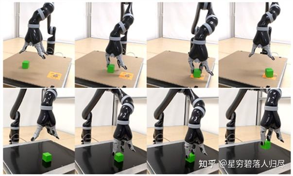
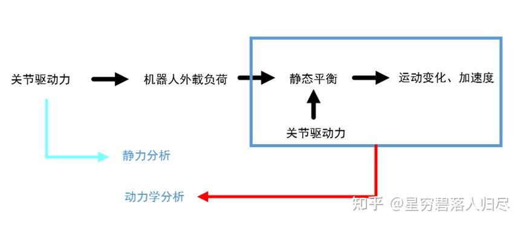
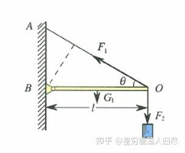
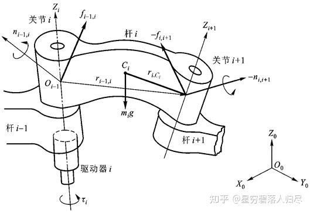
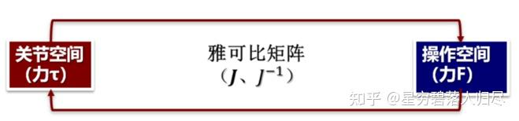
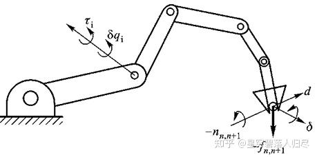

###### datetime:2025/09/04 16:16

###### author:nzb

# 机器人基础知识学习笔记—理论篇

## 3. 机器人静力学分析

既然有运动学方程可以求解机器人的位姿，那又为什么还需要动力学呢？设想一个场景，当机械臂把一个物体从 A 点移动到 B 点，需要考虑机械臂在 A 点的位置、姿态拿到物体、在 B 点的位置、姿态放下物体，那么这个过程中的一般步骤就是：

1. DH 法给出机器人运动学方程；
2. 计算 A 点和 B 点手部理想位姿的逆运动学解 qa, qb；
3. 从 qa 到 qb 求出关节的运动轨迹；
4. 根据求出的轨迹，控制关节运动。

按以上步骤，在求逆解后还需要设计求出对应的关节轨迹，那么每一个时刻都需要确切的手部位姿：每时每刻都把逆运动学解直接求出来是不太现实的。不能满足 dx 不能太大的要求，无法给出可靠的轨迹，产生轨迹形状变形或严重时造成关节不断抖动。而动力学的引入允许我们更快、更精确地跟随需要的轨迹。

机器人在工作状态下，把持物体或与外部环境之间相互作用，需要机器人关节提供力和力矩，通过连杆传递到末端操作器。达到静态平衡和产生运动。

### 3.1 力和力矩的平衡

把机器人手臂看做刚体，需要同时考虑力和力矩的相互作用，也就是考虑力和力矩是否平衡。

1. **力的平衡**

    同一物体受力 F1、F2 的作用，但仍然保持静止状态，这时可以称为两个力相互作用并处于平衡状态一个物体受到多个力的作用，但它们的合力为 0 的情况，则说明力处于平衡状态。合力是将多个力计算合并为 1 个力。力是具备大小和方向的矢量，合力的求解既是矢量的合成。

2. **力矩的平衡**

    作用力使物体绕着转动轴或支点转动的趋向，转动力矩又称为扭矩。

其中, 力矩计算公式为: $$\tau = L \times F$$ 。其中 $$L$$ 是从转动轴到着力点的径向距离矢量, $$F$$ 是矢量力。

使物体进行回转运动的力是力矩。具备一定大小的静止物体，即便是在多个力矩的作用下物体仍然保持静止状态，作用在物体上的力矩处于平衡状态。

力矩的平衡条件:

1. 合力为 0 ;
2. 任意点的力矩和为 0 ;
3. 不产生平移运动;
4. 不产生回转运动。

### 3.2 操作臂力和力矩的平衡

$$f_{i-1,i}$$ 及 $$n_{i-1,i}$$ —— i-1 杆通过关节 i 作用在 i 杆上的力和力矩;

$$f_{i,i+1}$$ 及 $$n_{i,i+1}$$ ——i 杆通过关节 i + 1 作用在 i + 1 杆上的力和力矩;

$$-f_{i,i+1}$$ 及  $$-n_{i,i+1}$$ —— i + 1 杆通过关节 i + 1 作用在 i 杆上的反作用力和反作用力矩;

$$f_{n, n+1}$$ 及 $$n_{n,n+1}$$ ——机器人最末杆对外界环境的作用力和力矩;

$$-f_{n,n+1}$$ 及 $$-n_{n, n+1}$$ ——外界环境对机器人最末杆的作用力和力矩;

$$f_{0, 1}$$ 及 $$n_{0,1}$$ ——机器人机座对杆 1 的作用力和力矩;

$$m_{i}g$$ ——连杆 i 的重量，作用在质心 $$C_{i}$$上。

连杆的静力平衡条件为其上所受的合力和合力矩为零，因此力和力矩平衡方程式为

$$\begin{aligned} & f_{i-1, i} + (-f_{i, i+1}) + m_i g = 0 \\ & n_{i-1, i} + (-n_{i, i+1}) + (r_{i-1, i} + r_{i, C_i}) \times f_{i-1, i} + (r_{i, C_i}) \times (-f_{i, i+1}) = 0 \end{aligned}$$

$$r_{i-1, i}$$ ——坐标系 $$\{i\}$$ 的原点相对于坐标系 $$\{i+1\}$$ 的位置矢量；

$$r_{i, C_i}$$ ——质心 $$\{i\}$$ 相对于坐标系 $$\{i+1\}$$ 的位置矢量。

假如已知外界环境对机器人末端杆件的作用力和力矩，那么可以由最后一个连杆向零连杆（机座）依次递推，从而计算出每个连杆上的受力情况。

机器人雅可比矩阵揭示了操作空间与关节空间的映射关系。雅可比不仅表示操作空间与关节空间的速度映射关系，也表示二者之间力的传递关系。

1、 表示机器人**手部端点的力和力矩**（简称为端点广义力 $$F$$），可将 $$f_{n, n+1}$$ 和 $$n_{n, n+1}$$ 合并写成一个 6 维矢量

$$F = \begin{bmatrix} f_{n, n+1} \\ n_{n, n+1} \end{bmatrix} = [f_x, f_y, f_z, n_x, n_y, n_z]^T$$

2、 各关节驱动器的驱动力或力矩可写成一个 $$n$$ 维矢量的形式

$$n$$ 为关节的个数；

$$\tau$$ 为关节力矩（或关节力）矢量，简称广义关节力矩。

对于转动关节，$$\tau_i$$ 表示关节驱动力矩；

对于移动关节，$$\tau_i$$ 表示关节驱动力

$$\tau = \begin{bmatrix} \tau_1 \\ \tau_2 \\ \vdots \\ \tau_n \end{bmatrix}$$

忽略摩擦力，忽略各杆件的重力，可以利用虚功原理推导机器人手部端点力 $$F$$ 与关节力矩 $$\tau$$ 的关系

$$\delta X = \begin{bmatrix} d \\ \delta \end{bmatrix}$$

其中，$$\mathbf{d} = [\mathbf{d}_x, \mathbf{d}_y, \mathbf{d}_z]^T$$为末端执行器的线虚位移；$$\boldsymbol{\delta} = [\delta n_x, \delta n_y, \delta n_z]^T$$为末端执行器的角虚位移

$$\delta \mathbf{q} = [\delta q_1, \delta q_2, \cdots, \delta q_n]^T$$

$$\delta \mathbf{q}$$ 为由各关节虚位移 $$\delta q_i$$ 组成的机器人关节虚位移矢量。

假设发生上述虚位移时，各关节力矩为 $$\tau_i (i=1, 2, \ldots, n)$$，环境作用在机器人手部端点上的力和力矩分别为 $$\mathbf{-f}_{n,n+1}$$ 和 $$\boldsymbol{-\eta}_{n,n+1}$$。由上述力和力矩所作的虚功可以由下式求出：

$$\delta W = \tau_1 \delta q_1 + \tau_2 \delta q_2 + \cdots + \tau_n \delta q_n - \mathbf{f}_{n,n+1}^T \mathbf{d} - \boldsymbol{\eta}_{n,n+1}^T \boldsymbol{\delta}$$

根据虚位移原理，机器人处于平衡状态的充分必要条件是对任意符合几何约束的虚位移有 $$\delta W = 0$$，并注意到虚位移 $$\delta \mathbf{q}$$ 和 $$\delta \mathbf{X}$$ 之间符合杆件的几何约束条件

$$\delta W = \boldsymbol{\tau}^T \delta \mathbf{q} - \mathbf{F}^T \mathbf{J} \delta \mathbf{q} = (\boldsymbol{\tau} - \mathbf{J}^T \mathbf{F})^T \delta \mathbf{q}$$

表示了在静态平衡状态下，手部端点力 $$\mathbf{F}$$ 和广义关节力矩 $$\boldsymbol{\tau}$$ 之间的线性映射关系。式中 $$\mathbf{J}^T$$ 与手部端点力 $$\mathbf{F}$$ 和广义关节力矩 $$\boldsymbol{\tau}$$ 之间的力传递有关，称为**机器人力雅可比**。显然，**机器人力雅可比 $$\mathbf{J}^T$$ 是速度雅可比 $$\mathbf{J}$$ 的转置矩阵**。

机器人操作臂静力计算的主要问题：

(1) 已知外界环境对机器人手部的作用力 $$\mathbf{F}$$（即手部端点力 $$\mathbf{F}$$），利用力雅可比求相应的满足静力平衡条件的关节驱动力矩 $$\boldsymbol{\tau}$$。

(2) 已知关节驱动力矩 $$\boldsymbol{\tau}$$，确定机器人手部对外界环境的作用力或负载的质量。第二类问题是第一类问题的逆解。逆解的关系式为

$$\mathbf{F} = (\mathbf{J}^T)^{-1} \boldsymbol{\tau}$$
