###### datetime:2025/09/10 11:00

###### author:nzb

# 机器人基础知识学习笔记---执行器篇

## 1.引言

在现代机器人技术中，机器人运动以及功能实现离不开其基础硬件系统。 如图所示，机器人硬件系统的基本组成包括相机、芯片、传感器等构成的感知层；各类电机、传感器、轴承等组成的关节驱动系统；以及电池组、传感器、冷却系统和FSD系统构成的整体躯干层。

而在机器人技术的快速发展中，关节系统即执行器作为机器人的“肌肉”和“关节”，扮演着至关重要的角色。它们是连接机器人感知系统和运动系统的关键部件，负责将控制信号转化为实际的机械运动。从工业制造到医疗护理，从太空探索到家庭服务，执行器的性能直接决定了机器人能够完成的任务类型和执行效率。本文将深入探讨机器人关节的多种类型、工作原理、应用场景以及未来的发展趋势。

## 2.机器人执行器的定义与作用

执行器是机器人系统中的一个重要组成部分，其主要功能是将输入的控制信号（通常是电信号或气压信号）转化为机械运动或力输出。在机器人的运动链中，执行器连接着关节和连杆，通过精确控制其运动，实现机器人的各种动作和任务。例如，在工业机器人中，执行器用于驱动机械臂的关节旋转或直线运动；在移动机器人中，执行器则用于驱动车轮或履带的运动。

执行器的作用不仅限于简单的运动输出，它们还需要具备高精度、高效率、高可靠性和良好的动态响应能力，以满足机器人在复杂环境中的多样化需求。例如，在医疗机器人中，执行器需要具备极高的精度和稳定性，以确保手术操作的准确性；而在工业机器人中，执行器则需要具备强大的负载能力和高重复定位精度，以保证生产效率和产品质量。

## 3.机器人执行器的组成及分类

机器人常用的执行器构造主要由**电机，减速器，编码器**以及**驱动器**等组成，每个组件在不同的应用场景中可发挥不同的性能特点。

**电机**按工作原理可分为：**直流电机，交流电机，步进电机，伺服电机**四大类，不同类型的电机具有不同的工作原理和应用场景。直流电机适用于需要精确控制的场合，交流电机广泛应用于工业领域，无刷直流电机则在高效率和高可靠性方面表现出色。步进电机和同步电机则分别在精确位置控制和高精度应用中发挥重要作用。

而按照结构分：可分为**外转子电机**和**内转子电机**，外转子电机和内转子电机虽然基于相同的电磁感应原理，但由于结构的不同，它们在性能和应用上各有特点。外转子电机具有转矩密度大的特点，适合高扭矩和高负载的应用，常用于飞行器和足式机器人，而内转子电机散热效果好，稳定性高，则更适合需要快速响应和紧凑设计的场景，多用于机械臂。根据具体需求选择合适的电机类型是确保系统高效运行的关键。选择合适的电机类型需要根据具体的应用需求和工作环境来决定。

**减速器**作为机械系统中的关键部件，基本原理是通过齿轮传动实现转速降低和转矩增加。减速器按照结构和工作原理大致可分为：**齿轮减速器、行星齿轮减速器、蜗杆减速器，谐波加速器和RV减速器**。不同类型的减速器（如）适用于不同的应用场景，如行星减速器刚度高、成本低，适合足式机器人；谐波减速器精度高、减速比大，常用于机械臂；而RV减速器刚度大、减速比高，多用于工业机器人。通过合理选择和计算减速器的参数（如减速比、扭矩、功率和效率），可以显著提高机械系统的性能和稳定性。

**编码器**通过将机械运动转换为电信号，实现精确的位置和速度控制。根据不同的应用场景和技术需求，编码器可分为多种类型。按照信号输出方式可分为：**增量型，绝对型和混合型**；按照工作原理分类可分为**光电，磁电和电容型**；按照应用场景分类可分为**旋转和直线型**；按照读取方式分类可分为**接触式和非接触式**。选择合适的编码器类型需要综合考虑精度、可靠性、环境适应性和成本等因素。

**驱动器**是用于控制机器人电机运动的关键部件，它将控制信号转换为电机所需的电信号，从而实现对电机的速度、位置和扭矩的精确控制。电机驱动器的性能直接影响机器人的运动精度、响应速度和可靠性。驱动器分为集成一体化和分离式两类，各有优缺点，选择合适的驱动器需要根据具体的应用需求来决定。集成一体式驱动器体积较小，适合对空间和可靠性要求较高的场景，如协作机械臂和医疗设备；而分离式驱动器则更适合对散热和灵活性要求较高的应用，如工业机器人和电动汽车。

**制动器**是确保机器人稳定运行和精确控制的关键部件。根据不同的应用场景和技术需求，可以选择电磁制动器、机械制动器、动态制动器、再生制动器或抱闸制动器。每种制动器都有其独特的工作原理和优缺点。

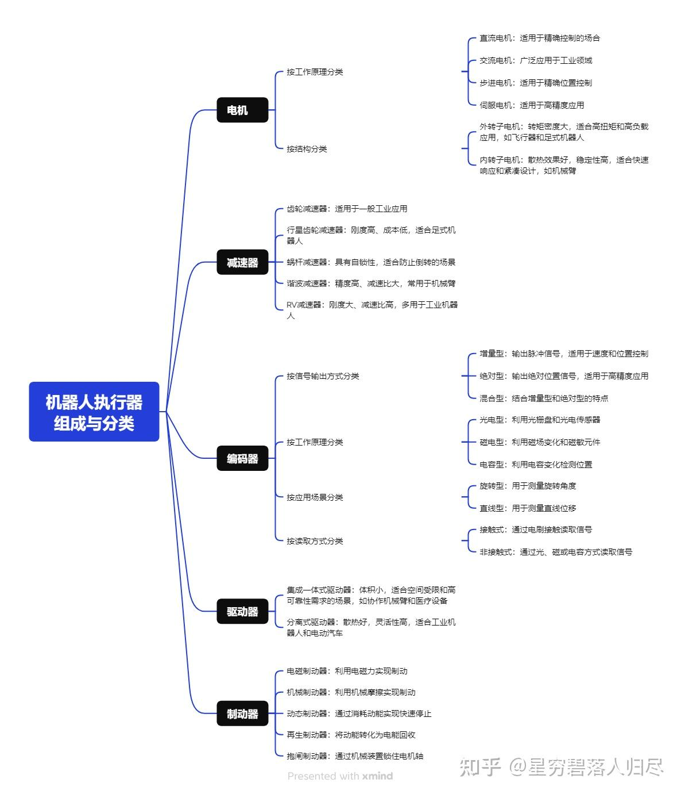

## 4.执行器组成--电机

电机是机器人执行器中的核心零部件，其工作原理基于电磁感应定律。当电机的绕组中通入电流时，会产生磁场，磁场与转子中的磁极相互作用，从而产生转矩，驱动电机的转子旋转。通过控制电流的大小和方向，可以实现电机的速度和方向控制。

### 4.1 按工作原理划分

直流电机：直流电机的工作原理是基于直流电源供电，通过改变电枢电流的方向来实现电机的正反转。其转速与电枢电压成正比，通过调节电枢电压可以实现调速控制。直流电机的控制电路相对简单，适用于对调速性能要求不高的场合。

直流电机的核心公式包括：

- 电压方程：$$V = R_{i} + L\frac{di}{dt} + K_{e}\omega$$
  - V：输入电压。 
  - R：绕组电阻。 
  - L：绕组电感。 
  - i：电枢电流。 
  - $$e_b$$：反电动势，定义为 $$e_b = K_{e}\omega$$，其中 $$K_e$$ 是反电动势常数，$$\omega$$ 是电机角速度。

- 转矩方程：$$T_{e} = K_{t}i$$
  - T_e：电磁转矩。 
  - K_t：转矩常数。

- 运动方程：$$J\frac{\mathrm{d} \omega }{\mathrm{d} t}  + B\omega  = T_{e} - T_{L}$$
  - J：转动惯量。 
  - B：粘性阻尼系数。 
  - T_L：负载转矩。

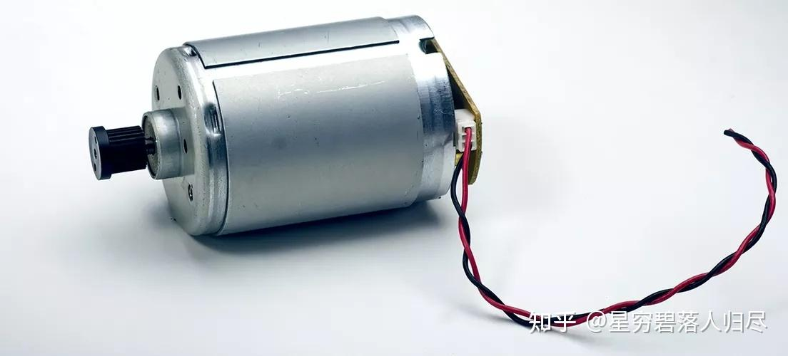

交流电机：交流电机的工作原理是基于交流电源供电，通过旋转磁场与转子中的感应电流相互作用来产生转矩。交流电机的转速与电源频率成正比，通过改变电源频率可以实现调速控制。交流电机的控制电路相对复杂，需要使用变频器来实现频率调节，适用于大功率和高精度调速的应用场景。

交流电机的核心公式包括：

- 电压方程：

- 转矩方程： $$T_{e} = \frac{3}{2}p(\psi_{q}i_{d} - \psi_{d}i_{q})$$
  - p：极对数。 
  - $$\psi_d$$, $$\psi_q$$：直轴和交轴磁链。 
  - $$i_d$$, $$i_q：$$直轴和交轴电流

- 同步速度： $$\omega _{s} = \frac{2\pi f}{p}$$
  - f：电源频率。 
  - p：极对数。

- 滑差： $$s = \frac{\omega_{s} - \omega_{r} }{\omega_{s}}$$
  - $$\omega_r$$：转子机械角速度

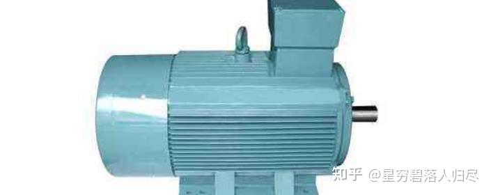

步进电机：步进电机的工作原理是基于电脉冲信号驱动，每次输入一个脉冲信号，电机转子就会转动一个固定的角度。步进电机的转速与脉冲频率成正比，位置与脉冲数量成正比，通过控制脉冲信号的频率和数量可以实现精确的位置和速度控制。步进电机不需要反馈装置，控制简单，适用于精度要求较高的场合。

步进电机的核心公式包括：

- 角位移公式： $$\theta = N \cdot \theta_{s}$$
  - $$\theta_s$$：每步的角位移（步距角）

- 转矩公式： $$T_{e} = n_{p} {\textstyle \sum_{k}^{}} \frac{\partial L(\theta )}{\partial \theta }i^{2}_{k}$$
    - n_p：极对数。 
    - W_m：磁共能

- 动态方程： $$J\frac{d^{2}\theta }{dt^{2}} + B\frac{d\theta }{dt} = T_{e} - T_{L}$$
    - J：转动惯量。 
    - B：粘性阻尼系数。 
    - T_L：负载转矩

- 步距角 $$\theta_{s}$$ 的计算公式为： $$\theta_{s} = \frac{360^{°}}{2pN_{p}} $$
  - p：电机极对数。 
  - N_p：转子齿数

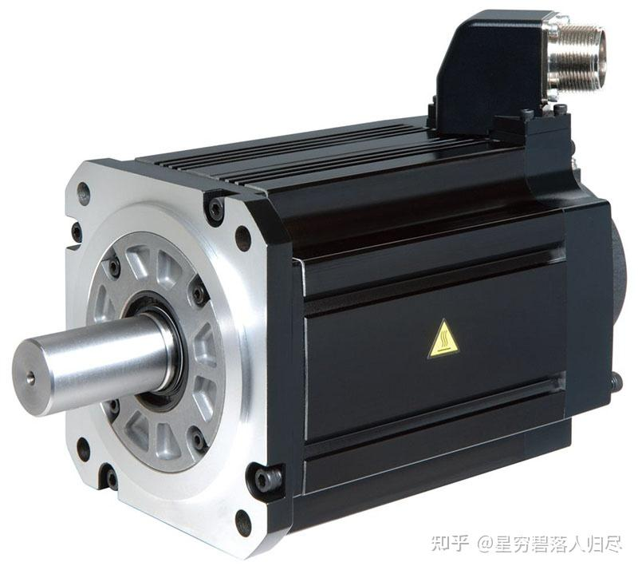

伺服电机：伺服电机的工作原理是基于反馈控制，通过位置传感器、速度传感器和力矩传感器等反馈装置，实时检测电机的运动状态，并将反馈信号与目标信号进行比较，通过控制器调整电机的电流和电压，实现精确的位置、速度和力矩控制。伺服电机的控制精度高，动态响应速度快，适用于对运动控制要求极高的机器人应用。

伺服电机的核心公式包括：

- 电压方程： $$V = R_{i} + L\frac{di}{dt} + K_{e}\omega$$
  - V：输入电压。 
  - R：绕组电阻。 
  - L：绕组电感。 
  - i：电枢电流。 
  - $$e_b$$：反电动势，定义为 $$e_b = K_{e}\omega$$，其中 $$K_e$$ 是反电动势常数，$$\omega$$ 是电机角速度。

- 转矩方程：$$T_{e} = K_{t}i$$
  - T_e：电磁转矩。 
  - K_t：转矩常数。

- 运动方程：$$J\frac{\mathrm{d} \omega }{\mathrm{d} t}  + B\omega  = T_{e} - T_{L}$$
  - J：转动惯量。 
  - B：粘性阻尼系数。 
  - T_L：负载转矩。

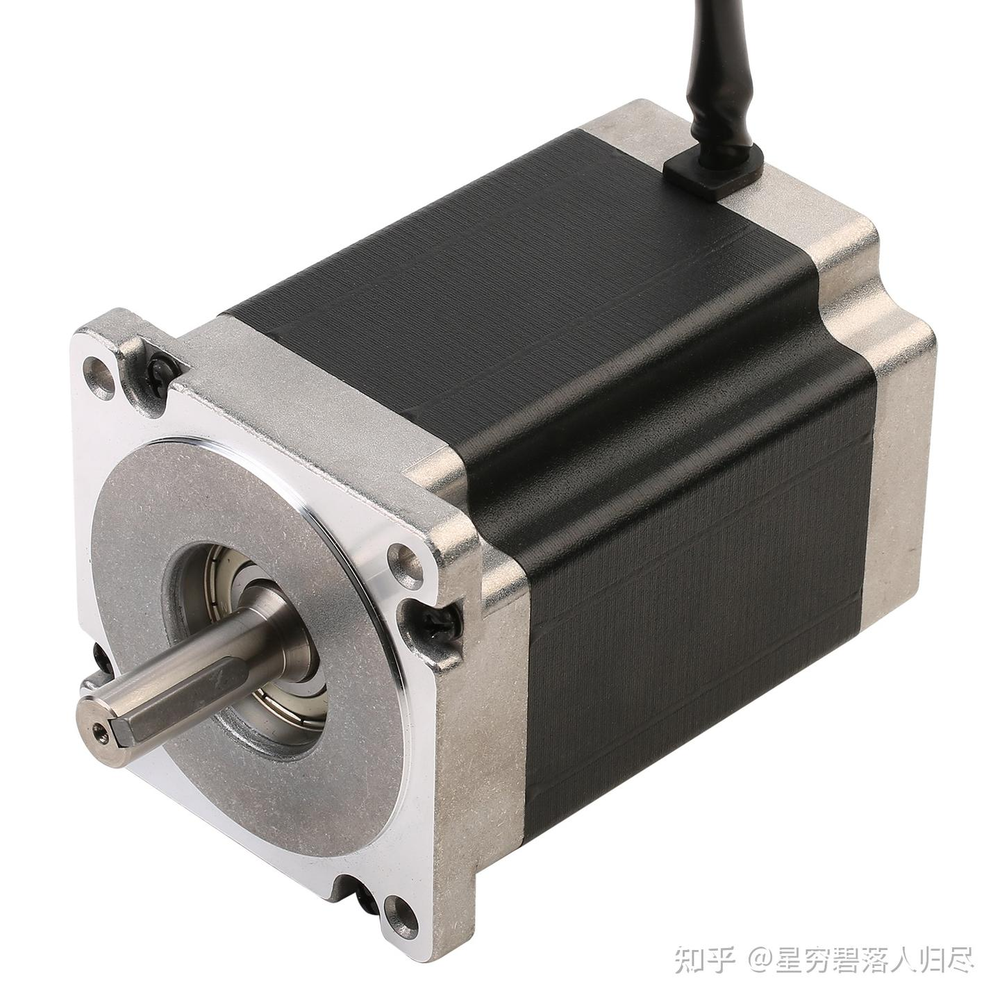

### 4.2 按结构划分

- 外转子电机
  - 1、定义与结构：外转子电机是一种电机结构，其转子位于定子外部。转子通常由永磁体或电磁铁组成，而定子（固定部分）由绕组线圈和铁芯构成。这种设计使得外转子电机在高负载应用中表现出更高的稳定性和扭矩输出。
  - 2、工作原理：外转子电机的工作原理基于电磁感应和磁场相互作用。当电流通过定子绕组时，产生旋转磁场，该磁场与转子中的永磁体或电磁铁相互作用，从而驱动转子旋转。外转子电机的转动惯量较大，因此更适合需要高扭矩和稳定运行的应用。

- 内转子电机
  - 1、定义与结构：内转子电机的转子位于定子内部，通常由永磁体或电磁铁组成，而定子由绕组线圈构成。这种结构使得内转子电机设计紧凑，适合对空间要求较高的应用。
  - 2、工作原理：内转子电机的工作原理同样基于电磁感应。当电流通过定子绕组时，产生的旋转磁场作用于转子，使其旋转。内转子电机通常具有较高的启动转矩和响应速度，适合需要快速加速的应用。

## 5. 执行器组成--减速器

### 5.1 定义

减速器（减速机）是一种由封闭在刚性壳体内的齿轮传动、蜗杆传动或齿轮-蜗杆传动组成的独立部件，常用于原动机（如电机）与工作机或执行机构之间的减速传动装置。其核心作用是**降低转速并增大转矩**，同时在某些场景下也可作为增速器使用。

### 5.2 工作原理

减速器的工作原理基于齿轮传动的原理，通过不同大小的齿轮组合来实现转速的降低和转矩的增加。以下是几种常见的减速器类型及其工作原理：

### 齿轮减速器

齿轮减速器通过小齿轮带动大齿轮实现减速。输入轴上的小齿轮与输出轴上的大齿轮啮合，由于大齿轮的齿数更多，其转速比小齿轮慢，从而实现减速效果。

齿轮减速器的核心公式包括：

- 传动比： $$i = \frac{z_{2}}{z_{1}} = \frac{n_{1}}{n_{2}}$$
    - z_1, z_2：主动轮和从动轮的齿数。 
    - n_1, n_2：主动轮和从动轮的转速。

- 输出转速： $$n_{2} = \frac{n_{1}}{i}$$

- 输出扭矩： $$T_{2} = T_{1} \cdot i \cdot \eta$$

- 效率： $$\eta = \frac{T_{2} \cdot n_{2}}{T_{1}\cdot n_{1}}$$
  - $$\eta$$：减速器的机械效率。

- 特点：
  - 传动比：由齿轮的齿数比决定。
  - 效率：较高，通常在90%以上。
  - 结构：简单紧凑，适合多种应用场景。
  - 缺点：噪音较大，齿轮磨损可能导致精度下降。

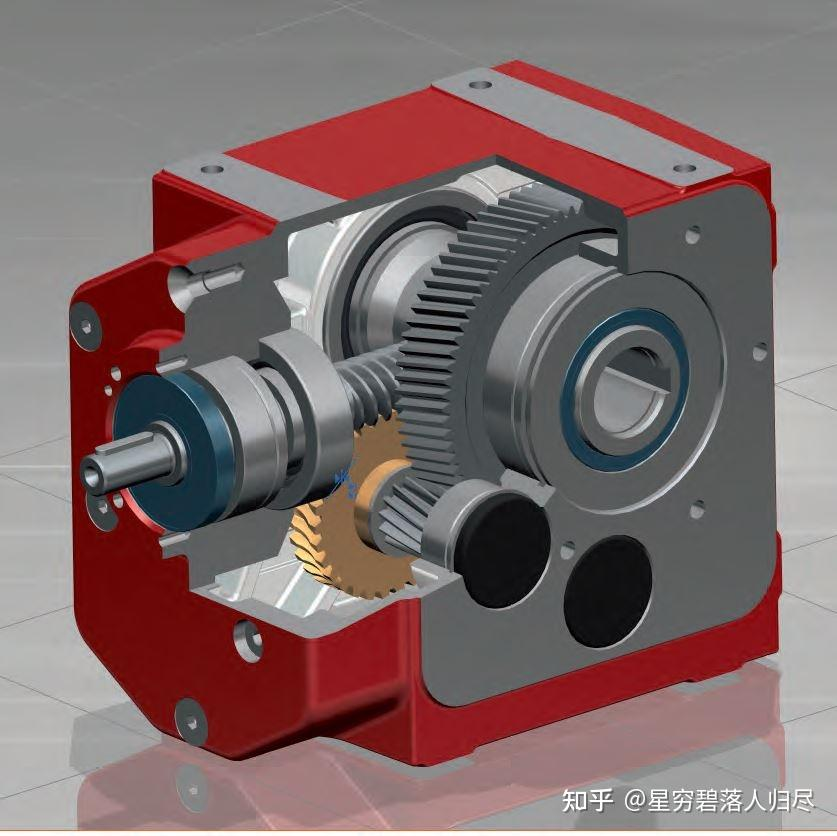

### 行星齿轮减速器

行星齿轮减速器由太阳轮、行星轮和内齿圈组成。电机驱动太阳轮转动，行星轮围绕太阳轮旋转的同时，也围绕内齿圈公转，从而实现减速。

行星齿轮减速器的核心公式包括：

- 传动比： $$i = 1 + \frac{z_{R}}{z_{S}}$$

- 输出转速： $$n_{C} = \frac{n_{s}}{i}$$  
    - z_S：太阳轮齿数。 
    - z_R：内齿圈齿数。 
    - n_S：太阳轮转速。 
    - n_C：行星架转速。

- 输出扭矩： $$T_{C} = T_{S} \cdot i \cdot \eta$$

- 效率： $$\eta = \frac{T_{C}\cdot n_{C}}{T_{S}\cdot n_{S}}$$

- 扭矩在各部件之间的传递关系为： $$T_{S} + T_{R} = T_{C}$$
  - T_S：太阳轮输入扭矩。 
  - T_R：内齿圈扭矩。 
  - T_C：行星架输出扭矩。

- 特点：
  - 传动比：由行星轮和内齿圈的齿数比决定。
  - 效率：高，通常在95%以上。
  - 结构：紧凑，功率密度高，适合高精度应用。
  - 优点：高精度、高承载能力、长寿命。
  - 缺点：制造成本较高。

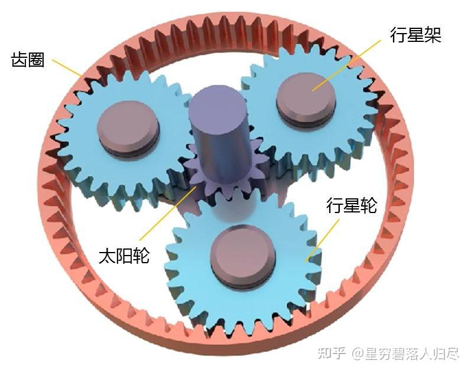

### 蜗杆减速器

蜗杆减速器通过蜗杆与蜗轮的啮合实现减速。蜗杆的轴线与蜗轮的轴线垂直，通过蜗杆的旋转带动蜗轮缓慢转动，实现较大的减速比。

蜗杆减速器的核心公式包括：

- 传动比： $$i = \frac{z_{w}}{z_{r}}$$
    - z_w：蜗轮齿数。 
    - z_r：蜗杆头数（螺旋线的数量）。

- 输出转速： $$n_{w} = \frac{n_{r}}{i}$$

- 输出扭矩： $$T_{w} = T_{r} \cdot i \cdot \eta$$

- 效率： $$\eta \approx \frac{\tan (\lambda -\phi )}{\tan (\lambda )}$$
  - $$\lambda$$：蜗杆的螺旋升角，定义为 $$\tan(\lambda) = \frac{\pi \cdot z_r}{d_m}$$，d_m 为蜗杆的分度圆直径。 
  - $$\phi$$：当量摩擦角，通常取 $$\phi \approx 0.05rad$$。

- 特点：
  - 传动比：由蜗轮齿数与蜗杆头数的比值决定。
  - 效率：较低，通常在50%-70%。
  - 结构：简单，适合大减速比需求。
  - 优点：具有自锁性，适合防止倒转的场景。
  - 缺点：效率低，散热差，精度有限

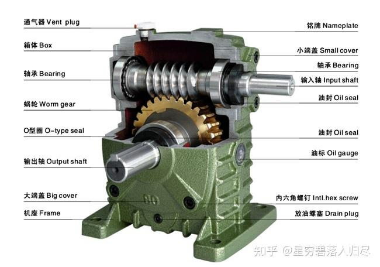

### RV减速器

RV减速器由一级行星齿轮传动和二级摆线行星传动组成。一级减速通过行星齿轮实现，二级减速通过摆线齿轮实现，常用于机器人关节等高精度、高承载力的场景

RV减速器的核心公式包括：

- 传动比： $$i = \frac{z_{R}}{z_{S}} \cdot \frac{z_{P}}{z_{B}}$$
    - z_S：太阳轮齿数。 
    - z_R：内齿圈齿数。
    - z_P：行星轮齿数。 
    - z_B：摆线轮齿数。

- 输出转速： $$n_{out} = \frac{n_{in}}{i}$$

- 输出扭矩： $$T_{out} = T_{in} \cdot i \cdot \eta$$

- 效率： $$\eta = \frac{T_{out}\cdot n_{out}}{T_{in} \cdot n_{in}}$$
  - $$\eta_1$$：第一级行星齿轮传动效率。 
  - $$\eta_2$$：第二级摆线针轮传动效率。

- 特点
  - 传动比：较大，适合高减速比需求。
  - 效率：较高，振动小，噪音低。
  - 结构：紧凑，精度高，适合机器人关节等高精度应用。
  - 优点：高精度、高承载能力、长寿命。
  - 缺点：重量较大，成本较高。

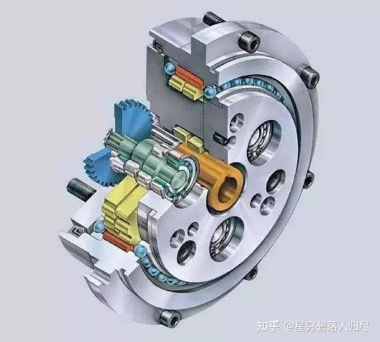

### 谐波减速器

定义与结构：谐波减速器利用柔性元件的可控弹性变形传递运动和动力。其主要由波发生器、柔轮和刚轮组成。

工作原理：波发生器使柔轮产生可控的弹性变形，与刚轮啮合传递动力。通过波发生器的旋转，柔轮与刚轮的啮合点不断变化，实现减速。

谐波减速器的核心公式包括：

- 传动比： $$i = \frac{z_{c} - z_{f}}{z_{f}}$$

- 输出转速： $$n_{out} = \frac{n_{in}}{i}$$

- 输出扭矩： $$T_{out} = T_{in} \cdot i \cdot \eta$$

- 回差： $$\Delta \theta  = \frac{\Delta F}{k}$$

- 特点
  - 传动比：单级传动比大。
  - 效率：中等，但精度极高。
  - 结构：紧凑，体积小，重量轻。
  - 优点：高精度、高扭矩密度。
  - 缺点：柔轮寿命有限，不耐冲击

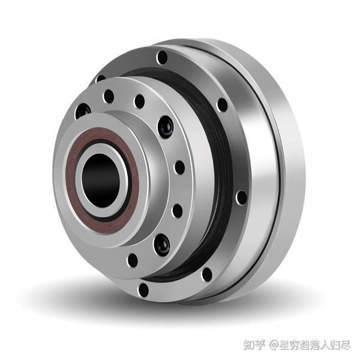

## 6. 执行器组成--编码器

### 6.1 定义

编码器（Encoder）是一种传感器设备，用于将物理信号（如旋转角度、直线位移等）转换为电信号（如脉冲、编码等）。编码器广泛应用于机器人、数控机床、电机控制、自动化设备等领域，是实现精确运动控制和位置反馈的核心部件。

### 6.2类型及工作原理

编码器可以根据不同的分类方式分为多种类型，以下是常见的分类方法及其特点：

- 1、按信号输出形式分类
  - 增量型编码器（Incremental Encoder）：通过输出脉冲信号来表示位置变化。每转过一个单位角度或移动一个单位距离，编码器就会发出一个脉冲。其优点是结构简单、成本较低，但需要参考点来确定绝对位置。
  - 绝对型编码器（Absolute Encoder）：为每个位置提供唯一的编码值，即使在断电后重新启动，也能立即提供准确的位置信息。其输出信号通常是数字编码，适用于高精度和高可靠性要求的场合。
  - 混合型编码器（Mixed Mode Encoder）：结合了增量型和绝对型编码器的特点，既能提供绝对位置信息，也能输出增量脉冲，适用于复杂的工业自动化系统。

- 2、按工作原理分类
  - 光电编码器（Optical Encoder）：利用光栅盘和光电传感器工作。光栅盘上有透明和不透明的条纹，当光栅盘旋转时，光线通过条纹产生脉冲信号。光电编码器精度高、响应速度快，但对环境光线和灰尘较为敏感。
  - 磁电编码器（Magnetic Encoder）：利用磁场变化检测位置。通过磁性材料和磁敏元件（如霍尔效应传感器）的相互作用，将磁场变化转换为电信号。磁电编码器结构简单、抗干扰能力强，适用于恶劣环境。
  - 电容编码器（Capacitive Encoder）：通过电容变化检测位置。其精度高、灵敏度高，但受温度和湿度等环境因素影响较大，需要进行补偿和校准。

- 3、按应用场景分类
  - 旋转编码器（Rotary Encoder）：用于测量旋转角度和速度，广泛应用于电机、机器人关节等需要旋转运动的场合。
  - 直线编码器（Linear Encoder）：用于测量直线位移，常用于数控机床、自动化生产线等需要精确直线运动的设备。

- 4、按读取方式分类
  - 接触式编码器（Contact Encoder）：通过电刷与码盘接触产生电信号，结构简单但易磨损，维护成本较高。
  - 非接触式编码器（Non-Contact Encoder）：通过光电、磁电或电容元件检测位置，无需接触，具有寿命长、无磨损、低维护成本等优点。

### 6.3 机器人编码器设计

机器人编码器的核心公式包括：

- 分辨率： $$R = PPR$$

- 角位置： $$\theta = \theta _{0} + N \cdot \Delta \theta$$

- 角速度： $$\omega = 2\pi\frac{\Delta N}{\Delta t}$$

- 线性位移： $$d = N \cdot \Delta d$$

- 插补分辨率： $$\Delta \theta ^{'} = \frac{\Delta \theta }{M}$$

## 7. 执行器组成--驱动器

### 定义及工作原理

- 1、集成一体式驱动器
  - 工作原理：集成一体式驱动器通过内部集成的电路和元件，直接将控制信号转换为电机所需的驱动信号。其内部通常集成了功率MOSFET、栅极驱动电路、保护电路和反馈电路，能够实现高效、紧凑的电机控制。
  - 控制方式：通常采用PWM（脉宽调制）技术，通过调节PWM信号的占空比来控制电机的转速和扭矩。

- 2、分离式驱动器
  - 工作原理：分离式驱动器通过外部连接的驱动器模块和电机实现控制功能。驱动器模块通常包含栅极驱动电路和功率MOSFET，而电机则根据控制信号独立运行。
  - 控制方式：同样采用PWM控制，但外部元件的灵活性更高，可以根据具体需求选择不同的MOSFET和驱动电路。

## 8. 执行器组成--制动器

### 8.1定义

机器人制动器是一种用于控制机器人运动部件速度、停止或保持停止状态的装置。它通过摩擦、电磁力或其他物理原理实现制动功能，确保机器人在运动过程中能够准确、稳定地完成任务。

### 8.2 类型及工作原理

机器人制动器根据其工作原理和结构特点，可分为以下几种类型：

- 电磁制动器
  - 工作原理：电磁制动器通过电磁力实现制动或释放。通电时，电磁线圈产生磁场，吸引衔铁或制动片，使其与制动盘分离，释放制动；断电时，弹簧力使制动片与制动盘接触，产生摩擦力矩，阻止运动。
  - 特点：体积小、重量轻、结构紧凑、操作方便、可靠性高。
  - 应用：广泛用于工业机器人、协作机器人和伺服电机。

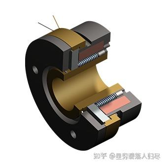

- 机械制动器
  - 工作原理：利用机械摩擦力实现制动。常见的机械制动器包括盘式制动器、鼓式制动器和带式制动器。
  - 特点：结构简单、成本低、制动力矩大。
  - 应用：适用于重载和高精度要求的机器人。

- 动态制动器
  - 工作原理：通过消耗电机的动能来实现快速停止。通常在电机绕组中接入电阻，将动能转化为热能。
  - 特点：快速制动，适用于需要快速停机的场合。

- 再生制动器
  - 工作原理：将电机发电产生的能量通过泄放电阻释放到直流母线，保持母线电压在安全范围内。
  - 特点：节能，适用于需要频繁启停的场合。

- 抱闸制动器
  - 工作原理：通过机械装置锁住电机轴，防止电机在断电后自由旋转。
  - 特点：安全性高，适用于需要保持位置的场合。

### 8.3 基本设计原理

机器人制动器的核心公式包括：

- 制动力矩： $$T_{b} = \mu \cdot F_{n} \cdot r$$

- 惯性转矩： $$T_{inertia} = J\cdot \alpha \$$$

- 重力转矩： $$T_{gravity} = m\cdot g\cdot l\cdot \sin (\theta )$$

- 阻尼力矩： $$T_{d} = B \cdot \omega $$

- 温升： $$\Delta T = \frac{T_{b}\cdot \Delta \theta }{C} $$

通过这些公式可以分析机器人制动器的设计和性能。

## 9.机器人一体化关节

### 9.1 定义

机器人一体化关节（Integrated Joint Module）是一种高度集成化的机器人关节组件，将电机、驱动器、减速器、编码器、制动器和力矩传感器等关键部件集成在一个紧凑的模块中。这种设计不仅简化了机器人的组装过程，还提高了系统的可靠性、灵活性和精确度。

一体化关节模组通常占到人形机器人成本的70%以上，是制约人形机器人成本的最重要因素。它广泛应用于人形机器人、协作机器人、四足机器人、医疗机器人等领域。

### 9.2 类型

一体化关节模组根据应用场景和功能特点，可以分为以下几种类型：

- 高性能中空系列
  - 特点：使用超薄谐波减速器、无刷力矩电机和高精度多圈绝对值编码器，结构紧凑，体积和重量优化。
  - 应用：人形机器人、协作机器人等高端应用场景。

- 高性价比无孔系列
  - 特点：价格优惠，适用范围广，体积和重量优化。
  - 应用：通用机器人、工业自动化等。

- 行星系列
  - 特点：采用行星减速器，提供高扭矩密度和高精度。
  - 应用：工业机器人、重载机器人。

- 带力控旋转关节模组
  - 特点：集成谐波减速器、电机、编码器、驱动器，支持高精度力控。
  - 应用：人形机器人手臂、双足机器人。

### 9.3 工作原理

一体化关节模组的工作原理基于以下核心部件的协同工作：

电机与驱动器: 提供动力，驱动器将控制信号转换为电机所需的电信号，实现精确的速度和扭矩控制。

减速器: （如谐波减速器、行星减速器）用于降低电机转速并增加扭矩，确保关节能够输出足够的力量。

编码器: 提供位置和速度反馈，确保关节的运动精度。

力矩传感器 : 实时监测关节的负载，实现力控功能，确保机器人与环境的交互安全。

制动器 : 用于保持关节的静止状态，防止机器人在断电或意外情况下自由运动。

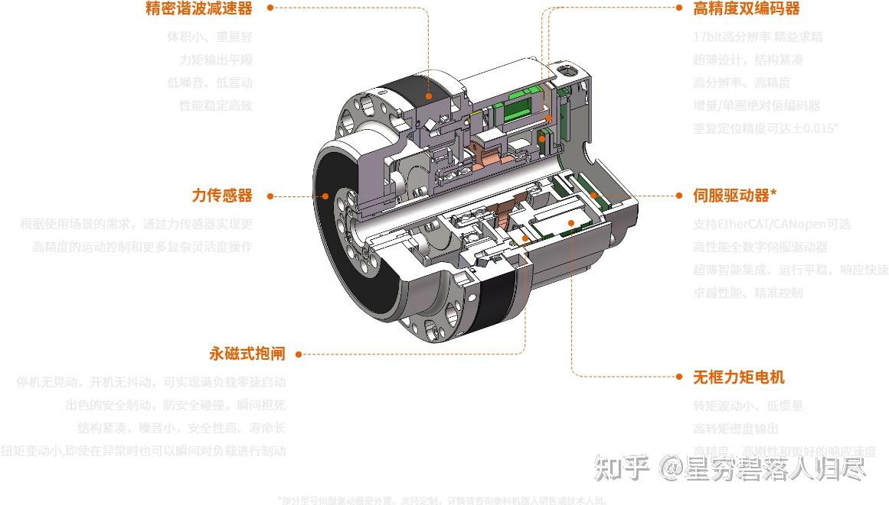