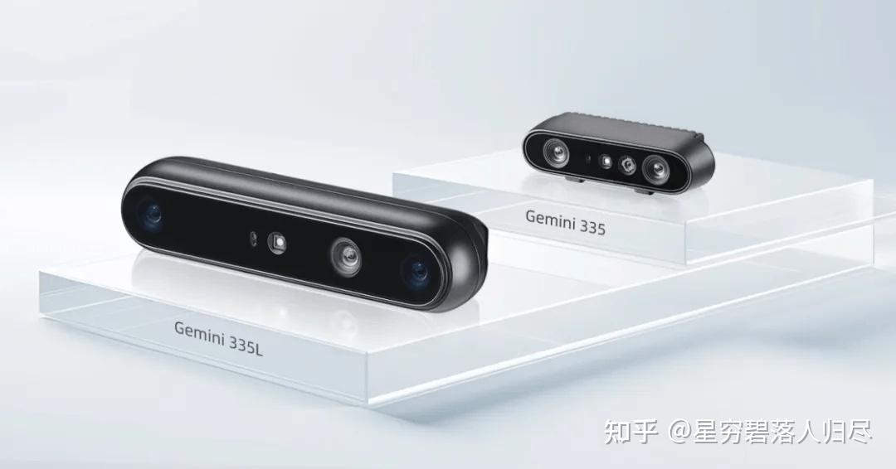

###### datetime:2025/09/11 11:00

###### author:nzb

# 机器人基础知识学习笔记---传感器篇

## 1. 引言

在现代机器人技术中，机器人运动以及功能实现离不开其基础硬件系统。如图所示，机器人硬件系统的基本组成包括相机、芯片、传感器等构成的感知层；各类电机、传感器、轴承等组成的关节驱动系统；以及电池组、传感器、冷却系统和FSD系统构成的整体躯干层。

在机器人技术的迅猛发展进程中，传感器作为机器人的“感官”和“神经”，发挥着不可或缺的作用。它们是连接机器人硬件系统与外部环境的关键纽带，负责将复杂的环境信息转化为可处理的数据信号，为机器人的决策和行动提供依据。从工业自动化到智能安防，从智能家居到医疗诊断，传感器的性能直接决定了机器人对环境的感知能力和任务执行的精准度。本文将深入剖析机器人传感器的多种类型、工作原理、应用场景以及未来的发展趋势。

## 2. 传感器的分类及作用

传感器作为机器人的核心感知部件，相当于人类的五官和神经，赋予了机器人感知和理解环境的能力。如果我们简单将传感器对标为人类的五感，按照物理学的声光电热力几大特性，机器人所用的传感器类型可大略分为视觉、听觉、嗅觉、味觉、触觉以及力觉和热觉等多种类型。当然，需要注意的是，仅凭一篇文章显然是不可能将所有传感器囊括其中并做到面面俱到的介绍的，除去一些在特种任务作业和特殊场景，相对通用和常见的以及使用相对小众的传感器，本篇文章主要探讨应用在机器人上的常见的传感器的种类、技术特点及其应用。

### 2.1 视觉传感器

视觉传感器是机器人感知外部世界的重要工具，通过捕捉图像信息，帮助机器人识别物体的形状、颜色、位置和运动状态。常见的视觉传感器包括：

1. **摄像头**：通过光学成像技术将物体的图像转换为数字信号，用于物体识别、目标跟踪和环境监测。
2. **激光雷达 (LiDAR)**：利用激光束测量距离，生成高精度的三维环境地图，广泛应用于自动驾驶和机器人导航。
3. **深度相机**：通过结构光或飞行时间（ToF）技术，获取物体的深度信息，适用于复杂环境中的物体抓取和避障。

### 2.2 力/力矩传感器

**力觉传感器**用于测量机器人与环境之间的力和力矩，是实现机器人精准操作的关键。常见的力觉传感器包括：

1. **六维力传感器**：能够同时测量三维空间中的力和力矩，常用于机器人手腕和脚踝等末端执行器。**末端六维力传感器**在机器人领域的应用十分广泛，主要用于实时监测末端执行器施加的力和扭矩，以优化抓取策略、防止物体滑落，并用于碰撞检测，确保机器人操作的安全性。
2. **电流环力控传感器**：通过检测电机电流变化实现力的反馈控制。电流估计力矩是通过监测电流来估算力矩，成本较低、安装简单，但其估计精度受电机特性和负载变化影响，且无法提供方向信息。

### 2.3 触觉传感器

触觉传感器是一种能够将外部力学量（如压力、剪切力、振动等）转换为电信号的装置，广泛应用于机器人、医疗设备、可穿戴技术等领域。它们是机器人与外界交互的重要感知部件，能够帮助机器人实现物体的抓取、操作以及环境感。常见的触觉传感器包括：

1. 压力传感器：用于测量接触力的大小和分布，帮助机器人实现精准抓取。
2. 电容式触觉传感器：通过检测电容变化感知物体的接触和接近。
3. 光传感式触觉传感器：利用光学原理检测物体的形状和纹理。

### 2.4 位置传感器

位置传感器是机器人感知自身位置和运动状态的关键部件，广泛应用于导航、姿态控制、路径规划等场景。

1. 惯性测量单元（IMU）：IMU通常由加速度计、陀螺仪和磁力计组成。加速度计测量线性加速度，陀螺仪测量角速度，磁力计测量磁场方向。IMU的体积小、功耗低、响应速度快，能够在短时间内提供高精度的运动信息，其广泛用于机器人导航、姿态控制、运动轨迹跟踪以及SLAM（同时定位与地图构建）。

2. 磁性位置传感器：一般通过检测磁场变化来确定位置，具有高精度、高分辨率和无滞后误差的特点，适用于机器人运动控制、精密定位和工业自动化。

3. MEMS测距传感器：由激光测距、超声波测距、红外测距和电容测距等传感器组成，它能够实时测量机器人与障碍物之间的距离，具有高灵敏度和快速响应能力，常用于机器人避障、路径规划、环境建图以及精密操作。

4. 视觉位置传感器：通过摄像头获取环境图像，结合计算机视觉算法实现位置感知，常用于复杂环境中的导航、物体识别和定位。

## 3. 视觉摄像头

### 3.1 分类及组成

机器人视觉摄像头主要分为以下几类：

1. 2D摄像头：主要用于平面图像的采集，适用于简单的物体识别和定位任务。
2. 3D摄像头：通过深度传感器获取物体的三维信息，能够实现复杂场景下的物体检测、空间定位和避障功能。
3. 红外摄像头：在低光照或黑暗环境中表现出色，常用于热成像和夜视功能。
4. 多光谱摄像头：能够捕捉可见光以外的光谱信息，适用于农业检测、环境监测等特殊场景。
5. 高动态范围（HDR）摄像头：能够在高对比度场景下提供清晰的图像，适合复杂光照条件下的视觉任务。

视觉摄像头通常由以下部分组成：

1. 光学镜头：负责聚焦光线，影响图像的清晰度和视野范围。
2. 图像传感器：如CMOS或CCD，将光信号转换为电信号。
3. 深度传感器（3D摄像头）：通过结构光、飞行时间（ToF）或双目立体视觉技术获取深度信息。
4. 图像处理模块：对采集到的图像进行预处理、特征提取和算法优化。
5. 接口与通信模块：支持USB、HDMI、以太网等多种接口，便于与机器人系统通信。

### 3.2 双目结构光深度相机

这里介绍一种在机器人上使用较多的一种视觉相机，双目结构光深度相机，以下是对其概念、原理的详细介绍

双目结构光深度相机是一种通过投射已知模式的光线（如条纹、点阵）到目标物体表面，并利用两个摄像头捕捉反射光，从而计算物体三维信息的设备。它结合了双目视觉和结构光技术，能够提供高精度的深度数据。

#### 3.2.2 基本工作原理

- 结构光投影：结构光投影模块将一个已知的空间光模式（如正弦条纹或点阵）投射到目标物体上。假设投影图案为 $$P(x, y)$$，则该图案在物体表面上的变形取决于物体的形状和位置。

- 图像采集：双目相机系统由两个摄像头组成，分别位于不同的视角。每个摄像头捕捉到的图像会因视差（Disparity）而产生差异。设左摄像头捕获的图像为 $$I_L(x_L, y_L)$$，右摄像头捕获的图像为 $$I_R(x_R, y_R)$$。

- 视差计算：视差 $$d$$ 定义为同一特征点在左右图像中的水平偏移量：$$d = x_L - x_R$$，视差与深度 $$Z$$ 的关系由几何三角测量公式决定。

#### 3.2.3 几何模型与公式推导

##### 双目视觉几何模型

假设双目相机系统的基线长度为 $$B$$（两摄像头光心之间的距离），焦距为 $$f$$，则深度 $$Z$$ 可表示为：$$Z = \frac{f \cdot B}{d}$$

其中：
- $$f$$：摄像头焦距。
- $$B$$：基线长度。
- $$d$$：视差。

##### 像素坐标转换

实际应用中，图像坐标通常以像素为单位，因此需要将像素坐标转换为物理坐标。设像素尺寸为 $$s_x$$（水平方向）和 $$s_y$$（垂直方向），则物理坐标 $$x, y$$ 可表示为：

$$x = x_{\text{pixel}} \cdot s_x$$，$$y = y_{\text{pixel}} \cdot s_y$$

对于视差 $$d$$，其物理值为：$$d_{\text{physical}} = d_{\text{pixel}} \cdot s_x$$

将像素尺寸代入深度公式：$$Z = \frac{f \cdot B}{d_{\text{pixel}} \cdot s_x}$$

##### 三维重建

通过深度 $$Z$$ 和图像坐标 $$x, y$$，可以计算物体的三维坐标 $$(X, Y, Z)$$：

$$X = Z \cdot \frac{x}{f}$$，$$Y = Z \cdot \frac{y}{f}$$，$$Z = \frac{f \cdot B}{d}$$

#### 3.2.4 结构光编码与解码

##### 编码方式

结构光投影模块通常使用正弦条纹或点阵图案进行编码。例如，正弦条纹的强度分布可表示为：$$I(x, y) = A + B \cdot \sin(2\pi fx + \phi)$$

其中：
- $$A$$：背景亮度。
- $$B$$：调制幅度。
- $$f$$：频率。
- $$\phi$$：相位。

##### 相位解码

通过多幅不同相位偏移的图像，可以提取目标表面的相位信息。假设三幅图像的相位偏移分别为 $$0, \frac{2\pi}{3}, \frac{4\pi}{3}$$，则目标点的相位 $$\phi$$ 可表示为：

$$\phi = \arctan (\frac{\sqrt{3}\cdot (I_{1} - I_{2}) }{2I_{0} - I_{1} - I_{2}} )$$

其中：
- $$I_0, I_1, I_2$$ ：三幅图像的像素值。

##### 深度计算

将解码得到的相位信息映射到深度值。假设相位与深度的关系为线性，则：$$Z = k \cdot \phi + c$$

其中：
- $$k, c$$ ：标定参数。

#### 3.2.5. 标定与误差分析

##### 内参标定

摄像头内参包括**焦距 $$f$$、主点坐标 $$(c_x, c_y)$$ 和畸变系数**。通过标定板（如棋盘格）获取这些参数。

##### 外参标定

外参包括两摄像头之间的相对位置和姿态。通常通过优化算法求解。

##### 误差来源

- 光学畸变：镜头非理想导致的图像变形。
- 噪声：环境光干扰或传感器噪声。
- 分辨率限制：视差计算精度受像素分辨率限制。

双目结构光深度相机结合了**双目视觉**和**结构光**技术，能够精确测量物体的三维信息。其核心公式包括：

- 深度公式：$$Z = \frac{f \cdot B}{d}$$
- 三维重建公式：$$X = Z \cdot \frac{x}{f}, Y = Z \cdot \frac{y}{f}, Z = \frac{f \cdot B}{d}$$
- 相位解码公式：$$\phi = \arctan\left(\frac{\sqrt{3} \cdot (I_1 - I_2)}{2I_0 - I_1 - I_2}\right)$$

## 4. 激光雷达

激光雷达（LiDAR, Light Detection And Ranging）是一种通过发射激光束并接收反射光来测量目标距离的传感器。在机器人领域，激光雷达广泛用于环境感知、导航和避障等任务。它通过扫描环境生成点云数据，从而构建三维地图或二维平面图。

### 4.1 分类

机器人激光雷达主要分为以下几类：

1. 机械式激光雷达：通过机械旋转部件实现360°扫描，具有高精度和长测距范围，但成本较高。

2. 半固态激光雷达：结合了机械式和固态的特点，采用微振镜或转镜实现扫描，成本较低，适合大规模应用。

3. 全固态激光雷达：无机械运动部件，可靠性高，包括Flash和OPA两种类型。

按线数分，可以分为：

1. 单线激光雷达：获取的是**2D平面扫描图**。

2. 多线激光雷达：4线、8线、16线、32线、64线和128线等，多线激光雷达可以识别物体的高度信息并获取周围环境的**3D扫描图**。

激光雷达通常由以下部分组成：

1. 发射模块：负责发射激光脉冲。

2. 接收模块：接收反射光并转换为电信号。

3. 扫描模块：通过机械或电子方式控制激光束的扫描方向。

4. 控制模块：处理信号并生成点云数据。

### 4.2 工作原理

激光雷达的核心原理是基于时间飞行法（Time of Flight, TOF）或三角测距法来测量目标距离。

#### 4.2.1 时间飞行法（TOF）

时间飞行法通过测量激光脉冲从发射到返回的时间间隔 $$t$$ 来计算目标距离 $$d$$。公式为：

$$d = \frac{c \cdot t}{2}$$

其中：
- $$c$$：光速（约 $$3 \times 10^8$$ m/s）。
- $$t$$：激光往返时间。

其推导过程如下：

假设激光以速度 $$c$$ 发射，经过时间 $$\frac{t}{2}$$ 到达目标，再经过时间 $$\frac{t}{2}$$ 返回，则总传播时间为 $$t$$。因此，目标距离为：$$d = c \cdot \frac{t}{2}$$

#### 4.2.2 三角测距法

三角测距法利用光学三角原理测量目标距离。激光雷达发射一束激光到目标物体，并通过接收器检测反射光的角度偏移。假设发射角为 $$\theta$$，接收角为 $$\phi$$，则目标距离 $$d$$ 可表示为：

$$d = \frac{b}{\tan(\phi - \theta)}$$

其中：
- $$b$$：基线长度（发射器与接收器之间的距离）。
- $$\phi - \theta$$：角度差。

推导过程

根据几何关系，三角形的对边与邻边之比为正切值：$$\tan(\phi - \theta) = \frac{b}{d}$$

整理得：$$d = \frac{b}{\tan(\phi - \theta)}$$

#### 4.2.3 激光雷达扫描模型

激光雷达通过旋转扫描头或使用多线激光器实现全方位扫描。假设激光雷达的扫描角度范围为 $$[-\alpha, \alpha]$$，扫描步长为 $$\Delta \theta$$，则每个扫描点的角度位置为：

$$\theta_i = -\alpha + i \cdot \Delta \theta, \quad i = 0, 1, 2, \ldots, N$$

其中：
- $$N$$：扫描点数。
- $$\Delta \theta = \frac{2\alpha}{N}$$。

对于每个扫描点：激光雷达测量的距离为 $$d_i$$，最终生成一组极坐标数据 $$(d_i, \theta_i)$$。

#### 4.2.4 点云生成

激光雷达通过多次扫描生成点云数据。假设扫描次数为 $$M$$，每次扫描生成 $$N$$ 个点，则点云数据可以表示为：

$$P = \{(x_{ij}, y_{ij}, z_{ij}) | i = 1, 2, \ldots, M; j = 1, 2, \ldots, N\}$$

其中：

$$x_{ij} = d_{ij} \cdot \cos(\theta_j) \cdot \cos(\phi_i)$$

$$y_{ij} = d_{ij} \cdot \sin(\theta_j) \cdot \cos(\phi_i)$$

$$z_{ij} = d_{ij} \cdot \sin(\phi_i)$$

- $$d_{ij}$$：第 $$i$$ 次扫描中第 $$j$$ 个点的距离。
- $$\theta_j$$：水平扫描角度。
- $$\phi_i$$：垂直扫描角度。

#### 4.2.5 数据处理与误差分析

##### 数据滤波

激光雷达采集的数据可能包含噪声。常用滤波方法包括**中值滤波**和**高斯滤波**，前者用于去除孤立点，而后者可用于数据的平滑。

##### 误差来源

激光雷达的测量误差主要来源于以下因素：

- 光速误差：光速 $$c$$ 的精确值难以完全确定。
- 时钟误差：激光发射和接收时间的同步误差。
- 光学误差：光学元件的非理想特性导致的角度偏差。
- 环境干扰：如强光、烟雾或灰尘的影响。

##### 标定

为了减少误差，激光雷达需要进行标定。标定参数包括：

- 内参：焦距、基线长度等。
- 外参：激光雷达与其他传感器（如IMU、相机）的相对位置和姿态。

##### 总结

激光雷达的核心原理包括时间飞行法和三角测距法，其核心公式为：

- 时间飞行法：$$d = \frac{ct}{2}$$
- 三角测距法：$$d = \frac{b}{\tan(\phi - \theta)}$$

## 5. 六维力传感器

### 5.1. 基本概念

六维力传感器是一种能够同时测量三个方向的力（Fx, Fy, Fz）和三个方向的力矩（Mx, My, Mz）的传感器。它通常安装在机器人末端执行器上，用于感知外部环境对机器人的作用力和力矩，广泛应用于精密装配、打磨、抛光等任务中。

### 5.2. 工作原理

六维力传感器的核心原理是**通过应变片或电容式传感元件检测结构变形，并将其转换为电信号输出**。传感器内部通常设计为一个多自由度的弹性体，每个自由度对应一个特定的力或力矩分量。

### 5.3. 力与力矩的关系

假设传感器坐标系为 $$O-xyz$$，作用在传感器上的外力和力矩可以表示为：

$$F = \begin{bmatrix}F_{x}\\ F_{y} \\ F_{z}\end{bmatrix},
M = \begin{bmatrix}M_{x}\\ M_{y} \\ M_{z}\end{bmatrix}$$

根据力矩定义, 力矩可以通过力和作用点位置计算:

$$\mathbf{M}=\mathbf{r} \times \mathbf{F}$$

其中: 
- $$\mathbf{r}$$ : 力的作用点相对于坐标原点的位置矢量。

### 5.4. 应变片测量原理

#### 应变与应力关系

应变片通过测量弹性体的应变来间接获得力和力矩。应变 $$\epsilon$$ 与应力 $$\sigma$$ 的关系为:

$$\epsilon=\frac{\sigma}{E}$$

其中：
- $$E$$ : 材料的杨氏模量。

应力 $$\sigma$$ 可以由作用力 $$F$$ 和截面积 $$A$$ 计算:

$$\sigma=\frac{F}{A}$$

因此, 应变与力的关系为:

$$\epsilon=\frac{F}{E A}$$

#### 电桥电路输出

应变片通常连接成惠斯通电桥电路, 其输出电压 $$V_{o u t}$$ 与应变 $$\epsilon$$ 的关系为:

$$V_{o u t}=k \cdot \epsilon \cdot V_{s}$$

其中: 
- $$k$$ : 应变片灵敏系数。
- $$V_{s}$$ : 电桥供电电压。

将应变与力的关系代入:

$$V_{o u t}=k \cdot \frac{F}{E A} \cdot V_{s}$$

整理得:

$$F=\frac{V_{o u t} \cdot E \cdot A}{k V_{s}}$$

### 5.5. 六维力解耦

由于六维力传感器需要同时测量六个自由度的力和力矩, 实际测量值可能存在耦合现象。为了分离各个分量, 通常使用标定矩阵进行解耦。

标定矩阵

设传感器的原始输出为 $$\mathbf{V}=\left[V_{1}, V_{2}, \ldots, V_{n}\right]^{\mathrm{T}}$$, 标定矩阵为 $$\mathbf{C}$$, 则解耦后的力和力矩为:

$$\begin{bmatrix}F_{x} \\F_{y} \\F_{z} \\M_{x} \\M_{y} \\M_{z}\end{bmatrix} = C \cdot V$$

标定矩阵 $$\mathbf{C}$$ 通过实验标定得到, 其形式为:

$$\mathbf{C}=\left[\begin{array}{cccc} c_{11} & c_{12} & \cdots & c_{1 n} \\ c_{21} & c_{22} & \cdots & c_{2 n} \\ \vdots & \vdots & \ddots & \vdots \\ c_{61} & c_{62} & \cdots & c_{6 n} \end{array}\right]$$

### 5.6. 动态特性分析

#### 频率响应

六维力传感器的频率响应取决于弹性体的固有频率和阻尼比。假设弹性体的质量为 $$m$$, 刚度为 $$k$$, 阻尼系数为 $$c$$, 则系统的动态方程为:

$$m \cdot \ddot{x}+c \cdot \dot{x}+k \cdot x=F$$

将方程转化为频域形式:

$$X(\omega)=\frac{F(\omega)}{m(-\omega^{2})+c i \omega+k}$$

其中: 
- $$\omega$$ : 角频率。
- $$i$$ : 虚数单位。

#### 相位滞后

由于传感器的动态特性, 输出信号可能存在相位滞后。相位滞后 $$\phi$$ 可表示为:

$$\tan (\phi)=\frac{\operatorname{Im}(H(\omega))}{\operatorname{Re}(H(\omega))}$$

其中: 
- $$H(\omega)$$ : 系统传递函数。

#### 总结

六维力传感器通过应变片或电容式传感元件测量弹性体的变形, 从而获得力和力矩信息。其核心公式包括:

- 应变与力的关系: $$F=\frac{V_{\text {out }} \cdot E \cdot A}{k \cdot V_{g}}$$

- 解耦公式: $$\left[\begin{array}{c} F_{x} \\ F_{y} \\ F_{z} \\ M_{x} \\ M_{y} \\ M_{z} \end{array}\right]=\mathbf{C} \cdot \mathbf{V}$$

